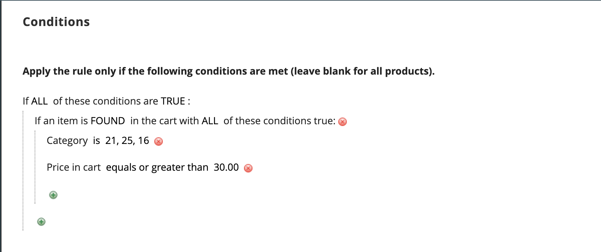

# Exemplo de regra de preço do carrinho - desconto com compra mínima

As regras de preço do carrinho podem ser usadas para oferecer um desconto percentual com base em uma compra mínima. No exemplo a seguir, um desconto de 25% é aplicado a todas as compras acima de US$ 200,00 em uma categoria específica. O formato do desconto é o seguinte:

X% de desconto em Y (categoria) acima de $Z dólares

## Etapa 1. Criar uma regra de carrinho

Siga o básico [instruções](price-rules-cart.md) para criar uma regra de carrinho.

## Etapa 2. Definir as condições

1. Rolar para baixo e expandir  o **[!UICONTROL Conditions]** seção.

1. Clique em _Adicionar_ () e escolha **[!UICONTROL Product Attribute Combination]**.

   {width="500" zoomable="yes"}

1. Clique em _Adicionar_ () no início da próxima linha e na lista em **[!UICONTROL Product Attribute]**, escolha **[!UICONTROL Category]**.

   - Clique no botão **..**) _mais_ para exibir opções adicionais.

     {width="600" zoomable="yes"}

   - Clique em _Seletor_ () para ver as categorias disponíveis. Na árvore de categorias, marque a caixa de seleção de cada categoria que você deseja incluir. Clique no ícone de verificação para aceitar as seleções de categoria.

     {width="600" zoomable="yes"}

1. Clique em _Adicionar_ () no início da próxima linha e faça o seguinte:

   - Na lista abaixo **[!UICONTROL Cart Item Attribute]**, escolha **[!UICONTROL Price in cart]**.

     {width="500"}

   - Clique em **é** e escolha `equals or greater than`.

   - Clique em **..** e insira o valor que o Preço no carrinho deve ser para atender à condição. Por exemplo, insira `30`.

     {width="500"}

1. Clique em **[!UICONTROL Save and Continue Edit]**.

## Etapa 3. Definir as ações

1. Expandir  o **[!UICONTROL Actions]** e faça o seguinte:

   {width="600" zoomable="yes"}

   - Definir **[!UICONTROL Apply]** para `Percent of product price discount`.

   - Insira o **[!UICONTROL Discount Amount]**. Por exemplo, insira `10` por um desconto de 10%.

   - Para evitar que promoções adicionais sejam aplicadas à compra, defina **[!UICONTROL Discard subsequent rules]** para `Yes`.

1. Clique em **[!UICONTROL Save and Continue Edit]** e conclua a regra conforme necessário.

## Etapa 4. Preencha os rótulos

Concluído [Etapa 4](price-rules-cart.md) das instruções de regra de preço do carrinho para inserir quaisquer rótulos que apareçam durante a finalização da compra.

## Etapa 5: salvar e testar a regra

{{new-price-rule}}

1. Quando a regra for concluída, clique em **[!UICONTROL Save Rule]**.

1. Teste a regra para verificar se ela funciona corretamente.
