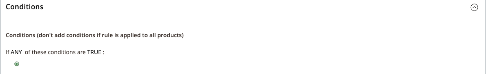

# Regra de preço de catálogo com vários SKUs

Uma única regra de preço de catálogo pode ser aplicada a vários SKUs, o que permite criar várias promoções com base em um produto, marca ou categoria. Ao criar essa regra, você deseja definir condições que correspondam aos SKUs selecionados. Ao criar a regra, você pode navegar facilmente e selecionar SKUs na grade.

## Etapa 1. Verificar propriedades de vitrine do atributo de produto

Antes de começar, verifique se as [Propriedades da vitrine](../catalog/attribute-product-create.md#step-4-describe-the-storefront-properties) do atributo `sku` estão definidas como `Use in Promo Rules`.

1. Na barra lateral _Admin_, vá para **[!UICONTROL Stores]** > _[!UICONTROL Attributes]_>**[!UICONTROL Product]**.

1. No filtro de pesquisa na parte superior da coluna _[!UICONTROL Attribute Code]_, digite `sku` e clique em **[!UICONTROL Search]**.

1. Clique para abrir o atributo `sku` no modo de edição.

1. No painel esquerdo, clique em **[!UICONTROL Storefront Properties]** e verifique se **[!UICONTROL Use for Promo Rule Conditions]** está definido como `Yes`.

1. Se você alterou o valor da propriedade, clique em **[!UICONTROL Save Attribute]**.

## Etapa 2. Aplicar uma regra de preço a vários SKUs

1. Na barra lateral _Admin_, vá para **[!UICONTROL Marketing]** > _[!UICONTROL Promotions]_>**[!UICONTROL Catalog Price Rules]**.

1. Siga um destes procedimentos:

   - Siga as instruções para criar uma [regra de preço de catálogo](price-rules-catalog.md).
   - Abra uma regra de preço de catálogo existente.

1. Expanda  a seção **[!UICONTROL Conditions]** e faça o seguinte:

   - Na primeira linha, defina o primeiro parâmetro como `ANY`.

     {width="600" zoomable="yes"}

   - Clique em _Adicionar_ () no início da próxima linha e, na lista abaixo de **[!UICONTROL Product Attribute]**, clique em `SKU`.

     {width="600" zoomable="yes"}

   - Para a comparação, você tem opções. Se quiser localizar pelo menos um item de uma lista de SKUs, `select is one of`. Se você quiser localizar um grupo de SKUs aos quais todos devem ser aplicados, selecione `is`. Recomendamos selecionar `is one of`.

     {width="600" zoomable="yes"}

   - Para concluir a condição, clique no link more (**...**) e clique no ícone _Chooser_ () da lista de produtos disponíveis.

     {width="600" zoomable="yes"}

   - Procure, filtre ou pesquise para encontrar os SKUs que deseja adicionar. Na lista, marque a caixa de seleção de cada produto a ser incluído.

   - Clique em **[!UICONTROL Save and Apply]** para adicionar as SKUs à condição.

     {width="600" zoomable="yes"}

1. Conclua a regra, incluindo quaisquer [Ações](price-rules-catalog.md) a serem executadas quando as condições forem atendidas.

1. Quando a regra estiver concluída, clique em **[!UICONTROL Save]**.

{{new-price-rule}}
