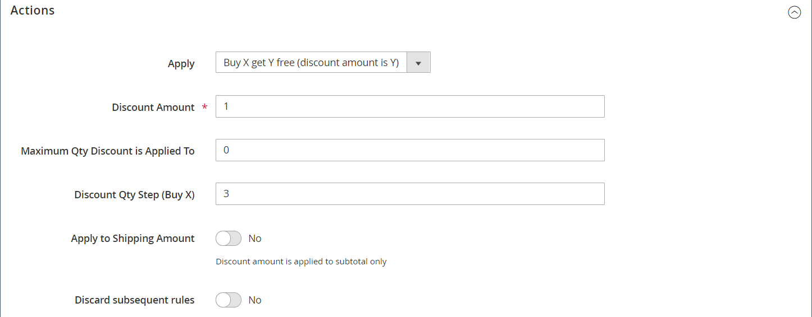

# Exemplo de regra de preço do carrinho - compre este e obtenha

Este exemplo mostra como configurar um [regra de preço do carrinho](price-rules-cart.md) para um _Compre isso e ganhe de graça_ promoção. O formato do desconto é o seguinte:

_Comprar X quantidade de produto, obter Y quantidade gratuitamente_

## Etapa 1. Criar uma regra de preço de carrinho

Concluído [Etapa 1](price-rules-cart.md) da regra de preço do carrinho instruções para completar as informações da regra.

## Etapa 2. Definir as condições

Concluído [Etapa 2](price-rules-cart.md) das instruções do carrinho para definir as condições da regra de preço. Essa é a primeira das duas condições que podem ser adicionadas à regra e determina quando a regra é acionada. Ela pode ser baseada em uma combinação dos seguintes:

- Atributos do produto
- Produtos
- Atributos do carrinho
-  (Somente no Adobe Commerce) Segmentos de clientes

Se deixado em branco, a regra será acionada para cada carrinho.

{width="600" zoomable="yes"}

## Etapa 3. Definir as ações

1. Expandir  o **[!UICONTROL Actions]** e faça o seguinte:

   - Definir **[!UICONTROL Apply]** para `Buy X get Y free (_[!UICONTROL _[!UICONTROL Discount Amount]_]_ is Y)`.

   - Definir **[!UICONTROL Discount Amount]** para `1`. Essa é a quantidade que o cliente recebe gratuitamente.

   - Para limitar o número de descontos que podem ser aplicados quando a condição é atendida, insira o número na caixa **[!UICONTROL Maximum Qty Discount is Applied To]** campo. Isso é calculado usando este [fórmula](#maximum-quantity-discount).

   - Para **[!UICONTROL Discount Qty Step (Buy X)]**, insira a quantidade que o cliente deve comprar para se qualificar para o desconto. Neste exemplo, o cliente deve comprar três.

   - Se quiser impedir que outros descontos sejam aplicados à compra, defina **[!UICONTROL Discard subsequent rules]** para `Yes`.

   {width="600" zoomable="yes"}

1. Para aplicar a regra somente a itens específicos no carrinho, preencha a condição para descrever os itens do carrinho e/ou os atributos do produto necessários para a promoção.

   O exemplo a seguir usa o SKU para aplicar a regra a todas as variações associadas de um produto configurável.

   {width="600" zoomable="yes"}

1. Para incluir **[!UICONTROL Free Shipping]**, escolha `For matching items only`.

1. Clique em **[!UICONTROL Save and Continue Edit]** e conclua o restante da regra conforme necessário.

## Etapa 4. Preencha o rótulo

Concluído [Etapa 4](price-rules-cart.md) das instruções de regra de preço do carrinho para inserir o rótulo que aparece durante a finalização da compra.

## Etapa 5: salvar e testar a regra

{{new-price-rule}}

1. Quando a regra for concluída, clique em **[!UICONTROL Save Rule]**.

1. Teste a regra para verificar se ela funciona corretamente.

## Variações

Buy X Get Y Free é processado como uma única ação, com um _total da linha_ dependência. Todos os itens devem ser do mesmo SKU para se qualificarem para a promoção. Por exemplo:

Compre X quantidade de produto da categoria A, obtenha Y quantidade do mesmo produto gratuitamente.

Para limitar o produto livre às categorias A, B e C, defina a ação da seguinte maneira:

Se TODAS estas condições forem VERDADEIRAS: A categoria é uma das A, B, C

Para limitar os itens livres de qualquer categoria (A, B ou C) e receber Y dos SKUs (D123, E123 ou F123), defina a ação da seguinte maneira:

Se TODAS essas condições forem VERDADEIRAS: SKU é um dos modelos D123, E123, F123

## Desconto de quantidade máxima

Use a fórmula a seguir para determinar o valor correto para o Desconto da Qtde Máxima:

Fórmula = `(X+Y) * (M/Y)`
Onde
`X` = número de itens comprados
`Y` = número de itens livres
`M` = Número máximo de itens livres permitido

Por exemplo:

Compre cinco e ganhe dois gratuitos com um máximo de quatro itens gratuitos permitidos.

    Onde
    X = 5
    Y = 2
    M = 4
    Desconto de Qtd. Máxima = (5+2)*(4/2)=(7)*(2)=14

Compre cinco e ganhe três gratuitamente com um máximo de nove itens gratuitos permitidos.

    Onde
    X = 5
    Y = 3
    M = 9
    Desconto da Qtde Máxima = (5+3)*(9/3)=24

Compre 20 e ganhe dois grátis com um máximo de 20 itens gratuitos permitidos.

    Onde
    X = 20
    Y = 2
    M = 20
    Desconto de Qtd. Máxima = (20+2)*(20/2)=(22)*(10)=220
