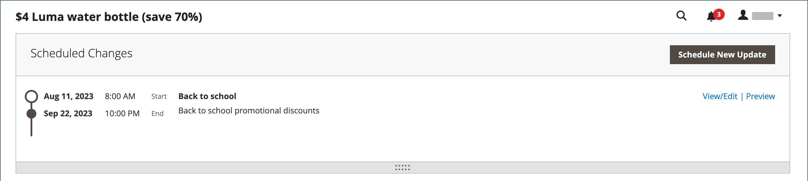

# Códigos de cupom

Os códigos de cupons são usados com [regras de preço do carrinho](price-rules-cart.md) para aplicar um desconto quando um conjunto de condições é atendido. Por exemplo, um código de cupom pode ser criado para um grupo de clientes específico ou para qualquer pessoa que faça uma compra acima de um determinado valor. Para aplicar o cupom a uma compra, o cliente pode inserir o código do cupom no carrinho ou possivelmente na caixa registradora da sua loja _brick and mortar_. Estas são algumas das maneiras de usar cupons na loja:

- Cupons de email para clientes
- Produzir cupons impressos
- Criar cupons na loja para usuários móveis

Os códigos de cupom podem ser enviados por email ou incluídos em boletins informativos, catálogos e anúncios. A lista de códigos de cupom pode ser exportada e enviada para uma impressora comercial. Você também pode criar cupons na loja com um código de resposta rápida que os compradores podem digitalizar com seus smartphones. O código QR pode ser vinculado a uma página em seu site com mais informações sobre a promoção.

A partir do Commerce 2.4.7, os compradores podem aplicar vários cupons a um carrinho. Os comerciantes também podem aplicar vários cupons usando a assistência para compras.

>[!NOTE]
>
>As regras de preço do carrinho com a mesma prioridade não resultam em um desconto combinado. Cada regra (cupom) é aplicada separadamente aos produtos correspondentes, um por um, de acordo com a ID da regra de preço do carrinho no banco de dados. Para controlar a ordem em que os descontos são aplicados, a Adobe recomenda definir uma prioridade diferente para cada regra de preço de carrinho adicionada.

## Configurar códigos de cupom

O comprimento e o formato dos códigos de cupom gerados automaticamente são controlados pela configuração. Os caracteres podem ser definidos como todos os números, todas as letras ou uma combinação. Você pode inserir um traço em intervalos definidos para facilitar a leitura e adicionar um prefixo e um sufixo para associar o código a uma campanha ou iniciativa específica.

1. Na barra lateral _Admin_, vá para **[!UICONTROL Stores]** > _[!UICONTROL Settings]_>**[!UICONTROL Configuration]**.

1. No painel esquerdo, expanda **[!UICONTROL Customers]** e escolha **[!UICONTROL Promotions]**.

   {width="600" zoomable="yes"}

1. Expanda a seção **[!UICONTROL Auto Generated Specific Coupon Codes]**.

   {width="600" zoomable="yes"}

1. Insira o **[!UICONTROL Code Length]**, incluindo prefixo, sufixo e separadores.

1. Defina o **[!UICONTROL Code Format]** como um dos seguintes:

   - `Alphanumeric`
   - `Alphabetical`
   - `Numeric`

1. Para **[!UICONTROL Code Prefix]**, insira o valor que você deseja que apareça no início de todos os códigos de cupom.

1. Para **[!UICONTROL Code Suffix]**, insira o valor que você deseja que apareça no final de todos os códigos de cupom.

1. Para **[!UICONTROL Dash Every X Characters]**, insira o número de caracteres entre cada traço.

   Os códigos de cupom com diferentes padrões de traço são considerados códigos diferentes, mesmo se os números forem os mesmos.

1. Quando terminar, clique em **[!UICONTROL Save Config]**.

## Criar cupons

>[!NOTE]
>
>[!BADGE Somente PaaS]{type=Informative url="https://experienceleague.adobe.com/pt-br/docs/commerce/user-guides/product-solutions" tooltip="Aplica-se somente a projetos do Adobe Commerce na nuvem (infraestrutura do PaaS gerenciada pela Adobe) e a projetos locais."} Antes de criar cupons, use o comando `bin/magento cron:run` para verificar se o cron está em execução. Consulte [Executar cron a partir da linha de comando](https://experienceleague.adobe.com/docs/commerce-operations/configuration-guide/cli/configure-cron-jobs.html?lang=pt-BR#run-cron-from-the-command-line) no _Guia de Configuração_ para obter mais informações.

### Método 1: criar um cupom específico

1. Siga as instruções para criar uma [regra de preço do carrinho](price-rules-cart.md).

1. Na seção **[!UICONTROL Rule Information]**, defina **[!UICONTROL Coupon]** como `Specific Coupon`.

1. Insira um **[!UICONTROL Coupon Code]** para ser usado com a promoção.

   O formato do código (numérico, alfanumérico ou alfabético) é determinado pela [configuração](#configure-coupon-codes).

1. Para limitar o número de vezes que o cupom pode ser usado, faça o seguinte:

   - Insira o número de **[!UICONTROL Uses per Coupon]**.
   - Insira o número de **[!UICONTROL Uses per Customer]**.

   Para uso ilimitado, deixe esses campos em branco.

   {width="600" zoomable="yes"}

   >[!NOTE]
   >
   >Se houver uso simultâneo do mesmo cupom por vários clientes ao mesmo tempo, é possível que o limite de uso definido seja excedido devido ao processamento atrasado do cupom.

1. Para tornar o cupom válido por um período de tempo, faça o seguinte:

   -  (somente Magento Open Source) Conclua as datas **De** e **Até**. Para selecionar a data, clique no ícone **Calendário** () ao lado de cada campo. Se você deixar o intervalo de datas vazio, a regra não expirará.

   -  (somente Adobe Commerce) Siga um destes procedimentos:

     **Opção 1:** agendar uma nova atualização

      - Clique em **[!UICONTROL Schedule New Update]** no canto superior direito da página.

        {width="600" zoomable="yes"}

      - Insira o **[!UICONTROL Update Name]** e **[!UICONTROL Description]**.

      - Escolha a **Data de Início** e **[!UICONTROL End Date]** no Calendário (  ). Se você deixar o intervalo de datas vazio, a regra não expirará.

      - Quando terminar, clique em **[!UICONTROL Save]**.

        {width="600" zoomable="yes"}

     **Opção 2:** Atribuir a uma atualização existente:

      - Selecione **[!UICONTROL Assign to Another Update]**.

      - Localize a atualização na lista e clique em **[!UICONTROL Select]**.

1. Conclua a [regra de preço do carrinho](price-rules-cart.md) conforme necessário.

### Método 2: Gerar um lote de cupons

A geração de cupons de desconto é uma operação assíncrona, executada em segundo plano para que você possa continuar trabalhando no Administrador sem esperar a conclusão da operação. O sistema exibe uma mensagem quando a tarefa é concluída.

1. Siga as instruções para criar uma [regra de preço do carrinho](price-rules-cart.md).

1. Em **[!UICONTROL Coupon Code]**, marque a caixa de seleção **[!UICONTROL Use Auto Generation]**.

1. Para limitar o número de vezes que cada cliente pode usar o cupom, insira o número de **[!UICONTROL Uses per Customer]**.

   {width="600" zoomable="yes"}

   >[!NOTE]
   >
   >Se houver uso simultâneo do mesmo cupom por vários clientes ao mesmo tempo, é possível que o limite de uso definido seja excedido devido ao processamento atrasado do cupom.

1. Role para baixo e expanda  a seção **[!UICONTROL Manage Coupon Codes]** e faça o seguinte:

   {width="600" zoomable="yes"}

   - Para **[!UICONTROL Coupons Qty]**, insira o número de cupons que você deseja gerar.

   - Insira o **[!UICONTROL Code Length]**, sem incluir prefixo, sufixo ou separadores.

   - Defina o **[!UICONTROL Code Format]** como um dos seguintes:

      - `Alphanumeric`
      - `Alphabetical`
      - `Numeric`

   - (Opcional) Digite um **[!UICONTROL Code Prefix]** para ser adicionado ao início do código.

   - (Opcional) Digite um **[!UICONTROL Code Suffix]** para ser adicionado ao final do código.

   - (Opcional) Para **[!UICONTROL Dash Every X Characters]**, insira o número de caracteres entre cada traço. Por exemplo, se o código tiver 12 caracteres e houver um traço a cada quatro caracteres, ele terá a aparência de `xxxx-xxxx-xxxx`. Os traços facilitam a leitura e a inserção dos códigos.

1. Quando terminar, clique em **[!UICONTROL Generate]**.

   O sistema exibe `Message is added to queue, wait to get your coupons soon`.

   Após a conclusão do trabalho cron, a lista de códigos gerados é exibida.

   | Campo | Descrição |
   |-------------|-------------|
   | [!UICONTROL Coupon Code] | Um código exclusivo de cupom que foi criado e pode ser usado para receber condições especiais. |
   | [!UICONTROL Created] | A data em que o código do cupom foi criado. |
   | [!UICONTROL Used] | Indica se o cupom foi usado. |
   | [!UICONTROL Times Used] | Indica quantas vezes o código do cupom foi usado. |

   {style="table-layout:auto"}

Você pode exportar códigos de cupom para um arquivo CSV ou XML do Excel selecionando o formato do arquivo e clicando em **[!UICONTROL Export]**.

Para excluir códigos de cupom, selecione um ou mais códigos na lista. Selecione `Delete` no seletor **[!UICONTROL Actions]** e clique em **[!UICONTROL Submit]**.

>[!NOTE]
>
>Embora a Commerce permita configurar vários códigos de cupom, um cliente pode usar apenas um código de cupom no carrinho. Para permitir o uso de mais de um código de cupom no carrinho simultaneamente, você pode considerar o uso de uma extensão correspondente do [Commerce Marketplace](https://marketplace.magento.com/).

## Relatório de cupons

O relatório _Cupons_ agrega dados de cada cupom usado durante um intervalo de datas específico. Como os cupons são aplicados a partir do carrinho de compras, o relatório inclui dados de todos os cupons resgatados, independentemente do [status do pedido](../stores-purchase/order-status.md). Como resultado, o relatório pode incluir os totais projetados e reais. O relatório pode ser filtrado por uma exibição de loja específica, período de tempo, status do pedido e regra de preço do carrinho.

No exemplo a seguir, o código de cupom &quot;H20&quot; foi usado por dois clientes. Um dos pedidos é faturado, mas o outro ainda está _pendente_. As colunas Subtotal de Vendas projetado, Desconto de Vendas e Total de Vendas mostram os valores agregados de ambas as ordens, mas somente a ordem faturada real aparece nas colunas Subtotal, Desconto e Total. Cada linha no relatório representa uma promoção de cupom única.

{width="600" zoomable="yes"}

### Executar o relatório

1. Na barra lateral _Admin_, vá para **[!UICONTROL Reports]** > _[!UICONTROL Sales]_>**[!UICONTROL Coupons]**.

1. Se você tiver várias exibições de loja, defina **[!DNL Store View]** no canto superior esquerdo para estabelecer o escopo do relatório.

1. Para atualizar as [estatísticas](../getting-started/sales-reports.md#refresh-statistics) de vendas do dia, clique na mensagem _Última Atualização_ na parte superior do espaço de trabalho.

   Em seguida, clique para marcar a caixa de seleção **[!UICONTROL Coupons]** e clique em **[!UICONTROL Refresh]**.

   {width="600" zoomable="yes"}

1. Para filtrar os dados, faça o seguinte:

   {width="600" zoomable="yes"}

   - Defina **[!UICONTROL Date Used]** como um dos seguintes:

      - `Order Created`
      - `Order Updated`

     O relatório _Pedido atualizado_ é criado em tempo real e não requer atualização.

   - Para definir o período coberto pelo relatório, defina **[!UICONTROL Period]** como um dos seguintes:

      - `Day`
      - `Month`
      - `Year`

   - Para definir o intervalo de datas do relatório, insira as datas **De** e **Até** no formato D/M/AA.

   - Para imprimir um relatório para um [status do pedido](../stores-purchase/order-status.md) específico, defina **[!UICONTROL Order Status]** como `Specified` e escolha o status do pedido na lista.

   - Para omitir linhas sem dados do relatório, defina **[!UICONTROL Empty Rows]** como `No`.

   - Para definir a atividade de cupom incluída no relatório, siga um destes procedimentos:

      - Para incluir todas as atividades de cupom de todas as regras de preço, defina **[!UICONTROL Cart Price Rule]** como `Any`.
      - Para incluir apenas a atividade relacionada a uma regra de preço específica, defina **[!UICONTROL Cart Price Rule]** como `Specified` e selecione a regra de preço do carrinho na lista.

1. Quando estiver pronto para executar o relatório, clique em **[!UICONTROL Show Report]**.

   O relatório é exibido na parte inferior da página.

### Opções de filtro

| Campo | Descrição |
|--- |--- |
| [!UICONTROL Date Used] | Identifica o campo de data usado como base do relatório. Opções: **[!UICONTROL Order Created]**: gera o relatório com base na data em que o pedido foi feito pelo cliente. Para garantir que os dados mais atuais sejam incluídos, clique no link da mensagem para atualizar as estatísticas. **[!UICONTROL Order Updated]**: gera o relatório com base na data em que os pedidos foram atualizados pela última vez. Esse relatório usa dados em tempo real e não requer a atualização de estatísticas. |
| [!UICONTROL Period] | Determina o tipo de intervalo de datas usado para o relatório. Opções: `Day` / `Month` / `Year` |
| [!UICONTROL From] | Indica a primeira data no intervalo de dados de pedido que está incluído no relatório. |
| [!UICONTROL To] | Indica a última data no intervalo de dados de pedido que está incluído no relatório. |
| [!UICONTROL Order Status] | Filtra o relatório por status de pedido. O relatório pode ser gerado para todos os pedidos ou pode ser limitado a um status de pedido específico. Opções:  **[!UICONTROL Any]**: inclui todas as ordens independentemente do status. **[!UICONTROL Specified]**: Inclui somente pedidos com o status especificado. Os pedidos cancelados não são incluídos no relatório. |
| [!UICONTROL Empty Rows] | Determina se o relatório inclui linhas de dados vazios que possam ser recuperadas. Opções: `Yes` / `No` |
| [!UICONTROL Cart Price Rules] | Determina quais promoções de cupom são incluídas no relatório. Opções: **[!UICONTROL Any]**: inclui informações de ordem para qualquer promoção de cupom que foi usada durante o intervalo de datas especificado. **[!UICONTROL Specified]**: Inclui somente informações de ordem para a promoção de cupom selecionada durante o intervalo de datas especificado. |

{style="table-layout:auto"}

### Colunas do relatório

| Coluna | Descrição |
|--- |--- |
| [!UICONTROL Interval] | Indica o intervalo de datas de uso do cupom a ser incluído no relatório. O intervalo pode ser um dia, mês ou ano específico ou um intervalo de datas. A data do intervalo é formatada como nos exemplos a seguir, de acordo com o valor definido na configuração **[!UICONTROL Period]**: `Day`: 21/6/19 `Month`: 6/2019 `Year`: 2019 |
| [!UICONTROL Coupon Code] | O Código de Desconto inserido pelos clientes no carrinho de compras para receber o desconto. |
| [!UICONTROL Price Rule] | O nome da regra de preço associada ao cupom. |
| [!UICONTROL Uses] | O número de vezes que o cupom foi usado durante o intervalo de datas especificado para o relatório. |
| [!UICONTROL Sales Subtotal] | O Subtotal projetado de todos os pedidos feitos com o cupom.  O Subtotal de Vendas representa o Subtotal agregado de todas as ordens qualificadas e inclui `Pending` ordens de venda que ainda não foram faturadas. |
| [!UICONTROL Sales Discount] | O valor de Desconto projetado de todos os pedidos feitos com o cupom.  O Desconto representa o valor de desconto agregado de todas as ordens qualificadas e inclui `Pending` ordens de venda que ainda não foram faturadas. |
| [!UICONTROL Sales Total] | O Total Geral projetado de todos os pedidos feitos com o cupom. O Total de Vendas inclui todas as taxas de remessa e manuseio, menos o valor do desconto.  O Total de Vendas representa o valor total geral agregado de todas as ordens qualificadas e inclui `Pending` ordens de venda que ainda não foram faturadas. O valor inclui o Subtotal mais Entrega e Manuseio, menos o Desconto, mais Imposto.   Calculado por: `((Subtotal + Shipping & Handling) - Discount) + Tax` |
| [!UICONTROL Subtotal] | O Subtotal agregado de todas as ordens faturadas que usaram o cupom. |
| [!UICONTROL Discount] | O Desconto agregado de todas as ordens faturadas que usaram o cupom. |
| [!UICONTROL Total] | O Total do Pedido agregado de todas as ordens faturadas que usaram o cupom. |

{style="table-layout:auto"}
