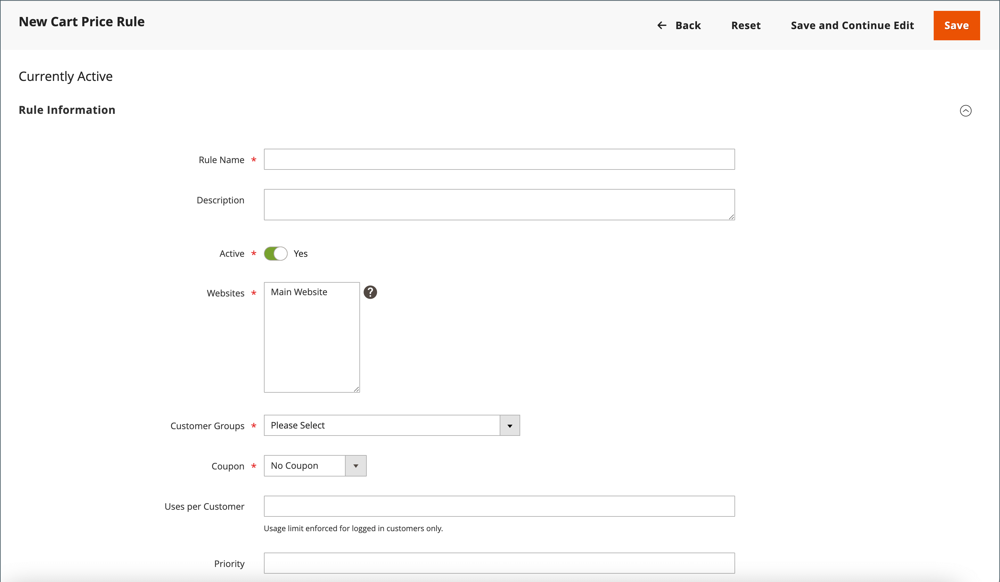

# Criar uma regra de preço de carrinho

Complete as etapas a seguir para adicionar uma regra, descrever as condições e definir as ações. Preencha também os rótulos e teste a regra. As condições da regra de preço podem ser baseadas no carrinho ou nos [atributos do produto](../catalog/product-attributes.md) ou nos [Públicos-alvo da Real-Time CDP](#use-real-time-cdp-audiences-to-set-a-condition), mas não em [opções personalizáveis](../catalog/settings-advanced-custom-options.md).

## Etapa 1: adicionar uma regra

1. Na barra lateral _Admin_, vá para **[!UICONTROL Marketing]** > _[!UICONTROL Promotions]_>**[!UICONTROL Cart Price Rules]**.

1. Clique em **[!UICONTROL Add New Rule]** e faça o seguinte:

   - Em _[!UICONTROL Rule Information]_, conclua o **[!UICONTROL Rule Name]**&#x200B;e **[!UICONTROL Description]**.

   - Se você não quiser que a regra entre em vigor imediatamente, defina **[!UICONTROL Active]** como `No`.

   {width="600" zoomable="yes"}

1. Para estabelecer o [escopo](../getting-started/websites-stores-views.md#scope-settings) da regra, faça o seguinte:

   - Selecione o **[!UICONTROL Websites]** em que a promoção deverá estar disponível.

   - Selecione o **[!UICONTROL Customer Groups]** ao qual a promoção se aplica.

     Se quiser que a promoção esteja disponível somente para clientes registrados, **_não_** escolha a opção `NOT LOGGED IN`.

1. Defina a regra a ser aplicada com ou sem um [cupom](price-rules-cart-coupon.md) da seguinte maneira:

   - Para aplicar a regra do carrinho sem o uso de um código de cupom, defina **[!UICONTROL Coupon]** como `No Coupon` e pule para a etapa 5.

   - Para associar um cupom a uma regra de preço, defina **[!UICONTROL Coupon]** como `Specific Coupon` e faça o seguinte:

      - Insira um texto livre **[!UICONTROL Coupon Code]** que o cliente deve inserir para receber o desconto.

      - Para definir um limite no número de vezes que o cupom pode ser usado, complete as seguintes opções:

     | Opção | Descrição |
     |------|-----------|
     | `Uses per Coupon` | Determina quantas vezes o código do cupom pode ser usado. Se não houver limite, deixe o campo em branco. |
     | `Uses per Customer` | Determina quantas vezes a regra de preço do carrinho pode ser usada pelo mesmo cliente registrado que pertence a qualquer um dos grupos de clientes selecionados. A configuração não se aplica a compradores de convidados que são membros do grupo de clientes NÃO CONECTADO, ou a clientes que compram sem fazer logon em suas contas. Se não houver limite, deixe o campo em branco. |

     {style="table-layout:auto"}

     Para saber mais, consulte [Códigos do cupom](price-rules-cart-coupon.md).

     {width="600" zoomable="yes"}

   -  (somente Magento Open Source) Use o _Calendário_ () para escolher o intervalo de datas **[!UICONTROL From]** e **[!UICONTROL To]** para a promoção.

1. Insira um número para definir o **[!UICONTROL Priority]** desta regra de preço em relação às Configurações de ação de outras regras de preço que estão ativas ao mesmo tempo.

   Quando várias regras de carrinho ou cupons se aplicam ao mesmo produto, a regra com a prioridade mais alta (número mais baixo) é aplicada primeiro. Regras com a mesma prioridade não são combinadas; elas são aplicadas separadamente com base na ID da regra. Para controlar a ordem na qual os descontos são aplicados, atribua prioridades exclusivas e considere usar a [Descartar Regras de Preços Subsequentes](#step-3-define-the-actions) na etapa Ações para impedir o empilhamento de descontos.

1. Para aplicar a regra aos [RSS feeds](social-rss.md#rss-feeds) publicados, defina **Público no RSS Feed** como `Yes`.

1. Clique em **[!UICONTROL Save and Continue Edit]**.

   -  (somente Magento Open Source) Após salvar a regra, o nome da regra de preço do carrinho aparece na parte superior da página.

   -  (somente Adobe Commerce) Após salvar a regra, o nome da regra de preço do carrinho e a caixa [Alterações agendadas](price-rule-cart-scheduled-changes.md) aparecem na parte superior da página.

     {width="600" zoomable="yes"}

## Etapa 2: descrever as condições

>[!NOTE]
>
>Se você estiver usando públicos do Real-Time CDP, pule para [esta seção](#use-real-time-cdp-audiences-to-set-a-condition).

Nesta etapa, são descritas as condições que devem ser atendidas para que um pedido se qualifique para a promoção. As condições afetam as regras de preço do carrinho das seguintes maneiras:

- A regra de preço do carrinho é aplicada a **_cada_** produto no carrinho de compras sempre que o conjunto de condições na guia _[!UICONTROL Conditions]_&#x200B;é atendido. Para limitar o número de produtos afetados pela regra de preço do carrinho, adicione condições na guia&#x200B;_[!UICONTROL Actions]_ para limitar o número de produtos afetados pela regra de preço do carrinho.

- Se pelo menos um atributo condicional de produto tiver um valor vazio, a regra de preço do carrinho não será aplicada ao produto.

1. No painel esquerdo, selecione **[!UICONTROL Conditions]**.

   {width="600" zoomable="yes"}

   A primeira condição é exibida por padrão e declara:

   `If **ALL** of these conditions are **TRUE**:`

   A instrução tem dois links em negrito nos quais você pode clicar para exibir a seleção de opções dessa parte da instrução. Você pode criar condições diferentes alterando a combinação desses valores. Siga um destes procedimentos:

   - Clique em **[!UICONTROL ALL]** e selecione `ALL` ou `ANY`.
   - Clique em **[!UICONTROL TRUE]** e selecione `TRUE` ou `FALSE`.
   - Deixe a condição inalterada para aplicar a regra a todos os produtos.

1. Clique em _Adicionar_ () no início da próxima linha e selecione uma opção para a condição, como atributo de carrinho, subseleção de produto ou combinação.

   Para este exemplo, complete a próxima parte da condição da seguinte maneira:

   - Quando solicitado para **[!UICONTROL Choose the condition to add]**, escolha `Products Subselection`.

     {width="600" zoomable="yes"}

   - Na declaração de condição, clique em **[!UICONTROL total quantity]** e selecione `total quantity` ou `total amount`.

   >[!IMPORTANT]
   >
   >[!UICONTROL Total amount] é um total de linha, portanto, os impostos não são incluídos em `total amount` para a condição de regra de preço do carrinho [!UICONTROL Products Subselection]. Use a condição [!UICONTROL Subtotal (Incl. Tax)] para incluir impostos.

   - Na declaração de condição, clique em **[!UICONTROL is]** e selecione `greater than`.

1. Quando a próxima parte da condição for exibida, clique nos elementos da instrução para que você possa ver onde cada link com valores de variável está localizado.

1. Clique no link &quot;mais&quot; (...) e digite `100`.

   Essa condição requer que a quantidade total do carrinho seja `101` ou maior.

   {width="600" zoomable="yes"}

1. Clique em **Adicionar** () no início da próxima linha e adicione uma condição baseada em **Categoria**.

   {width="600" zoomable="yes"}

1. Na próxima parte da condição, clique no link _mais_ (**...**) para exibir o campo de entrada e abra o _Seletor_ () para exibir a árvore de categorias.

1. Marque a caixa de seleção da categoria que você deseja usar como condição para a regra de preço e clique no ícone  para aceitar as seleções de categoria.

   A condição pode ser baseada em qualquer categoria que seja filha da [categoria raiz](../catalog/category-root.md) do armazenamento.

   {width="600" zoomable="yes"}

1. Para adicionar mais condições, clique em _Adicionar_ () e defina outra condição.

   Você pode repetir o processo quantas vezes forem necessárias para descrever as condições que devem ser atendidas para a regra de preço. Veja alguns exemplos:

   **Exemplo 1:** Regra de Preço Regional

   Para criar uma regra de preço regional, use um dos seguintes atributos do carrinho:

   - `Shipping Postcode`
   - `Shipping Region`
   - `Shipping State/Province`
   - `Shipping Country`

   **Exemplo 2:** Totais do carrinho de compras

   Para basear a condição nos totais do carrinho de compras, use um dos seguintes atributos do carrinho:

   - `Subtotal`
   - `Total Items Quantity`
   - `Total Weight`

>[!NOTE]
>
>Em um caso de várias promoções paralelas, a condição _Subtotal_ é aplicada ao subtotal do carrinho de compras _base_ **_antes_** de qualquer desconto.

>[!IMPORTANT]
>
>**Somente para ordens de compra**: quando uma regra de preço de carrinho é definida com base em um ou mais métodos de pagamento específicos, o desconto é aplicado ao total quando uma ordem de compra é criada. Depois que a ordem de compra é criada, o desconto permanece aplicado ao total se o método de pagamento for alterado para um que não é coberto pela regra de preço do carrinho.

### Adicionar um atributo de produto às regras de preço do carrinho

1. Vá para **[!UICONTROL Stores]** > _[!UICONTROL Attributes]_>**[!UICONTROL Product]**&#x200B;e abra o atributo de produto.

1. No painel esquerdo, selecione **[!UICONTROL Storefront Properties]**.

1. Defina **[!UICONTROL Use for Promo Rule Conditions]** como `Yes`.

1. Clique em **[!UICONTROL Save Attribute]**.

1. Vá para **[!UICONTROL Marketing]** > **[!UICONTROL Cart Price Rules]** e abra a regra de preço do carrinho necessária.

1. Expanda  a seção **[!UICONTROL Condition]** e selecione **[!UICONTROL Product attribute combination]**.

1. Defina essa condição com um dos seguintes valores:

   - Clique em **[!UICONTROL FOUND]** e selecione `FOUND` ou `NOT FOUND`.

   - Clique em **[!UICONTROL ALL]** e selecione `ALL` ou `ANY`.

1. Clique no ícone _Adicionar_ () e selecione o **[!UICONTROL Product Attribute]** que você configurou para condições de regra promocional.

1. Clique em **[!UICONTROL Save]**.

>[!NOTE]
>
>Ao usar a condição `is not one of` com um atributo de produto _SKU_ e um produto configurável, as SKUs de produto pai e filho devem ser selecionadas. Para evitar listar todas as SKUs secundárias na regra, você pode usar a condição `does not contain` com partes SKU comuns de um produto configurável e seus produtos secundários.

### Usar públicos da Real-Time CDP para definir uma condição

Você pode definir uma condição para uma regra de preço do carrinho com base em um [público-alvo](../customers/audience-activation.md) do Real-Time CDP.

1. Expanda **[!UICONTROL Conditions]**, clique no ícone &quot;+&quot; e selecione **[!UICONTROL Real-Time CDP Audience]** na lista.

   {width="300"}

1. Selecione o ícone _Mais_ (**...**), clique em **[!UICONTROL Open Chooser]** e exiba todos os públicos-alvo da Real-Time CDP disponíveis.

   {width="600" zoomable="yes"}

1. Selecione o público-alvo do Real-Time CDP que deseja usar para a regra de preço do carrinho.

   | Opção | Descrição |
   |------|-----------|
   | `ID` | Um identificador interno do público-alvo usado no Administrador |
   | `Real-Time CDP Audience ID` | Identificador exclusivo do público-alvo quando ele foi criado no Experience Platform |
   | `Name` | Nome do público, como `Orders over $50` |
   | `Description` | Descrição do público, como `People who placed an order over $50 in the last month.`. |
   | `Source` | Indica a origem do público-alvo, como `Experience Platform`. |
   | `Website` | Indica qual site você vinculou à sequência de dados que contém os públicos-alvo. Você cria este link ao conectar a instância do Commerce à Experience Platform por meio da extensão [[!DNL Data Connection]](https://experienceleague.adobe.com/docs/commerce/data-connection/fundamentals/connect-data.html?lang=pt-BR). |

   {style="table-layout:auto"}

Na próxima etapa, você define a ação a ser executada quando a condição for atendida.

## Etapa 3: definir as ações

As ações de regra de preço do carrinho de compras descrevem como os preços são atualizados quando as condições são atendidas.

1. Role para baixo até **[!UICONTROL Actions]** e expanda  na seção.

   {width="600" zoomable="yes"}

1. Defina **[!UICONTROL Apply]** com uma das seguintes opções de desconto:

   | Opção | Descrição |
   |------|-----------|
   | `Percent of product price discount` | Descontos, subtraindo uma porcentagem do preço original. O desconto se aplica a cada item qualificado no carrinho. Por exemplo: insira `10` em [!UICONTROL Discount Amount] para um preço atualizado 10% menor que o preço original. |
   | `Fixed amount discount` | Descontos subtraindo um valor fixo do preço original de cada item qualificado do carrinho. Por exemplo: insira `10` em [!UICONTROL Discount Amount] para um preço atualizado que seja US$ 10 a menos do que o preço original. |
   | Desconto de valor fixo para o carrinho inteiro | Desconta o carrinho inteiro subtraindo um valor fixo do total do carrinho. Por exemplo: digite 10 em [!UICONTROL Discount Amount] para subtrair $10 do total do carrinho. Por padrão, o desconto se aplica somente ao subtotal do carrinho. Para aplicar o desconto ao subtotal e enviar separadamente, use a opção _[!UICONTROL Apply to Shipping Amount]_. |
   | `Buy X get Y free` | Define uma quantidade X que o cliente deve comprar para receber uma quantidade Y **do mesmo produto/variação** gratuitamente. (O [!UICONTROL Discount Amount] é Y.) Uma quantidade total de X+Y do mesmo item deve estar presente/adicionado ao carrinho para que o desconto seja aplicado. |

   {style="table-layout:auto"}

   - Para aplicar descontos de valor fixo de forma consistente em sites com moedas diferentes (sem converter da moeda base global), defina a opção **[!UICONTROL Catalog Price Scope]** como `Website` e defina uma moeda base para cada site.

   - Digite o **[!UICONTROL Discount Amount]** como um número, sem símbolos. Por exemplo, dependendo da opção de desconto selecionada, o número 10 pode indicar uma porcentagem, um valor fixo ou uma quantidade de itens.

   - Para um desconto de _Comprar X obter Y Gratuito_, insira a quantidade no campo **[!UICONTROL Discount Qty Step (Buy X)]** de um único produto/SKU/item de linha que o cliente deve comprar para receber o desconto na quantidade Y. X e Y se referem a quantidades do mesmo SKU e essa quantidade específica (variações de um produto configurável são contadas separadamente) do item deve ser adicionada manualmente ao carrinho.

   - No campo **[!UICONTROL Maximum Qty Discount is Applied To]**, insira a quantidade máxima do mesmo produto que pode se qualificar para o desconto na mesma compra.

   - Defina **[!UICONTROL Apply to Shipping Amount]** () da seguinte maneira:

     | Opção | Descrição |
     |------|-----------|
     | `Yes` | Aplica o valor do desconto separadamente aos valores de subtotal e remessa. |
     | `No` | Aplica o valor do desconto somente ao subtotal. |

     {style="table-layout:auto"}

   - Para interromper o processamento de outras regras depois que esta regra for aplicada, defina **[!UICONTROL Discard Subsequent Rules]** () como `Yes`. Essa configuração impede que vários descontos sejam aplicados ao mesmo produto.

     | Opção | Descrição |
     |------|-----------|
     | `Yes` | Impede que quaisquer outras regras de preços que possam ser aplicadas a um produto sejam aplicadas. Quando várias regras de preço se aplicam ao mesmo produto, somente a regra de preço com a prioridade mais alta definida (em um campo de regra [!UICONTROL Priority]) é aplicada ao produto qualificado. Isso impede que várias regras de preços sejam empilhadas e ofereçam descontos adicionais não intencionais. |
     | `No` | Permite que várias regras de preços sejam aplicadas ao mesmo produto. Isso pode resultar no empilhamento e no fornecimento de vários descontos aplicados ao preço da sua lista. |

     {style="table-layout:auto"}

     >[!IMPORTANT]
     >
     >Para descartar regras subsequentes, uma regra de preço deve usar as prioridades definidas no campo Prioridade de cada regra, e várias regras não devem ter a mesma prioridade definida. Consulte **[!UICONTROL Priority]** na etapa _Adicionar nova regra_.

1. Para definir os produtos **_exatos_** no carrinho de compras que são afetados pela regra de preço do carrinho, adicione as condições **_adicionais_** necessárias para a ação.

   Para determinar se a remessa gratuita é aplicada a ordens que atendem às condições, defina **[!UICONTROL Free Shipping]** como um dos seguintes:

   | Opção | Descrição |
   |------|-----------|
   | `No` | O frete gratuito não está disponível. |
   | `For matching items only` | O frete gratuito está disponível somente para itens que correspondem às condições da regra. |
   | `For shipment with matching items` | O frete gratuito está disponível para qualquer remessa que inclua itens correspondentes. O método de entrega [Envio Gratuito](../stores-purchase/shipping-free.md) deve ser habilitado para usar esta opção. |

   {style="table-layout:auto"}

1.  (somente Adobe Commerce) Para **[!UICONTROL Add Rewards Points]**, insira o número fixo de pontos ganho pelo cliente **_uma vez_** por pedido sempre que a regra de preço do carrinho for aplicada.

   Se os pontos de premiação não estiverem ativados, deixe este campo em branco.

1. Quando terminar, clique em **[!UICONTROL Save and Continue Edit]**.

## Etapa 4: preencher os rótulos

O rótulo aparece na seção totais do pedido para identificar o desconto. O texto da etiqueta está entre parênteses, depois da palavra `Discount`. Você pode inserir um rótulo padrão para todas as exibições de loja ou inserir um rótulo diferente para cada exibição.

{width="600"}

1. Role para baixo até **[!UICONTROL Labels]** e expanda a seção.

1. Digite o texto que você deseja usar como **[!UICONTROL Default Rule Label for All Store Views]**.

   {width="600" zoomable="yes"}

1. Se a loja tiver várias exibições ou vários sites com várias exibições, insira o texto do rótulo apropriado para cada uma.

   Por exemplo, se cada exibição de loja estiver em um idioma diferente, insira a tradução do rótulo para cada exibição.

   {width="600" zoomable="yes"}

## Etapa 5: adicionar blocos dinâmicos relacionados (opcional)

{{ee-feature}}

[Blocos Dinâmicos](../content-design/dynamic-blocks.md) associados à regra aparecem na vitrine sempre que as condições forem atendidas.

1. Expandir  a seção **[!UICONTROL Related Dynamic Blocks]**.

1. Use os [filtros de pesquisa](../getting-started/admin-workspace.md) para localizar os blocos que deseja associar à regra.

1. Marque a caixa de seleção na primeira coluna para associar o bloco à regra.

   Para saber mais, consulte [Blocos Dinâmicos em Regras de Preço](../content-design/dynamic-blocks-price-rules.md).

## Etapa 6: salvar e testar a regra

1. Quando terminar, clique em **[!UICONTROL Save Rule]**.

1. Teste a regra para verificar se ela funciona corretamente.

   As regras de preço são processadas automaticamente com outras regras do sistema todas as noites. Ao criar uma regra de preço, aguarde tempo suficiente para ela entrar no sistema. Teste a regra também para verificar se ela funciona corretamente. À medida que novas regras são adicionadas, o Commerce recalcula os preços e as prioridades de acordo.

## Demonstração da regra de preço do carrinho

Assista a este vídeo para saber mais sobre como criar regras de preço de carrinho:

>[!VIDEO](https://video.tv.adobe.com/v/3412502?quality=12&learn=on&captions=por_br)

## Descrições dos campos

### [!UICONTROL Rule Information]

| Campo | Descrição |
|--- |--- |
| [!UICONTROL Rule Name] | (Obrigatório) O nome da regra é para referência interna. |
| [!UICONTROL Description] | Uma descrição da regra deve incluir a finalidade da regra e explicar como ela é usada. |
| [!UICONTROL Active] | (Obrigatório) Determina se a regra está ativa no armazenamento. Opções: `Yes` / `No` |
| [!UICONTROL Websites] | (Obrigatório) Identifica os sites nos quais a regra pode ser usada. |
| [!UICONTROL Customer Groups] | (Obrigatório) Identifica os grupos de clientes aos quais a regra se aplica. |
| [!UICONTROL Coupon] | (Obrigatório) Indica se um cupom está associado à regra. Opções:  **[!UICONTROL No Coupon]**- Nenhum cupom está associado à regra. **[!UICONTROL Specific Coupon]** - Cupom específico associado à regra.  **[!UICONTROL Coupon Code]**- Quando solicitado, insira o Código do Cupom que o cliente deve inserir para aproveitar a promoção. **[!UICONTROL Use Auto Generation]** - Marque a caixa de seleção para gerar automaticamente vários códigos de cupom que podem ser usados com a promoção.  **[!UICONTROL Auto]**- Exibe a seção _[!UICONTROL Manage Coupon Codes]_&#x200B;para definir o formato dos códigos de cupom a serem gerados. |
| [!UICONTROL Uses per Coupon] | Determina quantas vezes o código do cupom pode ser usado. Se não houver limite, deixe o campo em branco. |
| [!UICONTROL Uses per Customer] | Determina quantas vezes a regra de preço do carrinho pode ser usada pelo mesmo cliente registrado que pertence a qualquer grupo de clientes selecionado. Não se aplica a compradores de convidados que são membros do grupo de clientes NÃO CONECTADOS, ou a clientes que compram sem fazer logon em suas contas. Para sem limite, deixe em branco. |
| [!UICONTROL Priority] | Um número que indica a prioridade dessa regra em relação a outras. As prioridades da mais alta para a mais baixa são `0,1,2,3...` |
| [!UICONTROL Public in RSS Feed] | Determina se a promoção está incluída no RSS feed público da loja. Opções:  `Yes` / `No` |
| [!UICONTROL From] |  (somente Magento Open Source) A primeira data em que o cupom pode ser usado. |
| [!UICONTROL To] |  (somente Magento Open Source) A última data em que o cupom pode ser usado. |

{style="table-layout:auto"}

### [!UICONTROL Conditions]

Especifica as condições que devem ser atendidas antes que a regra de preço do carrinho entre em ação. Se deixado em branco, a regra se aplica a todos os produtos no carrinho. As condições podem ser baseadas em qualquer combinação de carrinho e atributos de produto. No entanto, as [opções personalizáveis](../catalog/settings-advanced-custom-options.md) não podem ser referenciadas nas condições de regra de preço do carrinho.

| Campo | Descrição |
|--- |--- |
| [!UICONTROL **Atributo de item do carrinho**] |  |
| [!UICONTROL Price in cart] | Preço do produto. A regra é aplicada se o preço do produto na condição do carrinho for atendido. |
| [!UICONTROL Quantity in cart] | Quantidade do produto. A regra é aplicada se a quantidade do produto na condição do carrinho for atendida. |
| [!UICONTROL Row total in cart] | Total da linha de produto. A regra se aplica se a condição total da linha de produto no carrinho for atendida. |
| [!UICONTROL **Atributo do produto**] |  |
| [!UICONTROL Attribute Set] | Conjunto de atributos do produto. A regra se aplica se o produto atender à condição de atributo de produto. |
| [!UICONTROL Category/Other attribute] | Categoria do produto/outro atributo. A regra se aplica se o próprio produto ou os filhos atenderem à condição de atributo categoria/outro. O atributo deve ter [!UICONTROL Use for Promo Rule Conditions] definido como `Yes`. |
| [!UICONTROL Category/Other attribute (Children Only)] | Categoria do produto secundário/outro atributo. A regra se aplica se somente os filhos do produto atenderem à condição de atributo de categoria/outro (o produto em si não é marcado aqui). O atributo deve ter [!UICONTROL Use for Promo Rule Conditions] a `Yes`. |
| [!UICONTROL Category/Other attribute (Parent Only)] | Categoria do produto principal/outro atributo. A regra se aplica se somente o produto atender à condição de categoria/outro atributo (produtos secundários não são verificados aqui). O atributo deve ter [!UICONTROL Use for Promo Rule Conditions] definido como `Yes`. |
| [!UICONTROL **Atributo do carrinho**] |  |
| [!UICONTROL Subtotal (Excl. Tax)] | Subtotal do carrinho (excluindo imposto). A regra se aplica se o carrinho de compras atender à condição de subtotal (excluindo impostos). |
| [!UICONTROL Subtotal (Incl. Tax)] | Subtotal do carrinho (incluindo imposto). A regra se aplica se o carrinho de compras atender à condição de subtotal (incluindo imposto). |
| [!UICONTROL Subtotal] | Subtotal do carrinho. A regra se aplica se o carrinho de compras atender a uma condição de subtotal. Marque inclui ou exclui imposto de acordo com as configurações de imposto atuais. |
| [!UICONTROL Total Items Quantity] | Quantidade total de todos os produtos no carrinho de compras. A regra se aplica se o carrinho de compras atender a uma condição de quantidade de itens totais. |
| [!UICONTROL Total Weight] | Peso total de todos os produtos no carrinho de compras. A regra se aplica se o carrinho de compras atender à condição de peso total. |
| [!UICONTROL Payment Method] | Método de pagamento selecionado no check-out. A regra se aplica se a condição do método de pagamento for atendida. |
| [!UICONTROL Shipping Method] | Método de envio selecionado no check-out. A regra se aplica se a condição do método de envio for atendida. |
| [!UICONTROL Shipping Postcode] | Código postal do endereço para remessa. A regra se aplica se o endereço de entrega atender à condição de código postal. |
| [!UICONTROL Shipping Region] | Região do endereço de entrega. A regra se aplica se o endereço de entrega atender à condição de região. |
| [!UICONTROL Shipping State/Province] | Estado/província do endereço para remessa. A regra se aplica se o endereço de entrega atender à condição de estado/província. |
| [!UICONTROL Shipping Country] | País do endereço de entrega. A regra se aplica se o endereço de entrega atender à condição do país. |
| [!UICONTROL Customer Segment] | A regra se aplica se um cliente registrado ou convidado atender à condição do segmento do cliente. |

### [!UICONTROL Actions]

| Campo | Descrição |
|--- |--- |
| [!UICONTROL Apply] | Determina o tipo de cálculo aplicado à compra. Opções:  **[!UICONTROL Percent of product price discount]**- Item de descontos subtraindo uma porcentagem do preço original. Por exemplo: insira `10` em _[!UICONTROL Discount Amount]_&#x200B;para um preço atualizado 10% menor que o preço original. **[!UICONTROL Fixed amount discount]**- Descontos subtraindo um valor fixo do preço original de cada item qualificado do carrinho. Por exemplo: insira `10` em&#x200B;_[!UICONTROL Discount Amount]_ para um preço atualizado que seja US$ 10 a menos do que o preço original.  **[!UICONTROL Fixed amount discount for whole cart]**- Desconta o carrinho inteiro subtraindo um valor fixo do subtotal do carrinho. Por exemplo: digite `10` em _[!UICONTROL Discount Amount]_&#x200B;para subtrair $10 do subtotal do carrinho. Por padrão, o desconto se aplica somente ao subtotal do carrinho. Para aplicar o desconto ao subtotal e enviar separadamente, consulte_Aplicar ao Valor do Envio _. **[!UICONTROL Buy X Get Y Free (discount amount is Y)]**- Define uma quantidade que o cliente deve comprar para receber uma quantidade gratuitamente. (O&#x200B;_[!UICONTROL Discount Amount]_ é Y.) |
| [!UICONTROL Discount Amount] | (Obrigatório) A quantia de desconto oferecida. |
| [!UICONTROL Maximum Qty Discount is Applied To] | Define o número máximo de produtos aos quais o desconto pode ser aplicado na mesma compra. |
| [!UICONTROL Discount Qty Step (Buy X)] | Define o número de produtos representados por `X` em uma promoção de `Buy X Get Y Free`. Além disso, define quantos produtos devem ser adicionados ao carrinho juntos em lotes para aplicar promoções de `Fixed amount discount` e `Percent of product price discount`. |
| [!UICONTROL Apply to Shipping Amount] | Determina se o desconto é aplicado separadamente aos valores de subtotal e remessa. Caso contrário, será aplicado somente ao subtotal. Opções: `Yes` / `No` |
| [!UICONTROL Discard Subsequent Rules] | Determina se regras de prioridade mais baixa (1 é a prioridade mais alta) podem ser aplicadas ao produto quando esta regra de preço do carrinho é uma correspondência. Habilite esta opção para impedir que vários descontos sejam aplicados ao mesmo produto. Opções: `Yes` / `No` |
| [!UICONTROL Free Shipping] | Determina se a remessa gratuita está incluída na promoção e, nesse caso, para quais itens. Opções:  **[!UICONTROL No]**- O frete gratuito não está disponível para a regra atual. **[!UICONTROL For matching items only]** - O frete gratuito está disponível somente para itens específicos no carrinho que correspondem à regra.  **[!UICONTROL For shipment with matching items]**- O envio gratuito está disponível para todos os itens do carrinho. O método de entrega [Envio Gratuito](../stores-purchase/shipping-free.md) deve ser habilitado para usar esta opção. |
| [!UICONTROL Add Reward Points] |  (somente Adobe Commerce) Especifica o número de [pontos de premiação](rewards-loyalty.md) que são ganhos pelo cliente sempre que a regra de preço é aplicada. |

{style="table-layout:auto"}

### [!UICONTROL Labels]

| Campo | Descrição |
|--- |--- |
| [!UICONTROL Default Rule Label for All Store Views] | Um rótulo padrão que identifica o desconto e pode ser usado para todas as exibições de loja. |
| [!UICONTROL Store View Specific Labels] | Se aplicável, especifica um rótulo diferente para identificar o desconto para cada exibição de loja. |

{style="table-layout:auto"}

### [!UICONTROL Related Dynamic Blocks]

{{ee-feature}}

Identifica todos os [blocos dinâmicos](../content-design/dynamic-blocks.md) associados à regra.
