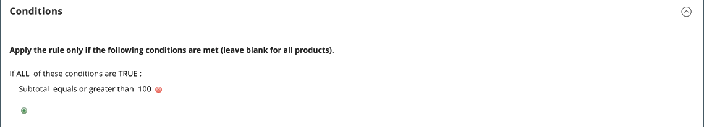

# Exemplo de regra de preço do carrinho - promoção de frete grátis

O frete grátis pode ser oferecido como uma promoção, com ou sem um [cupom](price-rules-cart-coupon.md). Um cupom de remessa gratuita, ou voucher, também pode ser aplicado a ordens de retirada do cliente, para que a ordem possa ser faturada e remetida para concluir o [fluxo de trabalho](../stores-purchase/order-processing.md#order-workflow-and-processing).

Algumas configurações de transportadoras oferecem a capacidade de oferecer frete grátis com base em um pedido mínimo. Para expandir esse recurso básico, você pode usar as regras de preço do carrinho de compras para criar condições complexas com base em vários atributos de produto, conteúdo do carrinho e grupos de clientes.

## Etapa 1. Ativar frete grátis

1. Habilitar [remessa gratuita](../stores-purchase/shipping-free.md) na configuração da loja.

1. Conclua as configurações de frete grátis para qualquer [serviço de transportadora](../stores-purchase/carriers.md) que você desejar usar para frete gratuito.

## Etapa 2. Criar uma regra de preço de carrinho

Na barra lateral _Admin_, vá para **[!UICONTROL Marketing]** > _[!UICONTROL Promotions]_>**[!UICONTROL Cart Price Rules]**.

Siga as etapas abaixo para configurar o tipo de promoção de frete gratuito que deseja oferecer.

### Exemplo 1: envio gratuito para qualquer pedido

1. Conclua o **[!UICONTROL Rule Information]** da seguinte maneira:

   - Insira um **[!UICONTROL Rule Name]** para referência interna.
   - Digite um breve **[!UICONTROL Description]** para descrever a regra.
   - Defina **[!UICONTROL Active]** como `Yes`.
   - Na caixa **[!UICONTROL Websites]**, selecione cada site onde o cupom de frete gratuito deverá estar disponível.
   - Selecione o **[!UICONTROL Customer Groups]** ao qual a regra se aplica.
   - Defina **[!UICONTROL Coupon]** como um dos seguintes:
      - Para oferecer uma promoção de remessa gratuita sem um cupom, aceite a configuração padrão (`No Coupon`).
      - Para usar um cupom com a regra de preço, selecione `Specific Coupon`. Se necessário, complete as instruções para configurar um [cupom](price-rules-cart-coupon.md).

1. Role para baixo e expanda  a seção **[!UICONTROL Actions]** e faça o seguinte:

   - Defina **[!UICONTROL Apply]** como `Percent of product price discount`.
   - Defina **[!UICONTROL Apply to Shipping Amount]** como `Yes`.
   - Defina **[!UICONTROL Free Shipping]** como `For matching items only`.

   {width="600" zoomable="yes"}

### Exemplo 2: envio gratuito para pedidos acima do valor de $

1. Conclua as configurações de **[!UICONTROL General Information]** conforme descrito no exemplo anterior.

1. Role para baixo e expanda  na seção **[!UICONTROL Conditions]**.

1. Clique em _Adicionar_ () para inserir uma condição e faça o seguinte:

   - Na lista abaixo de **[!UICONTROL Cart Attribute]**, escolha `Subtotal`.
   - Clique em **[!UICONTROL is]** e escolha `equals or greater than`.
   - Clique em **...** e insira um valor de limite para o Subtotal, como `100`, para concluir a condição.

   {width="600" zoomable="yes"}

1. Se necessário, expanda  a seção **[!UICONTROL Actions]** e faça o seguinte:

   - Defina **[!UICONTROL Apply]** como `Percent of product price discount`.
   - Defina **[!UICONTROL Apply to Shipping Amount]** como `Yes`.
   - Defina **[!UICONTROL Free Shipping]** como `For matching items only`.

## Etapa 3. Preencha os rótulos

Conclua a [Etapa 4](price-rules-cart.md) das instruções de regra de preço do carrinho para inserir rótulos que apareçam durante o check-out.

## Etapa 4. Salvar e testar a regra

{{new-price-rule}}

1. Quando a regra estiver concluída, clique em **[!UICONTROL Save Rule]**.

1. Teste a regra para verificar se ela funciona corretamente.
