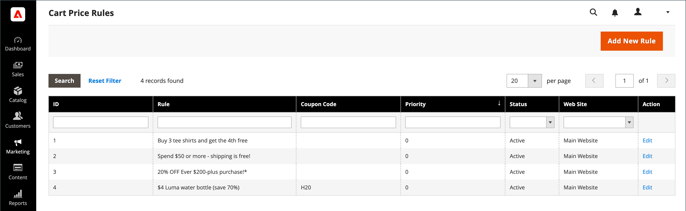

# Regras de preço do carrinho

As regras de preço do carrinho aplicam descontos aos itens do carrinho de compras, com base em um conjunto de condições. O desconto pode ser aplicado automaticamente quando as condições forem atendidas ou quando o cliente inserir um código de cupom válido. Quando aplicado, o desconto é exibido no carrinho abaixo do subtotal. Uma regra de preço do carrinho pode ser usada conforme necessário para uma temporada ou promoção, alterando seu status e intervalo de datas.

>[!NOTE]
>
>Se a regra do carrinho de cupom tiver condições que especificam opções de finalização de compra, como determinados métodos de envio ou de pagamento, as condições serão atendidas somente na finalização de compra após a seleção dos métodos específicos de envio/pagamento. Nesse caso, o cupom pode ser aplicado no check-out na última etapa.

{width="600" zoomable="yes"}

## Acessar regras de preço do carrinho

1. Na barra lateral _Admin_, vá para **[!UICONTROL Marketing]** > _[!UICONTROL Promotions]_>**[!UICONTROL Cart Price Rules]**.

   {width="700" zoomable="yes"}

1. Se você tiver muitas regras, use as opções de filtro na parte superior de cada coluna para simplificar a lista e clique em **[!UICONTROL Search]** para aplicar os filtros.

1. Para limpar todas as opções de filtro e exibir a lista completa, clique em **[!UICONTROL Reset Filter]**.

1. Atualizar propriedades de uma regra:

   -  (somente Adobe Commerce) Clique em **[!UICONTROL Edit]** para exibir a página Informações da Regra.

   -  (somente Magento Open Source) Clique na regra da lista para exibir a página Informações da Regra.

   Lá, é possível alterar as configurações da regra (semelhante à criação de uma regra).

## Opções de filtro por coluna

| Coluna | Descrição |
|--- |--- |
| [!UICONTROL ID] | Insira um texto para filtrar a lista de um número de ID de regra específico. |
| [!UICONTROL Rule] | Digite texto para filtrar a lista com base no nome da regra definido quando a regra foi criada. |
| [!UICONTROL Coupon Code] | Insira um texto para filtrar a lista com base no nome do código definido quando a regra foi criada. |
| [!UICONTROL Priority] | Campo de texto livre que filtra a lista com base na prioridade definida para uma regra. |
| [!UICONTROL Status] | Use esta opção para filtrar a lista com base no status da regra (`Active` ou `Inactive`). |
| [!UICONTROL Web Site] | Use essa opção para filtrar a lista com base nos sites definidos para uma regra. |
| [!UICONTROL Action] |  (somente Adobe Commerce) Clique em **[!UICONTROL Edit]** para exibir a página _[!UICONTROL Rule Information]_&#x200B;e atualizar as configurações de regra (semelhante à criação de uma regra). |
| [!UICONTROL Start] |  (somente Magento Open Source) Use os campos de calendário dinâmico (_[!UICONTROL To:]_&#x200B;e&#x200B;_[!UICONTROL From:]_) para filtrar a lista com base na data de início da regra conforme definido quando a regra foi criada. |
| [!UICONTROL End] |  (somente Magento Open Source) Use os campos de calendário dinâmico (_[!UICONTROL To:]_&#x200B;e&#x200B;_[!UICONTROL From:]_) para filtrar a lista com base na data final da regra conforme definido quando a regra foi criada. |

{style="table-layout:auto"}

## Use os públicos da Real-Time CDP para informar as regras de preço do carrinho

Saiba como [ativar](../customers/audience-activation.md) públicos-alvo da Real-Time CDP na sua instância do Adobe Commerce para informar as regras de preço do carrinho.
