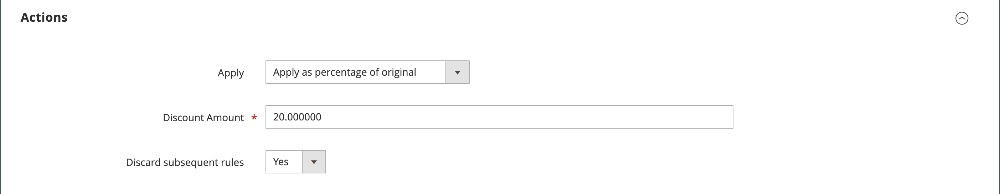

# Criar uma regra de preço de catálogo

Siga estas instruções para aplicar um desconto a produtos específicos sempre que um conjunto de condições for atendido. Os descontos da regra de preço de catálogo entram em vigor antes de o produto ser colocado no carrinho de compras.

## Etapa 1: adicionar uma regra

1. Na barra lateral _Admin_, vá para **[!UICONTROL Marketing]** > _[!UICONTROL Promotions]_>**[!UICONTROL Catalog Price Rule]**.

1. No canto superior direito, clique em **[!UICONTROL Add New Rule]**.

   A seção _[!UICONTROL Rule Information]_inclui seções expansíveis para **[!UICONTROL Conditions]**e **[!UICONTROL Actions]**.

   {width="700" zoomable="yes"}

1. Complete os campos **[!UICONTROL Rule Name]** e **[!UICONTROL Description]**.

   Esses campos são somente para sua referência interna.

1. Defina o **[!UICONTROL Status]** da regra de preço conforme necessário.

   O status padrão é `Inactive`.

   >[!NOTE]
   >
   >Após a criação da regra, é possível atualizar seu status, alterando-o para `Active` ou `Inactive`, conforme necessário.

1. Selecione o **[!UICONTROL Websites]** em que a regra deve estar disponível.

1. Selecione o **[!UICONTROL Customer Groups]** ao qual esta regra se aplica.

   Para escolher vários grupos, mantenha pressionada a tecla Ctrl (PC) ou a tecla Command (Mac) e clique em cada opção.

   >[!NOTE]
   >
   >As opções nesta lista dependem dos grupos de clientes criados e gerenciados em _Clientes_ > _Grupos de Clientes_.

1.  (somente Magento Open Source) Insira as datas **[!UICONTROL From]** e **[!UICONTROL To]** para determinar quando a regra de preço está em vigor.

   Você pode inserir as datas ou usar o **[!UICONTROL Calendar]** () para escolher as datas. Se você deixar as datas em branco, a regra será ativada quando a regra de preço for salva.

1. Insira um número para estabelecer o **[!UICONTROL Priority]** desta regra em relação a outras regras.

   >[!NOTE]
   >
   >A configuração _[!UICONTROL Priority]_é importante quando o mesmo produto de catálogo atende às condições definidas para mais de uma regra de preço. A regra com a configuração de prioridade mais alta (as prioridades da mais alta para a mais baixa são 0,1,2,3...) se torna ativa para o produto.

## Etapa 2: definir as condições

A maioria das condições disponíveis é baseada nos valores de atributo existentes. Para aplicar a regra a todos os produtos, deixe as condições em branco.

>[!NOTE]
>
>Se pelo menos um atributo condicional de produto tiver um valor vazio, a regra de preço de catálogo não será aplicada ao produto.

>[!NOTE]
>
>Para aplicar uma condição de atributo de produto `Category` a qualquer produto [bundle](../catalog/product-create-bundle.md) ou [grouped](../catalog/product-create-grouped.md), todos os produtos derivados devem ser atribuídos à mesma categoria para que a regra seja aplicada corretamente. Caso contrário, você pode usar uma promoção de [Regra de preço do carrinho](price-rules-cart-create.md).

1. Role para baixo e expanda  na seção **[!UICONTROL Conditions]**.

   A primeira condição é exibida por padrão e declara:

   `If **ALL** of these conditions are **TRUE**:`

   {width="400"}

   A instrução tem dois links em negrito nos quais você pode clicar para exibir a seleção de opções dessa parte da instrução. Você pode criar condições diferentes alterando a combinação desses valores.

1. Altere a instrução de qualquer uma das seguintes maneiras:

   - Clique em **[!UICONTROL ALL]** e selecione `ALL` ou `ANY`.
   - Clique em **[!UICONTROL TRUE]** e selecione `TRUE` ou `FALSE`.
   - Deixe a condição inalterada para aplicar a regra a todos os produtos.

   Você pode criar condições diferentes alterando a combinação desses valores. Neste exemplo, a condição padrão é usada.

1. Clique no ícone _Adicionar_ () no início da próxima linha e selecione uma opção para a condição, como um atributo ou combinação de produto.

1. Na lista em **[!UICONTROL Product Attribute]**, escolha o atributo que você deseja usar como a base da condição.

   Para este exemplo, a condição é `Attribute Set`.

   {width="400"}

   >[!NOTE]
   >
   >Para que um atributo seja exibido na lista, ele deve ser configurado para uso nas condições de regra promocional. Para saber mais, consulte [Atributos do produto](../catalog/product-attributes.md).

   >[!NOTE]
   >
   >Ao usar a condição `is not one of` com um atributo de produto _SKU_ e um produto configurável, as SKUs de produto pai e filho devem ser selecionadas. Para evitar listar todas as SKUs secundárias na regra, você pode usar a condição `does not contain` com partes SKU comuns de um produto configurável e seus produtos secundários.

   A condição selecionada aparece na instrução, seguida por mais dois links em negrito. As opções diferem dependendo do atributo de condição selecionado. A declaração agora diz:

   `If **ALL** of these conditions are **TRUE**:  Attribute Set **is** …`

1. Clique em **[!UICONTROL is]** e escolha o operador de comparação que descreve a condição a ser atendida.

   Essas opções podem incluir uma opção para comparações diferentes. Neste exemplo, as opções são `is` e `is not`.

1. Selecione ou insira valores para a condição.

   Dependendo da condição, você pode selecionar produtos de uma grade ou lista, inserir um valor numérico e assim por diante.

   {width="400"}

   O item selecionado aparece na instrução para concluir a condição.

   `If **ALL** of these conditions are **TRUE**:   Attribute Set **is Default**`

1. Para adicionar outra linha de condição à instrução, clique no ícone _Adicionar_ () e escolha uma das seguintes opções:

   - `Conditions Combination`
   - `Product Attribute`

   Repita o processo até que todas as condições desejadas sejam concluídas.

   Se, a qualquer momento, você quiser excluir parte da declaração de condição, clique no ícone **[!UICONTROL Delete]** () no final da linha.

## Etapa 3: definir as ações

1. Expanda a seção **[!UICONTROL Actions]** e faça o seguinte:

   {width="600" zoomable="yes"}

1. Em **[!UICONTROL Pricing Structure Rules]**, defina **[!UICONTROL Apply]** como um dos seguintes:

   - `Apply as percentage of original` - Descontos subtraindo uma porcentagem do preço normal. Por exemplo: Insira 10 em Valor do desconto para um preço final marcado para 10% abaixo do preço normal.
   - `Apply as fixed amount` - Descontos subtraindo um valor fixo do preço normal. Por exemplo: Insira 10 em Quantia de Desconto para um preço final que seja US$ 10 a menos que o preço normal.
   - `Adjust final price to this percentage` - Ajusta o preço final por uma porcentagem do preço normal. Por exemplo: Insira 25 em Valor do Desconto para um preço final marcado 75% abaixo do preço normal.
   - `Adjust final price to discount value` - Define o preço final como um valor fixo e com desconto. Por exemplo: Insira 20 em Valor do Desconto para um preço final de US$ 20,00.

   >[!NOTE]
   >
   >_Preço normal_ refere-se ao preço base do produto sem descontos promocionais ou especiais. _Preço final_ refere-se ao preço com desconto que aparece no carrinho de compras.  O preço do produto **_final_** é calculado como o preço relevante de **_mínimo_**, usando a seguinte fórmula:  `Final Price=Min(Regular(Base) Price, Group(Tier) Price, Special Price, Catalog Price Rule) + Sum(Min Price per each required custom option)`

   >[!NOTE]
   >
   >**_Preço Fixo_** O produto de Opções Personalizáveis _não_ é afetado pelas regras de Preço de Grupo, Preço de Camada, Preço Especial ou Preço de Catálogo.

1. Insira o **[!UICONTROL Discount Amount]**.

1. Para interromper o processamento de outras regras depois que esta regra for aplicada, defina **[!UICONTROL Discard Subsequent Rules]** como `Yes`.

   >[!NOTE]
   >
   >Configurar isso como `Yes` é uma proteção para impedir que o sistema aplique vários descontos (regras) ao mesmo produto.

## Etapa 4: adicionar blocos dinâmicos relacionados

{{ee-feature}}

[Blocos dinâmicos](../content-design/dynamic-blocks.md) associados a uma regra de preço de catálogo aparecem na loja sempre que as condições são atendidas. Esta é uma etapa opcional.

1. Expandir a seção **[!UICONTROL Related Dynamic Blocks]**.

1. Use os [filtros de pesquisa](../getting-started/admin-workspace.md) para localizar os blocos dinâmicos que deseja associar à regra.

1. Marque a caixa de seleção na primeira coluna para associar o bloco dinâmico à regra.

   {width="600" zoomable="yes"}

1. Clique em **[!UICONTROL Save and Continue Edit]**.

## Etapa 5: agendar a regra

{{ee-feature}}

>[!NOTE]
>
>Definir a regra como ativa deve ser adicionado como uma atualização programada. Para saber mais, consulte [Alterações agendadas](price-rule-catalog-scheduled-changes.md).

1. Na caixa _Alterações agendadas_, clique em **[!UICONTROL Schedule New Update]** na parte superior da caixa).

   Se a regra tiver uma atualização agendada existente, você poderá clicar em **[!UICONTROL View/Edit]** à direita da alteração listada.

   Você pode editar a atualização existente ou atribuir a regra de preço do catálogo a outra campanha. A opção **Editar Atualização Existente** está selecionada por padrão.

1. Para agendar a regra, insira o **[!UICONTROL Start Date]** e **[!UICONTROL End Date]** que a regra de preço deve estar ativa.

   Você pode inserir as datas ou escolher as datas no _Calendário_ ().

   {width="600" zoomable="yes"}

1. Clique em **[!UICONTROL Save]**.

1. Na seção _Informações da Regra_, defina **[!UICONTROL Status]** como `active`.

## Etapa 6: salvar e testar a regra

1. Quando terminar, salve a regra.

   -  (somente Magento Open Source) Clique em **[!UICONTROL Save and Apply]**.

   -  (somente Adobe Commerce) Clique em **[!UICONTROL Save]**.

     A página Informações da regra exibe uma linha do tempo atualizada nas Alterações programadas da regra.

     {width="600" zoomable="yes"}

1. Atualizar propriedades de uma regra:

   -  (somente Adobe Commerce) Clique em **[!UICONTROL Edit]** para exibir a página _[!UICONTROL Rule Information]_.

   -  (somente Magento Open Source) Clique na regra da lista para exibir a página _[!UICONTROL Rule Information]_.

1. Teste a regra para verificar se ela funciona corretamente.

   As regras de preço são processadas automaticamente com outras regras do sistema todas as noites. Ao criar uma regra de preço, aguarde tempo suficiente para que ela entre no sistema antes de testar a regra para verificar se ela funciona corretamente. À medida que novas regras são adicionadas, o Commerce recalcula os preços e as prioridades de acordo.

## Demonstração da regra de preço de catálogo

Assista a este vídeo para saber mais sobre como criar regras de preço de catálogo:

>[!VIDEO](https://video.tv.adobe.com/v/343834?quality=12&learn=on)

## Descrições dos campos

### [!UICONTROL Rule Information]

| Campo | Descrição |
|-----|-----------|
| [!UICONTROL Rule name] | (Obrigatório) O nome da regra é para referência interna. |
| [!UICONTROL Description] | Uma descrição da regra deve incluir a finalidade da regra e explicar como ela é usada. |
| [!UICONTROL Websites] | (Obrigatório) Identifica os sites nos quais a regra pode ser usada. |
| [!UICONTROL Customer Groups] | (Obrigatório) Identifica os grupos de clientes aos quais a regra se aplica. |
| [!UICONTROL Priority] | Um número que indica a prioridade dessa regra em relação a outras. As prioridades da mais alta para a mais baixa são `0,1,2,3...` |
| [!UICONTROL Status] |  (somente Magento Open Source) Determina se a regra está ativa no armazenamento. Opções: `Yes` / `No` |
| [!UICONTROL From] |  (somente Magento Open Source) Especifica o primeiro dia em que a regra de preço está em vigor. Se deixado em branco, a regra de preço entra em vigor quando é salva. |
| [!UICONTROL To] |  (somente Magento Open Source) Especifica o último dia em que a regra de preço está em vigor. Se deixado em branco, a regra de preço continuará indefinidamente. |

{style="table-layout:auto"}

### [!UICONTROL Conditions]

Especifica as condições que devem ser atendidas antes que a regra de preço de catálogo entre em ação. Se deixado em branco, a regra se aplica a todos os produtos.

### [!UICONTROL Actions]

| Campo | Descrição |
|-----|-----------|
| [!UICONTROL Apply] | Determina o tipo de cálculo aplicado à compra. Opções:  **[!UICONTROL Apply as percentage of original]**- Item de descontos subtraindo uma porcentagem do preço normal. **[!UICONTROL Apply as fixed amount]** - Descontos subtraindo um valor fixo do preço normal.  **[!UICONTROL Adjust final price to this percentage]**- Ajusta o preço final por uma porcentagem do preço normal. **[!UICONTROL Adjust final price to discount value]** - Define o preço final como um valor fixo e com desconto.   **_Observação:_**preço normal refere-se ao preço base do produto sem descontos promocionais ou especiais. Preço final refere-se ao preço com desconto que aparece no carrinho de compras.  O preço do produto**_final _**é calculado como o preço relevante de**_mínimo _**, usando a seguinte fórmula:  `Final Price=Min(Regular(Base) Price, Group(Tier) Price, Special Price, Catalog Price Rule) + Sum(Min Price per each required custom option)` |
| [!UICONTROL Discount Amount] | (Obrigatório) A quantia de desconto oferecida. |
| [!UICONTROL Discard Subsequent Rules] | Determina se regras adicionais podem ser aplicadas a esta compra. Para evitar que vários descontos sejam aplicados à mesma compra, selecione `Yes`. Opções: `Yes` / `No` |

{style="table-layout:auto"}

### [!UICONTROL Related Dynamic Blocks]

{{ee-feature}}

Identifica todos os [blocos dinâmicos](../content-design/dynamic-blocks.md) associados à regra.
