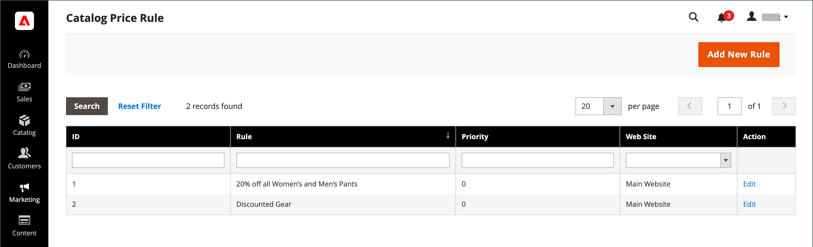

# Regras de preço de catálogo

As regras de preço de catálogo podem ser usadas para oferecer produtos aos compradores por um preço com desconto, com base em um conjunto de condições definidas. As regras de preço de catálogo não usam [códigos de cupom](price-rules-cart-coupon.md), pois são acionadas antes de um produto ser colocado no carrinho de compras.

Por exemplo, você pode definir e definir as condições para uma regra de preço que, quando atendida, exibe automaticamente os produtos com um preço especial ou promocional. As propriedades de regras definidas podem incluir grupos de clientes, categorias de produtos, um valor ou porcentagem de desconto, cor do produto, tamanho do produto ou quase qualquer atributo de produto definido em sua loja. É possível definir datas inicial e final para uma regra de preço que inicie e interrompa automaticamente uma promoção nas datas definidas na regra. As propriedades de uma regra salva podem ser atualizadas ou modificadas, conforme necessário.

-  (somente Adobe Commerce) Também é possível vincular uma regra definida a um [bloco dinâmico](../content-design/dynamic-blocks.md) para ajudar a promover o evento ou produto em sua loja.

-  (somente Magento Open Source) Para promoções recorrentes, você pode definir manualmente uma regra salva para o status _Ativo_ ou _Inativo_ sempre que desejar executar a promoção.

## Acessar regras de preço de catálogo

1. Na barra lateral _Admin_, vá para **[!UICONTROL Marketing]** > _[!UICONTROL Promotions]_>**[!UICONTROL Catalog Price Rules]**.

   {width="700" zoomable="yes"}

1. Atualizar propriedades de uma regra:

   -  (somente Adobe Commerce) Clique em **[!UICONTROL Edit]** para exibir a página _Informações da Regra_.

   -  (somente Magento Open Source) Clique na regra na lista para exibir a página Informações da Regra.

   Você pode alterar as configurações da regra (semelhante a [criando uma regra](price-rules-catalog-create.md)).

## Opções de filtro

| Campo | Descrição |
|--- |--- |
| [!UICONTROL ID] | Insira um texto para filtrar a lista de um número de ID de regra específico. |
| [!UICONTROL Rule] | Digite texto para filtrar a lista com base no nome da regra definido quando a regra foi criada. |
| [!UICONTROL Priority] |  (somente Adobe Commerce) Digite texto neste campo para filtrar a lista com base na prioridade definida para uma regra. |
| [!UICONTROL Web Site] |  (somente Adobe Commerce) Use essa opção para filtrar a lista com base nos sites definidos para uma regra. |
| [!UICONTROL Action] |  (somente Adobe Commerce) Clique em **[!UICONTROL Edit]** para exibir as Informações da Regra e atualizar as configurações da regra (semelhante à criação de uma regra). |
| [!UICONTROL Start] |  (somente Magento Open Source) Use os campos de calendário dinâmico (Para: e De:) para filtrar a lista com base na data de início da regra, conforme definido quando a regra foi criada. |
| [!UICONTROL End] |  (somente Magento Open Source) Use os campos de calendário dinâmico (Para: e De:) para filtrar a lista com base na data de término da regra, conforme definido quando a regra foi criada. |
| [!UICONTROL Status] |  (somente Magento Open Source) Use esta opção para filtrar a lista com base no status da regra (`Active` ou `Inactive`). |

{style="table-layout:auto"}
