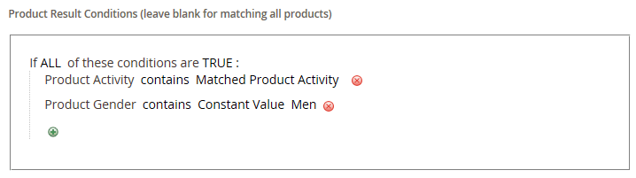

# Criar uma regra de produto relacionada

{{ee-feature}}

O processo de criação de uma regra de produto relacionada é semelhante à configuração de uma regra de preço. Primeiro, defina as condições a serem atendidas e escolha os produtos que deseja exibir. Em um determinado momento, pode haver várias regras ativas que podem ser acionadas para exibir produtos relacionados, vendas adicionais e vendas cruzadas. A prioridade de cada regra determina a ordem na qual o bloco de produtos aparece na página.

>[!NOTE]
>
>Para que um atributo seja usado em uma regra direcionada, a variável [_[!UICONTROL Use for Promo Rule Conditions]_](../catalog/product-attributes.md) propriedade deve ser definida como `Yes`.

>[!NOTE]
>
>A variável `All Store Views` o valor do escopo é sempre usado para ambos [!UICONTROL Products to Match] e [!UICONTROL Products to Display] condições para todos os atributos de produto. Isso também se aplica quando os atributos do produto têm valores diferentes para diferentes exibições e sites da loja.

## Criar uma regra de produto relacionada

1. No _Admin_ barra lateral, vá para **[!UICONTROL Marketing]** > _[!UICONTROL Promotions]_>**[!UICONTROL Related Product Rules]**.

1. No canto superior direito, clique em **[!UICONTROL Add Rule]**.

   {width="600" zoomable="yes"}

1. Conclua o **[!UICONTROL Rule Information]** do seguinte modo:

   - Insira um **[!UICONTROL Rule Name]** para identificar a regra ao trabalhar no Administrador.

   - Para **[!UICONTROL Priority]**, insira um número que determine a ordem em que os resultados aparecem na página quando os resultados de outras regras são direcionados para o mesmo local. Número `1` O é a prioridade máxima.

   - Para ativar a regra, defina **[!UICONTROL Status]** para `Active`.

   - Definir **[!UICONTROL Apply To]** a um dos seguintes:

      - `Related Products`
      - `Up-sells`
      - `Cross-sells`

   - Se a regra for ficar ativa por um período específico, insira o **[!UICONTROL From]** e **[!UICONTROL To]** datas.

   - Para **[!UICONTROL Result Limit]**, insira o número de registros a serem exibidos na lista de resultados. O número máximo é 20.

   - Se a regra se aplicar a um [segmento de cliente](../customers/customer-segments.md), definir **[!UICONTROL Customer Segments]** para `Specified` e escolha o segmento do cliente na lista.

1. No painel esquerdo, escolha **[!UICONTROL Products to Match]** e crie as condições como você faria para uma [regra de preço de catálogo](price-rules-catalog.md).

   {width="500"}

1. No painel esquerdo, escolha **[!UICONTROL Products to Display]** e crie as condições dos resultados da mesma maneira que você faria para uma [regra de preço de catálogo](price-rules-catalog.md).

   {width="500"}

   Complete a condição para descrever os produtos que deseja incluir nos resultados exibidos.

1. Quando terminar, clique em **[!UICONTROL Save]**.

## Excluir uma regra de produto relacionada

1. No _Admin_ barra lateral, vá para **[!UICONTROL Marketing]** > _[!UICONTROL Promotions]_>**[!UICONTROL Related Product Rules]**.

1. Localize a regra de produto relacionada que deseja excluir.

1. Clique na regra para abrir a página de detalhes.

1. No canto superior direito, clique em **[!UICONTROL Delete]**.

1. Para confirmar a ação, clique em **[!UICONTROL OK]**.

## Demonstração de regra de produto relacionada

Assista a este vídeo para saber mais sobre como criar regras de produto relacionadas:

>[!VIDEO](https://video.tv.adobe.com/v/343837?quality=12&learn=on)

## Descrições dos campos

| Campo | Descrição |
|--- |--- |
| [!UICONTROL Rule Name] | Um nome que identifica a regra para uso interno. |
| [!UICONTROL Priority] | Determina a sequência em que os resultados da regra aparecem quando exibidos com outros conjuntos de resultados que têm como alvo o mesmo local na página. O valor pode ser definido como qualquer número inteiro, com a prioridade mais alta de 1. Por exemplo, se houver várias regras de venda adicional aplicáveis, a de maior prioridade será exibida antes das outras. A ordem de classificação dos produtos em cada conjunto de resultados é aleatória. Qualquer venda adicional, venda cruzada e produto relacionado que foi configurado manualmente sempre aparecem na página antes de qualquer promoção de produto baseada em regras. |
| [!UICONTROL Status] | Controla o status ativo da regra. Opções: `Active` / `Inactive` |
| [!UICONTROL Apply To] | Identifica o tipo de relacionamento de produto associado à regra. Opções: `Related Products` / `Up-sells` / `Cross-sells` |
| [!UICONTROL From Date] | Se a regra estiver ativa por um intervalo de tempo, essa configuração determinará a primeira data em que a regra estará ativa. |
| [!UICONTROL To Date] | Se a regra estiver ativa por um intervalo de tempo, essa configuração determinará a última data em que a regra ficará ativa. |
| [!UICONTROL Result Limit] | Determina o número de produtos que aparecem nos resultados de uma vez. O número máximo é 20. Se mais resultados correspondentes forem encontrados, os produtos girarão pelo bloco sempre que a página for atualizada. |
| [!UICONTROL Customer Segments] | Identifica os segmentos de clientes aos quais a regra se aplica. Opções: `All` / `Specified` |

{style="table-layout:auto"}
