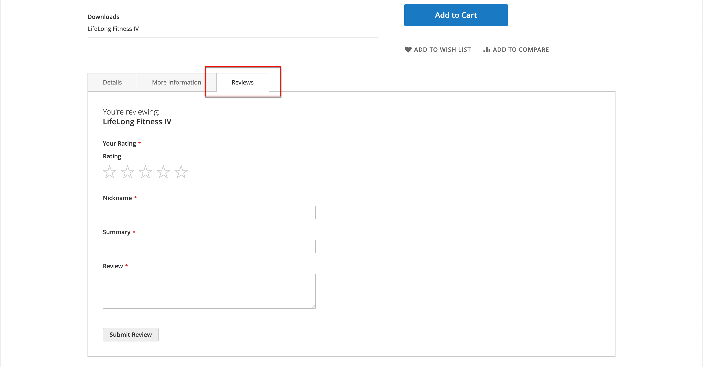
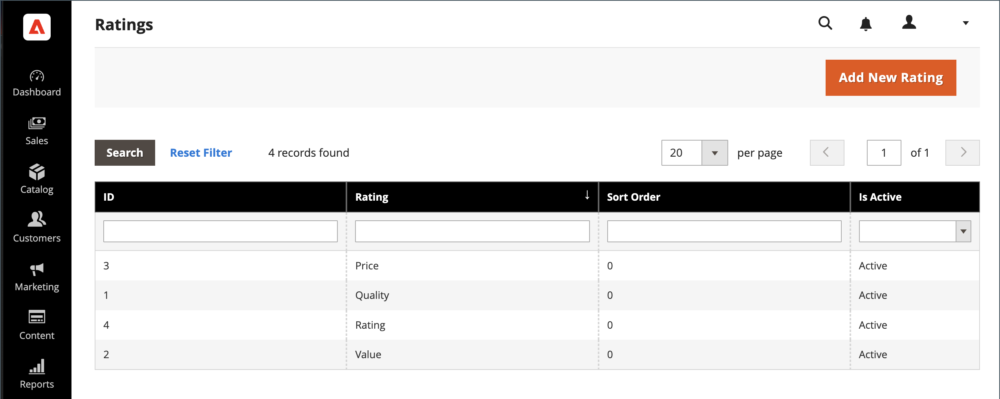

# Resenhas do produto

Resenhas de produtos ajudam a construir um senso de comunidade e são consideradas mais críveis do que qualquer dinheiro de publicidade pode comprar. Na verdade, alguns mecanismos de pesquisa dão aos sites com análises de produtos uma classificação mais alta do que aqueles sem análises. Para aqueles que encontram seu site procurando por um produto específico, uma análise do produto é essencialmente a página inicial da sua loja. As análises de produtos ajudam as pessoas a encontrar sua loja, mantê-las envolvidas e geralmente levam a vendas.

O Commerce inclui um recurso nativo de análises de produtos que você pode gerenciar no Administrador. Também é possível usar uma extensão do [Commerce Marketplace](../getting-started/commerce-marketplace.md) para usar um sistema hospedado de gerenciamento de revisões.

>[!NOTE]
>
>O Adobe Commerce e o Magento Open Source versões 2.4.0 a 2.4.3 incluíam a extensão desenvolvida pelo fornecedor do Yotpo. A partir da versão 2.4.4, essa extensão não é mais fornecida com a versão principal e deve ser instalada e atualizada do Commerce Marketplace. O Marketplace também fornece acesso à documentação atual fornecida pelo desenvolvedor da extensão.
>  
>Se você tiver a extensão agrupada ativada e configurada, deverá atualizar o arquivo composer.json como parte do processo de atualização 2.4.4 e gerenciar as atualizações de extensão a partir de agora. Consulte [Atualizar módulos](https://experienceleague.adobe.com/docs/commerce-operations/upgrade-guide/modules/upgrade.html) no _Guia de atualização_ para obter mais informações.

## Resenhas de produtos na loja

Quando a função Nativa Revisões de produto estiver ativada, os clientes poderão escrever revisões para qualquer produto em seu catálogo. As análises podem ser escritas na página do produto clicando em:

- **Adicionar sua avaliação** para produtos com revisões existentes.

- **Seja o primeiro em analisar este produto** para produtos sem revisões existentes.

A variável [!UICONTROL Reviews] A guia lista todas as revisões atuais e o formulário usado para enviar uma revisão.

Sua configuração determina se os clientes devem abrir uma conta na loja antes de escrever análises de produtos ou se podem enviar análises como convidados. Exigir que os revisores abram uma conta impede envios anônimos e melhora a qualidade das análises.

{width="700" zoomable="yes"}

O número de estrelas indica o índice de satisfação do produto. Os visitantes podem clicar no link para ler as revisões e escrever as suas próprias. Como incentivo, os clientes podem receber pontos de recompensa pelo envio de uma revisão. Quando uma revisão é enviada, ela é enviada ao administrador para moderação. Quando aprovada, a revisão é publicada na loja.

{width="700" zoomable="yes"}

### [!UICONTROL My Product Reviews]

A variável _[!UICONTROL My Product Reviews]_do painel de conta do cliente lista todas as análises enviadas pelo cliente e aprovadas para publicação. Cada resumo de revisão inclui a data em que a revisão foi enviada, links para a página do produto e detalhes da revisão.

{width="700" zoomable="yes"}

1. Na barra lateral da conta, o cliente escolhe **[!UICONTROL My Product Reviews]**.

1. Para exibir a revisão completa, clique em **[!UICONTROL See Details]**.

   {width="700" zoomable="yes"}

## Habilitar recursos de análise do produto

A função Análises de produto do Commerce é ativada por padrão.

>[!NOTE]
>
>Para definir esses campos como `No` e desativar Análises de produto do Commerce, você deve limpar a **Usar valor do sistema** caixas de seleção.

1. No _Admin_ barra lateral, vá para **[!UICONTROL Stores]** > _[!UICONTROL Settings]_>**[!UICONTROL Configuration]**.

1. No painel esquerdo, expanda **[!UICONTROL Catalog]** e selecione **[!UICONTROL Catalog]** por baixo.

1. Expandir  o **[!UICONTROL Product Reviews]** seção.

   {width="600" zoomable="yes"}

1. Definir **[!UICONTROL Enabled]** para `Yes`.

   Essa é a configuração padrão que permite revisões de produtos.

1. Definir **[!UICONTROL Allow Guests to Write Reviews]** para `Yes`.

   Essa é a configuração padrão que determina se os clientes devem abrir uma conta na loja para poderem escrever análises de produtos.

1. Quando terminar, clique em **[!UICONTROL Save Config]**.

## Criar classificações personalizadas

Com as Análises de produto do Commerce, os clientes podem atribuir classificações ao enviar uma análise de produto. As classificações padrão são qualidade, preço e valor. Além dessas, você pode adicionar suas próprias classificações personalizadas. A média das classificações de cinco estrelas exibidas nas páginas do catálogo é calculada para cada produto.

{width="700" zoomable="yes"}

1. No _Admin_ barra lateral, vá para **[!UICONTROL Stores]** > _[!UICONTROL Attributes]_>**[!UICONTROL Rating]**.

1. No canto superior direito, clique em **[!UICONTROL Add New Rating]**.

   {width="700" zoomable="yes"}

1. No _[!UICONTROL Rating Title]_, insira o **[!UICONTROL Default Value]**para a nova classificação.

   Se aplicável, insira também a tradução para cada exibição de loja.

   {width="600" zoomable="yes"}

1. No _Visibilidade de classificação_ seção, definir **[!UICONTROL Visibility In]** para a exibição da loja onde a classificação será usada.

   Para selecionar várias exibições de loja, mantenha pressionada a tecla Ctrl (PC) ou a tecla Command (Mac) e clique em cada item.

   >[!NOTE]
   >
   >As classificações não estarão visíveis, a menos que atribuídas a uma visualização de loja.

1. Para **[!UICONTROL Sort Order]**, insira um número para determinar a ordem dessa classificação quando listada com outras pessoas.

1. Se quiser mostrar sua classificação na loja, selecione a **[!UICONTROL Is Active]** caixa de seleção

   {width="600" zoomable="yes"}

1. Quando terminar, clique em **[!UICONTROL Save Rating]**.

   A classificação média de todas as revisões é exibida para cada produto na página de grade de produtos do catálogo.

   {width="700" zoomable="yes"}
