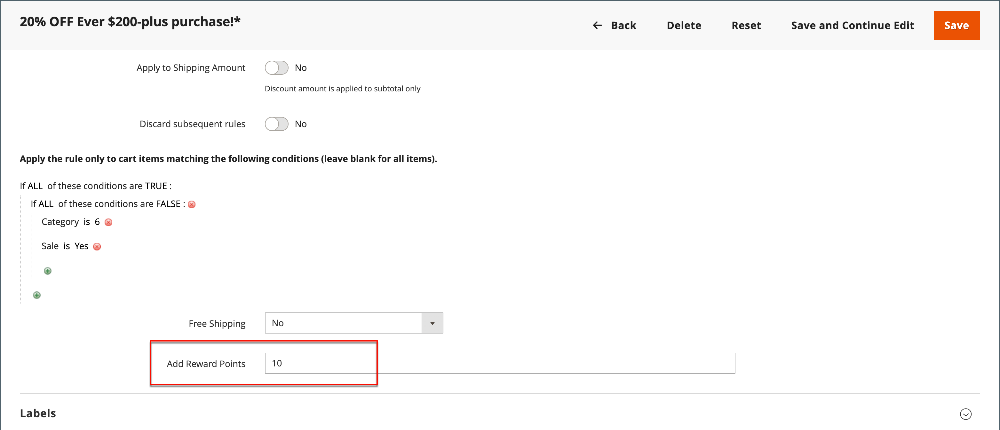

# Pontos de recompensa nas regras de preço

{{ee-feature}}

Os pontos de recompensa podem ser concedidos aos clientes de acordo com uma [regra de preço do carrinho](price-rules-cart.md). A atribuição de pontos pode ser a única ação da regra de preço ou pode ser usada com um desconto.

>[!NOTE]
>
>A configuração [Taxas de Câmbio de Recompensa](reward-exchange-rates.md) é necessária para o resgate de pontos de recompensa por clientes e usuários administradores durante o check-out.

## Adicionar pontos de premiação a uma regra de preço

1. Na barra lateral _Admin_, vá para **[!UICONTROL Marketing]** > _[!UICONTROL Promotions]_>**[!UICONTROL Cart Price Rules]**.

1. Clique em **[!UICONTROL Add New Rule]** para criar uma regra de preço do carrinho ou clique em uma regra de preço do carrinho existente para abri-la.

1. Role para baixo, expanda  a seção **[!UICONTROL Actions]**, defina as condições e insira o número de pontos no campo **[!UICONTROL Add Reward Points]**.

   {width="600" zoomable="yes"}

1. Siga as instruções padrão para concluir a [regra de preço do carrinho](price-rules-cart-create.md).

   Quando a regra de preço é ativada, uma mensagem é exibida no carrinho para informar aos clientes quantos pontos eles podem ganhar ao fazer o pedido. Isso se aplica somente a usuários registrados e pode variar quando um usuário está conectado.
