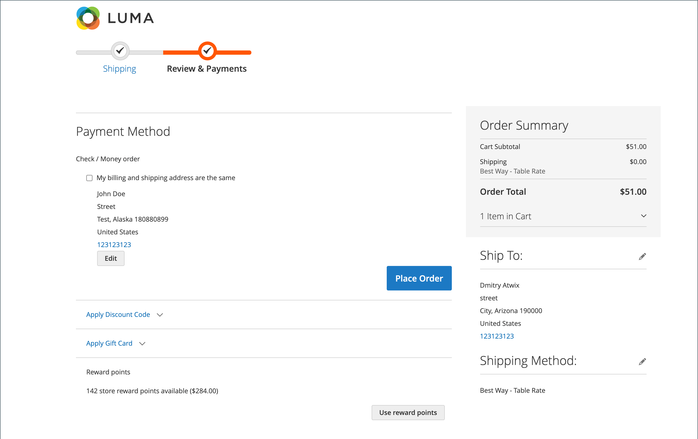

# Experiência da loja de pontos de premiação

{{ee-feature}}

A seção [Pontos de Recompensa](rewards-loyalty.md) da conta do cliente mostra o saldo atual dos pontos de premiação ganhos pelo cliente e um histórico do saldo desses pontos de premiação.

{width="700" zoomable="yes"}

## Resgatar os pontos de premiação durante o check-out

Se a [Taxa de Câmbio de Recompensa](reward-exchange-rates.md) com a direção `Points to Currency` estiver configurada, os clientes poderão usar pontos de premiação durante o check-out.

1. Depois de adicionar todos os produtos necessários ao carrinho de compras, o cliente navega até o checkout.

1. Insira todas as informações de remessa necessárias e navegue até a etapa _Revisão e Pagamentos_.

1. Na seção _[!UICONTROL Reward points]_, verifica o número de pontos disponíveis e o respectivo valor de moeda.

1. Cliques **[!UICONTROL Use reward points]**.

{width="700" zoomable="yes"}

O desconto de pontos disponível é aplicado ao subtotal.

>[!NOTE]
>
>Se o saldo disponível for maior que o total geral do pedido, outro método de pagamento não será necessário.
