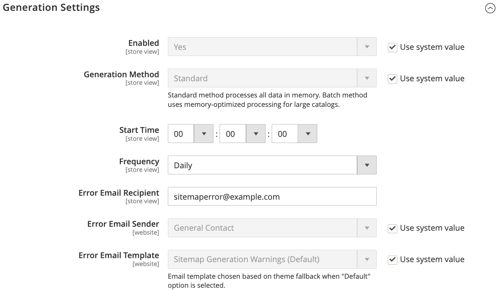

# Mapas do site

>[!TIP]
>
>Para o Adobe Commerce as a Cloud Service, consulte as [diretrizes de SEO](https://experienceleague.adobe.com/developer/commerce/storefront/setup/seo/indexing/) na documentação da Commerce Storefront

Um mapa de site melhora a maneira como sua loja é indexada por mecanismos de pesquisa e é projetado para encontrar páginas que podem ser ignoradas por rastreadores da Web. Um mapa do site pode ser configurado para indexar todas as páginas e imagens.

Quando habilitado, o Commerce cria um arquivo chamado `sitemap.xml` que é salvo na sua instalação no local especificado. A configuração oferece a capacidade de definir a frequência das atualizações e a prioridade para cada tipo de conteúdo. O mapa do site deve ser atualizado com a mesma frequência que as alterações de conteúdo do site, que podem ser diárias, semanais ou mensais.

Enquanto o site estiver em desenvolvimento, você poderá incluir instruções no arquivo `robots.txt` para que os rastreadores da Web evitem indexar o site. Antes do lançamento, é possível alterar as instruções para permitir que o site seja indexado.

Para obter informações técnicas, consulte [Adicionar sitemap e robots.txt](https://experienceleague.adobe.com/docs/commerce-cloud-service/user-guide/configure-store/robots-sitemap.html) no _Guia do Commerce on Cloud Infrastructure_.

{width="700" zoomable="yes"}

## Etapa 1. Configurar o mapa do site

Conclua a [configuração de Mapa de Site XML](#site-map-configuration) para determinar o que está incluído e com que frequência o mapa do site é atualizado.

## Etapa 2. Gerar o mapa do site

1. No menu _Admin_, vá para **[!UICONTROL Marketing]** > _[!UICONTROL SEO & Search]_>**[!UICONTROL Site Map]**.

1. Clique em **[!UICONTROL Add Site Map]**.

   {width="700" zoomable="yes"}

1. Insira o mapa do site **[!UICONTROL Filename]**. Por exemplo: `sitemap.xml`

1. Insira o **[!UICONTROL Path]** para determinar onde o arquivo de mapa do site deve residir no servidor. Verifique se o caminho é gravável.

   - `/sitemap/` - Coloca o arquivo do mapa do site em um diretório chamado _mapa do site_.

   - `/` - Coloca o arquivo de mapa do site no caminho base ou raiz da sua instalação do Commerce.

   {width="600" zoomable="yes"}

1. Quando terminar, clique em **[!UICONTROL Save & Generate]**.

   Pode levar alguns minutos para que o mapa do site apareça na grade.

## Etapa 3. Configure e ative o robots.txt (opcional)

Conclua a configuração dos [robôs do mecanismo de pesquisa](seo-overview.md#search-engine-robots) com instruções que direcionem os mecanismos de pesquisa para rastrear as partes do site que você deseja indexar.

## Etapa 4. Enviar o mapa do site para mecanismos de pesquisa

Você pode enviar o mapa do site para diferentes mecanismos de pesquisa fornecendo a eles o link para o arquivo `sitemap.xml` na sua instalação do Commerce. Para copiar o link, faça o seguinte:

1. Na lista _Mapa do Site_, clique com o botão direito do mouse na URL na coluna **[!UICONTROL Link for Google]**.

1. No menu, escolha **[!UICONTROL Copy Link Address]**.

Para obter mais informações, consulte as instruções do mecanismo de pesquisa específico. Aqui estão os links para instruções para dois dos principais mecanismos de pesquisa:

- [Google](https://support.google.com/webmasters/answer/183669?hl=en)
- [Microsoft® Bing](https://www.bing.com/webmasters/help/Sitemaps-3b5cf6ed)

## Etapa 5: Restaurar instruções anteriores do robô (opcional)

Agora é possível restaurar as restrições originais (padrão).

## Gerencie mapas de site e o robots.txt para vários sites

Se você tiver vários sites, poderá simplificar o processo de criação e envio de mapas de site. Basta [criar](#site-map-configuration) um ou mais mapas de site que incluam URLs para todos os seus armazenamentos verificados e salvar os mapas de site em um único local. Todos os sites devem ser verificados no [Google Search Console](https://support.google.com/webmasters/answer/7451001).

Para criar mapas de site para uma instância multiarmazenamento, faça o seguinte:

1. Crie uma pasta chamada `sitemaps` na raiz do site e, em seguida, crie subpastas para cada domínio:

       /sitemaps/domain_1/
       /sitemaps/domain_2/
   
1. Na barra lateral _Admin_, vá para **[!UICONTROL Marketing]** > _[!UICONTROL SEO & Search]_>**[!UICONTROL Site Map]**.

1. Crie ou edite as listagens de mapa de site para cada armazenamento e defina o **[!UICONTROL Path]** como aquele que você criou para o armazenamento:

   `/sitemaps/domain_1/`
   `/sitemaps/domain_2/`

1. Se necessário, atualize o arquivo robots.txt.

   Para garantir que as aranhas do mecanismo de pesquisa sejam direcionadas corretamente aos novos mapas de site, você pode atualizar ou criar o arquivo robots.txt. Adicione as seguintes linhas na parte superior.

       Mapa do Site
       Mapa do site: https://www.domain_1.com/sitemaps/domain_1/sitemap.xml
       Mapa do site: https://www.domain_2.com/sitemaps/domain_2/sitemap.xml
   
>[!NOTE]
>
>Se o site usa o mecanismo de servidor Web [Apache](https://experienceleague.adobe.com/docs/commerce-operations/installation-guide/prerequisites/web-server/apache.html), atualize o arquivo [`.htaccess`](https://httpd.apache.org/docs/current/howto/htaccess.html) na raiz do site para direcionar quaisquer outras solicitações de mapa de site para o local adequado.

## Descrições da coluna

| Coluna | Descrição |
|------|-----------|
| [!UICONTROL ID] | O número de registro sequencial do mapa do site atual. |
| [!UICONTROL Filename] | O nome do arquivo do mapa do site. |
| [!UICONTROL Path] | O local onde o mapa do site reside no servidor. Por exemplo:  `/sitemap/` - Coloca o arquivo do mapa do site em um diretório chamado _mapa do site_, um nível abaixo da raiz da instalação do Commerce.  `/` - Coloca o arquivo de mapa do site no caminho base ou raiz da instalação do Commerce. |
| [!UICONTROL Link for Google] | A URL do mapa do site que deve ser enviado para o Google e outros mecanismos de pesquisa. |
| [!UICONTROL Last Generated] | Indica a data e a hora em que o mapa do site foi gerado pela última vez. |
| [!UICONTROL Store View] | A exibição de loja onde o mapa do site se aplica. |
| [!UICONTROL Generate] | Regenera o mapa do site. |

{style="table-layout:auto"}

## Configuração do mapa do site

O mapa do site deve ser atualizado com a mesma frequência que as alterações de conteúdo do site, o que pode ocorrer diariamente, semanalmente ou mensalmente. A configuração permite definir a frequência e a prioridade para cada tipo de conteúdo.

### Etapa 1. Definir a frequência e a prioridade das atualizações de conteúdo

1. Na barra lateral _Admin_, vá para **[!UICONTROL Stores]** > _[!UICONTROL Settings]_>**[!UICONTROL Configuration]**.

1. No painel esquerdo, expanda **[!UICONTROL Catalog]** e escolha **[!UICONTROL XML Sitemap]**.

1. Expanda  a seção **[!UICONTROL Categories Options]** e faça o seguinte:

   >[!NOTE]
   >
   >Se necessário, desmarque a caixa de seleção **[!UICONTROL Use system value]** para alterar essas configurações.

   - Defina **[!UICONTROL Frequency]** como um dos seguintes:

      - `Always`
      - `Hourly`
      - `Daily`
      - `Weekly`
      - `Monthly`
      - `Yearly`
      - `Never`

   - Para **[!UICONTROL Priority]**, insira um valor entre `0.0` e `1.0`. Zero tem a prioridade mais baixa.

   {width="600" zoomable="yes"}

   Para obter uma lista detalhada dessas opções, consulte [Opções de Categorias](../configuration-reference/catalog/xml-sitemap.md#categories-options) na _Referência de Configuração_.

1. Expanda o  a seção **[!UICONTROL Products Options]** e conclua as configurações de **[!UICONTROL Frequency]** e **[!UICONTROL Priority]** conforme necessário.

   Para obter uma lista detalhada dessas opções, consulte [Opções de Produtos](../configuration-reference/catalog/xml-sitemap.md#products-options) na _Referência de Configuração_.

1. Para determinar a extensão de inclusão de imagens no mapa de site, defina **[!UICONTROL Add Images into Sitemap]** como um dos seguintes:

   - `None`
   - `Base Only`
   - `All`

   {width="600" zoomable="yes"}

1. Expanda o  a seção **[!UICONTROL CMS Pages Options]** e conclua as configurações de **[!UICONTROL Frequency]** e **[!UICONTROL Priority]** conforme necessário.

   {width="600" zoomable="yes"}

   Para obter uma lista detalhada dessas opções, consulte [Opções de Páginas do CMS](../configuration-reference/catalog/xml-sitemap.md#cms-pages-options) na _Referência de Configuração_.

1. Expanda o  a seção **[!UICONTROL Store Url Options]** e conclua as configurações de **[!UICONTROL Frequency]** e **[!UICONTROL Priority]** conforme necessário.

   {width="600" zoomable="yes"}

   Para obter uma lista detalhada dessas opções, consulte [Armazenar Opções de Url](../configuration-reference/catalog/xml-sitemap.md#store-url-options) na _Referência de Configuração_.

1. Quando terminar, clique em **[!UICONTROL Save Config]**.

### Etapa 2. Concluir as configurações de geração

1. Expandir  a seção **[!UICONTROL Generation Settings]**.

   Se necessário, desmarque a caixa de seleção **Usar valor do sistema** para alterar essas configurações.

   {width="600" zoomable="yes"}

   Para obter uma lista detalhada dessas opções, consulte [Configurações de Geração](../configuration-reference/catalog/xml-sitemap.md#generation-settings) na _Referência de Configuração_.

1. Para gerar um mapa de site, defina **[!UICONTROL Enabled]** como `Yes` e faça o seguinte:

   - Defina **[!UICONTROL Start Time]** como a hora, os minutos e o segundo em que deseja que o mapa do site seja atualizado.

   - Defina **[!UICONTROL Frequency]** como um dos seguintes:

      - `Daily`
      - `Weekly`
      - `Monthly`

   - Para **[!UICONTROL Error Email Recipient]**, insira o endereço de email da pessoa que receberá a notificação se ocorrer um erro durante uma atualização do mapa de site.

   - Defina **[!UICONTROL Error Email Sender]** para o contato de armazenamento que aparece como remetente da notificação de erro.

   - Defina **[!UICONTROL Error Email Template]** para o modelo usado para a notificação de erro.

### Etapa 3. Definir os limites de arquivo do mapa do site

1. Expandir  a seção **[!UICONTROL Sitemap File Limits]**.

   {width="600" zoomable="yes"}

   Para obter uma lista detalhada dessas opções, consulte [Limites de Arquivo do Mapa de Site](../configuration-reference/catalog/xml-sitemap.md#sitemap-file-limits) na _Referência de Configuração_.

1. Para **[!UICONTROL Maximum No of URLs per File]**, insira o número máximo de URLs que podem ser incluídas no mapa de site.

   Por padrão, o limite é de 50.000.

1. Para **[!UICONTROL Maximum File Size]**, insira o maior tamanho em bytes alocado para o mapa de site.

   O tamanho padrão é 10.485.760 bytes.

### Etapa 4. Definir as configurações de envio do mecanismo de pesquisa

1. Expandir  a seção **[!UICONTROL Search Engine Submission Settings]**.

   {width="600" zoomable="yes"}

1. Se estiver usando um arquivo `robots.txt` para fornecer instruções aos mecanismos de pesquisa que rastreiam seu site, defina **[!UICONTROL Enable Submission to Robots.txt]** como `Yes`.

1. Quando terminar, clique em **[!UICONTROL Save Config]**.
