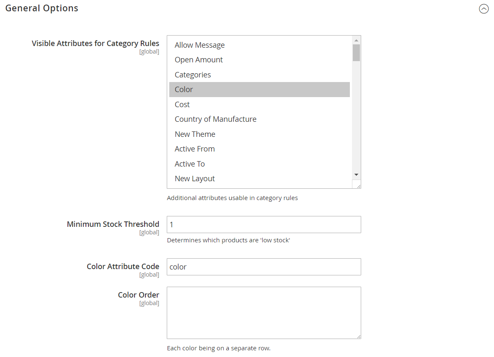

# Configurar atributos inteligentes para o Visual Merchandiser

{{ee-feature}}

A configuração do Visual Merchandiser determina os atributos que podem ser usados na janela de merchandising e o limite mínimo de estoque. A configuração também identifica o atributo usado para cor e a ordem dos valores de cor.

1. Na barra lateral _Admin_, vá para **[!UICONTROL Stores]** > _[!UICONTROL Settings]_>**[!UICONTROL Configuration]**.

1. No painel esquerdo, expanda **[!UICONTROL Catalog]** e escolha **[!UICONTROL Visual Merchandiser]** abaixo de.

1. Expandir  a seção **[!UICONTROL General Options]**.

   {width="600" zoomable="yes"}

1. Na lista **[!UICONTROL Attributes for Category Rules]**, selecione cada atributo que você deseja disponibilizar para merchandising visual.

   Para selecionar vários atributos, mantenha pressionada a tecla Ctrl (PC) ou a tecla Command (Mac) e clique em cada item.

1. Digite o **[!UICONTROL Minimum Stock Threshold]** para que um produto seja exibido na janela Visual Merchandiser.

1. Insira o **[!UICONTROL Color Attribute Code]**.

   O valor padrão é `color`. Se o catálogo usar um atributo diferente, insira o nome do atributo em minúsculas.

1. Para **[!UICONTROL Color Order]**, insira cada valor de cor em uma linha separada e em sequência para determinar a prioridade de cada cor.

1. Quando terminar, clique em **[!UICONTROL Save Config]**.
