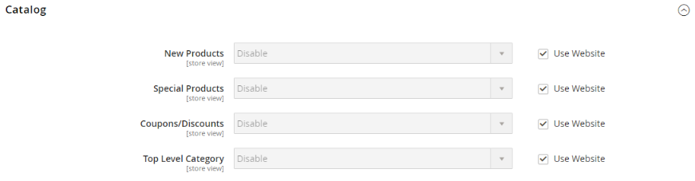

# Redes sociais e RSS feeds

Muitos comerciantes usam mídias sociais e outras ferramentas digitais para criar uma percepção da marca e do produto. É possível integrar sua loja às redes sociais instalando uma extensão do Marketplace ou adicionando um plug-in às páginas de conteúdo. Use RSS feeds para publicar informações de produto em sites de agregação de compras e até mesmo incluí-los em informativos. Os clientes podem assinar seus RSS feeds para saber mais sobre novos produtos e promoções.

## Redes sociais

Sua loja pode ser conectada a redes sociais instalando um [Extensão do Marketplace](../getting-started/commerce-marketplace.md). Além disso, é possível adicionar facilmente plug-ins sociais, como o _Curtir_ botão para blocos CMS que podem ser incorporados a páginas em toda a loja.

Os sites de rede social têm vários plug-ins que podem ser facilmente adicionados à sua loja. Além disso, há muitas extensões no Commerce Marketplace que podem ser usadas para integrar sua loja às redes sociais. O exemplo a seguir mostra como adicionar um Facebook _Curtir_ botão para sua loja.

>[!NOTE]
>
>O Adobe Commerce removeu o nativo _Magento Social_ Integração do facebook e o não oferece mais suporte à extensão. Vá para a [Commerce Marketplace](https://marketplace.magento.com/catalogsearch/result/?q=Facebook){:target=&quot;_blank&quot;} para localizar extensões alternativas para integração com o Facebook.

### Etapa 1. Obter o código do botão

1. No site dos desenvolvedores do Meta, acesse o [configuração de botão](https://developers.facebook.com/docs/plugins/like-button) página.

1. Para **[!UICONTROL URL to Like]**, insira o URL da página na loja para a qual você deseja que as pessoas _Curtir_.

   Por exemplo, você pode inserir o URL da home page da sua loja.

1. Escolha o **[!UICONTROL Layout]** para o botão.

1. Insira o **[!UICONTROL Width]** em pixels que esteja disponível no site para o botão e qualquer mensagem de texto associada.

1. Definir **[!UICONTROL Action Type]** a um dos seguintes:

   - `Like`
   - `Recommend`

1. Clique em **[!UICONTROL Get Code]** para copiar o código gerado para a área de transferência.

### Etapa 2. Criar um bloco de conteúdo

1. Retorne ao Administrador da loja.

1. No _Admin_ barra lateral, vá para **[!UICONTROL Content]** > _[!UICONTROL Elements]_>**[!UICONTROL Blocks]**.

1. No canto superior direito, clique em **[!UICONTROL Add New Block]**.

1. Insira um descritivo **[!UICONTROL Block Title]** para referência interna.

   Por exemplo: `Facebook Like Button`.

1. Atribuir um único **[!UICONTROL Identifier]** ao bloco, usando todos os caracteres em minúsculas e sublinhados, em vez de espaços.

   Por exemplo: `facebook_like_button`.

1. Se sua instância do Commerce tiver várias exibições de loja, escolha cada **[!UICONTROL Store View]** onde o bloco deve estar disponível.

1. Adicione o trecho de código ao conteúdo do bloco, dependendo da ferramenta de conteúdo:

   - Ao usar [!DNL Page Builder], adicionar um [Código HTML](../page-builder/html-code.md) bloqueie para o palco e cole o trecho de código que você copiou do site do Facebook. Caso contrário, cole o trecho de código na **[!UICONTROL Content]** caixa.

   - Com o editor, cole o trecho de código que você copiou do site do Facebook na **[!UICONTROL Content]** caixa.

1. Se o bloco não estiver pronto para entrar no ar, defina **[!UICONTROL Enable Block]** para `No`.

1. Quando terminar, clique em **[!UICONTROL Save Block]**.

### Etapa 3. Colocar o bloco

1. Adicione o bloco, dependendo da ferramenta de conteúdo:

   - Ao usar [!UICONTROL Page Builder], siga as instruções para [adicionar o bloco](../page-builder/block.md) para o estágio.

   - No _Admin_ barra lateral, vá para **[!UICONTROL Content]** > _[!UICONTROL Elements]_>**[!UICONTROL Widgets]**.

1. No canto superior direito, clique em **[!UICONTROL Add Widget]** e faça o seguinte:

   -  (Disponível com B2B somente para Adobe Commerce) No _Configurações_ seção, definir **[!UICONTROL Type]** para `CMS Static Block` e clique em **[!UICONTROL Continue]**.

   - Verifique se **[!UICONTROL Design Theme]** está definido com o tema atual.

   - Clique em **[!UICONTROL Continue]**.

1. No **[!UICONTROL Storefront Properties]** faça o seguinte:

   - Para **[!UICONTROL Widget Title]**, insira um título para referência interna.

   - Definir **[!UICONTROL Assign to Store Views]** para `All Store Views`, ou para a exibição em que você deseja que o aplicativo esteja disponível. Para selecionar várias exibições, mantenha pressionada a tecla Ctrl (PC) ou a tecla Command (Mac) e clique em cada opção.

   - Insira um número no **[!UICONTROL Sort Order]** para determinar a ordem do bloco, se ele for atribuído para aparecer no mesmo local da página que outros elementos de conteúdo. A posição superior é zero.

1. No _[!UICONTROL Layout Updates]_clique em **[!UICONTROL Add Layout Update]**e defina **[!UICONTROL Display On]**à categoria, ao produto ou à página em que deseja que o bloco seja exibido.

   Por exemplo, se você escolher `All Pages` e posicionar o bloco no cabeçalho ou no rodapé, o bloco aparece no mesmo lugar em todas as páginas da loja.

   Para colocar o bloco em uma página específica, faça o seguinte:

   - Definir **[!UICONTROL Display On]** para `Specified Page` e selecione o **[!UICONTROL Page]** onde deseja que o bloco apareça.

   - Escolha o **[!UICONTROL Block Reference]** para identificar o local na página onde o bloco será colocado.

   - Aceite a configuração padrão para **[!UICONTROL Template]**, que está definida como `CMS Static Block Default Template`.

   - Clique em **[!UICONTROL Save and Continue Edit]**.

1. No painel à esquerda, escolha **[!UICONTROL Widget Options]**.

1. Clique em **[!UICONTROL Select Block…]** e escolha o bloco que deseja colocar.

1. Quando terminar, clique em **[!UICONTROL Save]**.

1. Quando solicitado, siga as instruções na parte superior do espaço de trabalho para atualizar o índice e o cache da página.

   O widget agora aparece na caixa _[!UICONTROL Widgets]_lista.

### Etapa 4. Verificar o local no armazenamento

Volte para a loja para verificar se o bloco está no local correto. Para mover o bloco, você pode reabrir o widget e tentar uma página ou referência de bloco diferente.

## RSS feeds

RSS (Really Simple Syndication) é um formato de dados baseado em XML usado para distribuir informações online. Seus clientes podem assinar seus RSS feeds para saber mais sobre novos produtos e promoções. Os RSS feeds também podem ser usados para publicar informações de produto em sites de agregação de compras e podem ser incluídos em boletins informativos.

Quando os RSS feeds estão habilitados, quaisquer adições a produtos, especiais, categorias e cupons são automaticamente enviadas aos assinantes de cada feed. Um link para todos os RSS feeds publicados está no rodapé da loja.

{width="100"} 

O software necessário para ler um feed RSS é chamado de leitor de feed, e permite que as pessoas assinem manchetes, blogs, podcasts e muito mais. O Google Reader é um dos muitos leitores de feeds que estão disponíveis online gratuitamente.

{width="700" zoomable="yes"}

### Benefícios da configuração de um feed RSS

- Baixe a atualização mais recente da sua loja ou blog
- Anúncios leves
- Ações ordinárias
- Aumentar o SEO
- Aumentar vendas

### Tipos de RSS feeds

| RSS Feed | Descrição |
|--- |--- |
| [!UICONTROL Wish List] | Quando ativado, um link de feed RSS é exibido na parte superior das páginas da lista de desejos do cliente. Além disso, a página de compartilhamento da lista de desejos inclui uma caixa de seleção que permite incluir um link para o feed de listas de desejos compartilhadas. |
| [!UICONTROL New Products] | Publica a notificação de novos produtos adicionados ao catálogo. |
| [!UICONTROL Special Products] | Publica a notificação de quaisquer produtos com preços especiais. |
| [!UICONTROL Coupons / Discounts] | Publica a notificação de todos os cupons ou descontos especiais disponíveis na loja. |
| [!UICONTROL Top Level Category] | Publica uma notificação de qualquer alteração na estrutura de categoria de nível superior do catálogo, que é refletida no menu principal. |
| [!UICONTROL Customer Order Status] | Oferece aos clientes a capacidade de rastrear o status do pedido pelo feed RSS. Quando ativado, um link de feed RSS é exibido no pedido. |

{style="table-layout:auto"}

### Configurar RSS feeds para sua loja

1. No _Admin_ barra lateral, vá para **[!UICONTROL Stores]** > _[!UICONTROL Settings]_>**[!UICONTROL Configuration]**.

1. No canto superior direito, defina **[!UICONTROL Store View]** às exibições em que os feeds devem estar disponíveis.

   Se for solicitada a confirmação, clique em **[!UICONTROL OK]**.

1. No painel esquerdo, expanda **[!UICONTROL Catalog]** e escolha **[!UICONTROL RSS Feeds]**.

1. Expandir  o **[!UICONTROL Rss Config]** seção e definir **[!UICONTROL Enable RSS]** para `Enable`.

   {width="600" zoomable="yes"}

   Se necessário, limpe a **[!UICONTROL Use Default]** para alterar o valor padrão.

1. Expandir  o **[!UICONTROL Wish List]** seção e definir **[!UICONTROL Enable RSS]** para `Enable`.

1. Expandir  o **[!UICONTROL Catalog]** e defina outros feeds como `Enable` conforme necessário.

   - **[!UICONTROL New Products]**
   - **[!UICONTROL Special Products]**
   - **[!UICONTROL Coupons/Discounts]**
   - **[!UICONTROL Top Level Category]**

   {width="600" zoomable="yes"}

1. Expandir  o **[!UICONTROL Order]** seção e definir **[!UICONTROL Customer Order Status Notification]** para `Enable`.

1. Quando terminar, clique em **[!UICONTROL Save Config]**.

1. Veja o resultado na loja com `/rss` no final do URL da página.

