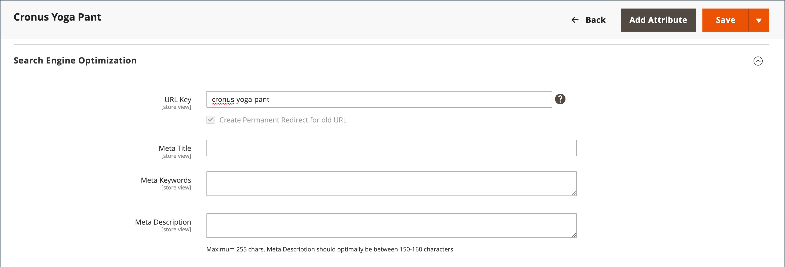
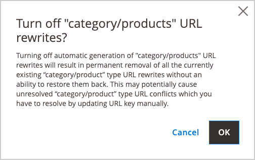

# Redirecionamentos automáticos

Sua loja pode ser configurada para gerar automaticamente um redirecionamento permanente sempre que a chave do URL de um produto ou categoria mudar. Na seção Otimização do mecanismo de pesquisa, a caixa de seleção abaixo da chave do URL indica se os redirecionamentos permanentes estão ativados. Se sua loja já estiver configurada para redirecionar automaticamente URLs de catálogo, um redirecionamento é uma atualização simples da chave do URL. O processo para criar um redirecionamento automático é o mesmo para produtos e categorias.

>[!NOTE]
>
>Quando redirecionamentos automáticos são ativados e você salva uma categoria, todas as regravações de produto e categoria são geradas em tempo real e armazenadas em tabelas de banco de dados por padrão. Isso pode resultar em problemas significativos de desempenho para categorias com muitos produtos atribuídos. A solução é alterar esse padrão e ignorar a geração de regravações de URL de categoria/produtos para produtos no salvamento da categoria. Nesse caso, as substituições de produto são geradas somente para o URL do produto canônico.

## Configurar redirecionamentos automáticos

1. No _Admin_ barra lateral, vá para **[!UICONTROL Stores]** > _[!UICONTROL Settings]_>**[!UICONTROL Configuration]**.

1. No painel esquerdo, expanda **[!UICONTROL Catalog]** e escolha **[!UICONTROL Catalog]** por baixo.

1. Expandir  o **[!UICONTROL Search Engine Optimization]** seção.

   {width="600" zoomable="yes"}

1. Definir **[!UICONTROL Create Permanent Redirect for URLs if URL Key Changed]** para `Yes`.

1. Quando terminar, clique em **[!UICONTROL Save Config]**.

## Redirecionar URLs de produtos automaticamente

1. No _Admin_ barra lateral, vá para **[!UICONTROL Catalog]** > **[!UICONTROL Products]**.

1. Encontre o produto na lista e clique em para abrir o registro.

1. Expandir  o **[!UICONTROL Search Engine Optimization]** seção.

   {width="600" zoomable="yes"}

1. Para **[!UICONTROL URL Key]**, faça o seguinte:

   - Certifique-se de que a variável **[!UICONTROL Create Permanent Redirect for old URL]** está marcada. Caso contrário, siga as instruções para [habilitar redirecionamentos automáticos](url-rewrite.md#configure-url-rewrites).

   - Atualize o **[!UICONTROL URL Key]** conforme necessário, usando todos os caracteres em minúsculas e hifens não à direita entre esses caracteres em vez de espaços.

1. Quando terminar, clique em **[!UICONTROL Save]**.

1. Quando solicitado a atualizar o cache, siga os links na mensagem na parte superior do espaço de trabalho.

   O redirecionamento permanente agora está em vigor para o produto e qualquer URL de categoria associado.

## Redirecionar URLs de categoria automaticamente

1. No _Admin_ barra lateral, vá para **[!UICONTROL Catalog]** > **[!UICONTROL Categories]**.

1. Localize a categoria na árvore e clique em para abrir o registro.

1. Expandir  o **[!UICONTROL Search Engine Optimization]** seção.

1. Para **[!UICONTROL URL Key]**, faça o seguinte:

   - Certifique-se de que a variável **[!UICONTROL Create Permanent Redirect for old URL]** está marcada. Caso contrário, siga as instruções para [habilitar redirecionamentos automáticos](url-rewrite.md#configure-url-rewrites).

   - Atualize o **[!UICONTROL URL Key]** conforme necessário, usando todos os caracteres em minúsculas e hifens não à direita entre esses caracteres em vez de espaços.

1. Quando terminar, clique em **[!UICONTROL Save]**.

1. Quando solicitado a atualizar o cache, siga os links na mensagem na parte superior do espaço de trabalho.

   O redirecionamento permanente agora está em vigor para a categoria e qualquer URL de produto associado.

## Ignorar geração de regravações de URL de produto para salvamento de categoria {#skip-rewrite}

>[!WARNING]
>
>Desativar a geração automática de substituições de URL de categoria/produtos resulta na remoção permanente de todas as substituições de URL de categoria/tipo de produto existentes, que não podem ser restauradas. Isso pode causar conflitos não resolvidos de URL de tipo de categoria/produto que exigem uma atualização manual da chave do URL para serem resolvidos.

1. No _Admin_ barra lateral, vá para **[!UICONTROL Stores]** > _[!UICONTROL Settings]_>**[!UICONTROL Configuration]**.

1. No painel esquerdo, expanda **[!UICONTROL Catalog]** e escolha **[!UICONTROL Catalog]** por baixo.

1. Expandir  o **[!UICONTROL Search Engine Optimization]** seção.

1. Definir **[!UICONTROL Generate "category/product" URL Rewrites]** para `No`.

1. Na caixa de diálogo de confirmação, clique em **[!UICONTROL OK]** para confirmar a alteração e a remoção de regravações de URL existentes.

   {width="350"}

1. Quando terminar, clique em **[!UICONTROL Save Config]**.
