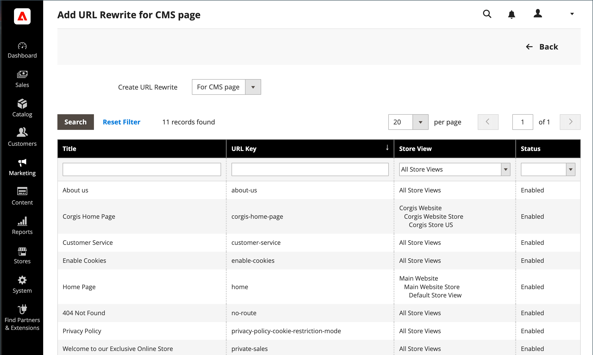

# O URL da página de conteúdo reescreve

Antes de começar, verifique se você entende exatamente o que o redirecionamento deve realizar. Pense em termos de _destino_ / _origem_ ou _redirecionar para_ / _redirecionar de_. Embora as pessoas ainda possam navegar para a página anterior a partir de mecanismos de pesquisa ou links desatualizados, o redirecionamento faz com que sua loja alterne para o novo público-alvo.

{width="700" zoomable="yes"}

## Etapa 1. Planejar a reescrita

Para evitar erros, anote a chave de URL da página _redirecionar para a página_ e a página _redirecionar da página_.

Caso não tenha certeza, abra cada página em seu armazenamento e copie o caminho da barra de endereços do navegador.

### Caminho da página do CMS

Redirecionar para: `new-page`

Redirecionar de: `old-page`

## Etapa 2. Criar a regravação

{{url-rewrite-params}}

1. Na barra lateral _Admin_, vá para **[!UICONTROL Marketing]** > _[!UICONTROL SEO & Search]_>**[!UICONTROL URL Rewrites]**.

1. Antes de continuar, faça o seguinte para verificar se o caminho da solicitação está disponível.

   - No filtro de pesquisa na parte superior da coluna **[!UICONTROL Request Path]**, digite a chave da URL da página que deve ser redirecionada e clique em **[!UICONTROL Search]**.

   - Se houver vários registros de redirecionamento para a página, localize aquele que corresponde à exibição de loja aplicável e abra-o no modo de edição.

   - No canto superior direito, clique em **[!UICONTROL Delete]**. Quando solicitado, clique em **[!UICONTROL OK]** para confirmar.

1. Ao retornar para a página Regravações de URL, clique em **[!UICONTROL Add URL Rewrite]**.

1. Defina **[!UICONTROL Create URL Rewrite]** como `for CMS page`.

1. Encontre sua nova página de destino na grade e abra no modo de edição.

   {width="700" zoomable="yes"}

1. Em Informações de regravação de URL, faça o seguinte:

   - Se você tiver vários modos de exibição de armazenamento, selecione o **[!UICONTROL Store]** ao qual a regravação se aplica.

   - Para **[!UICONTROL Request Path]**, insira a chave da URL da página original solicitada pelo cliente. Este é o _redirecionamento da_ página.

     >[!NOTE]
     >
     >O Caminho da solicitação deve ser exclusivo para o armazenamento especificado. Se já houver um redirecionamento que use o mesmo Caminho da solicitação, você receberá um erro ao tentar salvar o redirecionamento. O redirecionamento anterior precisa ser excluído para que você possa criar um.

   - Defina **[!UICONTROL Redirect]** como um dos seguintes:

      - `Temporary (302)`
      - `Permanent (301)`

   - Para sua referência, informe uma breve descrição da reescrita.

   {width="600" zoomable="yes"}

1. Antes de salvar o redirecionamento, revise o seguinte:

   - O link no canto superior esquerdo exibe o nome da página de destino.
   - O Caminho da Solicitação contém o caminho para o _redirecionamento original da página_.

1. Quando terminar, clique em **[!UICONTROL Save]**.

   A nova regravação aparece na grade na parte superior da lista.

## Etapa 3. Testar o resultado

1. Vá para a home page da loja.

1. Siga um destes procedimentos:

   - Navegue até a página _original de_.
   - Na barra de endereços do navegador, digite o nome do _redirecionamento original da página_ imediatamente após a URL de armazenamento e pressione **Enter**.

   A nova página de destino é exibida em vez da solicitação da página original.

## Descrições dos campos

| Campo | Descrição |
|--- |--- |
| [!UICONTROL Create URL Rewrite] | Indica o tipo de reescrita. O tipo não pode ser alterado após a criação da regravação. Opções: `Custom` / `For category` / `For product` / `For CMS page` |
| [!UICONTROL Request Path] | A página do CMS que deve ser redirecionada. O caminho da solicitação deve ser exclusivo e não pode estar sendo usado por outro redirecionamento. Se você receber uma mensagem de erro informando que o caminho da solicitação existe, exclua o redirecionamento existente e tente novamente. |
| [!UICONTROL Target Path] | O caminho interno usado pelo sistema para apontar para o destino. O caminho de destino está esmaecido e não pode ser editado. |
| [!UICONTROL Redirect] | Determina o tipo de redirecionamento. Opções:  **[!UICONTROL No]**- Nenhum redirecionamento especificado. **[!UICONTROL Temporary (302)]** - Indica aos mecanismos de pesquisa que a regravação é por um tempo limitado. Os mecanismos de pesquisa geralmente não retêm informações de classificação de página para regravações temporárias.  **[!UICONTROL Permanent (301)]**- Indica aos mecanismos de pesquisa que a regravação é permanente. Os mecanismos de pesquisa geralmente retêm informações de classificação de página para regravações permanentes. |
| [!UICONTROL Description] | Descreve a finalidade da regravação para referência interna. |

{style="table-layout:auto"}
