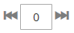
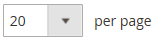

# Visual Merchandiser

{{ee-feature}}

O _Visual Merchandiser_ é um conjunto de ferramentas avançadas que permite posicionar produtos e aplicar condições que determinam quais produtos aparecem na lista de categorias. O resultado pode ser uma seleção dinâmica de produtos que se ajusta às alterações no catálogo. Você pode trabalhar no _modo visual_, que mostra cada produto como um bloco em uma grade, ou trabalhar a partir de uma lista de produtos na categoria. As mesmas ferramentas estão disponíveis em cada modo e você pode usar os botões no canto superior direito para alternar entre cada tipo de exibição.

{width="600" zoomable="yes"}

## Acessar o Visual Merchandiser

1. Na barra lateral _Admin_, vá para **[!UICONTROL Catalog]** > **[!UICONTROL Categories]**.

1. Percorra a árvore de categorias e clique na categoria que deseja editar.

1. Role para baixo e expanda  na seção **[!UICONTROL Products in Category]**.

1. Clique no botão _Exibir como Blocos_ (  ) para exibir os produtos como uma grade.

1. Quando terminar, clique em **[!UICONTROL Save Category]**.

## Alterar a posição de um produto

1. Use a [ordem de classificação](../catalog/navigation-product-listings.md) para exibir o produto que deseja mover.

   - **Método 1: arrastar e soltar**

     Segure o controle _Arrastar_ () no canto superior direito do bloco do produto e solte o produto na posição. O número de cada produto se ajusta para refletir a nova posição.

   - **Método 2: Definir Valor de Posição**

     No controlador _Posição_ () no bloco do produto, digite o número onde deseja que o produto apareça. Digite `0` para colocar o produto no topo da lista.

1. Quando terminar, clique em **[!UICONTROL Save Category]**.

>[!NOTE]
>
>Em uma instalação limpa, a Adobe Commerce reserva a ID de categoria `2` para o catálogo raiz do armazenamento padrão. O Visual Merchandiser pode usar somente categorias com um número de ID de `3` ou maior.

## Controles do Workspace

| Controle | Descrição |
|--- |--- |
|  | Exibir como lista |
|  | Exibir como blocos |
|  | Corresponder por regra - não |
|  | Corresponder por regra - sim |
|  | Arrastar |
|  | Position |
|  | Remover da categoria |
|  | Visualização por página |
|  | Ir para o próximo/anterior |

{style="table-layout:auto"}
