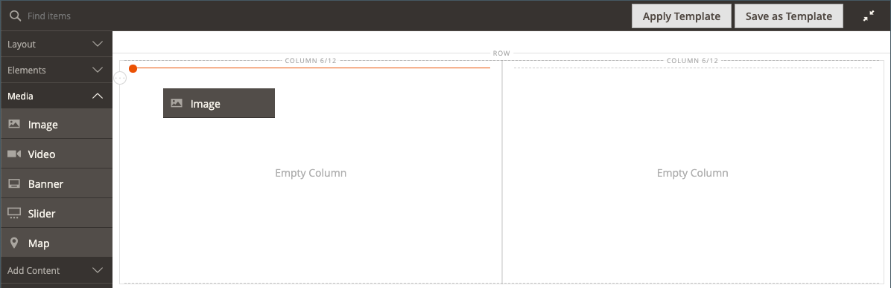
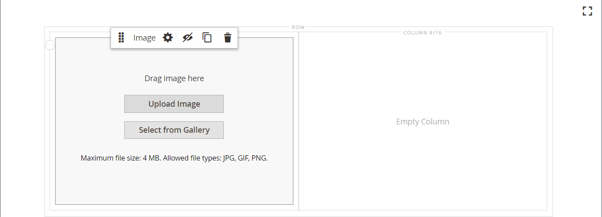
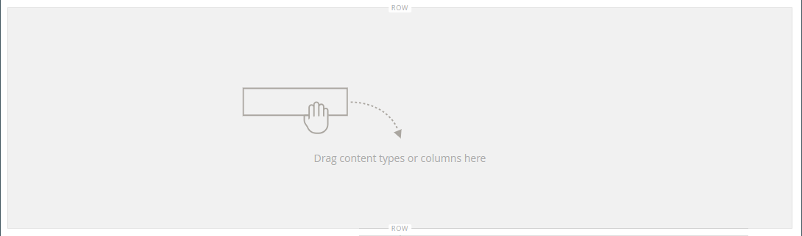
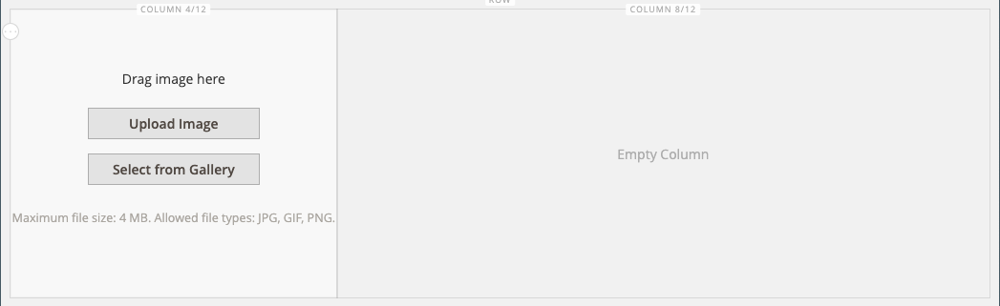
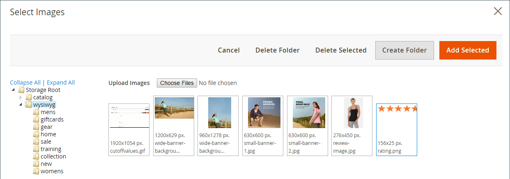
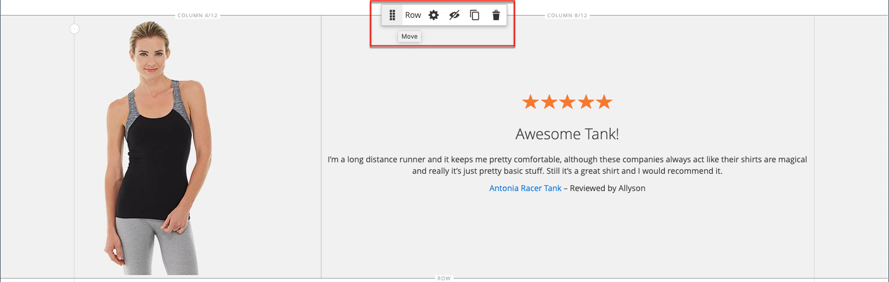

# [!DNL Page Builder] Apresentação parte 1: página simples

Siga este exercício de três partes para se familiarizar com o [!DNL Page Builder] um espaço de trabalho criando uma página simples que ilustra a facilidade de criar páginas ricas em conteúdo de seu próprio design.

{width="700" zoomable="yes"}

>[!NOTE]
>
>Estes exercícios de explicação são atualizados para refletir as alterações [!DNL Page Builder] no espaço de trabalho na versão 2.4.1. Se você estiver usando uma versão anterior do Adobe Commerce, use o [!DNL Page Builder] exercícios de explicação incluídos no [[!DNL Commerce] Guia do usuário da versão 2.3](https://docs.magento.com/user-guide/v2.3/cms/page-builder-learn.html).

## Antes de começar

Antes de iniciar este exercício, é recomendável que você aumente o [Duração da sessão do administrador](../systems/security-admin.md) para evitar que a sessão atinja o tempo limite enquanto você trabalha.

Verifique as definições de configuração necessárias para o gerenciamento de conteúdo:

- O Editor WYSIWYG está habilitado no [Opções WYSIWYG](../content-design/editor.md#configure-the-editor) configuração.

- [!DNL Page Builder] está ativado na variável [Ferramentas de conteúdo avançadas](setup.md) configuração.

### Baixar os ativos de imagem de apresentação

1. Baixe o [`simple-page-assets`](./assets/simple-page-assets.zip) e salve o arquivo em seu sistema local.

1. Navegue até o arquivo baixado e extraia os arquivos compactados.

   Em um sistema Windows, clique com o botão direito do mouse e escolha **[!UICONTROL Extract All]** arquivos. Escolha a pasta de destino e clique em **[!UICONTROL Extract]**.

   Em um sistema Mac, basta clicar duas vezes no arquivo zip e mover os arquivos extraídos para a pasta de destino.

   A pasta contém os seguintes arquivos de imagem:

   ![[!DNL Page Builder] arquivos de apresentação - ativos de página simples](./assets/pb-tutorial-simple-page-assets.png){width="500"}

Siga as três partes desta apresentação em ordem.

## Parte 1: Linha de sangria completa com banner

Nesta parte do exercício Página simples, você cria uma página que tem uma linha e um banner totalmente sangrados. A linha tem imagens de plano de fundo diferentes para dispositivos móveis e de desktop.

![[!DNL Page Builder] linha de sangria completa com banner](./assets/pb-tutorial1-full-bleed-with-banner.png){width="700" zoomable="yes"}

### Etapa 1: criar uma página

1. No _Admin_ barra lateral, vá para **[!UICONTROL Content]** > _[!UICONTROL Elements]_>**[!UICONTROL Pages]**.

1. No canto superior direito, clique em **[!UICONTROL Add New Page]** e faça o seguinte:

   - Para impedir que esta página seja publicada na sua loja, defina **[!UICONTROL Enable Page]** para `No`.

   - Para **[!UICONTROL Page Title]**, insira `Simple Page`.

   {width="600" zoomable="yes"}

1. Expandir  o **[!UICONTROL Design]** seção.

   Observe que **[!UICONTROL Layout]** está definida como `Page -- Full Width` por padrão. Além dos cinco padrões [layout](../content-design/page-layout.md) opções, [!DNL Page Builder] O adiciona layouts de largura total para páginas, categorias e produtos.

1. Se os dados de amostra estiverem disponíveis, defina **[!UICONTROL New Theme]** para `Magento Luma`. Caso contrário, você pode escolher outro tema disponível ou deixá-lo em branco para usar o tema padrão.

   A variável _[!UICONTROL New Theme]_pode ser usada para substituir o tema padrão e aplicar um tema diferente à página.

   >[!NOTE]
   >
   >O layout de largura total pode ser usado somente com um [tema](../content-design/themes.md).

   {width="600" zoomable="yes"}

1. No canto superior direito, clique em **[!UICONTROL Save]**.

   Quando a página é salva, o nome _Página simples_ é exibida no canto superior esquerdo da página.

### Etapa 2: Formatar a linha

1. Expandir  o **[!UICONTROL Content]** seção.

   Essa ação exibe a variável [!DNL Page Builder] visualizar com uma linha vazia.

   >[!NOTE]
   >
   >A variável [Cabeçalho do conteúdo](workspace.md) é opcional. Por padrão, é formatado como um cabeçalho de nível 1 (H1) de acordo com o tema. Para este exercício, a Comissão _Cabeçalho do conteúdo_ fica em branco.

   {width="600" zoomable="yes"}

1. Clique em **[!UICONTROL Edit with Page Builder]** ou dentro da área de visualização de conteúdo.

   No ambiente [!DNL Page Builder] [espaço de trabalho](workspace.md), o painel à esquerda fornece as ferramentas de conteúdo que você pode usar para criar o conteúdo no palco.

1. Passe o mouse sobre a linha vazia para exibir a caixa de ferramentas.

   Cada contêiner de conteúdo tem uma caixa de ferramentas com um conjunto semelhante de opções.

   ![[!DNL Page Builder] caixa de ferramentas de linha](./assets/pb-layout-page-add-content-row-tools.png){width="600" zoomable="yes"}

1. Na caixa de ferramentas Linha, escolha a _Configurações_ ({width="20"} ícone.

1. Em _[!UICONTROL Appearance]_, escolha **Sangria total**.

   A configuração de aparência Sangria completa estende as bordas esquerda e direita da área de conteúdo da linha e do plano de fundo até a largura total da página.

   {width="600" zoomable="yes"}

1. Role para baixo até _[!UICONTROL Advanced]_seção e definir todas **[!UICONTROL Margins and Padding]**configurações para `0`.

   Essa configuração garante que o banner estenda a largura total da linha.

   {width="600" zoomable="yes"}

1. Para salvar as configurações e retornar para a [!DNL Page Builder] espaço de trabalho, role até a parte superior da página e clique em **[!UICONTROL Save]** no canto superior direito.

### Etapa 3: adicionar um banner

>[!NOTE]
>
>[!DNL Page Builder] tem um novo tipo de conteúdo chamado _Banner_, que é apresentado nesta etapa. O que era anteriormente o _Banner_ no menu Conteúdo, agora é uma opção _Bloco dinâmico_.

1. No [!DNL Page Builder] painel, expandir **[!UICONTROL Media]** e arraste uma **Banner** espaço reservado para o estágio.

   {width="600" zoomable="yes"}
1. Passe o mouse sobre o contêiner de banner para exibir a caixa de ferramentas.

   >[!NOTE]
   >
   >O estágio agora tem dois contêineres de conteúdo, cada um com uma caixa de ferramentas separada. Como o banner está aninhado dentro da linha, verifique se você está trabalhando na caixa de ferramentas correta.

   Além da caixa de ferramentas, a variável _Fazer upload de imagem_ e _Selecionar na Galeria_ são incluídos botões para que você possa fazer alterações rápidas no banner diretamente do palco.

   {width="600" zoomable="yes"}

1. Na caixa de ferramentas Banner, escolha a _Configurações_ ( {width="20"} ) ícone.

1. Em _[!UICONTROL Appearance]_, escolha **[!UICONTROL Collage Right]**.

   A configuração Collage Right posiciona o conteúdo no lado direito do banner.

   {width="600" zoomable="yes"}

1. Role para baixo até _[!UICONTROL Background]_e defina a imagem de fundo do banner:

   - Para **[!UICONTROL Background Image]**, clique em **Carregar**.

     {width="600" zoomable="yes"}

     Navegue até o diretório onde você salvou os ativos de página simples extraídos e escolha a `wide-banner-background.jpg` arquivo.

     A imagem é carregada e uma miniatura da imagem carregada é exibida. O nome do arquivo, as dimensões da imagem e o tamanho do arquivo são observados abaixo.

     {width="600" zoomable="yes"}

   - Para **[!UICONTROL Background Mobile Image]**, clique em **Carregar**.

     No mesmo diretório de arquivo, escolha o `wide-banner-background-mobile.jpg` arquivo.

     A imagem de fundo móvel é usada para dispositivos móveis e também sempre que uma janela do navegador do desktop é redimensionada para a largura de um dispositivo móvel.

     {width="600" zoomable="yes"}

   - Volte para a parte superior da página e clique em **[!UICONTROL Save]** para salvar as configurações e retornar para a [!DNL Page Builder] espaço de trabalho.

     O plano de fundo aparece no palco e estende a largura total da linha.

     {width="600" zoomable="yes"}

   Observe o texto de espaço reservado que aparece no lado direito da linha. A posição deste texto reflete a _Colagem à direita_ configuração de aparência.

1. Clique no texto do espaço reservado e insira a seguinte mensagem como duas linhas:

   `Get fit and look fab in new seasonal styles.`

   `New LUMA yoga collection`

   A barra de ferramentas do editor é exibida acima da caixa de texto. O texto pode ser inserido e formatado diretamente do estágio ou escolhendo _Configurações_ na caixa de ferramentas banner.

   {width="600" zoomable="yes"}

1. Aplicar formatação ao texto:

   - Selecione a primeira linha de texto. Em seguida, na barra de ferramentas do editor, em **Formatos**, escolha `Heading 2`.

     {width="600" zoomable="yes"}

   - Selecione a segunda linha de texto. Em seguida, na barra de ferramentas do editor, em **Formatos**, escolha `Paragraph`.

   As configurações de formato aplicam os estilos da folha de estilos associada ao tema atual.

   {width="600" zoomable="yes"}
__

1. Para exibir a caixa de ferramentas Banner, selecione o _Configurações_ ( {width="20"} ) novamente e role até o ícone _[!UICONTROL Content]_seção.

   Observe que seu texto é exibido no campo _Texto da mensagem_ caixa. O texto pode ser inserido e editado no estágio ou no _[!UICONTROL Content]_seção das configurações de banner.

   {width="600" zoomable="yes"}

1. Continuar no _[!UICONTROL Content]_defina o link e o botão do banner:

   - Definir **Link** para `Category`e clique em **[!UICONTROL Select]** para mostrar a árvore de categorias.

   - Escolher `What's New` como a categoria vinculada.

     {width="600" zoomable="yes"}

   - Definir **[!UICONTROL Show Button]** para `Always`.

   - Para **[!UICONTROL Button Text]**, insira `Shop Now` como o texto que aparece no botão.

   - Para **[!UICONTROL Button Type]**, aceite o `Primary` padrão.

     O estilo do botão do tema atual determina o formato do botão.

1. Defina a sobreposição do banner:

   Você pode usar uma sobreposição para aplicar uma cor de plano de fundo à área de conteúdo ativa definida pela configuração Aparência. A imagem de fundo do banner permanece visível por toda a largura do banner.

   - Definir **[!UICONTROL Show Overlay]** para `Always`.

   - Para **[!UICONTROL Overlay Color]**, execute um dos procedimentos a seguir:

      - Clique no quadrado colorido e escolha a amostra branca.
      - Clique em _Sem cor_ caixa de texto e digite `White` ou o valor hexadecimal `#ffffff`.

     Em seguida, clique em **[!UICONTROL Apply]**.

     {width="600" zoomable="yes"}

   - Volte para a parte superior da página e clique em **[!UICONTROL Save]** para salvar as configurações e retornar para a [!DNL Page Builder] espaço de trabalho.

     O botão é exibido abaixo da mensagem do banner no palco.

     {width="600" zoomable="yes"}

1. No canto superior direito do estágio, clique na guia _Fechar tela cheia_ () ícone.

   Clicar nesse ícone retornará para a _[!UICONTROL Content]_para a página com a pré-visualização exibida.

   Você pode alternar entre os dois modos de espaço de trabalho a qualquer momento.

1. No canto superior direito, clique na guia **[!UICONTROL Save]** seta e escolha **[!UICONTROL Save & Close]**.

1. Se solicitado, clique no link [Gerenciamento de cache](../systems/cache-management.md) vincular na mensagem na parte superior da página e atualizar qualquer cache inválido.

## Parte 2: Linha contida com duas colunas iguais

Nesta parte do exercício, você adiciona uma linha à página e divide a linha em duas colunas iguais. Em seguida, você adiciona uma imagem vinculada a cada coluna. Nas instruções, cada nova linha é adicionada antes da primeira linha para fazer o [!DNL Page Builder] painel alinhado com o estágio. No final do exercício, você reorganiza as linhas para que elas correspondam ao exemplo de Página simples.

{width="600" zoomable="yes"}

### Etapa 1: adicionar uma linha

1. Na grade Páginas, localize o _Página simples_ que você criou na primeira parte deste exercício e selecione **[!UICONTROL Edit]** no _[!UICONTROL Action]_coluna.

1. Expandir  o **[!UICONTROL Content]** seção.

1. Clique em **[!UICONTROL Edit with Page Builder]** ou dentro da área de visualização de conteúdo.

1. No [!DNL Page Builder] painel em _[!UICONTROL Layout]_, arraste um **[!UICONTROL Row]**espaço reservado para o estágio e coloque-o acima do banner.

   A diretriz vermelha marca o limite entre as duas linhas.

   {width="600" zoomable="yes"}

1. Passe o mouse sobre a nova linha para exibir a caixa de ferramentas e escolher a _Configurações_ ( {width="20"} ) ícone.

   {width="600" zoomable="yes"}

1. Em _[!UICONTROL Appearance]_, aceite o **Contido**configuração padrão.

   Essa configuração limita a área de conteúdo da linha à largura da página, conforme definido pelo tema.

   {width="600" zoomable="yes"}

1. No canto superior direito, clique em **[!UICONTROL Save]** para salvar as configurações e retornar para a [!DNL Page Builder] espaço de trabalho.

### Etapa 2: adicionar uma coluna

1. No [!DNL Page Builder] painel em _[!UICONTROL Layout]_, arraste um **[!UICONTROL Column]**espaço reservado para a nova linha.

   {width="600" zoomable="yes"}

   A linha agora é dividida em duas colunas de igual largura. Cada coluna é um container separado para o conteúdo com sua própria caixa de ferramentas dedicada de opções.

   {width="600" zoomable="yes"}

1. No canto superior esquerdo da primeira coluna, clique no ícone circular _Grade_ controle () para mostrar as diretrizes da grade.

   A grade garante que o conteúdo seja alinhado de forma consistente e seja renderizado corretamente em dispositivos móveis e desktop. Para obter informações sobre como configurar o tamanho da grade, consulte [Configurar [!DNL Page Builder]](setup.md#configure-page-builder) na seção [!DNL Page Builder] Configurar tópico.

   Os números entre parênteses (6/12) na borda superior de cada contêiner de coluna indicam o número de divisões de grade em cada coluna e o número total de divisões na linha.

   {width="600" zoomable="yes"}

### Etapa 3: Adicionar imagens com links

Nesta etapa, você aprenderá a fazer upload de uma imagem no banner.

1. No [!DNL Page Builder] , expanda a **[!UICONTROL Media]** e arraste um **[!UICONTROL Image]** para a primeira coluna.

   {width="600" zoomable="yes"}

1. Insira a imagem de amostra no espaço reservado.

   {width="600" zoomable="yes"}

   Para uma imagem localizada em seu sistema, você pode escolher um destes métodos:

   - **Fazer upload do arquivo de imagem**: Na primeira coluna, clique em **[!UICONTROL Upload Image]**. Em seguida, navegue até o diretório onde você salvou os ativos de página simples extraídos e escolha a `small-banner-1.jpg` arquivo.

     {width="600" zoomable="yes"}

     Repita essa ação para adicionar a variável `small-banner-2.jpg` para a segunda coluna.

   - **Arraste o arquivo de imagem**: na área de trabalho, abra a pasta de ativos da página simples e a posicione ao lado da janela do navegador Admin, onde você está trabalhando com o [!DNL Page Builder] estágio. Arraste o arquivo `small-banner-1.jpg` na pasta ativos da página simples e solte-a na primeira coluna.

     {width="600" zoomable="yes"}

     Repita essa ação para adicionar a variável `small-banner-2.jpg` para a segunda coluna.

1. Determine qual página do catálogo deseja vincular a cada imagem.

1. Passe o mouse sobre a imagem na primeira coluna para exibir a caixa de ferramentas e escolher o _Configurações_ ( {width="20"} ) ícone.

   {width="600" zoomable="yes"}

1. Vincular a imagem a uma categoria:

   - Rolar para baixo e definir **Link** para `Category`.

   - Na árvore de categorias, faça drill-down e escolha a `Men's Hoodies & Sweatshirt` categoria.

   - No canto superior direito, **[!UICONTROL Save]** as configurações e retorne à [!DNL Page Builder] espaço de trabalho.

1. Repita a etapa anterior para vincular a imagem na segunda coluna ao _Engrenagem_ categoria.

1. No canto superior direito do estágio, clique na guia _Fechar tela cheia_ () ícone.

   Clicar nesse ícone retornará para a _[!UICONTROL Content]_para a página com a pré-visualização exibida.

1. No canto superior direito, clique na guia **[!UICONTROL Save]** seta e escolha **[!UICONTROL Save & Close]**.

1. Quando solicitado, clique no link [Gerenciamento de cache](../systems/cache-management.md) vincular na mensagem na parte superior da página e atualizar qualquer cache inválido.

## Parte 3: Linha de largura total com colunas desiguais

A linha final desta página apresenta o conteúdo de uma análise do produto. Você adiciona uma linha de largura completa e a divide em duas colunas de larguras diferentes. Uma imagem de plano de fundo é adicionada à primeira coluna, com uma cor de plano de fundo correspondente aplicada à linha para um efeito unificado.

{width="500"}

### Etapa 1: adicionar uma linha

1. Na grade Páginas, localize o _Página simples_ que você criou na primeira parte deste exercício e selecione **[!UICONTROL Edit]** no _[!UICONTROL Action]_coluna.

1. Expandir  o **[!UICONTROL Content]** seção.

1. Clique em **[!UICONTROL Edit with Page Builder]** ou dentro da área de visualização de conteúdo.

1. No [!DNL Page Builder] painel em _[!UICONTROL Layout]_, arraste um **[!UICONTROL Row]**o espaço reservado para o estágio e coloque-o acima da linha criada na segunda parte deste exercício.

   Uma diretriz vermelha marca o limite entre as duas linhas.

   {width="600" zoomable="yes"}

1. Passe o mouse sobre a nova linha para exibir a caixa de ferramentas e escolher a _Configurações_ ({width="20"} ) ícone.

   {width="600" zoomable="yes"}

1. Na página Editar linha em _[!UICONTROL Appearance]_, escolha **[!UICONTROL Full Width]**.

   Essa configuração limita a área de conteúdo à largura máxima da página definida pelo tema. A cor e/ou imagem do plano de fundo não são limitadas e estendem a largura total da linha.

   {width="600" zoomable="yes"}

1. No _[!UICONTROL Background]_, insira `#f1f1f1` como o **[!UICONTROL Background Color]**.

   {width="600" zoomable="yes"}

1. Role para baixo até _[!UICONTROL Advanced]_seção e definir todas **Margens e preenchimento**valores para `0`.

   {width="600" zoomable="yes"}

1. Volte para a parte superior da página e clique em **[!UICONTROL Save]** para salvar as configurações e retornar para a [!DNL Page Builder] espaço de trabalho.

   A cor de fundo da linha agora é um bege claro.

   {width="600" zoomable="yes"}

### Etapa 2: adicionar colunas de diferentes larguras

1. No [!DNL Page Builder] painel em _[!UICONTROL Layout]_, arraste um **[!UICONTROL Column]**espaço reservado para a linha superior do palco.

   {width="600" zoomable="yes"}

1. Arraste a borda direita da primeira coluna para o quarto de 12 (`4/12`) na grade.

   O tamanho da segunda coluna é ajustado para oito de 12 (`8/12`).

   {width="600" zoomable="yes"}

1. Passe o mouse sobre o primeiro container da coluna para exibir a caixa de ferramentas e escolher o _Configurações_ ( {width="20"} ) ícone.

1. Role para baixo até _[!UICONTROL Advanced]_seção e definir todas **Margens e preenchimento**valores para `0`.

   {width="600" zoomable="yes"}

1. Volte para a parte superior da página e clique em **[!UICONTROL Save]** para salvar as configurações e retornar para a [!DNL Page Builder] espaço de trabalho.

### Etapa 3: adicionar uma imagem à primeira coluna

1. No [!DNL Page Builder] painel, expandir **[!UICONTROL Media]** e arraste um **[!UICONTROL Image]** tipo de conteúdo para a primeira coluna.

   {width="600" zoomable="yes"}

1. No alocador de espaço de imagem, clique em **[!UICONTROL Upload Image]**.

   {width="600" zoomable="yes"}

1. Navegue até o diretório onde você salvou os ativos de página simples extraídos e escolha a `review-image.jpg` arquivo.

   A imagem carregada aparece na primeira coluna e se mescla perfeitamente com a cor do plano de fundo da linha.

   {width="600" zoomable="yes"}

### Etapa 4: adicionar o conteúdo da revisão à segunda coluna

A segunda coluna da linha deve conter conteúdo de uma análise do cliente, incluindo a imagem de classificação de cinco estrelas e a mensagem de texto formatada.

1. No [!DNL Page Builder] , expanda a **[!UICONTROL Elements]** e arraste o **[!UICONTROL Text]** tipo de conteúdo para a segunda coluna.

   {width="600" zoomable="yes"}

1. Clique em no elemento de texto para exibir a barra de ferramentas do editor.

1. Na barra de ferramentas, clique na guia _Inserir imagem_ () e faça o seguinte:

   {width="600" zoomable="yes"}

   - No _[!UICONTROL Insert/edit image]_clique na caixa de diálogo_ Localizar _(  ) ao lado do ícone_[!UICONTROL Source]_ campo.

     {width="600" zoomable="yes"}

   - No _[!UICONTROL Select Images]_clique em **[!UICONTROL Choose Files]**.

   - Na pasta onde você salvou os ativos de página simples, escolha `rating.png`.

   - De volta à página, clique duas vezes no bloco de imagem para selecioná-lo e inserir seu URL no campo Origem.

     {width="600" zoomable="yes"}

   - Para **[!UICONTROL Image Description]**, insira `5-Star Rating` e clique em **[!UICONTROL OK]** para inserir a imagem na coluna.

   - Na barra de ferramentas do editor, clique em **Centralizar** () para centralizar a imagem na coluna.

     {width="600" zoomable="yes"}

1. Posicione o ponto de inserção logo após a imagem de cinco estrelas, pressione a tecla Enter/Return para iniciar uma nova linha e insira o seguinte texto:

   `Awesome Tank!`

   `I'm a long distance runner and it keeps me pretty comfortable, although these companies always act like their shirts are magical and really it's just pretty basic stuff. Still it's a great shirt, and I would recommend it.`

   `Antonia Racer Tank – Reviewed by Allyson`

   O texto é centralizado à medida que você digita.

   {width="600" zoomable="yes"}

1. Formate o texto:

   - Clique em qualquer lugar na primeira linha de texto e na barra de ferramentas do editor em **Formatos**, escolha `Heading 2`.

   - Selecione o texto restante e na barra de ferramentas do editor em **Formatos**, escolha `Paragraph`.

   O texto é formatado de acordo com a folha de estilos associada ao tema.

1. Obtenha as dimensões da imagem para centralizar o conteúdo verticalmente na coluna:

   - Passe o mouse sobre a imagem na primeira coluna para exibir a caixa de ferramentas e escolher o _Configurações_ ({width="20"} ) ícone.

   - Abaixo da miniatura da imagem, anote as dimensões da imagem.

     {width="600" zoomable="yes"}

   - No canto superior direito, clique em **Fechar**.

1. Centralizar o conteúdo verticalmente na segunda coluna:

   - Passe o mouse sobre a segunda coluna para exibir a caixa de ferramentas e escolher a _Configurações_ ({width="20"} ) ícone.

   >[!NOTE]
   >
   >Selecione o contêiner de coluna em vez do contêiner de Texto para exibir a caixa de ferramentas correta.

   - Para **[!UICONTROL Minimum Height]**, insira `450` como a altura em pixels da imagem na primeira coluna.

   - Definir **[!UICONTROL Vertical Alignment]** para `Center`.

   {width="600" zoomable="yes"}

1. Role para baixo até _[!UICONTROL Advanced]_seção e definir todas **[!UICONTROL Margins and Padding]**valores para zero ( `0` ).

   {width="600" zoomable="yes"}

1. Volte para a parte superior da página e, no canto superior direito, clique em **[!UICONTROL Save]** para salvar as configurações e retornar para a [!DNL Page Builder] espaço de trabalho.

   {width="600" zoomable="yes"}

### Etapa 5: inserir um link de produto de catálogo

1. Selecione o `Antonia Racer Tank` e clique no botão _Inserir link_ () na barra de ferramentas do editor.

1. No _Inserir link_ especifique o link para o produto de catálogo:

   - Insira o produto **[!UICONTROL URL]**.

     Você pode inserir um URL relativo ou totalmente qualificado. O link relativo a seguir é inserido para este exemplo:

     `../antonia-racer-tank.html`

   - (Opcional) Para **Título**, digite o nome do produto.

     O atributo Title link é usado por alguns navegadores como uma dica de ferramenta.

     {width="600" zoomable="yes"}

   - Quando terminar, clique em **[!UICONTROL OK]** para salvar o link.

     O texto vinculado agora é realçado no banner.

     {width="600" zoomable="yes"}

1. No canto superior direito do estágio, clique na guia _Fechar tela cheia_ () ícone.

   Clicar nesse ícone retornará para a _[!UICONTROL Content]_para a página com a pré-visualização exibida.

1. No canto superior direito, clique em **[!UICONTROL Save]**.

### Etapa 6: reorganizar as linhas

Com todas as três linhas concluídas, a etapa final é reorganizar as linhas para corresponder ao original _Página simples_ exemplo. Para corresponder ao exemplo original, a primeira linha deve ser movida para a parte inferior e a última linha deve ser movida para a parte superior.

1. Se necessário, expanda  o **[!UICONTROL Content]** seção.

1. Clique em **[!UICONTROL Edit with Page Builder]** ou dentro da área de visualização de conteúdo.

1. Passe o mouse sobre a primeira linha do palco para exibir a caixa de ferramentas e escolha a _Mover_ ( ) ícone.

   {width="600" zoomable="yes"}

1. Mantenha o botão do mouse pressionado enquanto verifica se todo o conteúdo da linha está selecionado e arraste a linha para uma posição abaixo da linha de guia vermelha na parte inferior da página.

   >[!NOTE]
   >
   >Se você mover acidentalmente apenas parte do conteúdo (como a imagem), basta mover o conteúdo de volta para onde ele pertence e tentar novamente.

   {width="600" zoomable="yes"}

1. Repita esse processo para mover a primeira linha para a segunda posição.

   A ordem das linhas na página agora corresponde ao exemplo de Página simples.

1. No canto superior direito do estágio, clique na guia _Fechar tela cheia_ () ícone.

   Clicar nesse ícone retornará para a _[!UICONTROL Content]_para a página com a pré-visualização exibida.

1. No canto superior direito, clique na guia **[!UICONTROL Save]** seta e escolha **[!UICONTROL Save & Close]**.

1. Se solicitado, clique no link [Gerenciamento de cache](../systems/cache-management.md) vincular na mensagem na parte superior da página e atualizar qualquer cache inválido.

Você concluiu o exercício Página simples. Manter o trabalho criado para que você possa consultá-lo posteriormente.

Quando estiver pronto, prossiga para [Parte 2: Blocos](2-blocks.md).
