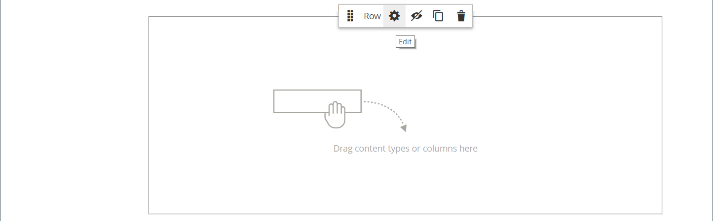
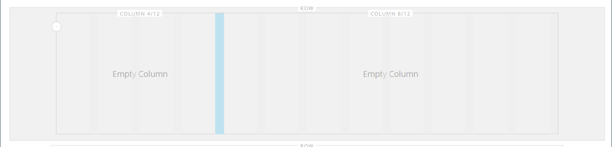
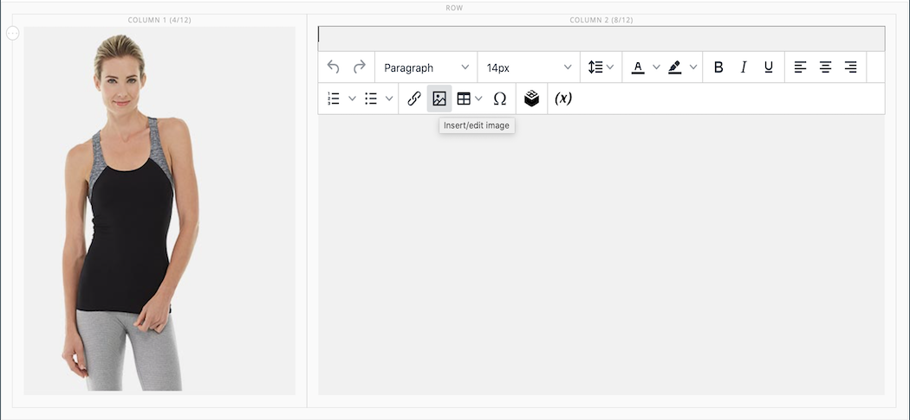
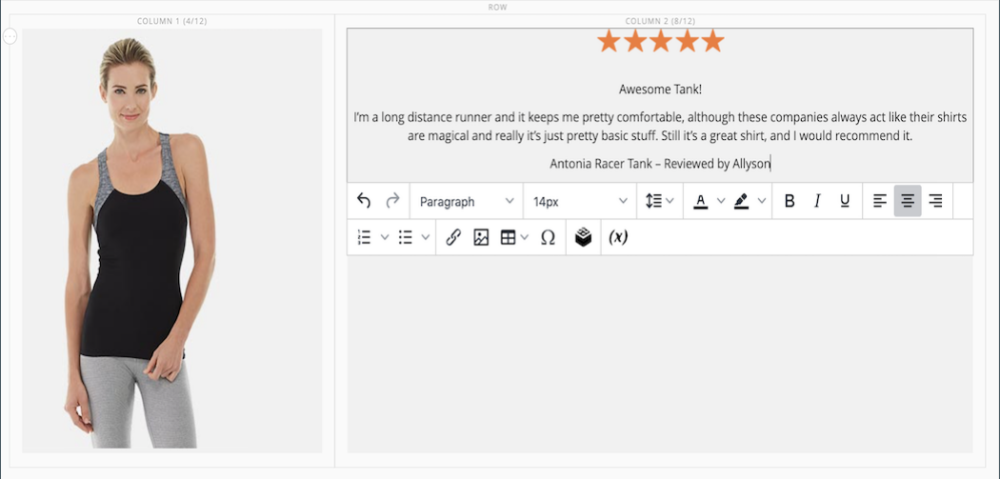

# [!DNL Page Builder] Apresentação parte 1: página simples

Siga este exercício de três partes para se familiarizar com o espaço de trabalho do [!DNL Page Builder] criando uma página simples que ilustra a facilidade de criar páginas ricas em conteúdo de seu próprio design.

{width="700" zoomable="yes"}

>[!NOTE]
>
>Esses exercícios de explicação são atualizados para refletir as alterações recentes no espaço de trabalho do [!DNL Page Builder] na versão 2.4.1.

## Antes de começar

Antes de iniciar este exercício, é recomendável aumentar o [Tempo de Vida da Sessão do Administrador](../systems/security-admin.md) para evitar que a sessão atinja o tempo limite enquanto você trabalha.

Verifique as definições de configuração necessárias para o gerenciamento de conteúdo:

- O Editor do WYSIWYG está habilitado na configuração [Opções do WYSIWYG](../content-design/editor.md#configure-the-editor).

- [!DNL Page Builder] está habilitado na configuração das [Ferramentas Avançadas de Conteúdo](setup.md).

### Baixar os ativos de imagem de apresentação

1. Baixe o arquivo [`simple-page-assets`](./assets/simple-page-assets.zip) e salve-o em seu sistema local.

1. Navegue até o arquivo baixado e extraia os arquivos compactados.

   Em um sistema Windows, clique com o botão direito do mouse e escolha **[!UICONTROL Extract All]** arquivos. Escolha a pasta de destino e clique em **[!UICONTROL Extract]**.

   Em um sistema Mac, basta clicar duas vezes no arquivo zip e mover os arquivos extraídos para a pasta de destino.

   A pasta contém os seguintes arquivos de imagem:

   ![[!DNL Page Builder] arquivos de apresentação - ativos de página simples](./assets/pb-tutorial-simple-page-assets.png){width="500"}

Siga as três partes desta apresentação em ordem.

## Parte 1: Linha de sangria completa com banner

Nesta parte do exercício Página simples, você cria uma página que tem uma linha e um banner totalmente sangrados. A linha tem imagens de plano de fundo diferentes para dispositivos móveis e de desktop.

![[!DNL Page Builder] linha de sangria completa com banner](./assets/pb-tutorial1-full-bleed-with-banner.png){width="700" zoomable="yes"}

### Etapa 1: criar uma página

1. Na barra lateral _Admin_, vá para **[!UICONTROL Content]** > _[!UICONTROL Elements]_>**[!UICONTROL Pages]**.

1. No canto superior direito, clique em **[!UICONTROL Add New Page]** e faça o seguinte:

   - Para impedir que esta página seja publicada no seu armazenamento, defina **[!UICONTROL Enable Page]** como `No`.

   - Para **[!UICONTROL Page Title]**, digite `Simple Page`.

   {width="600" zoomable="yes"}

1. Expandir  a seção **[!UICONTROL Design]**.

   Observe que **[!UICONTROL Layout]** está definido como `Page -- Full Width` por padrão. Além das cinco opções padrão de [layout](../content-design/page-layout.md), o [!DNL Page Builder] adiciona layouts de largura total para páginas, categorias e produtos.

1. Se os dados de exemplo estiverem disponíveis, defina **[!UICONTROL New Theme]** como `Magento Luma`. Caso contrário, você pode escolher outro tema disponível ou deixá-lo em branco para usar o tema padrão.

   A configuração _[!UICONTROL New Theme]_pode ser usada para substituir o tema padrão e aplicar um tema diferente à página.

   >[!NOTE]
   >
   >O layout de Largura Total só pode ser usado com um [tema](../content-design/themes.md) compatível.

   {width="600" zoomable="yes"}

1. No canto superior direito, clique em **[!UICONTROL Save]**.

   Quando a página é salva, o nome _Página Simples_ aparece no canto superior esquerdo da página.

### Etapa 2: Formatar a linha

1. Expandir  a seção **[!UICONTROL Content]**.

   Esta ação exibe a visualização de [!DNL Page Builder] com uma linha vazia.

   >[!NOTE]
   >
   >O campo [Cabeçalho de Conteúdo](workspace.md) é opcional. Por padrão, é formatado como um cabeçalho de nível 1 (H1) de acordo com o tema. Para este exercício, o _Cabeçalho do Conteúdo_ é deixado em branco.

   {width="600" zoomable="yes"}

1. Clique em **[!UICONTROL Edit with Page Builder]** ou dentro da área de visualização de conteúdo.

   No [!DNL Page Builder] [espaço de trabalho](workspace.md) expandido, o painel à esquerda fornece as ferramentas de conteúdo que você pode usar para criar o conteúdo no estágio.

1. Passe o mouse sobre a linha vazia para exibir a caixa de ferramentas.

   Cada contêiner de conteúdo tem uma caixa de ferramentas com um conjunto semelhante de opções.

   Caixa de ferramentas de ![[!DNL Page Builder] linha](./assets/pb-layout-page-add-content-row-tools.png){width="600" zoomable="yes"}

1. Na caixa de ferramentas Linha, escolha o ícone _Configurações_ ({width="20"}.

1. Em _[!UICONTROL Appearance]_, escolha **Sangria Completa**.

   A configuração de aparência Sangria completa estende as bordas esquerda e direita da área de conteúdo da linha e do plano de fundo até a largura total da página.

   {width="600" zoomable="yes"}

1. Role para baixo até a seção _[!UICONTROL Advanced]_e defina todas as configurações de **[!UICONTROL Margins and Padding]**como `0`.

   Essa configuração garante que o banner estenda a largura total da linha.

   {width="600" zoomable="yes"}

1. Para salvar as configurações e retornar ao espaço de trabalho [!DNL Page Builder], role até a parte superior da página e clique em **[!UICONTROL Save]** no canto superior direito.

### Etapa 3: adicionar um banner

>[!NOTE]
>
>[!DNL Page Builder] tem um novo tipo de conteúdo chamado _Banner_, que é apresentado nesta etapa. A opção _Banner_ no menu Conteúdo agora é um _Bloco Dinâmico_.

1. No painel [!DNL Page Builder], expanda **[!UICONTROL Media]** e arraste um espaço reservado para **Banner** para o estágio.

   {width="600" zoomable="yes"}
1. Passe o mouse sobre o contêiner de banner para exibir a caixa de ferramentas.

   >[!NOTE]
   >
   >O estágio agora tem dois contêineres de conteúdo, cada um com uma caixa de ferramentas separada. Como o banner está aninhado dentro da linha, verifique se você está trabalhando na caixa de ferramentas correta.

   Além da caixa de ferramentas, os botões _Carregar Imagem_ e _Selecionar na Galeria_ são incluídos para que você possa fazer alterações rápidas no banner diretamente do palco.

   {width="600" zoomable="yes"}

1. Na caixa de ferramentas Banner, escolha o ícone _Configurações_ ( {width="20"} ).

1. Em _[!UICONTROL Appearance]_, escolha **[!UICONTROL Collage Right]**.

   A configuração Collage Right posiciona o conteúdo no lado direito do banner.

   {width="600" zoomable="yes"}

1. Role para baixo até a seção _[!UICONTROL Background]_e defina a imagem de fundo do banner:

   - Para **[!UICONTROL Background Image]**, clique em **Carregar**.

     {width="600" zoomable="yes"}

     Navegue até o diretório onde você salvou os ativos de página simples extraídos e escolha o arquivo `wide-banner-background.jpg`.

     A imagem é carregada e uma miniatura da imagem carregada é exibida. O nome do arquivo, as dimensões da imagem e o tamanho do arquivo são observados abaixo.

     {width="600" zoomable="yes"}

   - Para **[!UICONTROL Background Mobile Image]**, clique em **Carregar**.

     No mesmo diretório de arquivos, escolha o arquivo `wide-banner-background-mobile.jpg`.

     A imagem de fundo móvel é usada para dispositivos móveis e também sempre que uma janela do navegador do desktop é redimensionada para a largura de um dispositivo móvel.

     {width="600" zoomable="yes"}

   - Volte para a parte superior da página e clique em **[!UICONTROL Save]** para salvar as configurações e retornar ao espaço de trabalho [!DNL Page Builder].

     O plano de fundo aparece no palco e estende a largura total da linha.

     {width="600" zoomable="yes"}

   Observe o texto de espaço reservado que aparece no lado direito da linha. A posição deste texto reflete a configuração de aparência _Collage Right_.

1. Clique no texto do espaço reservado e insira a seguinte mensagem como duas linhas:

   `Get fit and look fab in new seasonal styles.`

   `New LUMA yoga collection`

   A barra de ferramentas do editor é exibida acima da caixa de texto. O texto pode ser inserido e formatado diretamente do palco ou escolhendo _Configurações_ na caixa de ferramentas do banner.

   {width="600" zoomable="yes"}

1. Aplicar formatação ao texto:

   - Selecione a primeira linha de texto. Em seguida, na barra de ferramentas do editor, em **Formatos**, escolha `Heading 2`.

     {width="600" zoomable="yes"}

   - Selecione a segunda linha de texto. Em seguida, na barra de ferramentas do editor, em **Formatos**, escolha `Paragraph`.

   As configurações de formato aplicam os estilos da folha de estilos associada ao tema atual.

   {width="600" zoomable="yes"}
__

1. Passe o mouse para exibir a caixa de ferramentas Banner, escolha novamente o ícone _Configurações_ ( {width="20"} ) e role até a seção _[!UICONTROL Content]_.

   Observe que seu texto é exibido na caixa _Texto da Mensagem_. O texto pode ser inserido e editado no estágio ou na seção _[!UICONTROL Content]_das configurações de banner.

   {width="600" zoomable="yes"}

1. Continuando na seção _[!UICONTROL Content]_, defina o link e o botão do banner:

   - Defina **Link** como `Category` e clique em **[!UICONTROL Select]** para mostrar a árvore de categorias.

   - Escolha `What's New` como a categoria vinculada.

     {width="600" zoomable="yes"}

   - Defina **[!UICONTROL Show Button]** como `Always`.

   - Para **[!UICONTROL Button Text]**, insira `Shop Now` como o texto que aparece no botão.

   - Para **[!UICONTROL Button Type]**, aceite o padrão `Primary`.

     O estilo do botão do tema atual determina o formato do botão.

1. Defina a sobreposição do banner:

   Você pode usar uma sobreposição para aplicar uma cor de plano de fundo à área de conteúdo ativa definida pela configuração Aparência. A imagem de fundo do banner permanece visível por toda a largura do banner.

   - Defina **[!UICONTROL Show Overlay]** como `Always`.

   - Para **[!UICONTROL Overlay Color]**, siga um destes procedimentos:

      - Clique no quadrado colorido e escolha a amostra branca.
      - Clique na caixa de texto _Sem cor_ e digite `White` ou o valor hexadecimal `#ffffff`.

     Em seguida, clique em **[!UICONTROL Apply]**.

     {width="600" zoomable="yes"}

   - Volte para a parte superior da página e clique em **[!UICONTROL Save]** para salvar as configurações e retornar ao espaço de trabalho [!DNL Page Builder].

     O botão é exibido abaixo da mensagem do banner no palco.

     {width="600" zoomable="yes"}

1. No canto superior direito do estágio, clique no ícone _Fechar Tela cheia_ ().

   Clicar nesse ícone retorna à seção _[!UICONTROL Content]_da página com a visualização exibida.

   Você pode alternar entre os dois modos de espaço de trabalho a qualquer momento.

1. No canto superior direito, clique na seta **[!UICONTROL Save]** e escolha **[!UICONTROL Save & Close]**.

1. Se solicitado, clique no link [Gerenciamento de Cache](../systems/cache-management.md) na mensagem na parte superior da página e atualize qualquer cache inválido.

## Parte 2: Linha contida com duas colunas iguais

Nesta parte do exercício, você adiciona uma linha à página e divide a linha em duas colunas iguais. Em seguida, você adiciona uma imagem vinculada a cada coluna. Nas instruções, cada nova linha é adicionada antes da primeira linha para fazer com que o painel [!DNL Page Builder] se alinhe ao estágio. No final do exercício, você reorganiza as linhas para que elas correspondam ao exemplo de Página simples.

{width="600" zoomable="yes"}

### Etapa 1: adicionar uma linha

1. Na grade Páginas, localize a _Página Simples_ que você criou na primeira parte deste exercício e selecione **[!UICONTROL Edit]** na coluna _[!UICONTROL Action]_.

1. Expandir  a seção **[!UICONTROL Content]**.

1. Clique em **[!UICONTROL Edit with Page Builder]** ou dentro da área de visualização de conteúdo.

1. No painel [!DNL Page Builder], em _[!UICONTROL Layout]_, arraste um espaço reservado **[!UICONTROL Row]**para o estágio e coloque-o acima do banner.

   A diretriz vermelha marca o limite entre as duas linhas.

   {width="600" zoomable="yes"}

1. Passe o mouse sobre a nova linha para exibir a caixa de ferramentas e escolha o ícone _Configurações_ ( {width="20"} ).

   {width="600" zoomable="yes"}

1. Em _[!UICONTROL Appearance]_, aceite a configuração padrão **Concontained**.

   Essa configuração limita a área de conteúdo da linha à largura da página, conforme definido pelo tema.

   {width="600" zoomable="yes"}

1. No canto superior direito, clique em **[!UICONTROL Save]** para salvar as configurações e retornar ao espaço de trabalho [!DNL Page Builder].

### Etapa 2: adicionar uma coluna

1. No painel [!DNL Page Builder], em _[!UICONTROL Layout]_, arraste um espaço reservado **[!UICONTROL Column]**para a nova linha.

   {width="600" zoomable="yes"}

   A linha agora é dividida em duas colunas de igual largura. Cada coluna é um container separado para o conteúdo com sua própria caixa de ferramentas dedicada de opções.

   {width="600" zoomable="yes"}

1. No canto superior esquerdo da primeira coluna, clique no controle circular _Grade_ () para mostrar as diretrizes de grade.

   A grade garante que o conteúdo seja alinhado de forma consistente e seja renderizado corretamente em dispositivos móveis e desktop. Para obter informações sobre como configurar o tamanho da grade, consulte a seção [Configurar [!DNL Page Builder]](setup.md#configure-page-builder) no tópico de Instalação [!DNL Page Builder].

   Os números entre parênteses (6/12) na borda superior de cada contêiner de coluna indicam o número de divisões de grade em cada coluna e o número total de divisões na linha.

   {width="600" zoomable="yes"}

### Etapa 3: Adicionar imagens com links

Nesta etapa, você aprenderá a fazer upload de uma imagem no banner.

1. No painel [!DNL Page Builder], expanda a seção **[!UICONTROL Media]** e arraste um espaço reservado **[!UICONTROL Image]** para a primeira coluna.

   {width="600" zoomable="yes"}

1. Insira a imagem de amostra no espaço reservado.

   {width="600" zoomable="yes"}

   Para uma imagem localizada em seu sistema, você pode escolher um destes métodos:

   - **Carregar o arquivo de imagem**: na primeira coluna, clique em **[!UICONTROL Upload Image]**. Em seguida, navegue até o diretório onde você salvou os ativos de página simples extraídos e escolha o arquivo `small-banner-1.jpg`.

     {width="600" zoomable="yes"}

     Repita esta ação para adicionar o arquivo `small-banner-2.jpg` à segunda coluna.

   - **Arraste o arquivo de imagem**: na área de trabalho, abra a pasta de ativos da página simples e posicione-a ao lado da janela do navegador Admin, onde você está trabalhando com o estágio [!DNL Page Builder]. Em seguida, arraste o arquivo `small-banner-1.jpg` da pasta de ativos da página simples e solte-o na primeira coluna.

     {width="600" zoomable="yes"}

     Repita esta ação para adicionar o arquivo `small-banner-2.jpg` à segunda coluna.

1. Determine qual página do catálogo deseja vincular a cada imagem.

1. Passe o mouse sobre a imagem na primeira coluna para exibir a caixa de ferramentas e escolha o ícone _Configurações_ ( {width="20"} ).

   {width="600" zoomable="yes"}

1. Vincular a imagem a uma categoria:

   - Role para baixo e defina **Link** como `Category`.

   - Na árvore de categorias, faça drill-down e escolha a categoria `Men's Hoodies & Sweatshirt`.

   - No canto superior direito, **[!UICONTROL Save]** as configurações e retorne ao espaço de trabalho [!DNL Page Builder].

1. Repita a etapa anterior para vincular a imagem na segunda coluna à categoria _Gear_.

1. No canto superior direito do estágio, clique no ícone _Fechar Tela cheia_ ().

   Clicar nesse ícone retorna à seção _[!UICONTROL Content]_da página com a visualização exibida.

1. No canto superior direito, clique na seta **[!UICONTROL Save]** e escolha **[!UICONTROL Save & Close]**.

1. Quando solicitado, clique no link [Gerenciamento de Cache](../systems/cache-management.md) na mensagem na parte superior da página e atualize qualquer cache inválido.

## Parte 3: Linha de largura total com colunas desiguais

A linha final desta página apresenta o conteúdo de uma análise do produto. Você adiciona uma linha de largura completa e a divide em duas colunas de larguras diferentes. Uma imagem de plano de fundo é adicionada à primeira coluna, com uma cor de plano de fundo correspondente aplicada à linha para um efeito unificado.

{width="500"}

### Etapa 1: adicionar uma linha

1. Na grade Páginas, localize a _Página Simples_ que você criou na primeira parte deste exercício e selecione **[!UICONTROL Edit]** na coluna _[!UICONTROL Action]_.

1. Expandir  a seção **[!UICONTROL Content]**.

1. Clique em **[!UICONTROL Edit with Page Builder]** ou dentro da área de visualização de conteúdo.

1. No painel [!DNL Page Builder], em _[!UICONTROL Layout]_, arraste um espaço reservado **[!UICONTROL Row]**para o estágio e coloque-o acima da linha criada na segunda parte deste exercício.

   Uma diretriz vermelha marca o limite entre as duas linhas.

   {width="600" zoomable="yes"}

1. Passe o mouse sobre a nova linha para exibir a caixa de ferramentas e escolha o ícone _Configurações_ ({width="20"} ).

   {width="600" zoomable="yes"}

1. Na página Editar Linha em _[!UICONTROL Appearance]_, escolha **[!UICONTROL Full Width]**.

   Essa configuração limita a área de conteúdo à largura máxima da página definida pelo tema. A cor e/ou imagem do plano de fundo não são limitadas e estendem a largura total da linha.

   {width="600" zoomable="yes"}

1. Na seção _[!UICONTROL Background]_, digite `#f1f1f1` como **[!UICONTROL Background Color]**.

   {width="600" zoomable="yes"}

1. Role para baixo até a seção _[!UICONTROL Advanced]_e defina todos os valores de **Margens e Preenchimento**como `0`.

   {width="600" zoomable="yes"}

1. Volte para a parte superior da página e clique em **[!UICONTROL Save]** para salvar as configurações e retornar ao espaço de trabalho [!DNL Page Builder].

   A cor de fundo da linha agora é um bege claro.

   {width="600" zoomable="yes"}

### Etapa 2: adicionar colunas de diferentes larguras

1. No painel [!DNL Page Builder], em _[!UICONTROL Layout]_, arraste um espaço reservado **[!UICONTROL Column]**para a linha superior do palco.

   {width="600" zoomable="yes"}

1. Arraste a borda direita da primeira coluna para a posição quatro de 12 (`4/12`) na grade.

   O tamanho da segunda coluna se ajusta a oito de 12 (`8/12`).

   {width="600" zoomable="yes"}

1. Passe o mouse sobre o primeiro contêiner de coluna para exibir a caixa de ferramentas e escolher o ícone _Configurações_ ( {width="20"} ).

1. Role para baixo até a seção _[!UICONTROL Advanced]_e defina todos os valores de **Margens e Preenchimento**como `0`.

   {width="600" zoomable="yes"}

1. Volte para a parte superior da página e clique em **[!UICONTROL Save]** para salvar as configurações e retornar ao espaço de trabalho [!DNL Page Builder].

### Etapa 3: adicionar uma imagem à primeira coluna

1. No painel [!DNL Page Builder], expanda **[!UICONTROL Media]** e arraste um tipo de conteúdo **[!UICONTROL Image]** para a primeira coluna.

   {width="600" zoomable="yes"}

1. No espaço reservado de imagem, clique em **[!UICONTROL Upload Image]**.

   {width="600" zoomable="yes"}

1. Navegue até o diretório onde você salvou os ativos de página simples extraídos e escolha o arquivo `review-image.jpg`.

   A imagem carregada aparece na primeira coluna e se mescla perfeitamente com a cor do plano de fundo da linha.

   {width="600" zoomable="yes"}

### Etapa 4: adicionar o conteúdo da revisão à segunda coluna

A segunda coluna da linha deve conter conteúdo de uma análise do cliente, incluindo a imagem de classificação de cinco estrelas e a mensagem de texto formatada.

1. No painel [!DNL Page Builder], expanda a seção **[!UICONTROL Elements]** e arraste o tipo de conteúdo **[!UICONTROL Text]** para a segunda coluna.

   {width="600" zoomable="yes"}

1. Clique em no elemento de texto para exibir a barra de ferramentas do editor.

1. Na barra de ferramentas, clique no ícone _Inserir imagem_ () e faça o seguinte:

   {width="600" zoomable="yes"}

   - Na caixa de diálogo _[!UICONTROL Insert/edit image]_, clique no ícone_ Localizar _(  ) ao lado do campo_[!UICONTROL Source]_.

     {width="600" zoomable="yes"}

   - Na página _[!UICONTROL Select Images]_, clique em **[!UICONTROL Choose Files]**.

   - Na pasta onde você salvou os ativos de página simples, escolha `rating.png`.

   - De volta à página, clique duas vezes no bloco de imagem para selecioná-lo e inserir seu URL no campo do Source.

     {width="600" zoomable="yes"}

   - Para **[!UICONTROL Image Description]**, digite `5-Star Rating` e clique em **[!UICONTROL OK]** para inserir a imagem na coluna.

   - Na barra de ferramentas do editor, clique em **Alinhar ao Centro** () para centralizar a imagem na coluna.

     {width="600" zoomable="yes"}

1. Posicione o ponto de inserção logo após a imagem de cinco estrelas, pressione a tecla Enter/Return para iniciar uma nova linha e insira o seguinte texto:

   `Awesome Tank!`

   `I'm a long distance runner and it keeps me pretty comfortable, although these companies always act like their shirts are magical and really it's just pretty basic stuff. Still it's a great shirt, and I would recommend it.`

   `Antonia Racer Tank – Reviewed by Allyson`

   O texto é centralizado à medida que você digita.

   {width="600" zoomable="yes"}

1. Formate o texto:

   - Clique em qualquer lugar na primeira linha de texto e, na barra de ferramentas do editor, em **Formatos**, escolha `Heading 2`.

   - Selecione o texto restante e, na barra de ferramentas do editor, em **Formatos**, escolha `Paragraph`.

   O texto é formatado de acordo com a folha de estilos associada ao tema.

1. Obtenha as dimensões da imagem para centralizar o conteúdo verticalmente na coluna:

   - Passe o mouse sobre a imagem na primeira coluna para exibir a caixa de ferramentas e escolha o ícone _Configurações_ ({width="20"} ).

   - Abaixo da miniatura da imagem, anote as dimensões da imagem.

     {width="600" zoomable="yes"}

   - No canto superior direito, clique em **Fechar**.

1. Centralizar o conteúdo verticalmente na segunda coluna:

   - Passe o mouse sobre a segunda coluna para exibir a caixa de ferramentas e escolha o ícone _Configurações_ ({width="20"} ).

   >[!NOTE]
   >
   >Selecione o contêiner de coluna em vez do contêiner de Texto para exibir a caixa de ferramentas correta.

   - Para **[!UICONTROL Minimum Height]**, insira `450` como a altura em pixels da imagem na primeira coluna.

   - Defina **[!UICONTROL Vertical Alignment]** como `Center`.

   {width="600" zoomable="yes"}

1. Role para baixo até a seção _[!UICONTROL Advanced]_e defina todos os valores de **[!UICONTROL Margins and Padding]**como zero ( `0` ).

   {width="600" zoomable="yes"}

1. Volte para a parte superior da página e, no canto superior direito, clique em **[!UICONTROL Save]** para salvar as configurações e retornar ao espaço de trabalho [!DNL Page Builder].

   {width="600" zoomable="yes"}

### Etapa 5: inserir um link de produto de catálogo

1. Selecione o texto `Antonia Racer Tank` e clique no ícone _Inserir link_ () na barra de ferramentas do editor.

1. Na caixa de diálogo _Inserir link_, especifique o link para o produto de catálogo:

   - Insira o produto **[!UICONTROL URL]**.

     Você pode inserir um URL relativo ou totalmente qualificado. O link relativo a seguir é inserido para este exemplo:

     `../antonia-racer-tank.html`

   - (Opcional) Para **Título**, insira o nome do produto.

     O atributo Title link é usado por alguns navegadores como uma dica de ferramenta.

     {width="600" zoomable="yes"}

   - Quando terminar, clique em **[!UICONTROL OK]** para salvar o link.

     O texto vinculado agora é realçado no banner.

     {width="600" zoomable="yes"}

1. No canto superior direito do estágio, clique no ícone _Fechar Tela cheia_ ().

   Clicar nesse ícone retorna à seção _[!UICONTROL Content]_da página com a visualização exibida.

1. No canto superior direito, clique em **[!UICONTROL Save]**.

### Etapa 6: reorganizar as linhas

Com todas as três linhas concluídas, a etapa final é reorganizar as linhas para corresponder ao exemplo original de _Página Simples_. Para corresponder ao exemplo original, a primeira linha deve ser movida para a parte inferior e a última linha deve ser movida para a parte superior.

1. Se necessário, expanda  a seção **[!UICONTROL Content]**.

1. Clique em **[!UICONTROL Edit with Page Builder]** ou dentro da área de visualização de conteúdo.

1. Passe o mouse sobre a primeira linha do palco para exibir a caixa de ferramentas e escolha o ícone _Mover_ ( ).

   {width="600" zoomable="yes"}

1. Mantenha o botão do mouse pressionado enquanto verifica se todo o conteúdo da linha está selecionado e arraste a linha para uma posição abaixo da linha de guia vermelha na parte inferior da página.

   >[!NOTE]
   >
   >Se você mover acidentalmente apenas parte do conteúdo (como a imagem), basta mover o conteúdo de volta para onde ele pertence e tentar novamente.

   {width="600" zoomable="yes"}

1. Repita esse processo para mover a primeira linha para a segunda posição.

   A ordem das linhas na página agora corresponde ao exemplo de Página simples.

1. No canto superior direito do estágio, clique no ícone _Fechar Tela cheia_ ().

   Clicar nesse ícone retorna à seção _[!UICONTROL Content]_da página com a visualização exibida.

1. No canto superior direito, clique na seta **[!UICONTROL Save]** e escolha **[!UICONTROL Save & Close]**.

1. Se solicitado, clique no link [Gerenciamento de Cache](../systems/cache-management.md) na mensagem na parte superior da página e atualize qualquer cache inválido.

Você concluiu o exercício Página simples. Manter o trabalho criado para que você possa consultá-lo posteriormente.

Quando estiver pronto, prossiga para [Parte 2: Blocos](2-blocks.md).
