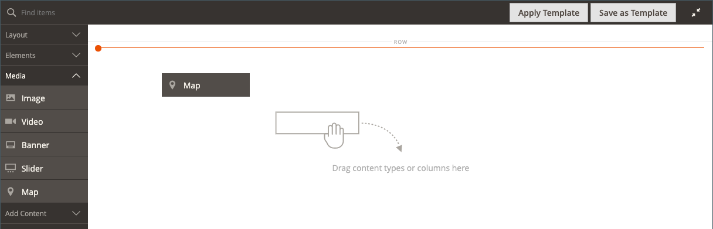
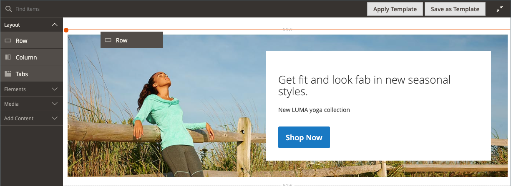
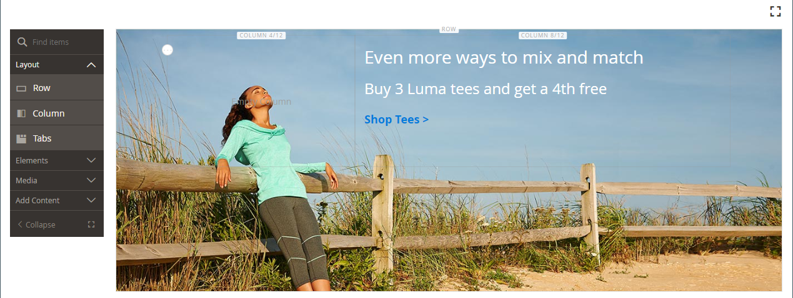
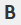

# [!DNL Page Builder] Apresentação parte 2: blocos

O exercício a seguir ilustra a diferença entre [blocos simples](../content-design/blocks.md) e [blocos dinâmicos](dynamic-block.md) e como usar [!DNL Page Builder] para criar cada tipo de bloco.

>[!NOTE]
>
>[!DNL Page Builder] tem um novo tipo de conteúdo chamado _Banner_, que é apresentado no primeiro exercício de explicação passo a passo e não está relacionado à funcionalidade de banner anterior. A opção anterior Banner no [menu Conteúdo](../content-design/content-menu.md), agora é _Bloco Dinâmico_.

{width="700" zoomable="yes"}

Este exercício supõe que você tenha concluído a [Parte 1: Página Simples](1-simple-page.md), incluindo os pré-requisitos e [arquivos de amostra baixados](./assets/simple-page-assets.zip). Siga as partes deste exercício de explicação em ordem.

>[!NOTE]
>
>Esses exercícios de explicação são atualizados para refletir as alterações recentes no espaço de trabalho do [!DNL Page Builder] na versão 2.4.1.

## Parte 1: Criar um bloco simples

Neste exercício de apresentação, você cria um bloco simples com conteúdo de [!DNL Google Maps]. Blocos simples às vezes são chamados de _blocos CMS_ ou _blocos estáticos_, pois o conteúdo não é alterado. Um bloco simples é ideal para conteúdo que você possa querer reutilizar.

### Etapa 1: criar um bloco

1. Na barra lateral _Admin_, vá para **[!UICONTROL Content]** > _[!UICONTROL Elements]_>**[!UICONTROL Blocks]**.

1. No canto superior direito, clique em **[!UICONTROL Add New Block]**.

1. Para **[!UICONTROL Block Title]**, digite `Google Map`.

1. Para **[!UICONTROL Identifier]**, digite `google-map`.

1. Escolha o **[!UICONTROL Store View]** onde o bloco deve estar disponível.

   {width="600" zoomable="yes"}

1. No canto superior direito, clique em **[!UICONTROL Save]**.

### Etapa 2: Adicionar um [!DNL Google Map]

1. Role para baixo até a visualização de conteúdo [!DNL Page Builder] (atualmente vazia) e clique em **[!UICONTROL Edit with Page Builder]**.

1. No painel [!DNL Page Builder], expanda **[!UICONTROL Media]** e arraste um espaço reservado **[!UICONTROL Map]** para o estágio.

   {width="600" zoomable="yes"}

   Será exibido um mapa para o local da loja se [!DNL Google Maps] estiver configurado para a loja.

   {width="600" zoomable="yes"}

   Um mapa de espaço reservado será exibido se [!DNL Google Maps] ainda não estiver configurado para seu armazenamento.

   ![[!DNL Google Maps] espaço reservado](./assets/pb-tutorial2-media-map-not-configured.png){width="600" zoomable="yes"}

1. No canto superior direito do estágio, clique no ícone _Fechar Tela cheia_ ().

   Clicar nesse ícone retorna à seção _[!UICONTROL Content]_do bloco com a visualização exibida.

1. No canto superior direito, clique na seta **[!UICONTROL Save]** e escolha **[!UICONTROL Save & Close]**.

### Etapa 3: configurar [!DNL Google Maps]

Se [!DNL Google Maps] já estiver configurado para o seu armazenamento, você poderá ignorar esta etapa e prosseguir para a próxima.

1. Vá para o [Console da Google Cloud Platform](https://console.cloud.google.com/google/maps-apis/overview).

1. Clique na lista suspensa do projeto e selecione ou crie o projeto ao qual deseja adicionar uma chave de API.

1. Para configurar suas credenciais de API, siga as [instruções][1] na documentação [!DNL Google Maps].

1. Copie sua chave de API na área de transferência.

1. Retorne ao Administrador [!DNL Commerce] e vá para **[!UICONTROL Stores]** > _[!UICONTROL Settings]_>**[!UICONTROL Configuration]**.

1. No painel esquerdo, em _[!UICONTROL General]_, escolha **[!UICONTROL Content Management]**.

1. Expandir  **[!UICONTROL Advanced Content Tools]**.

   {width="600" zoomable="yes"}

   Para obter mais informações sobre as opções de configuração do [!UICONTROL Content Management Advanced Tools], consulte o [_Guia de Referência de Configuração_](../configuration-reference/general/content-management.md).

1. Para **[!UICONTROL Google Maps API Key]**, cole a chave que você copiou.

1. Clique em **[!UICONTROL Test Key]**.

   Se houver um problema com sua chave, retorne ao site da Plataforma [!DNL Google Maps] para resolver o problema. Em seguida, tente novamente.

1. Após verificar sua chave, clique em **[!UICONTROL Save Config]**.

### Etapa 4: adicionar o bloco a uma página

1. Na barra lateral _Admin_, vá para **[!UICONTROL Content]** > _[!UICONTROL Elements]_>**[!UICONTROL Pages]**.

1. Na grade, localize o _[!UICONTROL Simple Page]_que você criou no primeiro tutorial e selecione **[!UICONTROL Edit]**na coluna_[!UICONTROL Action]_.

1. Expanda  a seção **[!UICONTROL Content]** e clique em **[!UICONTROL Edit with Page Builder]** ou dentro da área de visualização de conteúdo.

1. No painel [!DNL Page Builder], em _[!UICONTROL Layout]_, arraste um espaço reservado **[!UICONTROL Row]**para a parte superior do estágio.

   {width="600" zoomable="yes"}

1. No painel [!DNL Page Builder], expanda **[!UICONTROL Add Content]** e arraste um espaço reservado **[!UICONTROL Block]** para a nova linha.

1. Passe o mouse sobre o contêiner de blocos vazios para exibir a caixa de ferramentas e escolha o ícone _Configurações_ ({width="20"} ).

   {width="600" zoomable="yes"}

1. Na página Editar Bloco, clique em **[!UICONTROL Select Block]**.

   {width="600" zoomable="yes"}

1. Na caixa de pesquisa, digite `map` e pressione a tecla Enter/Return para localizar o bloco criado.

   {width="600" zoomable="yes"}

1. Na grade, clique em **[!UICONTROL Select]** para escolher o bloco [!DNL Google Maps].

1. No canto superior direito, clique em **[!UICONTROL Save]** para salvar as configurações e retornar ao espaço de trabalho [!DNL Page Builder].

1. No canto superior direito do estágio, clique no ícone _Fechar Tela cheia_ ().

   Clicar nesse ícone retorna à seção _[!UICONTROL Content]_da página com a visualização exibida.

1. No canto superior direito, clique na seta **[!UICONTROL Save]** e escolha **[!UICONTROL Save & Close]**.

**Parabéns!** Você concluiu a primeira parte do exercício Bloquear. Certifique-se de manter seu trabalho como referência.

## Parte 2: Criar um bloco dinâmico

Um bloco dinâmico inclui uma lógica que determina onde, quando e para quem ele aparece. Neste exercício de explicação passo a passo, você cria um bloco dinâmico para uma promoção que é acionada quando as condições da regra de preço são atendidas e que é exibida somente para um segmento de cliente específico. O resultado desse exemplo é semelhante ao banner criado no primeiro exercício, mas com uma lógica que controla quando ele aparece na loja.

{width="600" zoomable="yes"}

### Etapa 1: criar um novo bloco dinâmico

1. Na barra lateral _Admin_, vá para **[!UICONTROL Content]** > _[!UICONTROL Elements]_>**[!UICONTROL Dynamic Blocks]**.

   {width="700" zoomable="yes"}

1. No canto superior direito, clique em **[!UICONTROL Add Dynamic Block]**.

   {width="600" zoomable="yes"}

1. Conclua as configurações básicas do novo bloco dinâmico:

   - Defina **[!UICONTROL Enable Dynamic Block]** como `Yes`.

   - Para **[!UICONTROL Dynamic Block Name]**, digite `Tee Shirt Promo`.

   - Defina **[!UICONTROL Dynamic Block Type]** como `Content Area` e clique em **[!UICONTROL Done]**.

     O Tipo de Bloco Dinâmico determina onde o bloco é colocado no [layout de página](../content-design/page-layout.md). Ao configurar um bloco dinâmico para sua loja, considere o layout da página e o [tema](../content-design/themes.md), para que você possa usar bem o espaço disponível. Algumas lojas têm uma área de conteúdo ativa limitada a uma largura fixa, enquanto outras estendem a largura total da tela.

     {width="600" zoomable="yes"}

   - Para **[!UICONTROL Customer Segment]**, marque a caixa de seleção de cada segmento que você deseja aplicar ao bloco dinâmico e clique em **Concluído** para salvar a lista de segmentos.

     Para o exemplo a seguir, há dois [segmentos de clientes](../customers/customer-segments.md) que identificam clientes registrados por gênero. Esse bloco dinâmico aparece somente para clientes fêmeas registrados que estão conectados às suas contas enquanto fazem compras em sua loja.

     {width="600" zoomable="yes"}

### Etapa 2: Concluir as configurações

Role para baixo até a seção _[!UICONTROL Content]_, que exibe uma visualização vazia do conteúdo [!DNL Page Builder], e clique em **[!UICONTROL Edit with Page Builder]**. Em seguida, conclua as seguintes tarefas:

**Tarefa 1:** adicionar uma imagem de plano de fundo

1. Passe o mouse sobre o contêiner de linhas para exibir a caixa de ferramentas e escolha o ícone _Configurações_ ({width="20"} ).

1. Em _[!UICONTROL Appearance]_, escolha **[!UICONTROL Full Bleed]**.

1. Para **[!UICONTROL Minimum Height]**, digite `400px`.

1. Role até a seção _[!UICONTROL Background]_e defina o **[!UICONTROL Background Image]**clicando em **[!UICONTROL Select from Gallery]**e escolhendo a imagem `wide-banner-background.png` carregada no primeiro tutorial.

1. No canto superior direito, clique em **[!UICONTROL Save]** para aplicar as configurações e retornar ao espaço de trabalho [!DNL Page Builder].

   {width="600" zoomable="yes"}

**Tarefa 2:** Adicionar colunas

No painel [!DNL Page Builder], em _[!UICONTROL Layout]_, arraste um espaço reservado **[!UICONTROL Column]**para a linha.

{width="600" zoomable="yes"}

A linha agora é dividida em duas colunas de igual largura.

**Tarefa 3:** Adicionar texto

1. No painel [!DNL Page Builder], expanda **[!UICONTROL Elements]** e arraste um espaço reservado para **Texto** para a segunda coluna.

   {width="600" zoomable="yes"}

1. Insira as três linhas de texto a seguir no editor:

   `Even more ways to mix and match.`

   `Buy 3 Luma tees and get a 4th free.`

   `Shop Tees >`

   {width="600" zoomable="yes"}

1. Selecione todas as três linhas de texto e use a barra de ferramentas para definir a **Altura da Linha** como `40px`.

   {width="600" zoomable="yes"}

1. Defina o **[!UICONTROL Font Size]** para cada linha da seguinte maneira:

   | Linha | Tamanho da fonte |
   |-----| ---------- |
   | Linha 1: | `28px` |
   | Linha 2: | `24px` |
   | Linha 3: | `18px` |

   Como esse bloco pode ser colocado em qualquer lugar da página, use o estilo de parágrafo padrão, em vez dos níveis de cabeçalho. Além disso, não se preocupe se o texto ainda não for quebrado corretamente na coluna.  

   {width="600" zoomable="yes"}

**Tarefa 4:** Adicionar um Link

No primeiro exercício, você aprendeu a usar o tipo de conteúdo [Botão](buttons.md) para criar um link. Este exemplo mostra como inserir um link da barra de ferramentas do editor.

1. Em outra guia do navegador, abra a loja e navegue até a página que deve ser o destino do link.

   Você pode usar o URL totalmente qualificado ou um URL relativo que omita a referência ao domínio da loja.

   URL completo
: `https://mystore.com/women/tops-women/tees-women.html`

   URL relativo
: `../women/tops-women/tees-women.html`

1. Retorne à guia do espaço de trabalho [!DNL Page Builder] e ao editor de texto, selecione o texto `Shop Tees >` na terceira linha e escolha **Negrito** () na barra de ferramentas do editor.

1. Com o texto `Shop Tees >` na terceira linha ainda selecionado, escolha **Inserir/editar link** () na barra de ferramentas do editor.

   {width="600" zoomable="yes"}

1. Para **[!UICONTROL URL]**, insira o link relativo preparado.

1. Defina **[!UICONTROL Target]** como `None`.

   Essa configuração abre a página na mesma janela do navegador, em vez de abrir uma nova guia.

1. Para **[!UICONTROL Title]**, digite `Shop Tees`.

   O atributo Title link é usado por alguns navegadores como uma dica de ferramenta.

1. Para salvar o link e retornar ao espaço de trabalho [!DNL Page Builder], clique em **[!UICONTROL OK]**.

   {width="600" zoomable="yes"}

1. No canto superior direito do estágio, clique no ícone _Fechar Tela cheia_ ().

   Clicar nesse ícone retorna à seção _[!UICONTROL Content]_do bloco dinâmico com a visualização exibida.

1. No canto superior direito, clique em **[!UICONTROL Save]**.

### Etapa 3: Adicionar uma regra de preço

1. Abra o bloco dinâmico _Tee Shirt Promo_ no modo de edição novamente.

1. Expanda  a seção **[!UICONTROL Related Promotions]** e clique em **[!UICONTROL Add Cart Price Rules]**.

   {width="600" zoomable="yes"}

1. Na página _Adicionar Regras de Preço do Carrinho Relacionadas_, marque a caixa de seleção para a _Comprar 3 camisetas e obtenha a 4ª regra de preço_ gratuita e clique em **[!UICONTROL Add Selected]**.

   {width="600" zoomable="yes"}

   A regra de preço aparece na seção _Promoções Relacionadas_, em _Regra de Preço do Carrinho Relacionado_. Você pode associar várias regras de preço a um bloco dinâmico. No entanto, esse exemplo simples usa apenas um.

   {width="600" zoomable="yes"}

1. No canto superior direito, clique em **[!UICONTROL Save]**.

### Etapa 4: adicionar o bloco dinâmico a uma página

1. Na barra lateral _Admin_, vá para **[!UICONTROL Content]** > _[!UICONTROL Elements]_>**[!UICONTROL Pages]**

1. Localize a _Página Simples_ que você criou no [primeiro exercício de explicação passo a passo](1-simple-page.md) e abra-a no modo de edição.

1. Expanda  a seção **[!UICONTROL Content]** e clique em **[!UICONTROL Edit with Page Builder]**.

1. Passe o mouse sobre a linha superior com a mesma imagem do bloco dinâmico para exibir a caixa de ferramentas e o ícone _Remover_ ( {width="20"} ).

   Para confirmar a remoção da linha da página, clique em **[!UICONTROL OK]**.

1. No painel [!DNL Page Builder], em _[!UICONTROL Layout]_, arraste um novo espaço reservado **[!UICONTROL Row]**para a parte superior do estágio.

1. No painel [!DNL Page Builder], expanda **[!UICONTROL Add Content]** e arraste um espaço reservado **[!UICONTROL Dynamic Block]** para a nova linha.

   {width="600" zoomable="yes"}

1. Passe o mouse sobre o contêiner de bloco dinâmico para exibir a caixa de ferramentas e escolher o ícone _Configurações_ ( {width="20"} ).

   {width="600" zoomable="yes"}

1. Na página _[!UICONTROL Edit Dynamic Block]_, clique em **[!UICONTROL Select Dynamic Block]**.

   {width="600" zoomable="yes"}

1. Encontre o bloco dinâmico _[!DNL Tee Shirt Promo]_que você criou e clique em **[!UICONTROL Select]**.

   Um resumo das informações de bloco dinâmico aparece abaixo.

   {width="600" zoomable="yes"}

1. Aceite o padrão **[!UICONTROL Template]**, `Dynamic Block Block Template`.

1. Quando terminar, clique em **[!UICONTROL Save]** para salvar as configurações e retornar ao espaço de trabalho [!DNL Page Builder].

   {width="600" zoomable="yes"}

1. No canto superior direito do estágio, clique no ícone _Fechar Tela cheia_ ().

   Clicar nesse ícone retorna à seção _[!UICONTROL Content]_da página com a visualização exibida.

1. No canto superior direito, clique na seta **[!UICONTROL Save]** e escolha **[!UICONTROL Save & Close]**.

Você concluiu a segunda parte do exercício Bloquear. Certifique-se de manter seu trabalho como referência.

## Parte 3: Atualizar o bloco dinâmico

Nesta parte final do exercício, você edita um bloco dinâmico enquanto a página está ativa na loja. Em seguida, faça logon na loja como um membro do segmento do cliente para que o bloco apareça.

{width="600" zoomable="yes"}

### Etapa 1: Editar o bloco dinâmico

1. Na barra lateral _Admin_, vá para **[!UICONTROL Content]** > _[!UICONTROL Elements]_>**[!UICONTROL Dynamic Blocks]**.

1. Encontre seu bloco dinâmico _[!DNL Tee Shirt Promo]_na grade e abra-o no modo de edição.

1. Expanda  a seção **[!UICONTROL Content]** e clique em **[!UICONTROL Edit with Page Builder]**.

1. Alterar a largura da coluna:

   - Passe o mouse sobre a borda entre as duas colunas.

   - Mantenha pressionado o botão do mouse e arraste a borda duas divisões para a esquerda.

     {width="600" zoomable="yes"}

     A primeira coluna é agora quatro de 12 (4/12) divisões de grade de largura, e a segunda coluna é oito de 12 (8/12) divisões de largura.

     {width="600" zoomable="yes"}

1. Alterar a cor do texto:

   - Selecione as duas primeiras linhas de texto.

   - Na barra de ferramentas do editor, escolha **[!UICONTROL Text Color]** e clique na amostra **[!UICONTROL White]**.

   {width="600" zoomable="yes"}

1. No canto superior direito do estágio, clique no ícone _Fechar Tela cheia_ ().

   Clicar nesse ícone retorna à seção _[!UICONTROL Content]_do bloco dinâmico com a visualização exibida.

1. No canto superior direito, clique em **[!UICONTROL Save]**.

### Etapa 2: visualizar o bloco dinâmico

Como esse bloco dinâmico é visível somente para membros de um segmento de cliente específico, você deve fazer logon como um cliente que é membro do segmento de cliente para ver a promoção. Neste exemplo, o bloco aparece somente para clientes do sexo feminino.

1. Abra uma janela de navegador na loja.

1. Para exibir sua página de exemplo, modifique o URL na barra de endereços da seguinte maneira:

   mystore.com/sample-page

   Se o armazenamento estiver configurado para incluir o sufixo html, inclua o sufixo da seguinte maneira:

   mystore.com/sample-page.html

1. Fazer logon como uma cliente do sexo feminino:

   - No canto superior direito da home page, clique em **[!UICONTROL Sign In]**.

   - Se os dados do exemplo do Luma estiverem instalados no sistema, use as seguintes credenciais:

     **[!UICONTROL Email]** - `roni_cost@example.com`

     **[!UICONTROL Password]** - `roni_cost3@example.com`

   - Clique em **[!UICONTROL Sign In]**.

   - Retorne à página de exemplo para ver o bloco dinâmico criado com a Promoção Camiseta.

   {width="700" zoomable="yes"}

Você concluiu o exercício Bloquear. Certifique-se de manter seu trabalho como referência.

Quando estiver pronto, prossiga para a [Parte 3: Conteúdo do Catálogo](3-catalog-content.md)

[1]: https://developers.google.com/maps/documentation/javascript/get-api-key
