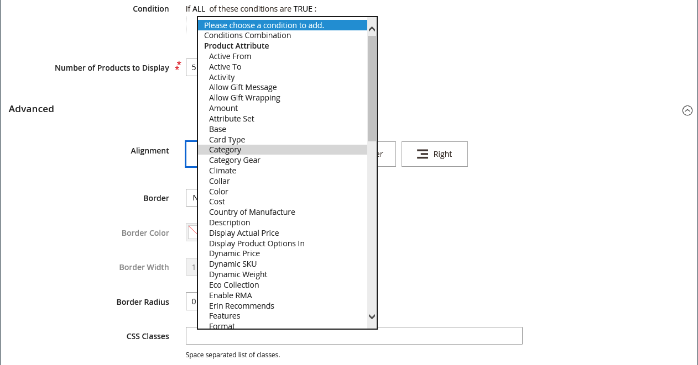
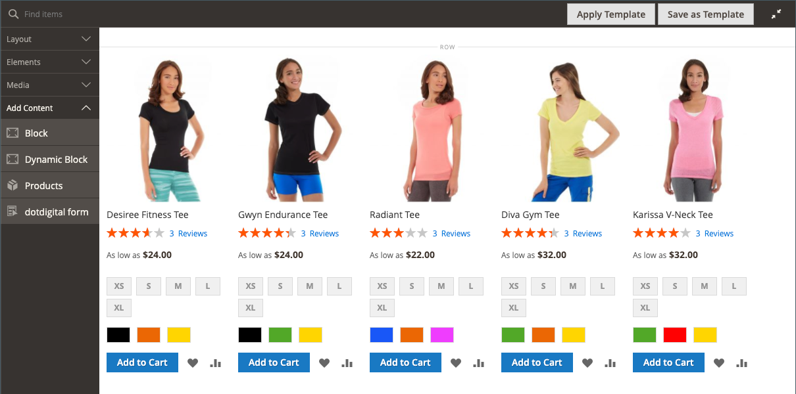
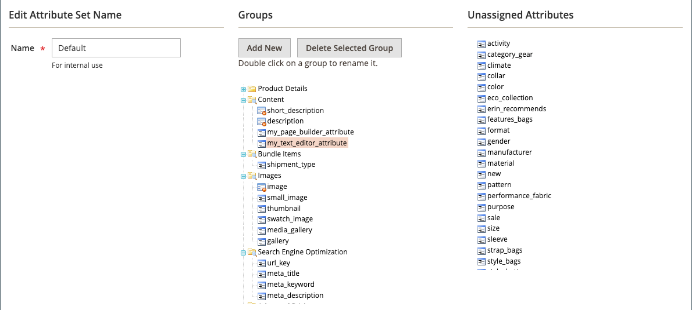

# [!DNL Page Builder] Apresentação parte 3: conteúdo do catálogo

Este exercício demonstra como é fácil adicionar uma lista de produtos a uma página, personalizar páginas de produtos e criar um atributo personalizado que adicione o espaço de trabalho [!DNL Page Builder] a um conjunto de atributos de produto.

{width="600" zoomable="yes"}

Este exercício supõe que você tenha concluído [Parte 1: Página Simples](1-simple-page.md) e [Parte 2: Blocos](2-blocks.md), incluindo os pré-requisitos e os arquivos de exemplo baixados. Siga as três partes deste exercício em ordem.

## Parte 1: Adicionar uma lista de produtos

O [!DNL Page Builder] facilita a adição de uma lista de produtos ao estágio. Neste exemplo, a lista de produtos é adicionada diretamente a uma página.

### Etapa 1: adicionar uma lista de produtos ao estágio

1. Na barra lateral _Admin_, vá para **[!UICONTROL Content]** > _[!UICONTROL Elements]_>**[!UICONTROL Pages]**.

1. Localize a _Página Simples_ que você criou no primeiro exercício e modificou no segundo, e selecione **[!UICONTROL Edit]** na coluna _[!UICONTROL Action]_.

1. Expanda  a seção **[!UICONTROL Content]** e clique em **[!UICONTROL Edit with Page Builder]** ou dentro da área de visualização de conteúdo.

1. No painel [!DNL Page Builder], em _[!UICONTROL Layout]_, arraste uma **[!UICONTROL Row]**para a parte superior do estágio.

1. No painel [!DNL Page Builder], expanda **[!UICONTROL Add Content]** e arraste um espaço reservado **[!UICONTROL Products]** para a nova linha.

   {width="600" zoomable="yes"}

### Etapa 2: compor a condição

1. Passe o mouse sobre o contêiner de produtos vazio para exibir a caixa de ferramentas e escolha o ícone _Configurações_ ( {width="20"} ).

   {width="600" zoomable="yes"}

1. Para **[!UICONTROL Select Products By]**, escolha `Condition`.

1. Adicione uma condição:

   - Clique no ícone _Adicionar_ ().

   - Em _[!UICONTROL Product Attribute]_, escolha **[!UICONTROL Category]**.

     {width="600" zoomable="yes"}

   - Conclua a parte _[!UICONTROL Category is]..._ da condição clicando no ícone Mais (...) e depois no ícone _Seletor_ ().

     {width="600" zoomable="yes"}

   - Na árvore de categorias, vá para a categoria **Mulheres > Primeiros** e marque a caixa de seleção **Árvores**.

     {width="600" zoomable="yes"}

   - Clique no ícone Marca de seleção ().

     A ID de categoria correspondente é exibida no campo para concluir a condição.

### Etapa 3: Concluir as configurações

1. Insira o **[!UICONTROL Number of Products to Display]**.

   Por padrão, a lista exibe cinco produtos.

1. Conclua as configurações restantes conforme necessário.

   Se necessário, use as descrições de campo no final da página [Adicionar conteúdo - Produtos](products.md) para referência.

1. Quando terminar, clique em **[!UICONTROL Save]** para salvar as configurações e retornar ao espaço de trabalho [!DNL Page Builder].

   {width="600" zoomable="yes"}

1. No canto superior direito do estágio, clique no ícone _Fechar Tela cheia_ ( {width="20"} ).

   Clicar nesse ícone retorna à seção _[!UICONTROL Content]_da página com a visualização exibida.

1. No canto superior direito, clique na seta **[!UICONTROL Save]** e escolha **[!UICONTROL Save & Close]**.

## Parte 2: Personalizar a página do produto

>[!NOTE]
>
>Um usuário administrador deve ter [!UICONTROL Content] permissões para seu [escopo de função](../systems/permissions-user-roles.md) para ver os botões [!UICONTROL Edit with Page Builder] e poder usar o Page Builder.

Nesta parte do exercício, você aprenderá como é fácil personalizar uma página de produto ao colocar um vídeo abaixo do conjunto de guias na página do produto. O processo para atualizar o conteúdo da página [categoria](../catalog/categories-content-settings.md) é basicamente o mesmo.

1. Na barra lateral _Admin_, vá para **[!UICONTROL Catalog]** > **[!UICONTROL Products]**.

1. Encontre um produto simples que você pode usar para este exemplo e abra-o no modo de edição.

1. Role para baixo e expanda  na seção **[!UICONTROL Content]**.

1. Ao lado de _[!UICONTROL Description]_, clique em **[!UICONTROL Edit with Page Builder]**.

   {width="600" zoomable="yes"}

   Se a descrição do produto foi inserida anteriormente sem [!DNL Page Builder], a descrição atual aparece como HTML em um contêiner de [Código HTML](html-code.md). Com o tema Luma, a descrição do produto aparece na guia Detail.

1. No painel [!DNL Page Builder], em _[!UICONTROL Layout]_, arraste um **[!UICONTROL Row]**para o estágio, colocando-o abaixo do contêiner de código HTML.

   Procure a diretriz vermelha para aparecer quando a linha estiver na posição correta.

   {width="600" zoomable="yes"}

1. No painel [!DNL Page Builder], expanda **[!UICONTROL Media]** e arraste um espaço reservado **[!UICONTROL Video]** para a nova linha.

   {width="600" zoomable="yes"}

1. Passe o mouse sobre o contêiner de vídeo vazio para exibir a caixa de ferramentas e escolha o ícone _Configurações_ ( {width="20"} ).

   {width="500" zoomable="yes"}

1. Insira o **[!UICONTROL Video URL]**.

   O vídeo pode ser hospedado no [YouTube](https://www.youtube.com/) ou no [Vimeo](https://vimeo.com/). O vídeo deste exemplo pode ser encontrado no YouTube no seguinte URL:

   `https://www.youtube.com/watch?v=ZpFrNyD4100`

   {width="500" zoomable="yes"}

1. Insira o **[!UICONTROL Maximum Width]** em pixels para a exibição do vídeo.

   Se você deixar essa opção em branco, o vídeo preencherá o espaço disponível.

1. Clique em **[!UICONTROL Save]** para salvar as configurações e retornar ao espaço de trabalho [!DNL Page Builder].

   {width="600" zoomable="yes"}

1. No canto superior direito do estágio, clique no ícone _Fechar Tela cheia_ ( {width="20"} ).

   Clicar nesse ícone retorna à seção _[!UICONTROL Content]_da página com a visualização exibida.

1. No canto superior direito, clique na seta **[!UICONTROL Save]** e escolha **[!UICONTROL Save & Close]**.

Na loja, o vídeo é exibido abaixo do conjunto de guias. Para ver a aparência da página em um dispositivo móvel, é possível redimensionar a janela.

{width="600" zoomable="yes"}

**Parabéns!** Você concluiu a segunda parte do tutorial Conteúdo do catálogo. Manter o trabalho criado para que você possa consultá-lo posteriormente.

## Parte 3: Adicionar atributos personalizados

Use o atributo personalizado [!DNL Page Builder] para adicionar um espaço de trabalho [!DNL Page Builder] totalmente funcional a uma página de produto, que você pode usar para criar conteúdo envolvente. Nesta parte do exercício, você aprenderá a criar um atributo personalizado usando o tipo de entrada [!DNL Page Builder] e aplicá-lo às páginas de produto no catálogo. Para obter mais informações sobre esses atributos, consulte [Atributos do produto](../catalog/product-attributes.md).

### Etapa 1: criar um produto

Para evitar alterações na loja em tempo real, crie um produto usando as propriedades descritas.

1. Na barra lateral _Admin_, vá para **[!UICONTROL Catalog]** > **[!UICONTROL Products]**.

1. No canto superior direito, clique em **[!UICONTROL Add Product]**.

1. Crie o produto com as seguintes propriedades:

   - 
     [!UICONTROL Conjunto de atributos]: Default
   - [!UICONTROL Product Name]: Meu produto
   - 
     [!UICONTROL SKU]: Tutorial
   - 
     [!UICONTROL Price]: 75.00
   - 
     [!UICONTROL Quantity]: 100
   - [!UICONTROL Stock Status]: Em Estoque
   - 
     [!UICONTROL Weight]: 1
   - [!UICONTROL Categories]: Mulheres > Topos > Tees

1. No canto superior direito, clique na seta **[!UICONTROL Save]** e escolha **[!UICONTROL Save & Close]**.

### Etapa 2: Criar atributos personalizados

Nesta etapa, você cria dois novos atributos personalizados para mostrar como os tipos de entrada [!DNL Page Builder] e Editor de Texto podem ser usados.

1. Na barra lateral _Admin_, vá para **[!UICONTROL Stores]** > _[!UICONTROL Attributes]_>**[!UICONTROL Product]**.

1. No canto superior direito, clique em **[!UICONTROL Add New Attribute]**.

1. Digite um **[!UICONTROL Default Label]** para o atributo.

   Neste exemplo, use `My Page Builder Attribute` para o rótulo.

1. Defina **[!UICONTROL Catalog Input Type for Store Owner]** como `Page Builder`.

   Ao criar um atributo personalizado, você pode especificar o editor mais adequado para o aplicativo como `Page Builder` ou o padrão, WYSIWYG `Text Editor`.

   ![[!DNL Page Builder] Tipo de entrada](./assets/pb-attribute-page-builder.png){width="600" zoomable="yes"}

1. Expanda  a seção **[!UICONTROL Advanced Attribute Properties]** e faça as seguintes configurações:

   - [!UICONTROL Attribute Code]: Insira um código de atributo em caracteres minúsculos, usando hífens em vez de espaços. Neste exemplo, use `my_page_builder_attribute`.
   - [!UICONTROL Scope]: Aceite o valor padrão, `Store View`.
   - [!UICONTROL Default Value]: Insira um valor padrão para o atributo.
   - 
     [!UICONTROL Unique Value]: `No`
   - 
     [!UICONTROL Add to Column Options]: `No`
   - 
     [!UICONTROL Use in Filter Options]: `Yes`

1. No painel _[!UICONTROL Attribute Information]_à esquerda, escolha **[!UICONTROL Storefront Properties]**e defina as seguintes configurações:

   - 
     [!UICONTROL Use for Promo Rule Conditions]: `Yes`
   - 
     [!UICONTROL Visible on Catalog Pages on Storefront]: `Yes`
   - 
     [!UICONTROL Used in Product Listing]: `Yes`

1. Quando terminar, clique em **[!UICONTROL Save Attribute]**.

1. Repita as etapas anteriores para criar um segundo atributo com as mesmas propriedades básicas, mas com o tipo de entrada Editor de texto da seguinte maneira:

   - [!UICONTROL Default Label]: Meu atributo do editor de texto
   - [!UICONTROL Catalog Input Type for Store Owner]: Editor de texto
   - 
     [!UICONTROL Código de atributo]: `my_text_editor_attribute`

### Etapa 3: atualizar o conjunto de atributos do produto

1. Na barra lateral _Admin_, vá para **[!UICONTROL Stores]** > _[!UICONTROL Attributes]_>**[!UICONTROL Attribute Set]**.

   Neste exemplo, você adiciona temporariamente os novos atributos ao conjunto de atributos `default`. No final deste exercício, remova os atributos do conjunto de atributos para não afetar seu catálogo.

   >[!NOTE]
   >
   >Se você não quiser alterar o armazenamento ao vivo, poderá acompanhar sem atualizar o conjunto de atributos.

1. Localize o conjunto de atributos _[!UICONTROL Default]_na lista e clique duas vezes nele para abri-lo no modo de edição.

1. Na lista _Atributos Não Atribuídos_, encontre os novos atributos criados e arraste cada um para a coluna _[!UICONTROL Groups]_, em **[!UICONTROL Content]**.

   O local do atributo na coluna [!UICONTROL Groups] determina onde ele aparece na página.

   {width="600" zoomable="yes"}

1. Clique em **[!UICONTROL Save]** para retornar à lista de conjuntos de atributos.

1. Quando solicitado, clique no link **[!UICONTROL Cache Management]** na parte superior da página e atualize qualquer cache inválido.

### Etapa 4: atualizar o produto

1. Na barra lateral _Admin_, vá para **[!UICONTROL Catalog]** > **[!UICONTROL Products]**.

1. Na grade Produtos, localize _Meu Produto_ e abra-o no modo de edição.

1. Role para baixo e expanda  na seção **[!UICONTROL Content]**.

   Na parte superior da seção, há dois atributos padrão para o conteúdo do produto:

   - _Descrição curta_, que usa o [editor](../content-design/editor.md) padrão do WYSIWYG.
   - _Descrição_, que exibe a visualização [!DNL Page Builder].

   {width="600" zoomable="yes"}

   À medida que você rolar a tela para a metade inferior da seção, há dois atributos que você criou e atribuiu:

   - _Meu [!DNL Page Builder] Atributo_, que exibe a visualização de [!DNL Page Builder].
   - _Meu Atributo do Editor de Texto_, que usa o editor WYSIWYG padrão.

   {width="600" zoomable="yes"}

1. No editor do **Atributo do Meu Editor de Texto**, digite `Text Editor Attribute placeholder text`.

   - No canto superior direito, clique na seta **[!UICONTROL Save]** e escolha **[!UICONTROL Save & Close]**.

1. Para o **Meu atributo do Page Builder**, clique em **[!UICONTROL Edit with Page Builder]** e adicione o texto da descrição:

   - No painel [!DNL Page Builder], expanda **[!UICONTROL Elements]** e arraste um **[!UICONTROL Text object]** para o estágio.

   - Digite `Page Builder attribute placeholder text`.

   - No canto superior direito do estágio, clique no ícone _Fechar Tela cheia_ ( {width="20"} ).

     {width="600" zoomable="yes"}

1. Role até **[!UICONTROL Description]**, clique em **[!UICONTROL Edit with Page Builder]** e adicione o texto desejado usando o mesmo método da etapa anterior.

1. No canto superior direito da página do produto, clique na seta **[!UICONTROL Save]** e escolha **[!UICONTROL Save & Close]**.

1. Se solicitado, clique no link **[!UICONTROL Cache Management]** na mensagem na parte superior da página e atualize qualquer cache inválido.

### Etapa 5: visualizar o resultado

1. Navegue até a página de exemplo do produto na vitrine.

   Neste exemplo, o produto pode ser encontrado na navegação superior em Mulheres > Topos > Árvores.

1. Role para baixo até as informações do _Meu atributo do Page Builder_.

   A posição dos atributos na página do produto é determinada pelo tema. No tema Luma, os novos atributos estão localizados logo após a descrição do produto.

   ![[!DNL Page Builder] e atributos do Editor de Texto na loja ](./assets/pb-storefront-product-attribute.png){width="600" zoomable="yes"}

Você concluiu o exercício Conteúdo do Catálogo [!DNL Page Builder]. Manter o trabalho criado para que você possa consultá-lo posteriormente.
