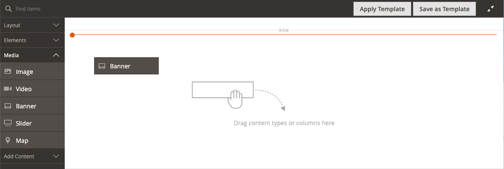

# Mídia - Banner

Use o tipo de conteúdo _Banner_ para adicionar um componente ilustrado e interativo que envolva os usuários com um plano de ação e um botão no [[!DNL Page Builder] estágio](workspace.md#stage).

>[!NOTE]
>
>A opção _Banner_ no menu Conteúdo agora é [Bloco Dinâmico](../content-design/dynamic-blocks.md).

{width="700" zoomable="yes"}

{{$include /help/_includes/page-builder-save-timeout.md}}

## Caixa de ferramentas Banner

A caixa de ferramentas do banner é exibida quando você passa o mouse sobre o container do banner.

{width="600" zoomable="yes"}

| Ferramenta | Ícone | Descrição |
|--- |--- |--- |
| Mover | {width="25"} | Move o banner para outra posição no palco. |
| (rótulo) | Banner | Identifica o contêiner de conteúdo atual como um banner. Passe o mouse sobre o contêiner para ver a caixa de ferramentas. |
| Configurações | {width="25"} | Abre a página Editar banner, onde é possível alterar as propriedades do banner e do container. |
| Ocultar | {width="25"} | Oculta o banner atual. |
| Mostrar | {width="25"} | Mostra o banner oculto. |
| Duplicar | {width="25"} | Faz uma cópia do banner. |
| Remover | {width="25"} | Exclui o banner do estágio. |
| [!UICONTROL Upload New Image] |  | Faz upload de uma imagem do seu sistema de arquivos local para a galeria para o plano de fundo do banner. |
| [!UICONTROL Select from Gallery] |  | Usa uma imagem existente da galeria para o fundo do banner. |

{style="table-layout:auto"}

{{$include /help/_includes/page-builder-hidden-element-note.md}}

## Adicionar um banner

1. No painel [!DNL Page Builder], expanda **[!UICONTROL Media]** e arraste um espaço reservado **[!UICONTROL Banner]** para o estágio.

   {width="600" zoomable="yes"}

   Os botões _[!UICONTROL Upload Image]_&#x200B;e_[!UICONTROL Select from Gallery]_ são incluídos para que você possa fazer alterações rápidas no conteúdo do banner diretamente do palco. Você também pode alterar o conteúdo na página _[!UICONTROL Edit Banner]_.

1. Clique no espaço reservado do banner para exibir o [editor de texto](../content-design/editor.md) e inserir o conteúdo do banner.

   Você também pode incluir conteúdo de banner mais complexo usando as configurações de [Conteúdo](#content).

## Alterar configurações de banner

1. Passe o mouse sobre o contêiner de banner para exibir a caixa de ferramentas e escolher o ícone _Configurações_ ().

1. Use as seguintes seções para obter informações detalhadas sobre a atualização das configurações disponíveis:

   - [[!UICONTROL Appearance]](#appearance)
   - [[!UICONTROL Content]](#content)
   - [[!UICONTROL Background]](#background)
   - [[!UICONTROL Advanced]](#advanced)

1. Quando terminar, clique em **[!UICONTROL Save]** no canto superior direito para fechar a página _[!UICONTROL Edit Banner]_.

1. No canto superior direito, clique em **[!UICONTROL Save]** para aplicar as configurações e retornar ao espaço de trabalho [!DNL Page Builder].

## [!UICONTROL Appearance]

Os banners são fáceis de configurar e manter, pois se baseiam em um dos quatro modelos predefinidos.

- Escolha um dos seguintes tipos de posicionamento de banner:

  | Posicionamento | Descrição |
  | --------- | ----------- |
  | [!UICONTROL Poster] | Centraliza o conteúdo e coloca o botão no banner. A sobreposição, se usada, estende a largura total do banner. |
  | [!UICONTROL Collage Left] | Coloca conteúdo e botão em uma área definida no lado esquerdo do banner. A sobreposição, se usada, cobre somente a área definida. |
  | [!UICONTROL Collage Center] | Coloca conteúdo e botão em uma área definida centralizada no banner. A sobreposição, se usada, cobre somente a área definida. |
  | [!UICONTROL Collage Right] | Coloca conteúdo e botão em uma área definida no lado direito do banner. A sobreposição, se usada, cobre somente a área definida. |

  {style="table-layout:auto"}

  {width="600" zoomable="yes"}

- (Opcional) Insira o **[!UICONTROL Minimum Height]** para a linha.

  A altura mínima pode ser um número com qualquer unidade CSS válida (como `100px`, `50%`, `50em`, `100vh`) ou um cálculo (como `100vh - 237px`).

  Por exemplo, você pode definir a altura mínima de um banner para alongar a altura total da página, fornecendo opções atraentes para imagens e vídeos de fundo de página inteira.

## [!UICONTROL Background]

Há muitas opções para definir a exibição do plano de fundo de um banner. É possível aplicar uma cor simples ou uma imagem de plano de fundo e gerenciar efeitos mais sofisticados.

### [!UICONTROL Background Color]

Especifique a cor do plano de fundo escolhendo uma amostra, clicando no seletor de cores ou inserindo um nome de cor válido ou um valor hexadecimal equivalente. Essa configuração determina a cor do plano de fundo da linha. Também é possível ajustar a opacidade da cor.

{width="200"}

Você pode definir o valor de uma das três formas a seguir:

- Um nome de cor predefinido, como `White`
- O valor de cor hexadecimal da cor, como `#ffffff`
- O valor rgba da cor, com porcentagem de opacidade, como `rgba(255, 255, 255, 0.75)`

Se quiser escolher uma cor, clique na amostra à esquerda da caixa _Sem cor_.

{width="600" zoomable="yes"}

Se você clicar na caixa de cores para abrir o seletor de cores novamente, a caixa abaixo do controle deslizante mostrará os valores atuais de vermelho, verde, azul e alfa (rgba). O último número indica a porcentagem de opacidade atual como um decimal. Você pode usar o controle deslizante para ajustar a opacidade ou inserir o valor decimal desejado.

{width="600" zoomable="yes"}

>[!NOTE]
>
>[!DNL Page Builder] também oferece suporte a uma camada de transparência, ou a um _canal alfa_, em imagens de plano de fundo que podem ser usadas para criar planos de fundo com vários graus de opacidade.

### [!UICONTROL Background Type]

Um tipo de plano de fundo pode ser uma imagem ou um vídeo. O [!DNL Page Builder] assume o padrão `Image` e mostra várias configurações de imagem. Se você selecionar `Video`, o [!DNL Page Builder] trocará as configurações da imagem pelas configurações do vídeo. Ambas as configurações de tipo de plano de fundo são descritas nas seções a seguir.

{width="200"}

### Configurações de tipo de imagem

Se você definir o _Tipo de Plano de Fundo_ como `Image`, use as configurações a seguir para definir a exibição da imagem de plano de fundo.

{width="600" zoomable="yes"}

- **[!UICONTROL Background Image]** - Se necessário, use as ferramentas fornecidas para escolher uma imagem de plano de fundo a ser aplicada ao banner:

  | Ferramenta | Descrição |
  | ---- | ----------- |
  | [!UICONTROL Upload] | Faz upload de um arquivo de imagem de seu computador local para a galeria e o aplica como a imagem de fundo para o banner. |
  | [!UICONTROL Select from Gallery] | Solicita que você escolha uma imagem existente da galeria como imagem de fundo para o banner. |
  | {width="25"} | Permite que você arraste a imagem para o bloco da câmera ou navegue até a imagem no seu sistema de arquivos local. |

  {style="table-layout:auto"}

- **[!UICONTROL Background Mobile Image]** - Se necessário, use as mesmas ferramentas para escolher uma imagem de plano de fundo diferente para ser usada para exibição em dispositivos móveis.

- **[!UICONTROL Background Size]** - Defina esta opção para determinar como a imagem do plano de fundo é dimensionada em relação à largura do banner:

  | Opção | Descrição |
  | ------ | ----------- |
  | `Cover` | A imagem de fundo cobre a largura total do banner. |
  | `Contain` | A imagem de fundo é limitada à largura da área de conteúdo. |
  | `Auto` | Aplica o tamanho da folha de estilos atual. |

  {style="table-layout:auto"}

  {width="200"}

- **[!UICONTROL Background Position]** - Defina esta opção para determinar como a imagem do plano de fundo é ancorada em relação ao banner:

  | Âncora | Posições |
  | ------ | ----------- |
  | `Top` | Esquerda / Centro / Direita |
  | `Center` | Esquerda / Centro / Direita |
  | `Bottom` | Esquerda / Centro / Direita |

  {style="table-layout:auto"}

  O ponto de ancoragem se parece com um pino de pressão que anexa a imagem ao banner na posição de fundo especificada.

- **[!UICONTROL Background Attachment]** - Definir o tipo de anexo para determinar como a imagem de plano de fundo se move em relação à página de rolagem:

  | Opção | Descrição |
  | ------ | ----------- |
  | `Scroll` | A imagem de fundo anexada é sincronizada para se mover para baixo conforme a página rola. |
  | `Fixed` | (Não disponível para dispositivos móveis) A imagem de plano de fundo não se move conforme o contêiner rola pela imagem e é fixada na posição de plano de fundo especificada. |

  {style="table-layout:auto"}

- **[!UICONTROL Background Repeat]** - Se quiser repetir a imagem de fundo para preencher o espaço, altere esta configuração `Yes`.

### Configurações de tipo de vídeo

Se você definir o _[!UICONTROL Background Type]_&#x200B;como `Video`, use as seguintes configurações para definir a exibição da imagem de fundo.

- **[!UICONTROL Video URL]** - Digite uma URL de vídeo válida. Os URLs válidos do vídeo podem ser links para:

   - Vídeos do YouTube: `https://youtu.be/CoDhMRUUjeI`
   - Vídeos do Vimeo: `https://vimeo.com/190156113`
   - Arquivos de vídeo válidos (`.mp4` é recomendado): `https://myvideos.com/spiral.mp4`

  {width="200"}

- **[!UICONTROL Overlay Color]** - Selecione uma cor para aplicar um tom transparente ao vídeo.

- **[!UICONTROL Infinite Loop]** - Defina como `No` para reproduzir o vídeo uma vez e parar. Quando definido como `Yes` (padrão), o vídeo se repete em um loop infinito.

- **[!UICONTROL Lazy Load]** - Defina como `No` para fazer com que o vídeo seja carregado com a página, mesmo quando não estiver visível. Quando definido como `Yes` (padrão), o vídeo é carregado a partir da origem somente quando visível na tela.

- **[!UICONTROL Play Only When Visible]** - Defina como `No` para fazer com que o vídeo comece a ser reproduzido imediatamente após ser carregado, independentemente de estar visível ou não. Quando está definido como `Yes` (padrão), o vídeo começa a ser reproduzido somente quando está visível.

- **[!UICONTROL Fallback Image]** - Se necessário, especifique uma imagem a ser exibida na tela antes do carregamento do vídeo e se ele não for carregado por algum motivo.

## [!UICONTROL Content]

Você pode modificar o conteúdo do banner diretamente no palco ou quando estiver alterando as configurações. As configurações fornecem recursos de conteúdo mais complexos, como links e botões de banner e sobreposições. A posição do conteúdo reflete a configuração de posicionamento [Aparência](#appearance).

### Conteúdo simples no palco

1. Clique no texto do espaço reservado e insira o texto que deseja exibir no banner.

   A barra de ferramentas do editor é exibida acima da caixa de texto.

   {width="600" zoomable="yes"}

1. Use a barra de ferramentas do editor para inserir e formatar texto, bem como inserir elementos, como links, imagens e widgets.

   {width="600" zoomable="yes"}

### Conteúdo complexo nas configurações

1. Passe o mouse sobre o contêiner de banner para exibir a caixa de ferramentas e escolher o ícone _Configurações_ ( {width="25"} ).

1. Role para baixo até a seção _[!UICONTROL Content]_&#x200B;e use o editor **[!UICONTROL Message Text]**&#x200B;para inserir e formatar o texto do banner.

   Você também pode inserir elementos, como links de texto, imagens e widgets.

   {width="600" zoomable="yes"}

1. Se necessário, especifique um **[!UICONTROL Link]** para o banner.

   O link é a página de destino exibida quando o cliente clica no botão ou na área do banner. Você pode usar um dos três tipos de link:

   - **[!UICONTROL URL]** - Links para uma URL relativa ou totalmente qualificada.
   - **[!UICONTROL Product]** - Identifica a página de destino com base no nome do produto ou SKU. Procure o produto por nome com base em um nome parcial ou completo. Escolha o produto na lista de resultados da pesquisa.
   - **[!UICONTROL Category]** - Identifica a página de destino como uma categoria ou subcategoria específica na árvore de categorias. Procure a categoria com base em um nome parcial ou completo. Escolha a categoria na seção expandida da árvore exibida.
   - **[!UICONTROL Page]** - Identifica a página de destino como uma página de conteúdo específica. Procure a página com base em um nome parcial ou completo. Escolha a página na lista de resultados da pesquisa.

   >[!NOTE]
   >
   >A partir da versão 2.4.1, o [!DNL Page Builder] não oferece mais suporte à vinculação do banner e dos links dentro do texto aninhado devido a problemas com a exibição na loja. Se você estiver usando um link no _[!UICONTROL Message Text]_, não poderá configurar a opção&#x200B;_[!UICONTROL Link]_. Se preferir usar um único link para todo o banner, você pode remover todos os links do texto. 
   >
   >{width="200"}

1. Se necessário, adicione um botão para solicitar que os clientes sigam o link.

   A configuração Aparência do banner coloca um único link ou botão abaixo do texto. Complete as propriedades do link ou botão que deseja adicionar.

   {width="600" zoomable="yes"}

   >[!NOTE]
   >
   >Você também pode usar vários botões ou links adicionando um [bloco](block.md) ao banner. Para evitar conflitos, mantenha todos os links ou botões no bloco separado e não adicione um link ou botão diretamente ao banner.

   - Defina **[!UICONTROL Show Button]** como um dos seguintes:

     | Opção | Descrição |
     | ------ | ----------- |
     | `Always` | Um botão sempre aparece no banner. |
     | `On Hover` | Um botão é exibido no banner somente ao passar o mouse. |
     | `Never Show` | Um botão nunca aparece no banner. |

     {style="table-layout:auto"}

   - Digite o **[!UICONTROL Button Text]** a ser exibido no botão.

   - Defina **[!UICONTROL Button Type]** como um dos seguintes:

     | Opção | Descrição |
     | ------ | ----------- |
     | `Primary` | Aplica o estilo de botão primário da folha de estilos atual. |
     | `Secondary` | Aplica o estilo de botão secundário da folha de estilos atual, se aplicável. |
     | `Link` | Cria um hiperlink em vez de um botão. |

     {style="table-layout:auto"}

     O estilo do botão do tema atual determina o formato do botão. Normalmente, um botão principal tem uma cor de fundo mais proeminente do que um botão secundário.

1. Defina **[!UICONTROL Show Overlay]** como um dos seguintes:

   | Opção | Descrição |
   | ------ | ----------- |
   | `Always` | A sobreposição está sempre visível. |
   | `On Hover` | A sobreposição aparece somente ao passar o mouse. |
   | `Never Show` | A sobreposição não está visível. |

   {style="table-layout:auto"}

   Você pode usar uma sobreposição para aplicar uma cor de plano de fundo à área de conteúdo ativa definida pela configuração [!UICONTROL Appearance]. A imagem de fundo do banner permanece visível por toda a largura do banner.

   Se você optar por mostrar uma sobreposição, defina o **[!UICONTROL Overlay Color]**:

   - Clique na amostra **Sem cor** e escolha uma amostra.
   - No campo **Sem Cor**, digite um nome de cor válido ou um valor hexadecimal.

   {width="600" zoomable="yes"}

1. No canto superior direito, clique em **[!UICONTROL Save]** para aplicar as configurações e retornar ao espaço de trabalho [!DNL Page Builder].

   {width="600" zoomable="yes"}

## [!UICONTROL Search Engine Optimization] {#seo}

O texto dessas configurações está visível para mecanismos de pesquisa e melhora a forma como a página é indexada.

- Para **[!UICONTROL Alternative Text]**, insira uma descrição de texto _alt_ para que as ferramentas de acessibilidade digital sejam exibidas.

  O uso do texto alternativo é uma prática recomendada de acessibilidade e é exigido por lei em alguns locais. No HTML, o atributo `alt` é um subconjunto da marca `image`: `<image title="tooltip" alt="description" src="image.jpg">`.

- Para **[!UICONTROL Title Attribute]**, insira o texto a ser exibido como uma dica de ferramenta ao passar o mouse.

  Como prática recomendada, escolha um título descritivo e rico em palavras-chave para melhorar a forma como a imagem é indexada por mecanismos de pesquisa. No HTML, o atributo `title` é um subconjunto da marca `image`: `<image title="tooltip" alt="description" src="image.jpg">`.

## [!UICONTROL Advanced]

1. Para controlar o posicionamento horizontal dos contêineres de conteúdo adicionados ao banner, escolha um **[!UICONTROL Alignment]**:

   | Opção | Descrição |
   | ------ | ----------- |
   | `Default` | Aplica a configuração padrão de alinhamento especificada na folha de estilos do tema atual. |
   | `Left` | Alinha os contêineres de conteúdo na borda esquerda do contêiner de banner, com permissão para qualquer preenchimento especificado. |
   | `Center` | Alinha o contêiner de conteúdo no centro do contêiner de banner, com permissão para qualquer preenchimento especificado. |
   | `Right` | Alinha o contêiner de conteúdo ao longo da borda direita do contêiner de banner, com permissão para qualquer preenchimento especificado. |

   {style="table-layout:auto"}

1. Defina o estilo **[!UICONTROL Border]** aplicado a todos os quatro lados do contêiner de banner:

   | Opção | Descrição |
   | ------ | ----------- |
   | `Default` | Aplica o estilo de borda padrão especificado pela folha de estilos associada. |
   | `None` | Não fornece nenhuma indicação visível das bordas do contêiner. |
   | `Dotted` | A borda do contêiner aparece como uma linha pontilhada. |
   | `Dashed` | A borda do contêiner aparece como uma linha tracejada. |
   | `Solid` | A borda do contêiner aparece como uma linha sólida. |
   | `Double` | A borda do contêiner aparece como uma linha dupla. |
   | `Groove` | A borda do contêiner é exibida como uma linha com ranhura. |
   | `Ridge` | A borda do contêiner aparece como uma linha estriada. |
   | `Inset` | A borda do contêiner aparece como uma linha interna. |
   | `Outset` | A borda do contêiner aparece como uma linha de saída. |

   {style="table-layout:auto"}

1. Se você definir um estilo de borda diferente de `None`, conclua as opções de exibição de borda:

   - **[!UICONTROL Border Color]** - Especifique a cor escolhendo uma amostra, clicando no seletor de cores ou inserindo um nome de cor válido ou um valor hexadecimal equivalente.

     {width="600" zoomable="yes"}

   - **[!UICONTROL Border Width]** - Insira o número de pixels para a largura da linha de borda.

   - **[!UICONTROL Border Radius]** - Insira o número de pixels para definir o tamanho do raio usado para arredondar cada canto da borda.

1. (Opcional) Especifique os nomes de **[!UICONTROL CSS classes]** da folha de estilos atual para aplicar ao contêiner de banner.

   Separe vários nomes de classe com um espaço.

1. Insira valores, em pixels, para que **[!UICONTROL Margins and Padding]** especifique as margens externas e o preenchimento interno do banner.

   Insira cada valor correspondente no diagrama do container de banner.

   | Opção | Descrição |
   | ------ | ----------- |
   | [!UICONTROL Margins] | A quantidade de espaço em branco aplicada à borda externa de todos os lados do container. |
   | [!UICONTROL Padding] | A quantidade de espaço em branco aplicada à borda interna de todos os lados do contêiner. |

   {style="table-layout:auto"}
