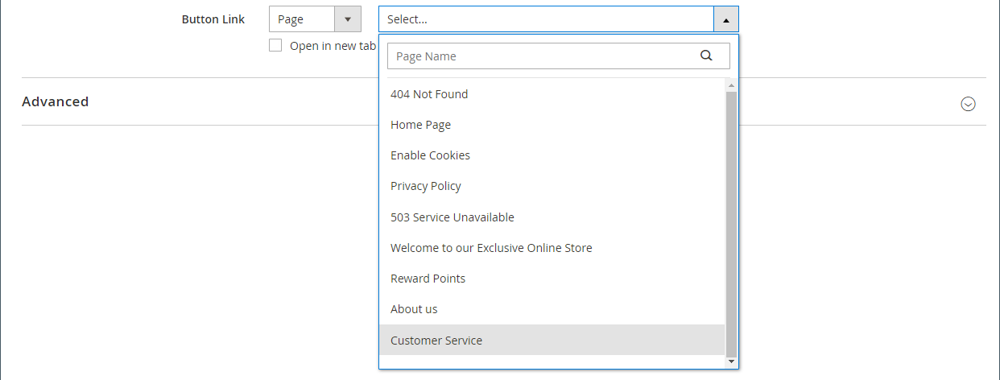
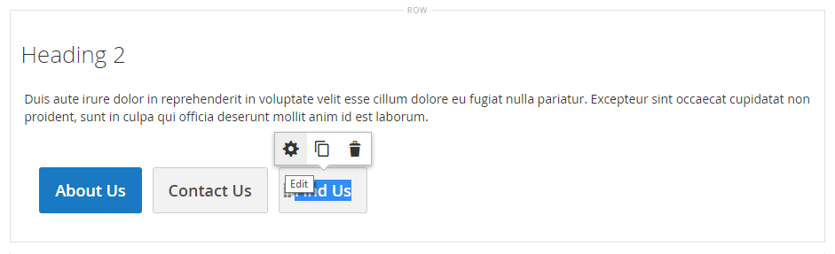

# Elementos - Botões

Use o tipo de conteúdo _Botões_ para adicionar um botão individual ou um conjunto de botões no [[!DNL Page Builder] estágio](workspace.md#stage). Você pode organizar botões horizontal ou verticalmente e adicioná-los diretamente a linhas, colunas, guias e banners no palco.

{width="600" zoomable="yes"}

{{$include /help/_includes/page-builder-save-timeout.md}}

## Toolboxes

Ao trabalhar com o tipo de conteúdo Botões, você adiciona e edita botões individuais e o container de botões que contém um ou mais botões. Cada uma tem sua própria caixa de ferramentas que você usa para criar botões no estágio [!DNL Page Builder].

### Caixa de ferramentas de botão Individual

{width="500" zoomable="yes"}

| Ferramenta | Ícone | Descrição |
| --------- | -------- | -------------- |
| Configurações | {width="25"} | Abre a página Editar Botão, onde é possível alterar as propriedades do botão. |
| Duplicar | {width="25"} | Faz uma cópia do botão. |
| Remover | {width="25"} | Exclui o botão do estágio. |

{style="table-layout:auto"}

### Caixa de ferramentas do contêiner de botões

{width="500" zoomable="yes"}

| Ferramenta | Ícone | Descrição |
| --------- | ----------------- | ----------- |
| Mover | {width="25"} | Move o contêiner de botão para outro local válido na página. |
| Adicionar | {width="25"} | Adiciona um botão ao container. |
| (rótulo) | Botão | Identifica o container atual como um elemento de botão. |
| Configurações | {width="25"} | Abre a página Editar botões, onde é possível alterar as propriedades do container. |
| Ocultar | {width="25"} | Oculta o contêiner do botão. |
| Mostrar | {width="25"} | Mostra o contêiner do botão oculto. |
| Duplicar | {width="25"} | Faz uma cópia do contêiner do botão. |
| Remover | {width="25"} | Exclui o contêiner de botão e seu conteúdo do estágio. |

{style="table-layout:auto"}

{{$include /help/_includes/page-builder-hidden-element-note.md}}

## Adicionar um botão individual

1. No painel [!DNL Page Builder], expanda **[!UICONTROL Elements]** e arraste um espaço reservado **[!UICONTROL Buttons]** para uma linha, coluna ou conjunto de guias no estágio.

   {width="500" zoomable="yes"}

1. Passe o mouse sobre o botão para exibir a caixa de ferramentas e escolha o ícone _Configurações_ ().

1. Digite o **[!UICONTROL Button Text]** a ser exibido no botão.

   {width="600" zoomable="yes"}

1. Defina **[!UICONTROL Button Type]** como um dos seguintes:

   | Tipo | Descrição |
   | ------ | ----------- |
   | `Primary` | Aplica o estilo de botão primário da folha de estilos atual. |
   | `Secondary` | Aplica o estilo de botão secundário da folha de estilos atual, se aplicável. |
   | `Link` | Cria um hiperlink em vez de um botão. |

   {style="table-layout:auto"}

   {width="500" zoomable="yes"}

1. Defina o **[!UICONTROL Button Link]** usando um dos seguintes tipos:

   - **[!UICONTROL URL]** - Insira a URL de destino do link.

     O URL pode ser um link relativo para um produto ou página em sua loja, ou um URL totalmente qualificado.

     Exemplo de URL relativa - `../luma-analog-watch.html`

     Exemplo de URL totalmente qualificado - `http://mystore.com/luma-analog-watch.html`

     Se o link for para um site diferente, é possível manter a página atual aberta na loja abrindo o link em uma nova guia do navegador.

     Para impedir que o visitante saia da sua loja, marque a caixa de seleção **[!UICONTROL Open in new tab]**.

   - **[!UICONTROL Product]** - Digite um nome de produto (parcial ou completo) ou SKU e escolha o nome do produto na lista.

     >[!NOTE]
     >
     >Os produtos são exibidos na lista de acordo com as configurações _Mostrar produtos sem estoque_. Para comerciantes do Multi Source que usam o [Inventory management](../inventory-management/introduction.md), a lista de produtos é limitada pela origem atribuída somente ao site padrão.

     {width="600" zoomable="yes"}

   - **[!UICONTROL Category]** - Insira um nome de categoria (parcial ou completo) ou clique no campo em branco para exibir a árvore de categorias. Em seguida, escolha o nome da categoria na árvore.

     {width="600" zoomable="yes"}

   - **[!UICONTROL Page]** - Insira o nome de uma página do CMS (parcial ou completa) ou clique no campo em branco para exibir a lista completa. Em seguida, escolha o nome da página na lista de resultados da pesquisa.

     {width="600" zoomable="yes"}

1. Conclua as [configurações avançadas][advanced-settings] conforme necessário.

1. Quando terminar, clique em **[!UICONTROL Save]** no canto superior direito para aplicar as configurações e retornar ao espaço de trabalho [!DNL Page Builder].

## Adição de um conjunto de botões

As seções a seguir descrevem uma série de etapas para começar com um botão individual e criar um conjunto de três botões em um contêiner de botão. Se você ainda não tiver um botão individual, siga as instruções anteriores para adicionar um botão individual ao estágio.

### Etapa 1: criar o segundo botão

1. Passe o mouse sobre o contêiner de botões para exibir a caixa de ferramentas e escolha o ícone _Adicionar_ ( {width="20"} ).

   {width="500" zoomable="yes"}

1. Digite o texto que você deseja que apareça no segundo botão.

1. Clique no novo botão para exibir sua caixa de ferramentas e escolha o ícone _Configurações_ ( {width="20"} ).

   {width="500" zoomable="yes"}

1. Defina **[!UICONTROL Button Type]** como `Secondary`.

1. Configure o **[!UICONTROL Button Link]** conforme necessário.

   No exemplo a seguir, o link é uma URL relativa que vai para a página [Fale Conosco](../getting-started/store-details.md#contact-us-form).

   {width="600" zoomable="yes"}

1. Conclua as [configurações avançadas][advanced-settings] conforme necessário.

1. Quando terminar, clique em **[!UICONTROL Save]** para aplicar as configurações e retornar ao espaço de trabalho [!DNL Page Builder].

### Etapa 2: criar o terceiro botão

1. Clique no segundo botão novamente no palco e escolha o ícone _Duplicar_ ( {width="20"} ).

   {width="500" zoomable="yes"}

1. Digite o texto que você deseja que apareça no terceiro botão.

1. Clique no terceiro botão para exibir a caixa de ferramentas e escolha o ícone _Configurações_ ( {width="20"} ).

   {width="500" zoomable="yes"}

1. Atualize o **[!UICONTROL Button Link]** conforme necessário.

1. No canto superior direito, clique em **[!UICONTROL Save]** para aplicar as configurações e retornar ao espaço de trabalho [!DNL Page Builder].

### Etapa 3: atualizar o contêiner de botão

1. Passe o mouse sobre o contêiner de botões para exibir a caixa de ferramentas e escolha o ícone _Configurações_ ( {width="20"} ).

   {width="500" zoomable="yes"}

1. Em _[!UICONTROL Appearance]_, escolha **[!UICONTROL Stacked]**.

1. Defina **[!UICONTROL All Buttons are same size]** como `Yes`.

   {width="300"}

1. Atualize as configurações restantes conforme necessário, usando as descrições de [Alterar configurações de um contêiner de botão][button-container].

1. Quando terminar, clique em **[!UICONTROL Save]** para aplicar as configurações e retornar ao espaço de trabalho [!DNL Page Builder].

   O conjunto completo de botões empilhados aparece no palco, com um botão principal e dois botões secundários.

   {width="500" zoomable="yes"}

## Mover um botão

1. Clique no botão que deseja mover.

1. Selecione e arraste o ícone Mover ( {width="20"} ), que aparece logo antes do texto do botão, para uma nova posição do botão dentro do contêiner do botão.

   {width="500" zoomable="yes"}

## Alterar configurações de um botão

1. Clique no botão no palco para exibir a caixa de ferramentas e escolha o ícone _Configurações_ ( {width="20"} ).

   {width="500" zoomable="yes"}

1. Atualize as configurações padrão conforme necessário.

   - **[!UICONTROL Button Text]** - Insira o texto a ser exibido no botão (também pode ser atualizado diretamente do estágio).

   - **[!UICONTROL Button Type]** - Determina o formato do botão.

     | Tipo | Descrição |
     | ------ | ----------- |
     | `Primary` | Aplica o estilo de botão primário da folha de estilos atual. |
     | `Secondary` | Aplica o estilo de botão secundário da folha de estilos atual, se aplicável. |
     | `Link` | Cria um hiperlink em vez de um botão. |

     {style="table-layout:auto"}

   - **[!UICONTROL Button Link]** - Determina a página de destino a ser apresentada ao clicar no botão.

     | Opção | Descrição |
     | ------ | ----------- |
     | `URL` | Usa um URL relativo ou totalmente qualificado para identificar a página de destino. |
     | `Product` | Identifica a página de destino com base no nome do produto ou SKU. O nome do produto pode ser pesquisado com base em um nome parcial ou completo. O produto é então escolhido na lista de resultados da pesquisa. |
     | `Category` | Identifica a página de destino como uma categoria ou subcategoria específica na árvore de categorias. |
     | `Page` | Identifica a página de destino como uma página específica do CMS. |

     {style="table-layout:auto"}

1. Conclua as [configurações avançadas][advanced-settings] conforme necessário.

1. Para salvar as configurações e retornar ao espaço de trabalho [!DNL Page Builder], clique em **[!UICONTROL Save]** no canto superior direito.

## Alterar configurações de um contêiner de botão

1. Passe o mouse sobre o contêiner de botões para exibir a caixa de ferramentas e escolha o ícone _Configurações_ ( {width="20"} ).

1. Atualize as configurações de **[!UICONTROL Appearance]** conforme necessário.

   - Use as opções de disposição para exibir os botões na horizontal ou na vertical no contêiner:

     | Opção | Descrição |
     | ------ | ----------- |
     | `Inline` | Organiza os botões horizontalmente. |
     | `Stacked` | Organiza os botões verticalmente. |

     {style="table-layout:auto"}

   - Defina a opção **[!UICONTROL All buttons are same size]** de acordo com sua preferência.

     Quando definido como `Yes`, todos os botões no contêiner têm um tamanho consistente, com base no comprimento do texto mais longo do botão.

1. Conclua as [Configurações avançadas][advanced-settings] conforme necessário.

1. Quando terminar, clique em **[!UICONTROL Save]** para aplicar as configurações e retornar ao espaço de trabalho [!DNL Page Builder].

## Alterar configurações avançadas

Você pode modificar as configurações de _[!UICONTROL Advanced]_para botões individuais e para o contêiner de botão.

1. Para controlar o posicionamento no contêiner pai, escolha a **[!UICONTROL Alignment]**:

   | Opção | Descrição |
   | ------ | ----------- |
   | `Default` | Aplica a configuração padrão de alinhamento especificada na folha de estilos do tema atual. |
   | `Left` | Alinha o conteúdo ao longo da borda esquerda do contêiner principal, com permissão para qualquer preenchimento especificado. |
   | `Center` | Alinha o conteúdo no centro do contêiner principal, com permissão para qualquer preenchimento especificado. |
   | `Right` | Alinha o conteúdo ao longo da borda direita do contêiner principal, com permissão para qualquer preenchimento especificado. |

   {style="table-layout:auto"}

1. Defina o estilo **[!UICONTROL Border]** aplicado a todos os quatro lados do botão ou contêiner de botões:

   | Opção | Descrição |
   | ------ | ----------- |
   | `Default` | Aplica o estilo de borda padrão especificado pela folha de estilos associada. |
   | `None` | Não fornece nenhuma indicação visível das bordas do contêiner. |
   | `Dotted` | A borda do contêiner aparece como uma linha pontilhada. |
   | `Dashed` | A borda do contêiner aparece como uma linha tracejada. |
   | `Solid` | A borda do contêiner aparece como uma linha sólida. |
   | `Double` | A borda do contêiner aparece como uma linha dupla. |
   | `Groove` | A borda do contêiner é exibida como uma linha com ranhura. |
   | `Ridge` | A borda do contêiner aparece como uma linha estriada. |
   | `Inset` | A borda do contêiner aparece como uma linha interna. |
   | `Outset` | A borda do contêiner aparece como uma linha de saída. |

   {style="table-layout:auto"}

1. Se você definir um estilo de borda diferente de `None`, conclua as opções de exibição de borda:

   | Opção | Descrição |
   | ------ |------------ |
   | [!UICONTROL Border Color] | Especifique a cor escolhendo uma amostra, clicando no seletor de cores ou inserindo um nome de cor válido ou um valor hexadecimal equivalente. |
   | [!UICONTROL Border Width] | Insira o número de pixels para a largura da linha de borda. |
   | [!UICONTROL Border Radius] | Insira o número de pixels para definir o tamanho do raio usado para arredondar cada canto da borda. |

   {style="table-layout:auto"}

1. (Opcional) Especifique os nomes de **[!UICONTROL CSS classes]** da folha de estilos atual para aplicar ao botão ou contêiner de botões.

   Separe vários nomes de classe com um espaço.

1. Insira valores, em pixels, para que **[!UICONTROL Margins and Padding]** determine as margens externas e o preenchimento interno do botão ou contêiner de botões.

   Insira os valores correspondentes no diagrama.

   | Área de contêiner | Descrição |
   | -------------- | ----------- |
   | [!UICONTROL Margins] | A quantidade de espaço em branco aplicada à borda externa de todos os lados do container. Opções: `Top` / `Right` / `Bottom` / `Left` |
   | [!UICONTROL Padding] | A quantidade de espaço em branco aplicada à borda interna de todos os lados do contêiner. Opções: `Top` / `Right` / `Bottom` / `Left` |

   {style="table-layout:auto"}

[advanced-settings]: #change-advanced-settings
[button-container]: #change-settings-for-a-button-container

<!-- Last updated from includes: 2023-09-11 14:30:19 -->
