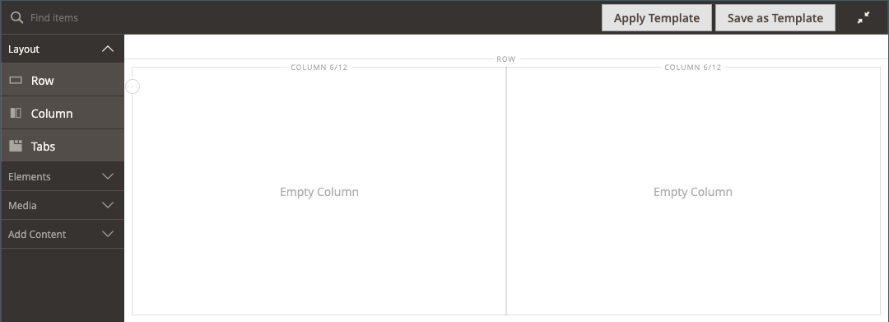
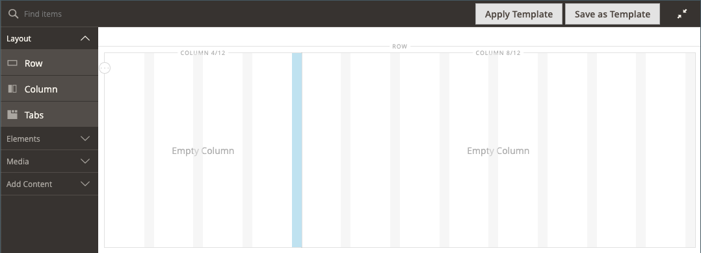

# Layout - Coluna

Use o tipo de conteúdo _Coluna_ para dividir uma página em várias colunas no [[!DNL Page Builder] estágio](workspace.md#stage). Ao adicionar uma coluna a uma linha, tabulação ou diretamente no estágio, o grupo de colunas é inicialmente dividido em duas colunas de igual largura. Você pode adicionar ou remover colunas, conforme necessário. Uma coluna pode ser redimensionada arrastando a borda entre duas colunas. A largura da próxima coluna é ajustada para preencher o espaço disponível na linha, guia ou estágio. Uma única coluna estende a largura total do estágio ou seu container.

{width="600" zoomable="yes"}

{{$include /help/_includes/page-builder-save-timeout.md}}

## Atualizações na versão 2.4.5

Os recursos do Page Builder são atualizados na versão 2.4.5 para que os usuários agora usem o _[!DNL Columns]_&#x200B;como um container principal de colunas individuais. Esse novo container também oferece suporte a propriedades para o plano de fundo e elimina a necessidade de envolver colunas em uma linha. Ela reduz as marcações desnecessárias e oferece um controle mais fino sobre a exibição e a experiência da vitrine.

Você pode alterar o layout do contêiner [!DNL Columns] arrastando uma coluna acima ou abaixo de outras colunas do grupo e empilhando-as. Isso abre uma nova variedade de combinações de layout possíveis que podem ser obtidas sem a necessidade de personalização pelos desenvolvedores.

Assista a este vídeo para obter uma demonstração de como o contêiner [!DNL Columns] pode ser usado para refinar seus layouts de página:

>[!VIDEO](https://video.tv.adobe.com/v/345828?quality=12&learn=on)

## Caixa de ferramentas Coluna

Cada coluna tem uma caixa de ferramentas de opções que aparece quando você passa o mouse sobre o container.

| Ferramenta | Ícone | Descrição |
|--- |--- |--- |
| Mover | {width="25"} | Move a coluna e seu conteúdo para outra posição em relação a outras colunas. |
| (rótulo) | Coluna | Identifica o container atual como uma coluna. Passe o mouse sobre o contêiner da coluna para mostrar a caixa de ferramentas. |
| Configurações | {width="25"} | Abre a página Editar Coluna, onde é possível alterar as propriedades do container. |
| Duplicar | {width="25"} | Faz uma cópia da coluna atual. |
| Remover | {width="25"} | Exclui a coluna atual e seu conteúdo. |

{style="table-layout:auto"}

## Grade de colunas

A [grade](workspace.md) garante que o conteúdo seja alinhado de forma consistente em uma coluna e ajuda a página a ser renderizada corretamente em dispositivos móveis e desktop. Para obter mais informações, consulte a seção [Ferramentas Avançadas de Conteúdo](setup.md) da configuração [!DNL Page Builder].

{width="500" zoomable="yes"}

No exemplo de duas colunas a seguir, os números entre parênteses (6/12) na borda superior de cada contêiner de coluna indicam o número de divisões de grade em cada coluna e o número total de divisões. Nesse caso, a coluna é a largura de seis unidades de grade de um total de 12.

{width="600" zoomable="yes"}

## Adicionar uma coluna

1. No painel [!DNL Page Builder], em _[!UICONTROL Layout]_, arraste uma **[!UICONTROL Column]**&#x200B;para o estágio.

   {width="600" zoomable="yes"}

   O grupo de colunas agora é dividido em duas colunas de igual largura. Cada coluna é um contêiner separado para o conteúdo e tem seu próprio conjunto de opções da caixa de ferramentas.

   {width="600" zoomable="yes"}

1. No canto superior esquerdo do grupo de colunas, clique na ferramenta _Grade_ () e ajuste o tamanho da grade conforme necessário.

   O posicionamento do conteúdo na grade ajuda a alinhar o conteúdo de forma consistente e renderiza a página corretamente em dispositivos móveis e desktop. Para obter mais informações, consulte a seção [Ferramentas Avançadas de Conteúdo](../configuration-reference/general/content-management.md) da configuração [!DNL Page Builder].

   {width="600" zoomable="yes"}

## Redimensionar uma coluna

1. Passe o mouse sobre a borda entre duas colunas.

   A borda é realçada e a caixa de ferramentas da coluna selecionada é exibida.

   {width="600" zoomable="yes"}

1. Mantenha pressionado o botão do mouse para mostrar a grade e arraste a borda para uma nova posição na grade.

   A largura de ambas as colunas é ajustada para refletir a alteração. A nova largura de cada coluna aparece após o rótulo, como `4/12` (quatro de 12) e `8/12` (oito de 12).

   {width="600" zoomable="yes"}

## Remover uma coluna

1. Passe o mouse sobre a coluna que você deseja remover para exibir a caixa de ferramentas e escolha o ícone _Remover_ ( {width="20"} ).

   {width="600" zoomable="yes"}

1. Se a coluna tiver conteúdo, clique em **[!UICONTROL OK]** para confirmar.

   Para acelerar o processo no futuro, você pode ignorar a etapa de confirmação marcando a caixa de seleção **[!UICONTROL Do not show this again]**.

   O grupo de colunas agora tem uma única coluna (12/12) e grade. Como a grade está disponível somente para colunas, você pode usar essa técnica para mostrar a grade.

   {width="600" zoomable="yes"}

1. Se desejar que o grupo de colunas estenda a coluna restante até a largura total da linha ou do estágio:

   - Passe o mouse sobre a coluna para exibir a caixa de ferramentas e escolha o ícone _Configurações_ ( {width="20"} ).

   - Role para baixo até a seção _[!UICONTROL Advanced]_&#x200B;e defina todos os quatro valores de **[!UICONTROL Padding]**&#x200B;como `0`.

     {width="600" zoomable="yes"}

   - No canto superior direito, clique em **[!UICONTROL Save]** para fechar a página _[!UICONTROL Edit Column]_.

1. Clique no ícone _Fechar Tela cheia_ ( {width="20"} ) no canto superior direito do espaço de trabalho e clique em **[!UICONTROL Save]** no canto superior direito.

## Alterar configurações de coluna

1. Passe o mouse sobre a coluna para exibir a caixa de ferramentas e escolha o ícone _Configurações_ ( {width="20"} ).

   {width="600" zoomable="yes"}

1. Altere as configurações de **[!UICONTROL Appearance]** conforme necessário.

   - Escolha a configuração de alinhamento que determina a posição da coluna em relação ao seu contêiner.

     | Opção | Descrição |
     | ------ | ----------- |
     | `Full Height` | A coluna estende a altura total do contêiner. |
     | `Top Aligned` | A coluna é alinhada na parte superior do seu contêiner. |
     | `Centered` | A coluna está centralizada no meio do container. |
     | `Bottom Aligned` | A coluna é alinhada na parte inferior do seu contêiner. |

     {style="table-layout:auto"}

   - Se necessário, insira o **[!UICONTROL Minimum Height]** para a coluna. Por exemplo, você pode definir a altura mínima para corresponder à altura de uma imagem de plano de fundo.

   - Se você definir a altura mínima, defina o **[!UICONTROL Vertical Alignment]** para controlar a posição dos contêineres de conteúdo adicionados à coluna (`Top`, `Center` ou `Bottom`).

1. Altere o plano de fundo do conteúdo da coluna.

   - **[!UICONTROL Background Color]** - Especifique a cor escolhendo uma amostra, clicando no seletor de cores ou inserindo um nome de cor válido ou um valor hexadecimal equivalente. Essa configuração determina a cor de fundo da coluna.

   - **[!UICONTROL Background Image]** - Se necessário, use as ferramentas fornecidas para escolher uma imagem de plano de fundo a ser aplicada à coluna:

     | Ferramenta | Descrição |
     | ------ | ----------- |
     | [!UICONTROL Upload] | Faz upload de um arquivo de imagem do seu computador local para a galeria e o aplica como a imagem de plano de fundo para a coluna. |
     | [!UICONTROL Select from Gallery] | Solicita que você escolha uma imagem existente da galeria como a imagem do plano de fundo para a coluna. |
     | {width="25"} | Permite que você arraste a imagem para o bloco da câmera ou navegue até a imagem no seu sistema de arquivos local. |

     {style="table-layout:auto"}

   - **[!UICONTROL Background Mobile Image]** - Se necessário, use as mesmas ferramentas para escolher uma imagem de plano de fundo diferente para ser usada para exibição em dispositivos móveis.

   - **[!UICONTROL Background Size]** - Altere esta configuração para determinar como a imagem do plano de fundo é dimensionada em relação à largura da coluna:

     | Opção | Descrição |
     | ------ | ----------- |
     | `Cover` | A imagem de plano de fundo cobre a largura total da coluna. |
     | `Contain` | A imagem de fundo é limitada à largura da área de conteúdo. |
     | `Auto` | Aplica o tamanho de plano de fundo padrão especificado na folha de estilos do tema atual. |

     {style="table-layout:auto"}

   - **[!UICONTROL Background Position]** - Altere esta configuração para determinar o ponto de ancoragem da imagem em relação à coluna. Opções: `Top Left`, `Top Center`, `Top Right`, `Center Left`, `Center`, `Center Right`, `Bottom Left`, `Bottom Center` ou `Bottom Right`

   - **[!UICONTROL Background Attachment]** - Altere esta configuração para determinar como a imagem de plano de fundo se move em relação à página de rolagem:

     | Opção | Descrição |
     | ------ | ----------- |
     | `Scroll` | A imagem de fundo é sincronizada para se mover para baixo conforme a página rola. |
     | `Fixed` | (Não disponível para dispositivos móveis) A imagem de plano de fundo não se move conforme o contêiner rola pela imagem e é fixa na posição de plano de fundo especificada. |

     {style="table-layout:auto"}

   - **[!UICONTROL Background Repeat]** - Se quiser repetir a imagem de fundo para preencher o espaço, altere esta configuração `Yes`.

1. Atualize as configurações de _[!UICONTROL Advanced]_&#x200B;conforme necessário.

   - Para controlar o posicionamento horizontal dos contêineres de conteúdo adicionados à coluna, escolha um **[!UICONTROL Alignment]**:

     | Opção | Descrição |
     | ------ | ----------- |
     | `Default` | Aplica a configuração padrão de alinhamento especificada na folha de estilos do tema atual. |
     | `Left` | Alinha os contêineres de conteúdo na borda esquerda do contêiner de coluna, com permissão para qualquer preenchimento especificado. |
     | `Center` | Alinha o contêiner de conteúdo no centro do contêiner de coluna, com permissão para qualquer preenchimento especificado. |
     | `Right` | Alinha o contêiner de conteúdo na borda direita do contêiner de coluna, com permissão para qualquer preenchimento especificado. |

     {style="table-layout:auto"}

   - Defina o estilo **[!UICONTROL Border]**, que é aplicado aos quatro lados do contêiner de coluna:

     | Opção | Descrição |
     | ------ | ----------- |
     | `Default` | Aplica o estilo de borda padrão especificado pela folha de estilos associada. |
     | `None` | Não fornece nenhuma indicação visível das bordas do contêiner. |
     | `Dotted` | A borda do contêiner aparece como uma linha pontilhada. |
     | `Dashed` | A borda do contêiner aparece como uma linha tracejada. |
     | `Solid` | A borda do contêiner aparece como uma linha sólida. |
     | `Double` | A borda do contêiner aparece como uma linha dupla. |
     | `Groove` | A borda do contêiner é exibida como uma linha com ranhura. |
     | `Ridge` | A borda do contêiner aparece como uma linha estriada. |
     | `Inset` | A borda do contêiner aparece como uma linha interna. |
     | `Outset` | A borda do contêiner aparece como uma linha de saída. |

     {style="table-layout:auto"}

   - Se você definir um estilo de borda diferente de `None`, conclua as opções de exibição de borda:

     | Opção | Descrição |
     | ------ |------------ |
     | [!UICONTROL Border Color] | Especifique a cor escolhendo uma amostra, clicando no seletor de cores ou inserindo um nome de cor válido ou um valor hexadecimal equivalente. |
     | [!UICONTROL Border Width] | Insira o número de pixels para a largura da linha de borda. |
     | [!UICONTROL Border Radius] | Insira o número de pixels para definir o tamanho do raio usado para arredondar cada canto da borda. |

     {style="table-layout:auto"}

   - (Opcional) Especifique os nomes de **[!UICONTROL CSS classes]** da folha de estilos atual para aplicar ao contêiner de coluna.

     Separe vários nomes de classe com um espaço.

   - Insira valores, em pixels, para que **[!UICONTROL Margins and Padding]** especifique as margens externas e o preenchimento interno da coluna.

     Insira cada valor correspondente no diagrama do container da coluna.

     | Área de contêiner | Descrição |
     | -------------- | ----------- |
     | [!UICONTROL Margins] | A quantidade de espaço em branco aplicada à borda externa de todos os lados do container. Opções: `Top` / `Right` / `Bottom` / `Left` |
     | [!UICONTROL Padding] | A quantidade de espaço em branco aplicada à borda interna de todos os lados do contêiner. Opções: `Top` / `Right` / `Bottom` / `Left` |

     {style="table-layout:auto"}

1. Quando terminar, clique em **[!UICONTROL Save]** para aplicar as configurações e retornar ao espaço de trabalho [!DNL Page Builder].

<!-- Last updated from includes: 2023-01-19 14:32:13 -->
