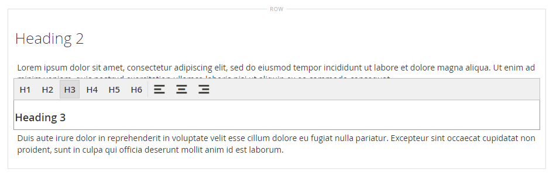

# Elementos - Cabeçalho

Os níveis de cabeçalho estabelecem uma hierarquia que organiza o conteúdo e ajuda os mecanismos de pesquisa a indexarem cada página. Use o _Cabeçalho_ tipo de conteúdo no [[!DNL Page Builder] estágio](workspace.md#stage) para adicionar um contêiner de texto com um nível de cabeçalho de H1 a H6 ao estágio. Os títulos são formatados de acordo com a folha de estilos associada ao tema atual.

A variável [Cabeçalho do conteúdo](workspace.md) no campo _[!UICONTROL Content]_para adicionar um cabeçalho H1 à parte superior da página. No entanto, o campo é um legado do anterior [!DNL Commerce] e é fornecido para oferecer suporte a conteúdo mais antigo. Este campo não aproveita o [!DNL Page Builder]recursos avançados do. É recomendável deixar o campo Cabeçalho do conteúdo em branco e usar a guia [!DNL Page Builder] Tipo de conteúdo de cabeçalho para adicionar cabeçalhos de qualquer nível à página.

O exemplo a seguir mostra como o Cabeçalho de conteúdo e o tipo de conteúdo Cabeçalho aparecem quando formatados pelo tema Luma.

{width="700" zoomable="yes"}

Você pode arrastar um cabeçalho da _Elementos_ seção do [!DNL Page Builder] para uma linha, coluna ou conjunto de guias no palco. O nível de cabeçalho e o alinhamento podem ser controlados na barra de ferramentas do editor no palco ou usando o _Configurações_ ( {width="20"} ) controle.

{{$include /help/_includes/page-builder-save-timeout.md}}

## Editor de cabeçalho

{width="500" zoomable="yes"}

## Caixa de ferramentas do contêiner de cabeçalho

Como em todos os contêineres de conteúdo, a caixa de ferramentas aparece quando você passa o mouse sobre o contêiner.

{width="500" zoomable="yes"}

| Ferramenta | Ícone | Descrição |
| --------- | ----------------- | ---------------------- |
| Mover | {width="25"} | Move o container de cabeçalho para outro local válido na página. |
| (rótulo) | Cabeçalho | Identifica o contêiner atual como um cabeçalho. |
| Configurações | {width="25"} | Abre a página Editar cabeçalho, onde é possível alterar as propriedades do container. |
| Ocultar | {width="25"} | Oculta o contêiner de cabeçalho. |
| Mostrar | {width="25"} | Mostra o contêiner de cabeçalho oculto. |
| Duplicar | {width="25"} | Faz uma cópia do contêiner de cabeçalho. |
| Remover | {width="25"} | Exclui o contêiner de cabeçalho e seu conteúdo do estágio. |

{style="table-layout:auto"}

{{$include /help/_includes/page-builder-hidden-element-note.md}}

## Adicionar um cabeçalho

1. No [!DNL Page Builder] painel, expandir **[!UICONTROL Elements]** e arraste uma **[!UICONTROL Heading]** espaço reservado para uma linha, coluna ou conjunto de guias no estágio.

   {width="600" zoomable="yes"}

1. No editor, insira o texto do cabeçalho sobre `Edit Heading Text` espaço reservado.

   Por padrão, o texto de cabeçalho recebe um tipo de cabeçalho de nível dois (H2).

   {width="500" zoomable="yes"}

1. Na barra de ferramentas, escolha o tipo de cabeçalho apropriado entre H1 e H6.

1. Altere o alinhamento, se necessário.

## Editar configurações de cabeçalho

1. Passe o mouse sobre o container do cabeçalho para exibir a caixa de ferramentas e escolher o _Configurações_ ( {width="20"} ) ícone.

   {width="500" zoomable="yes"}

1. Atualizar o conteúdo do cabeçalho (**[!UICONTROL Heading Type]** e **[!UICONTROL Heading Text]**) se necessário.

   Você também pode atualizar esse conteúdo no editor de cabeçalho.

1. Atualize o _[!UICONTROL Advanced]_conforme necessário.

   - Para controlar o posicionamento do cabeçalho no contêiner pai, escolha uma **[!UICONTROL Alignment]**:

     | Opção | Descrição |
     | ------ | ----------- |
     | `Default` | Aplica a configuração padrão de alinhamento especificada na folha de estilos do tema atual. |
     | `Left` | Alinha a lista ao longo da borda esquerda do contêiner principal, com permissão para qualquer preenchimento especificado. |
     | `Center` | Alinha a lista no centro do contêiner pai, com permissão para qualquer preenchimento especificado. |
     | `Right` | Alinha o bloco ao longo da borda direita do contêiner principal, com permissão para qualquer preenchimento especificado. |

     {style="table-layout:auto"}

   - Defina o **[!UICONTROL Border]** estilo aplicado aos quatro lados do contêiner de cabeçalho:

     | Opção | Descrição |
     | ------ | ----------- |
     | `Default` | Aplica o estilo de borda padrão especificado pela folha de estilos associada. |
     | `None` | Não fornece nenhuma indicação visível das bordas do contêiner. |
     | `Dotted` | A borda do contêiner aparece como uma linha pontilhada. |
     | `Dashed` | A borda do contêiner aparece como uma linha tracejada. |
     | `Solid` | A borda do contêiner aparece como uma linha sólida. |
     | `Double` | A borda do contêiner aparece como uma linha dupla. |
     | `Groove` | A borda do contêiner é exibida como uma linha com ranhura. |
     | `Ridge` | A borda do contêiner aparece como uma linha estriada. |
     | `Inset` | A borda do contêiner aparece como uma linha interna. |
     | `Outset` | A borda do contêiner aparece como uma linha de saída. |

     {style="table-layout:auto"}

   - Se você definir um estilo de borda diferente de `None`, conclua as opções de exibição da borda:

     | Opção | Descrição |
     | ------ |------------ |
     | [!UICONTROL Border Color] | Especifique a cor escolhendo uma amostra, clicando no seletor de cores ou inserindo um nome de cor válido ou um valor hexadecimal equivalente. |
     | [!UICONTROL Border Width] | Insira o número de pixels para a largura da linha de borda. |
     | [!UICONTROL Border Radius] | Insira o número de pixels para definir o tamanho do raio usado para arredondar cada canto da borda. |

     {style="table-layout:auto"}

   - (Opcional) Especifique os nomes dos **[!UICONTROL CSS classes]** na folha de estilos atual para aplicar ao contêiner.

     Separe vários nomes de classe com um espaço.

   - Insira valores, em pixels, para o **[!UICONTROL Margins and Padding]** para determinar as margens externas e o preenchimento interno do contêiner de cabeçalho.

     Insira os valores correspondentes no diagrama.

     | Área de contêiner | Descrição |
     | -------------- | ----------- |
     | [!UICONTROL Margins] | A quantidade de espaço em branco aplicada à borda externa de todos os lados do container. Opções: `Top` / `Right` / `Bottom` / `Left` |
     | [!UICONTROL Padding] | A quantidade de espaço em branco aplicada à borda interna de todos os lados do contêiner. Opções: `Top` / `Right` / `Bottom` / `Left` |

     {style="table-layout:auto"}

1. Quando terminar, clique em **[!UICONTROL Save]** para aplicar as configurações e retornar ao [!DNL Page Builder] espaço de trabalho.

## Duplicar um cabeçalho

Para um cabeçalho formatado com configurações específicas, é mais eficiente duplicar o cabeçalho, em vez de começar novamente com um novo espaço reservado.

1. Passe o mouse sobre o container do cabeçalho para exibir a caixa de ferramentas e escolher o _Duplicar_ ( {width="20"} ) ícone.

   A duplicata é exibida logo abaixo do original.

   {width="500" zoomable="yes"}

1. Passe o mouse sobre o novo container de cabeçalho para exibir a caixa de ferramentas e escolher o _Mover_ ( {width="20"} ) ícone.

   {width="500" zoomable="yes"}

1. Selecione e arraste o cabeçalho até que a linha de guia vermelha marque a nova posição.

   As bordas superior e inferior de cada contêiner são exibidas como linhas tracejadas enquanto o cabeçalho é movido.

   {width="500" zoomable="yes"}

1. Se quiser alterar o nível do cabeçalho, clique no texto do cabeçalho e escolha o novo nível na barra de ferramentas do editor.

   {width="500" zoomable="yes"}
