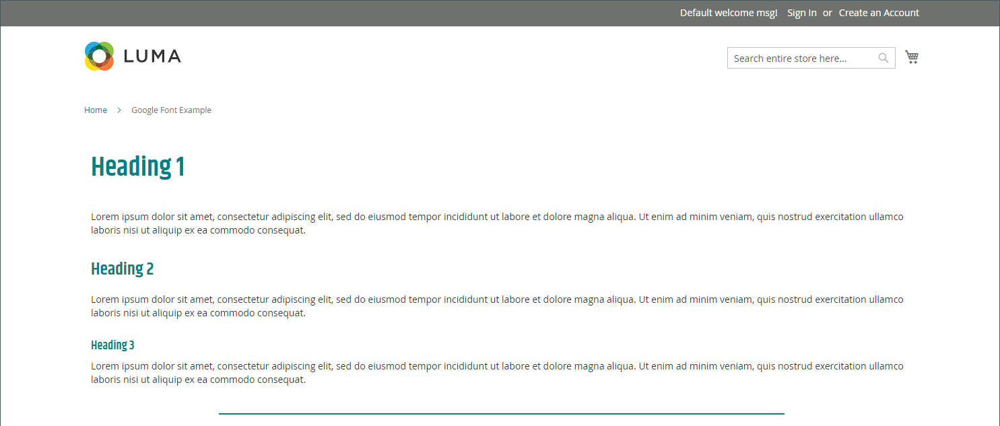

# Elementos - Código HTML

Use o _Código HTML_ tipo de conteúdo para adicionar trechos de código HTML, CSS e JavaScript no [[!DNL Page Builder] estágio](workspace.md#stage). Por exemplo, talvez você queira adicionar um HTML personalizado, declare uma classe CSS que possa ser aplicada a um elemento na página. Ou você pode adicionar um trecho de código para um logotipo, botão ou banner recebido de um provedor de terceiros.

## Caixa de ferramentas Código HTML

{width="500" zoomable="yes"}

| Ferramenta | Ícone | Descrição |
| --------- | ---------- | ----------------- |
| Mover | {width="25"} | Move o contêiner do Código HTML para outro local válido na página. |
| Configurações | {width="25"} | Abre a página Editar código HTML, onde é possível alterar as propriedades do container. |
| Ocultar | {width="25"} | Oculta o contêiner do Código HTML. |
| Mostrar | {width="25"} | Mostra o contêiner de Código HTML oculto. |
| Duplicar | {width="25"} | Faz uma cópia do contêiner do Código HTML. |
| Remover | {width="25"} | Exclui o contêiner do Código HTML e seu conteúdo do estágio. |

{{$include /help/_includes/page-builder-hidden-element-note.md}}

## Adicionar código HTML

O exemplo a seguir demonstra como incorporar [Fonte Google][1] codifica e declara classes de cabeçalho personalizadas que substituem a folha de estilos atual.

### Etapa 1: Escolher uma fonte do Google

1. Visite o [Google Fonts][1] e escolha a família de fontes que deseja usar.

1. Copie o código gerado que deve ser incorporado no `<head>` da página e cole-a temporariamente em um editor de texto.

   - Incorporar código de fonte
   - Regra CSS

1. Adicione a regra de família de fontes a cada classe de cabeçalho, colocando as classes de cabeçalho em uma `<style>` tag.

   Este código é colado em [!DNL Page Builder].

   ```html
   <style>
      h1 {color: teal; font-family: 'Khand', sans-serif; }
      h2 {color: teal; font-family: 'Khand', sans-serif; }
      h3 {color: teal; font-family: 'Khand', sans-serif; }
   </style>
   ```

### Etapa 2: adicionar o código à página

1. No _Admin_ barra lateral da loja, vá para **[!UICONTROL Content]** > _[!UICONTROL Elements]_>**[!UICONTROL Pages]**.

1. Localize a página onde a fonte deve estar disponível e abra-a no modo de edição.

1. Role para baixo e expanda a **[!UICONTROL Content]** seção.

1. No [!DNL Page Builder] painel, expandir **[!UICONTROL Elements]** e arraste um **[!UICONTROL HTML Code]** espaço reservado para uma linha, coluna ou conjunto de guias no estágio.

   Use a diretriz vermelha para posicionar o divisor antes ou depois de outro contêiner de conteúdo no conjunto de linhas, colunas ou guias.

   {width="600" zoomable="yes"}

1. Passe o mouse sobre o contêiner HTML para exibir a caixa de ferramentas e escolher o _Configurações_ ( {width="20"} ), ícone.

1. Na caixa de texto, cole as declarações de código e estilo incorporadas do Google Fonts que você preparou.

   Para facilitar a leitura, você pode digitar alguns espaços para recuar o código.

   {width="500" zoomable="yes"}

1. Atualize as configurações restantes conforme necessário (consulte [Alterar configurações de código HTML](#html-settings) para obter detalhes).

1. No canto superior direito, clique em **[!UICONTROL Save]** para aplicar as configurações e retornar ao [!DNL Page Builder] espaço de trabalho.

   A nova fonte é renderizada quando a página é visualizada em um navegador.

### Etapa 3: visualizar a página

1. No _[!UICONTROL Currently Active]_seção, definir **[!UICONTROL Enable Page]**para `Yes`.

   {width="600" zoomable="yes"}

1. No canto superior direito, clique na guia **[!UICONTROL Save]** seta e escolha **[!UICONTROL Save & Close]**.

1. Localize a página na grade e selecione **[!UICONTROL View]** no _[!UICONTROL Actions]_coluna.

   {width="700" zoomable="yes"}

## Alterar configurações de código HTML {#html-settings}

1. Passe o mouse sobre o contêiner HTML para exibir a caixa de ferramentas e escolher o _Configurações_ ( {width="20"} ) ícone.

1. Na caixa de texto, edite o código conforme necessário.

   Há suporte para HTML, CSS e código JavaScript. Trechos de código que pertencem a `<head>` da página pode ser inserida aqui.

   O editor também fornece botões para inserir elementos especiais no código:

   | Botão | Descrição |
   | ------ | ----------- |
   | Inserir widget... | Clique para inserir um widget na posição do cursor na caixa de texto HTML. |
   | Inserir imagem... | Clique para inserir uma imagem carregada ou uma imagem da Galeria na posição do cursor na caixa de texto HTML. |
   | Inserir variável... | Clique em para inserir uma variável na posição do cursor na caixa de texto HTML. |

1. Atualize o _[!UICONTROL Advanced]_conforme necessário.

   - Para controlar o posicionamento do código no container principal, escolha uma **[!UICONTROL Alignment]**:

     | Opção | Descrição |
     | ------ | ----------- |
     | `Default` | Aplica a configuração padrão de alinhamento especificada na folha de estilos do tema atual. |
     | `Left` | Alinha a lista ao longo da borda esquerda do contêiner principal, com permissão para qualquer preenchimento especificado. |
     | `Center` | Alinha a lista no centro do contêiner pai, com permissão para qualquer preenchimento especificado. |
     | `Right` | Alinha o bloco ao longo da borda direita do contêiner principal, com permissão para qualquer preenchimento especificado. |

     No exemplo a seguir, as opções são definidas para usar um alinhamento central para o bloco de código renderizado.

     {width="600" zoomable="yes"}

   - Defina o **[!UICONTROL Border]** estilo aplicado aos quatro lados do contêiner de código:

     | Opção | Descrição |
     | ------ | ----------- |
     | `Default` | Aplica o estilo de borda padrão especificado pela folha de estilos associada. |
     | `None` | Não fornece nenhuma indicação visível das bordas do contêiner. |
     | `Dotted` | A borda do contêiner aparece como uma linha pontilhada. |
     | `Dashed` | A borda do contêiner aparece como uma linha tracejada. |
     | `Solid` | A borda do contêiner aparece como uma linha sólida. |
     | `Double` | A borda do contêiner aparece como uma linha dupla. |
     | `Groove` | A borda do contêiner é exibida como uma linha com ranhura. |
     | `Ridge` | A borda do contêiner aparece como uma linha estriada. |
     | `Inset` | A borda do contêiner aparece como uma linha interna. |
     | `Outset` | A borda do contêiner aparece como uma linha de saída. |

   - Se você definir um estilo de borda diferente de `None`, conclua as opções de exibição da borda:

     | Opção | Descrição |
     | ------ |------------ |
     | [!UICONTROL Border Color] | Especifique a cor escolhendo uma amostra, clicando no seletor de cores ou inserindo um nome de cor válido ou um valor hexadecimal equivalente. |
     | [!UICONTROL Border Width] | Insira o número de pixels para a largura da linha de borda. |
     | [!UICONTROL Border Radius] | Insira o número de pixels para definir o tamanho do raio usado para arredondar cada canto da borda. |

     {style="table-layout:auto"}

   - (Opcional) Especifique os nomes dos **[!UICONTROL CSS classes]** na folha de estilos atual para aplicar ao contêiner.

     Separe vários nomes de classe com um espaço.

   - Insira valores, em pixels, para o **[!UICONTROL Margins and Padding]** para determinar as margens externas e o preenchimento interno do contêiner de código.

     Insira os valores correspondentes no diagrama.

     | Área de contêiner | Descrição |
     | -------------- | ----------- |
     | [!UICONTROL Margins] | A quantidade de espaço em branco aplicada à borda externa de todos os lados do container. Opções: `Top` / `Right` / `Bottom` / `Left` |
     | [!UICONTROL Padding] | A quantidade de espaço em branco aplicada à borda interna de todos os lados do contêiner. Opções: `Top` / `Right` / `Bottom` / `Left` |

[1]: https://fonts.google.com/
