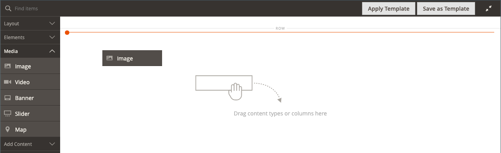

# Mídia - Imagem

Use o _Imagem_ tipo de conteúdo para adicionar uma imagem JPG, GIF ou PNG à [[!DNL Page Builder] estágio](workspace.md#stage). Além da imagem de desktop padrão, você pode especificar uma imagem secundária para dispositivos móveis. Você também pode adicionar uma legenda que aparece abaixo da imagem e vincular a imagem a qualquer URL, produto, categoria ou página.

>[!TIP]
>
>Você pode usar o [Integração do Adobe Stock](../content-design/adobe-stock.md) para encontrar e salvar um ativo apropriado entre os milhões fornecidos pelo [Adobe Stock](https://stock.adobe.com). Consulte [Uso de imagens do Adobe Stock](../content-design/adobe-stock-manage.md) para obter detalhes sobre como pesquisar, refinar e salvar ativos do Adobe Stock na galeria.

{{$include /help/_includes/page-builder-save-timeout.md}}

## Caixa de ferramentas Imagem

A caixa de ferramentas da imagem é exibida ao passar o mouse sobre o container de imagem.

{width="500" zoomable="yes"}

| Ferramenta | Ícone | Descrição |
|--- |--- |--- |
| Mover | {width="25"} | Move a imagem para outra posição no palco. |
| (rótulo) | Imagem | Identifica o container de conteúdo atual como uma imagem. Passe o mouse sobre o contêiner de imagem para ver a caixa de ferramentas. |
| Configurações | {width="25"} | Abre a _Editar imagem_ página, onde é possível alterar as propriedades da imagem e do container. |
| Ocultar | {width="25"} | Oculta a imagem atual. |
| Mostrar | {width="25"} | Mostra a imagem oculta. |
| Duplicar | {width="25"} | Faz uma cópia da imagem. |
| Remover | {width="25"} | Exclui a imagem do estágio. |
| Carregar nova imagem |  | Faz upload de uma imagem do seu sistema de arquivos local para a galeria. |
| Selecionar na Galeria |  | Escolhe uma imagem existente da galeria. |

{style="table-layout:auto"}

{{$include /help/_includes/page-builder-hidden-element-note.md}}

## Adicionar uma imagem

1. No [!DNL Page Builder] painel, expandir **[!UICONTROL Media]** e arraste um **[!UICONTROL Image]** espaço reservado para o contêiner de destino.

   É possível adicionar uma imagem a uma linha, coluna ou guia. No exemplo a seguir, a imagem é arrastada para uma coluna vazia.

   {width="600" zoomable="yes"}

1. Use um dos métodos a seguir para adicionar o ativo de imagem:

   {width="500" zoomable="yes"}

   >[!NOTE]
   >
   >O tamanho máximo do arquivo é 4 MB. Os tipos de arquivos compatíveis são JPG, GIF e PNG.

   - _**Carregar uma nova imagem**_: use esse método para fazer upload de um novo arquivo de imagem do seu sistema.

      - Clique em **[!UICONTROL Upload Image]**.

      - Localize e escolha a imagem para adicioná-la à galeria e ao container de destino.

     Como alternativa, você também pode arrastar um arquivo de imagem de seu sistema e soltá-lo no _Câmera_ ( {width="20"} ) ícone.

   - _**Selecionar um ativo existente**_: use esse método para selecionar um ativo de imagem existente no armazenamento de mídia/galeria.

      - Clique em **[!UICONTROL Select from Gallery]**.

      - Use a árvore para navegar até a imagem.

      - Clique na miniatura e em **[!UICONTROL Add Selected]**.

        {width="600" zoomable="yes"}

   - _**Pesquisar e selecionar uma imagem do Adobe Stock**_: use esse método para localizar uma imagem do Adobe Stock.

     >[!NOTE]
     >
     >Este método requer um [Integração do Adobe Stock](../content-design/adobe-stock.md) configurado para o seu Administrador.

      - Clique em **[!UICONTROL Search Adobe Stock]** e procure uma imagem.

      - Salve a imagem de visualização ou licenciada na galeria.

        Consulte [Uso de imagens do Adobe Stock](../content-design/adobe-stock-manage.md) para obter mais informações sobre como trabalhar com ativos do Adobe Stock.

      - Selecione a miniatura do ativo na galeria e clique em **[!UICONTROL Add Selected]**.

   A imagem é exibida no container de destino no local do espaço reservado. Diferentemente de uma imagem de plano de fundo, você pode mover a imagem para uma posição diferente no contêiner atual ou para um contêiner diferente.

   >[!NOTE]
   >
   >A variável [Banner](banner.md) e [Controle deslizante](slider.md) os tipos de conteúdo também incluem _Fazer upload de imagem_ e _Selecionar na Galeria_ opções para adicionar imagens.

   {width="500" zoomable="yes"}

## Alterar configurações da imagem

1. Passe o mouse sobre o contêiner de imagem para exibir a caixa de ferramentas e escolha a _Configurações_ ({width="20"} ) ícone.
O nome do arquivo, as dimensões e o tamanho do arquivo aparecem abaixo da imagem atual.

   {width="600" zoomable="yes"}

1. Para alterar o atual **[!UICONTROL Image]**, execute um dos procedimentos a seguir:

   - _**Carregar uma nova imagem**_: use esse método para fazer upload de um novo arquivo de imagem do seu sistema.

      - Clique em **[!UICONTROL Upload Image]**.

      - Localize e escolha a imagem para adicioná-la à galeria e ao container de destino.

   - _**Selecionar um ativo existente**_: use esse método para selecionar um ativo de imagem existente no armazenamento de mídia/galeria.

      - Clique em **[!UICONTROL Select from Gallery]**.

      - Use a árvore para navegar até a imagem.

      - Clique na miniatura e em **[!UICONTROL Add Selected]**.

        {width="600" zoomable="yes"}

   - **Pesquisar e selecionar uma imagem do Adobe Stock**: use esse método para localizar uma imagem do Adobe Stock.

     >[!NOTE]
     >
     >Este método requer um [Integração do Adobe Stock](../content-design/adobe-stock.md) configurado para o seu Administrador.

      - Clique em **[!UICONTROL Search Adobe Stock]** e procure uma imagem.

      - Salve a imagem de visualização ou licenciada na galeria.

        Consulte [Uso de imagens do Adobe Stock](../content-design/adobe-stock-manage.md) para obter mais informações sobre como trabalhar com ativos do Adobe Stock.

      - Selecione a miniatura do ativo na galeria e clique em **[!UICONTROL Add Selected]**.

1. Para adicionar um **[!UICONTROL Mobile Image]**, use os mesmos métodos descritos na etapa anterior para selecionar uma imagem a ser usada para exibição em dispositivos móveis.

   {width="600" zoomable="yes"}

1. Se necessário, especifique um **[!UICONTROL Link]** para a imagem.

   O link é a página de destino exibida quando o cliente clica na imagem. Você pode usar um dos três tipos de link:

   - **[!UICONTROL URL]** - Links para um URL relativo ou totalmente qualificado.

   - **[!UICONTROL Product]** - Identifica a página de destino com base no nome do produto ou SKU. Procure o produto por nome com base em um nome parcial ou completo. Escolha o produto na lista de resultados da pesquisa.

     {width="600" zoomable="yes"}

   - **[!UICONTROL Category]** - Identifica a página de destino como uma categoria ou subcategoria específica na árvore de categorias. Procure a categoria com base em um nome parcial ou completo. Escolha a categoria na seção expandida da árvore exibida.

     {width="600" zoomable="yes"}

   - **[!UICONTROL Page]** - Identifica a página de destino como uma página de conteúdo específica. Procure a página com base em um nome parcial ou completo. Escolha a página na lista de resultados da pesquisa.

     {width="600" zoomable="yes"}

   Se quiser impedir que o visitante saia da sua loja, selecione a variável **[!UICONTROL Open in new tab]** caixa de seleção Quando a caixa de seleção é desmarcada, o destino vinculado é aberto na mesma guia do navegador, o que pode efetivamente afastar o visitante da loja.

1. Para adicionar um **[!UICONTROL Image Caption]**, digite o texto que você deseja que apareça abaixo da imagem.

   O formato da legenda é determinado pela folha de estilos associada ao tema atual.

   Normalmente, a legenda aparece abaixo da imagem e fornece informações sobre a imagem para visitantes e mecanismos de pesquisa. Se o site estiver disponível em vários idiomas, você poderá usar a mesma imagem, mas traduzir a legenda. No HTML, a variável `<figcaption>` é um subconjunto de `<figure>` tag. `<figcaption>This is the image caption</figcaption>`

1. Atualize qualquer uma das outras configurações conforme necessário:

   - [Otimização do mecanismo de pesquisa](#search-engine-optimization)
   - [Avançado](#advanced)

1. Quando terminar, clique em **[!UICONTROL Save]** para aplicar as configurações e retornar ao [!DNL Page Builder] espaço de trabalho.

## Mover uma imagem

1. Passe o mouse sobre o contêiner de imagem para exibir a caixa de ferramentas e escolher o _Mover_ ({width="20"} ) ícone.

   {width="500" zoomable="yes"}

1. Selecione e arraste a imagem para a nova posição, logo abaixo da linha de guia vermelha.

   {width="500" zoomable="yes"}

## Remover uma imagem

1. Passe o mouse sobre o contêiner de imagem para exibir a caixa de ferramentas e escolher o _Remover_ ( {width="20"} ) ícone.

1. Quando for solicitada a confirmação, clique em **[!UICONTROL OK]**.

## Otimização do mecanismo de pesquisa

O texto dessas configurações está visível para mecanismos de pesquisa e melhora a forma como a página é indexada.

- Para **[!UICONTROL Alternative Text]**, insira um _alt_ descrição do texto para que as ferramentas de acessibilidade digital sejam exibidas.

  O uso do texto alternativo é uma prática recomendada de acessibilidade e é exigido por lei em alguns locais. No HTML, a variável `alt` atributo é um subconjunto de `image` tag: `<image title="tooltip" alt="description" src="image.jpg">`.

- Para **[!UICONTROL Title Attribute]**, digite o texto a ser exibido como uma dica de ferramenta ao passar o mouse.

  Como prática recomendada, escolha um título descritivo e rico em palavras-chave para melhorar a forma como a imagem é indexada por mecanismos de pesquisa. No HTML, a variável `title` atributo é um subconjunto de `image` tag: `<image title="tooltip" alt="description" src="image.jpg">`.

## [!UICONTROL Advanced]

- Para controlar o posicionamento horizontal das imagens adicionadas ao container, escolha uma **[!UICONTROL Alignment]**.

  | Opção | Descrição |
  | ------ | ----------- |
  | `Default` | Aplica a configuração padrão de alinhamento especificada na folha de estilos do tema atual. |
  | `Left` | Alinha o conteúdo da imagem na borda esquerda do contêiner de imagem, permitindo qualquer preenchimento especificado. |
  | `Center` | Alinha o conteúdo da imagem no centro do contêiner de imagem, permitindo qualquer preenchimento especificado. |
  | `Right` | Alinha o conteúdo da imagem na borda direita do contêiner de imagem, permitindo qualquer preenchimento especificado. |

  {style="table-layout:auto"}

- Defina o **[!UICONTROL Border]** estilo aplicado aos quatro lados do contêiner de imagem:

  | Opção | Descrição |
  | ------ | ----------- |
  | `Default` | Aplica o estilo de borda padrão especificado pela folha de estilos associada. |
  | `None` | Não fornece nenhuma indicação visível das bordas do contêiner. |
  | `Dotted` | A borda do contêiner aparece como uma linha pontilhada. |
  | `Dashed` | A borda do contêiner aparece como uma linha tracejada. |
  | `Solid` | A borda do contêiner aparece como uma linha sólida. |
  | `Double` | A borda do contêiner aparece como uma linha dupla. |
  | `Groove` | A borda do contêiner é exibida como uma linha com ranhura. |
  | `Ridge` | A borda do contêiner aparece como uma linha estriada. |
  | `Inset` | A borda do contêiner aparece como uma linha interna. |
  | `Outset` | A borda do contêiner aparece como uma linha de saída. |

  {style="table-layout:auto"}

- Se você definir um estilo de borda diferente de `None`, conclua as opções de exibição da borda:

  {width="600" zoomable="yes"}

  | Opção | Descrição |
  | ------ |------------ |
  | [!UICONTROL Border Color] | Especifique a cor escolhendo uma amostra, clicando no seletor de cores ou inserindo um nome de cor válido ou um valor hexadecimal equivalente. |
  | [!UICONTROL Border Width] | Insira o número de pixels para a largura da linha de borda. |
  | [!UICONTROL Border Radius] | Insira o número de pixels para definir o tamanho do raio usado para arredondar cada canto da borda. |

  {style="table-layout:auto"}

- (Opcional) Especifique os nomes dos **[!UICONTROL CSS classes]** na folha de estilos atual para aplicar ao contêiner de imagem.

  Separe vários nomes de classe com um espaço.

- Insira valores, em pixels, para o **[!UICONTROL Margins and Padding]** para especificar as margens externas e o preenchimento interno do contêiner de imagem.

  Insira cada valor correspondente no diagrama de contêiner de imagem.

  | Área de contêiner | Descrição |
  | -------------- | ----------- |
  | [!UICONTROL Margins] | A quantidade de espaço em branco aplicada à borda externa de todos os lados do container. |
  | [!UICONTROL Padding] | A quantidade de espaço em branco aplicada à borda interna de todos os lados do contêiner. |

  {style="table-layout:auto"}
