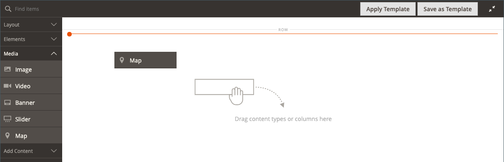

# Mídia - Mapa

Use o tipo de conteúdo _Mapa_ para adicionar um mapa da [[!DNL Google Maps] Plataforma](https://cloud.google.com/maps-platform/) para o [[!DNL Page Builder] estágio](workspace.md#stage). Por exemplo, você pode adicionar um mapa a um bloco e, em seguida, adicionar o bloco às páginas [Sobre Nós](../content-design/pages.md#about-us) e [Fale Conosco](../getting-started/store-details.md#contact-us-form).

Para aproveitar ao máximo a Plataforma [!DNL Google Maps], você pode personalizar o mapa, realçar seus locais de loja e usar o Google [Places](https://cloud.google.com/maps-platform/places/) para adicionar informações avançadas sobre sua loja a todos os [!DNL Google Maps].

## Benefícios da incorporação de um mapa do Google

1. Fornece aos compradores um escopo completo de informações sobre sua empresa (número de telefone, site, avaliações, classificações de estrelas e assim por diante) diretamente no seu site.

1. Um mapa do Google geralmente destaca atrações próximas, parques, restaurantes e assim por diante. Essas informações ajudam os clientes a determinar sua localização física e planejar a viagem.

1. Facilita para os clientes encontrar o endereço de sua loja física sem a necessidade de abrir uma nova janela do navegador e sair do site.

1. Se você tiver uma cadeia de lojas físicas, adicionar um Mapa do Google no seu site ajudará a aumentar a percepção e a credibilidade da sua marca na forma de itens destacados.

{width="700" zoomable="yes"}

{{$include /help/_includes/page-builder-save-timeout.md}}

## Caixa de ferramentas de mapa

A caixa de ferramentas do mapa é exibida quando você passa o mouse sobre o container do mapa.

| Ferramenta | Ícone | Descrição |
|--- |--- |--- |
| Mover | {width="25"} | Move o mapa para outra posição no palco. |
| (rótulo) | [!UICONTROL Map] | Identifica o contêiner de conteúdo atual como um mapa. Passe o mouse sobre o contêiner do mapa para ver a caixa de ferramentas. |
| Configurações | {width="25"} | Abre a página Editar mapa, onde é possível alterar as propriedades do mapa e do container. |
| Ocultar | {width="25"} | Oculta o mapa atual. |
| Mostrar | {width="25"} | Mostra o mapa oculto. |
| Duplicar | {width="25"} | Faz uma cópia do mapa. |
| Remover | {width="25"} | Exclui o mapa do estágio. |

{style="table-layout:auto"}

{{$include /help/_includes/page-builder-hidden-element-note.md}}

## Configurar o [!DNL Google Maps] para o seu administrador

Antes de adicionar um mapa, primeiro abra uma [conta](https://cloud.google.com/maps-platform/user-guide/) para uma avaliação gratuita da Plataforma [!DNL Google Maps]. O teste grátis dura 12 meses e inclui um crédito de 300 dólares. Se você consumir seu crédito, a Google não cobrará sua conta sem sua permissão.

### Etapa 1: Obtenha sua chave de API do [!DNL Google Maps]

Se você já tiver uma chave [!DNL Google Maps], use um dos procedimentos a seguir para obter a chave de API necessária para a configuração. Para configurar uma chave [!DNL Google Maps], você deve ser um administrador do site autorizado a habilitar o faturamento de sua conta. Se você não estiver pronto para configurar uma conta da Plataforma [!DNL Google Maps], ignore esta etapa e use o mapa de espaço reservado por enquanto.

1. Vá para o [Console da Google Cloud Platform](https://cloud.google.com/console/google/maps-apis/overview).

1. Clique na lista suspensa do projeto e selecione ou crie o projeto ao qual deseja adicionar uma chave de API.

1. Para configurar suas credenciais de API, siga as [instruções](https://developers.google.com/maps/documentation/javascript/get-api-key) nas documentações de [!DNL Google Maps].

1. Copie sua chave de API na área de transferência.

### Etapa 2: configurar [!DNL Google Maps] em [!DNL Commerce]

1. Na barra lateral _Admin_, vá para **[!UICONTROL Stores]** > _[!UICONTROL Settings]_>**[!UICONTROL Configuration]**.

1. No painel esquerdo, em _[!UICONTROL General]_, escolha **[!UICONTROL Content Management]**.

1. Expandir  **[!UICONTROL Advanced Content Tools]**.

   {width="600" zoomable="yes"}

   Para obter mais informações sobre as opções de configuração das Ferramentas Avançadas de Gerenciamento de Conteúdo, consulte o [Guia de Referência de Configuração](../configuration-reference/general/content-management.md).

1. Para **[!UICONTROL Google Maps API Key]**, cole a chave que você copiou na etapa 1.

1. Clique em **[!UICONTROL Test Key]**.

   Se houver um problema com sua chave, retorne ao site da Plataforma [!DNL Google Maps] para resolver o problema. Em seguida, tente novamente.

1. Após verificar sua chave, clique em **[!UICONTROL Save Config]**.

## Adicionar um mapa ao estágio

1. Abra a página, o bloco ou o bloco dinâmico no espaço de trabalho [!DNL Page Builder].

1. No painel [!DNL Page Builder], expanda **[!UICONTROL Media]** e arraste um espaço reservado **[!UICONTROL Map]** para o estágio.

   {width="600" zoomable="yes"}

   Se a Plataforma [!DNL Google Maps] estiver configurada para o seu armazenamento, um mapa será exibido para o local do seu armazenamento.

   ![[!DNL Google Maps]](./assets/pb-tutorial2-google-map.png){width="600" zoomable="yes"}

   Se a Plataforma [!DNL Google Maps] ainda não estiver configurada para o armazenamento, será exibido um mapa de espaço reservado.

   ![[!DNL Google Maps] Espaço reservado](./assets/pb-tutorial2-media-map-not-configured.png){width="600" zoomable="yes"}

## Adicionar um local de mapa personalizado

1. Passe o mouse sobre o contêiner do mapa para exibir a caixa de ferramentas e escolha o ícone _Configurações_ ( {width="20"} ).

1. No canto superior direito da página _[!UICONTROL Edit Map]_, clique em **[!UICONTROL Add Location]**.

1. Insira o **[!UICONTROL Location Name]** que você deseja associar ao pin no mapa.

1. Colete as coordenadas de localização que deseja usar para a localização personalizada.

   Como alternativa, na caixa **[!UICONTROL Position]**, você pode arrastar o pino no mapa exibido.

   Se necessário, vá para [[!DNL Google Maps]](https://www.google.com/maps) em uma nova janela de navegador e use um dos seguintes métodos para obter as coordenadas:

   {width="600" zoomable="yes"}

   **Método 1:** Copiar da URL

   - No canto superior esquerdo, digite o endereço na caixa **[!UICONTROL Search]** e clique no ícone _Pesquisar_ ( {width="20"} ).

   - Copie as coordenadas no URL e cole-as em um bloco de notas.

   **Método 2:** Copiar de &quot;O que há aqui?&quot;

   - Clique com o botão direito do mouse no pino vermelho que marca o local no mapa e escolha **[!UICONTROL What's here?]** no menu.

   - No rótulo exibido, copie o texto, incluindo as coordenadas, e cole-o em um bloco de notas.

1. Insira os números, sem a vírgula, em cada uma das caixas **[!UICONTROL Coordinates]**.

   Também é possível inserir o máximo de informações restantes que você deseja que estejam disponíveis no mapa.

1. Preencha quaisquer outras informações que deseja associar ao local do mapa:

   | Opção | Descrição |
   | ------ | ----------- |
   | [!UICONTROL Phone Number] | O número de telefone do local. |
   | [!UICONTROL Street Address] | O endereço do local. |
   | [!UICONTROL City] | A cidade do local. |
   | [!UICONTROL Region/State] | A região ou o estado da localização. |
   | [!UICONTROL Zip/Postal Code] | O CEP do local. |
   | [!UICONTROL Country] | O país do local. |
   | [!UICONTROL Comment] | Todos os comentários que deseja incluir. |

   {style="table-layout:auto"}

1. Quando terminar, clique em **[!UICONTROL Save]**.

   O novo local aparece no mapa e na grade de local do mapa na página _[!UICONTROL Edit Map]_.

   ![[!DNL Page Builder] - mapeia a grade de local](./assets/pb-media-maps-settings-add-location-grid.png){width="600" zoomable="yes"}

## Estilo do mapa {#styling}

Use o Assistente de Estilo de Plataforma [!DNL Google Maps] para aplicar um dos seis temas predefinidos ou criar um tema personalizado. Você pode gerar um arquivo JSON com as propriedades de estilo do mapa ou um link para o mapa estilizado.

### Alterar o estilo do mapa

1. Na barra lateral _Admin_, vá para **[!UICONTROL Stores]** > _[!UICONTROL Settings]_>**[!UICONTROL Configuration]**.

1. No painel esquerdo, em _[!UICONTROL General]_, escolha **[!UICONTROL Content Management]**.

1. Expandir  **[!UICONTROL Advanced Content Tools]**.

1. Na caixa de texto **[!UICONTROL Google Maps Style]**, clique em [Criar Estilo de Mapa](https://mapstyle.withgoogle.com/).

   Esta ação abre o [[!DNL Google Maps] Assistente de Estilos da Plataforma](https://mapstyle.withgoogle.com/) em uma guia separada, na qual você pode definir um estilo para o projeto da Plataforma [!DNL Google Maps].

1. Clique em **[!UICONTROL Create a Style]** e siga as instruções fornecidas.

   Quando terminar, clique em **[!UICONTROL Finish]**.

1. Exporte o estilo concluído como código JSON ou como uma URL para poder adicioná-lo à configuração [!DNL Commerce].

   - **JSON**: abaixo da caixa com o código JSON gerado, clique em **[!UICONTROL Copy JSON]**.

   - **[!UICONTROL URL]**: Abaixo da caixa com a URL gerada, clique em **[!UICONTROL Copy URL]**.

1. Retorne à guia Admin do navegador e cole o código ou URL gerado na caixa **Estilo do Google Maps**.

   Se você estiver usando uma URL, substitua o espaço reservado `YOUR_API_KEY` pela chave de API [!DNL Google Maps]. Esse URL é vinculado ao seu Google Map estilizado.

1. No canto superior direito, clique em **[!UICONTROL Save Config]**.

### Alterar as configurações do mapa

1. Passe o mouse sobre o contêiner do mapa para exibir a caixa de ferramentas e escolha o ícone _Configurações_ ( {width="20"} ).

1. Altere as configurações básicas conforme necessário:

   | Opção | Descrição |
   | ------ | ----------- |
   | [!UICONTROL Height] | Especifica a altura do mapa exibido em pixels. |
   | [!UICONTROL Show Controls] | Determina se os controles padrão do Google Map são exibidos. |

   {style="table-layout:auto"}

1. Modifique as configurações de _[!UICONTROL Advanced]_&#x200B;conforme necessário:

   - Para controlar o posicionamento horizontal do conteúdo do mapa adicionado ao contêiner, escolha um **[!UICONTROL Alignment]**:

     | Opção | Descrição |
     | ------ | ----------- |
     | `Default` | Aplica a configuração padrão de alinhamento especificada na folha de estilos do tema atual. |
     | `Left` | Alinha o conteúdo ao longo da borda esquerda do contêiner do mapa, com permissão para qualquer preenchimento especificado. |
     | `Center` | Alinha o conteúdo no centro do contêiner do mapa, com permissão para qualquer preenchimento especificado. |
     | `Right` | Alinha o conteúdo ao longo da borda direita do contêiner do mapa, com permissão para qualquer preenchimento especificado. |

     {style="table-layout:auto"}

   - Defina o estilo **[!UICONTROL Border]** aplicado a todos os quatro lados do contêiner de mapa:

     | Opção | Descrição |
     | ------ | ----------- |
     | `Default` | Aplica o estilo de borda padrão especificado pela folha de estilos associada. |
     | `None` | Não fornece nenhuma indicação visível das bordas do contêiner. |
     | `Dotted` | A borda do contêiner aparece como uma linha pontilhada. |
     | `Dashed` | A borda do contêiner aparece como uma linha tracejada. |
     | `Solid` | A borda do contêiner aparece como uma linha sólida. |
     | `Double` | A borda do contêiner aparece como uma linha dupla. |
     | `Groove` | A borda do contêiner é exibida como uma linha com ranhura. |
     | `Ridge` | A borda do contêiner aparece como uma linha estriada. |
     | `Inset` | A borda do contêiner aparece como uma linha interna. |
     | `Outset` | A borda do contêiner aparece como uma linha de saída. |

     {style="table-layout:auto"}

   - Se você definir um estilo de borda diferente de `None`, conclua as opções de exibição de borda:

     {width="600" zoomable="yes"}

     | Opção | Descrição |
     | ------ |------------ |
     | [!UICONTROL Border Color] | Especifique a cor escolhendo uma amostra, clicando no seletor de cores ou inserindo um nome de cor válido ou um valor hexadecimal equivalente. |
     | [!UICONTROL Border Width] | Insira o número de pixels para a largura da linha de borda. |
     | [!UICONTROL Border Radius] | Insira o número de pixels para definir o tamanho do raio usado para arredondar cada canto da borda. |

     {style="table-layout:auto"}

   - (Opcional) Especifique os nomes de **[!UICONTROL CSS classes]** da folha de estilos atual para aplicar ao contêiner de mapa.

     Separe vários nomes de classe com um espaço.

   - Insira valores, em pixels, para que **[!UICONTROL Margins and Padding]** especifique as margens externas e o preenchimento interno do contêiner de mapa.

     Insira cada valor correspondente no diagrama do contêiner de mapa.

     | Área de contêiner | Descrição |
     | -------------- | ----------- |
     | [!UICONTROL Margins] | A quantidade de espaço em branco aplicada à borda externa de todos os lados do container. |
     | [!UICONTROL Padding] | A quantidade de espaço em branco aplicada à borda interna de todos os lados do contêiner. |

     {style="table-layout:auto"}

     >[!NOTE]
     >
     >O preenchimento não está disponível para o tipo de conteúdo do Mapa.

1. Quando terminar, clique em **[!UICONTROL Save]** para aplicar as configurações e retornar ao espaço de trabalho [!DNL Page Builder].

### Alterar o tamanho da grade

O tamanho da grade determina o tamanho do mapa relacionado a uma [coluna](column.md) no estágio [!DNL Page Builder]. Por padrão, o mapa tem 12 colunas de largura, com um máximo de 16 colunas.

1. Na barra lateral _Admin_, vá para **[!UICONTROL Stores]** > _[!UICONTROL Settings]_>**[!UICONTROL Configuration]**.

1. No painel esquerdo, em _[!UICONTROL General]_, escolha **[!UICONTROL Content Management]**.

1. Expandir  **[!UICONTROL Advanced Content Tools]**.

1. Atualize as opções de grade conforme necessário:

   >[!NOTE]
   >
   >Se necessário, desmarque a caixa de seleção **[!UICONTROL Use system value]** para modificar essas configurações.

   - Para **[!UICONTROL Default Column Grid Size]**, insira um novo valor para o tamanho padrão da grade.

   - Para **[!UICONTROL Maximum Column Grid Size]**, insira um novo valor para o tamanho de grade máximo padrão.

   {width="600" zoomable="yes"}

1. Quando terminar, clique em **[!UICONTROL Save Config]**.

<!-- Last updated from includes: 2023-09-11 14:30:19 -->
