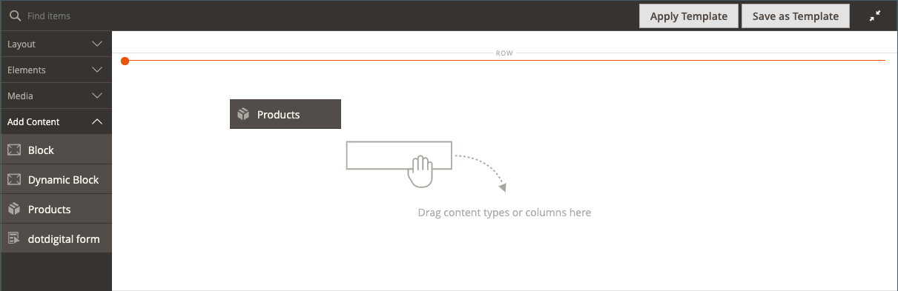

# Adicionar conteúdo - Produtos

Use o tipo de conteúdo _Produtos_ para adicionar uma lista de produtos ao [[!DNL Page Builder] estágio](workspace.md#stage), usando um layout de grade ou carrossel. Use a ferramenta [Adicionar Conteúdo - Bloquear](block.md) para colocar o bloco no estágio [!DNL Page Builder] e, em seguida, colocar uma lista de produtos no bloco. Ou você pode adicionar a lista de produtos diretamente em uma linha em uma página.

## Diretrizes para usar o carrossel de produtos

O carrossel de produtos oferece uma maneira avançada e atraente de exibir seus produtos. Para aproveitar ao máximo o, são recomendadas as seguintes diretrizes:

- Adicione carrosséis de produtos diretamente a contêineres de largura de página, como linhas, guias ou layouts de uma coluna. O uso de layouts de largura de página garante a melhor exibição responsiva de seus produtos. [!DNL Page Builder] reduz o número de produtos exibidos dependendo da largura da página, não da largura do contêiner.

- Não adicione um carrossel de produtos a uma coluna estreita. Como mencionado, o [!DNL Page Builder], por padrão, determina o número de produtos a serem exibidos com base na largura da página, não na largura da coluna.

- Se você quiser que o carrossel de produtos role continuamente, defina **[!UICONTROL Autoplay]** e **[!UICONTROL Infinite Loop]** como `Yes`. Se a Reprodução Automática estiver definida como `Yes`, mas o Loop Infinito estiver definido como `No`, a rolagem automática será interrompida no final da lista de produtos.

- Defina o **[!UICONTROL Carousel Mode]** como `Continuous` para realçar, centralizar e rolar um produto de cada vez dentro do carrossel. Os outros produtos são visíveis na lista, mas transparentes para destacar o produto centralizado.

  {width="600"}

- Para exibir e rolar até cinco produtos de cada vez no carrossel, mantenha o **[!UICONTROL Carousel Mode]** definido como `Default`.

  {width="600"}

As instruções a seguir mostram como adicionar uma lista de produtos a um bloco. Você pode usar um [widget](../content-design/widgets.md) para colocar o bloco em um local específico em qualquer página da sua loja.

{{$include /help/_includes/page-builder-save-timeout.md}}

## Caixa de ferramentas Produtos

| Ferramenta | Ícone | Descrição |
| --------- | ------------- | ----------------- |
| Mover | {width="25"} | Move o contêiner de produtos e seu conteúdo para outra posição no estágio. |
| Configurações | {width="25"} | Abre a página _Editar Produtos_, na qual você pode escolher a lista de produtos e alterar as propriedades do contêiner. |
| Ocultar | {width="25"} | Oculta o container de produtos atual e seu conteúdo. |
| Mostrar | {width="25"} | Mostra o contêiner de produtos ocultos e seu conteúdo. |
| Duplicar | {width="25"} | Faz uma cópia do container de produtos e de seu conteúdo. |
| Remover | {width="25"} | Exclui o contêiner de produtos e seu conteúdo do estágio. |

{style="table-layout:auto"}

{{$include /help/_includes/page-builder-hidden-element-note.md}}

## Criar um bloco de lista de produtos

1. Na barra lateral _Admin_, vá para **[!UICONTROL Content]** > _[!UICONTROL Elements]_>**[!UICONTROL Blocks]**.

1. Clique em **[!UICONTROL Add New Block]**.

1. Insira o **[!UICONTROL Block Title]** e **[!UICONTROL Identifier]**.

1. Escolha o **[!UICONTROL Store View]** onde o bloco deve estar disponível.

1. Role para baixo e clique em **[!UICONTROL Edit with Page Builder]** ou dentro da área de visualização de conteúdo para abrir o espaço de trabalho [!DNL Page Builder].

1. No painel [!DNL Page Builder], expanda **[!UICONTROL Add Content]** e arraste um espaço reservado **[!UICONTROL Products]** para o estágio.

   {width="600" zoomable="yes"}

## Configurar o container da lista de produtos

Passe o mouse sobre o contêiner vazio de _Produtos_ para exibir a caixa de ferramentas e clique no ícone _Configurações_ ({width="20"} ).

{width="500" zoomable="yes"}

Conclua as _Configurações_ de acordo com as seguintes seções:

### Aparência

1. Para determinar como a lista de produtos é exibida na página, escolha um dos tipos de aparência:

   | Tipo | Descrição |
   | ---- | ----------- |
   | Grade de produtos | Exibe os produtos em uma grade que mostra cinco produtos por linha (por padrão), com quantas linhas forem necessárias para exibir o número inserido na configuração **[!UICONTROL Number of Products to Display]**. |
   | Carrossel de produtos | Exibe os produtos em um carrossel (também conhecido como controle deslizante). O carrossel mostra até cinco produtos por slide.   **Alerta de capacidade de resposta**: ao selecionar essa aparência, é melhor adicionar o tipo de conteúdo Produtos diretamente a um layout de linha, guia ou uma coluna em que ele seja responsivo, mostrando menos produtos por lado em telas menores. Se você adicioná-lo a tipos de conteúdo mais estreitos do que a largura da página (como uma coluna estreita), o carrossel exibirá mais produtos por slide do que o container permite, independentemente do tamanho da tela. |

   {style="table-layout:auto"}

   {width="300"}

   Se você escolher o carrossel do produto, também deverá configurar as [Configurações do carrossel](#carousel-settings).

1. Para **[!UICONTROL Select Products By]**, escolha o método de seleção de produto:

   Você pode selecionar seus produtos por categoria, SKU ou condição. Essas opções são mutuamente exclusivas. Por exemplo, você não pode selecionar a opção Categoria, usar o seletor Categoria e alternar para a opção Condição para adicionar algumas condições. Seus produtos são selecionados com base apenas no que você definiu para _uma_ dessas três opções.

   - **[!UICONTROL Category]** - Escolha esta opção para exibir produtos usando uma categoria selecionada.

     {width="500"}

     Quando selecionada, esta opção fornece um seletor **[!UICONTROL Category]**. Clique na seta e faça drill-down para escolher a categoria de produtos a serem exibidos. Por exemplo, nos dados de amostra [!DNL Commerce], o detalhamento e a seleção de _Mulheres > Topos > Árvores_ exibem todos os produtos dessa categoria.

     {width="500"}

   - **[!UICONTROL SKU]** - Escolha esta opção para exibir produtos usando uma ou mais SKUs

     Quando selecionada, essa opção fornece uma caixa de texto **[!UICONTROL Product SKUs]**, onde você deve inserir uma lista separada por vírgulas de SKUs para exibição.

     {width="500"}

   - **[!UICONTROL Condition]** - Escolha esta opção para exibir produtos de acordo com uma ou mais condições definidas.

     Quando selecionada, há ferramentas disponíveis para adicionar condições à seleção de produtos. Por exemplo, você pode selecionar apenas produtos com um Sexo definido como Unisex.

     {width="500"}

     >[!NOTE]
     >
     >Selecionar a opção Categoria ou SKU fornece a opção **[!UICONTROL Sort By]** de `Position`. Com essa opção de classificação, os produtos aparecem na mesma ordem em que aparecem no catálogo. 
     >
     >Para a opção Categoria, a classificação por posição exibe os produtos na mesma ordem em que aparecem no catálogo. Para a opção SKU, a classificação por posição exibe os produtos na ordem em que você os insere na caixa de texto **[!UICONTROL Product SKUs]**.

1. Para **[!UICONTROL Sort By]**, escolha a ordem de classificação dos produtos na lista:

   | Opção | Descrição |
   | ------ | ----------- |
   | `Position` (somente para opções de Categoria e SKU) | Ao selecionar a opção Categoria, a Posição exibe os produtos na mesma ordem de sua posição no catálogo. Quando você seleciona a opção SKU, a Posição exibe os produtos na mesma ordem que os SKUs na caixa de texto SKUs do produto. |
   | `Newest products first` | Classifica os produtos pela data em que foram adicionados ao catálogo, exibindo primeiro os produtos com as datas de entrada mais recentes. |
   | `Oldest products first` | Classifica os produtos pela data em que foram adicionados ao catálogo, exibindo primeiro os produtos com as datas de entrada mais antigas. |
   | `Name: A - Z` | Classifica os produtos em ordem alfabética. |
   | `Name: Z - A` | Classifica produtos em ordem alfabética inversa. |
   | `SKU: ascending` | Classifica produtos por SKU em ordem alfanumérica. |
   | `SKU: descending` | Classifica produtos por SKU em ordem alfanumérica inversa. |
   | `Stock: low stock first` | Classifica produtos do estoque mais baixo para o mais alto disponível. |
   | `Stock: high stock first` | Classifica produtos do estoque mais alto para o mais baixo disponível. |
   | `Price: high to low` | Classifica os produtos do preço mais alto ao mais baixo. |
   | `Price: low to high` | Classifica os produtos do preço mais baixo para o mais alto. |

   {style="table-layout:auto"}

   {width="300"}

1. Insira o **[!UICONTROL Number of Products to Display]** no carrossel ou na grade.

   Os valores podem ser de `1` a `999`. O padrão é `5` para uma grade e `20` para um carrossel.

   >[!NOTE]
   >
   >Alguns produtos nas configurações Categoria, SKU ou Condição podem não aparecer na grade de produtos ou no carrossel. Por exemplo, os produtos com deficiência, os produtos marcados como não visíveis, os produtos indisponíveis e os produtos atribuídos a outro site não são exibidos.

   >[!IMPORTANT]
   >
   >Os preços dos produtos configuráveis, agrupados e agrupados (preço dinâmico) não são definidos no Admin. Portanto, esses produtos não serão exibidos no **[!UICONTROL Preview]** se forem filtrados por preço. Esses produtos não podem ser solicitados corretamente no **[!UICONTROL Preview]** se forem solicitados pelo preço.

### Configurações do carrossel

1. Para determinar como os produtos são exibidos no carrossel, escolha a **[!UICONTROL Carousel Mode]**:

   | Opção | Descrição |
   | ------ | ----------- |
   | `Default` | Por padrão, o carrossel exibe cinco produtos por slide e reduz esse número com agilidade, conforme necessário. |
   | `Continuous` | O carrossel exibe cinco produtos por slide por padrão (com metade de um produto à direita e à esquerda), mas centraliza e rola um produto de cada vez em um loop infinito. Os produtos à direita e à esquerda do produto centralizado ficam esmaecidos para que o produto central fique realçado. |

   {style="table-layout:auto"}

   Se você alternar entre esses dois modos, as outras configurações do carrossel serão mantidas, exceto a configuração **[!UICONTROL Infinite Loop]**, que é sempre definida como `Yes` no modo Contínuo e o campo é desativado.

   {width="600" zoomable="yes"}

1. Se necessário, defina a opção **[!UICONTROL Autoplay]** como `Yes`.

   Quando a reprodução automática está ativada, o carrossel começa a rolar automaticamente quando a página é carregada. Se você deixar a configuração padrão (`No`), o cliente deverá clicar na navegação do slide (pontos ou setas) para exibir cada slide em sequência.

   Se você habilitar este recurso, digite **[!UICONTROL Autoplay Speed]** para especificar o atraso em milissegundos entre cada slide. O valor padrão é `4000` (4 segundos).

1. Se necessário, defina a opção **[!UICONTROL Infinite Loop]** como `Yes`.

   Quando o loop infinito é ativado, a apresentação de slides é reproduzida indefinidamente enquanto a página está aberta. Se você sair da configuração padrão (`No`), a apresentação de slides será reproduzida apenas uma vez.

   >[!NOTE]
   >
   >Se você definir **[!UICONTROL Infinite Loop]** como `No` e **[!UICONTROL Autoplay]** como `Yes`, a reprodução automática será interrompida ao final do número de produtos a serem exibidos.

1. Se necessário, defina a opção **[!UICONTROL Show Arrows]** como `Yes`.

   Quando esta opção está habilitada, cada slide inclui as setas de navegação _próximo_ e _anterior_ nos lados esquerdo e direito. Se você deixar a configuração padrão (`No`), os slides não exibirão setas de navegação.

1. Se necessário, defina a opção **[!UICONTROL Show Dots]** como `No`.

   Quando definido para a configuração padrão (`Yes`), os pontos de navegação são exibidos na parte inferior do controle deslizante do carrossel. Se você desativar essa configuração, o controle deslizante do carrossel não exibirá pontos de navegação.

### Avançado

1. Para controlar o posicionamento da lista Produtos no contêiner pai, escolha a **[!UICONTROL Alignment]**:

   | Opção | Descrição |
   | ------ | ----------- |
   | `Default` | Aplica a configuração padrão de alinhamento especificada na folha de estilos do tema atual. |
   | `Left` | Alinha a lista ao longo da borda esquerda do contêiner principal, com permissão para qualquer preenchimento especificado. |
   | `Center` | Alinha a lista no centro do contêiner pai, com permissão para qualquer preenchimento especificado. |
   | `Right` | Alinha a lista ao longo da borda direita do contêiner principal, com permissão para qualquer preenchimento especificado. |

   {style="table-layout:auto"}

1. Defina o estilo **[!UICONTROL Border]** que é aplicado a todos os quatro lados do contêiner Produtos:

   | Opção | Descrição |
   | ------ | ----------- |
   | `Default` | Aplica o estilo de borda padrão especificado pela folha de estilos associada. |
   | `None` | Não fornece nenhuma indicação visível das bordas do contêiner. |
   | `Dotted` | A borda do contêiner aparece como uma linha pontilhada. |
   | `Dashed` | A borda do contêiner aparece como uma linha tracejada. |
   | `Solid` | A borda do contêiner aparece como uma linha sólida. |
   | `Double` | A borda do contêiner aparece como uma linha dupla. |
   | `Groove` | A borda do contêiner é exibida como uma linha com ranhura. |
   | `Ridge` | A borda do contêiner aparece como uma linha estriada. |
   | `Inset` | A borda do contêiner aparece como uma linha interna. |
   | `Outset` | A borda do contêiner aparece como uma linha de saída. |

   {style="table-layout:auto"}

1. Se você definir um estilo de borda diferente de `None`, conclua as opções de exibição de borda:

   | Opção | Descrição |
   | ------ |------------ |
   | [!UICONTROL Border Color] | Especifique a cor escolhendo uma amostra, clicando no seletor de cores ou inserindo um nome de cor válido ou um valor hexadecimal equivalente. |
   | [!UICONTROL Border Width] | Insira o número de pixels para a largura da linha de borda. |
   | [!UICONTROL Border Radius] | Insira o número de pixels para definir o tamanho do raio usado para arredondar cada canto da borda. |

   {style="table-layout:auto"}

1. (Opcional) Especifique os nomes de **[!UICONTROL CSS classes]** da folha de estilos atual para aplicar ao contêiner.

   Separe vários nomes de classe com um espaço.

1. Insira valores, em pixels, para que **[!UICONTROL Margins and Padding]** determine as margens externas e o preenchimento interno do contêiner Produtos.

   Insira os valores correspondentes no diagrama.

   | Área de contêiner | Descrição |
   | -------------- | ----------- |
   | [!UICONTROL Margins] | A quantidade de espaço em branco aplicada à borda externa de todos os lados do container. Opções: `Top` / `Right` / `Bottom` / `Left` |
   | [!UICONTROL Padding] | A quantidade de espaço em branco aplicada à borda interna de todos os lados do contêiner. Opções: `Top` / `Right` / `Bottom` / `Left` |

## Salvar e visualizar no estágio

No canto superior direito, clique em **[!UICONTROL Save]** para aplicar as configurações e retornar ao espaço de trabalho [!DNL Page Builder].

Se você tiver configurado um carrossel de produtos, ele deverá ser semelhante ao seguinte exemplo:

{width="600"}

Agora você pode usar um [widget](../content-design/widgets.md) para colocar este bloco onde quiser que ele apareça na loja. Ou você pode usar [Adicionar conteúdo - Bloquear](block.md) para adicionar o bloco a uma página, guia ou bloco existente.

<!-- Last updated from includes: 2023-09-11 14:30:19 -->
