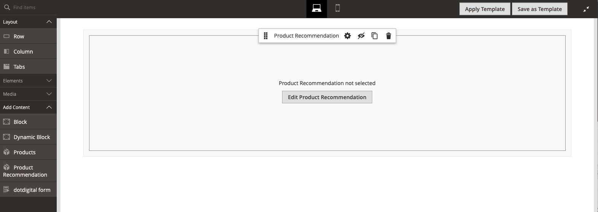

# Adicionar conteúdo - Recomendações de produto

Use o tipo de conteúdo _Recomendações de Produto_ para adicionar uma [unidade de recomendação](https://experienceleague.adobe.com/en/docs/commerce/product-recommendations/admin/create) existente e ativa[[!DNL Page Builder] ao estágio](workspace.md#stage) para uma página, bloco ou bloco dinâmico do CMS.

>[!NOTE]
>
>O tipo de conteúdo [!DNL Page Builder] _Recomendações de Produto_ tem suporte no Adobe Commerce 2.4.4 e posterior e está disponível no [metapackage de Recomendações de Produto versões 3.0.x ou posterior](https://commercemarketplace.adobe.com/magento-product-recommendations.html). Para adicionar o suporte do [!DNL Page Builder] às Recomendações de Produto, [consulte as informações de instalação](https://experienceleague.adobe.com/en/docs/commerce/product-recommendations/getting-started/install-configure). **Este tipo de conteúdo não está disponível para o Magento Open Source.**

{{$include /help/_includes/page-builder-save-timeout.md}}

## Caixa de ferramentas Recomendações de produto

| Ferramenta | Ícone | Descrição |
| --- | --| --- |
| Mover | {width="25"} | Move o container de recomendação do produto e seu conteúdo para outra posição no estágio. |
| Configurações | {width="25"} | Abre a página Editar recomendação do produto, na qual você pode escolher a unidade de recomendação e alterar as propriedades do container. |
| Ocultar | {width="25"} | Oculta o container de recomendação do produto atual e seu conteúdo. |
| Mostrar | {width="25"} | Mostra o contêiner de recomendação do produto oculto e seu conteúdo. |
| Duplicar | {width="25"} | Faz uma cópia duplicada do container de recomendação de produto e de seu conteúdo. |
| Remover | {width="25"} | Exclui o container de recomendação do produto e seu conteúdo do estágio. |

{style="table-layout:auto"}

{{$include /help/_includes/page-builder-hidden-element-note.md}}

## Adicionar uma unidade de recomendação existente

1. Verifique se você já [criou uma unidade de recomendação](https://experienceleague.adobe.com/en/docs/commerce/product-recommendations/admin/create) para o tipo de página [!DNL Page Builder].

>[!NOTE]
>
>Você pode criar unidades de recomendação para o tipo de página [!DNL Page Builder] somente na exibição de armazenamento padrão.

1. Abra a página, o bloco ou o bloco dinâmico no modo de edição.

1. Expanda a seção _[!UICONTROL Content]_e clique em **[!UICONTROL Edit with Page Builder]**ou dentro da área de visualização de conteúdo para abrir o espaço de trabalho [!DNL Page Builder].

1. No painel [!DNL Page Builder], em _[!UICONTROL Layout]_, arraste um espaço reservado **[!UICONTROL Row]**para o estágio.

1. No painel [!DNL Page Builder], em _[!UICONTROL Add Content]_, arraste um espaço reservado **[!UICONTROL Product Recommendation]**para a linha.

   {width="600" zoomable="yes"}

1. Siga um destes procedimentos:

   - Clique em **[!UICONTROL Edit Product Recommendation]**.
   - Passe o mouse sobre o container vazio para exibir a caixa de ferramentas e clique no ícone _Configurações_ ().

   {width="600" zoomable="yes"}

1. Na seção _[!UICONTROL Selection]_, clique em **[!UICONTROL Select]**.

1. Na lista de recomendações de produtos ativas, localize a linha com a unidade de recomendação que deseja adicionar e clique em **[!UICONTROL Select]** na última coluna.

   {width="600" zoomable="yes"}

1. No canto superior direito, clique em **[!UICONTROL Add Selected]**.

   O nome da recomendação de produto selecionada aparece na seção _[!UICONTROL Selection]_da página_[!UICONTROL Edit Product Recommendation]_.

1. Faça as alterações necessárias nas [Configurações avançadas](#advanced-settings).

   {width="600" zoomable="yes"}

1. Quando terminar, faça o seguinte:

   - Ao trabalhar com uma janela de navegador totalmente maximizada, clique no ícone _Fechar Tela cheia_ () no canto superior direito do espaço de trabalho.

   - Clique em **[!UICONTROL Save]** para aplicar as configurações e retornar ao espaço de trabalho [!DNL Page Builder].

   Ao retornar ao estágio, as imagens de espaço reservado do produto são exibidas no contêiner.

## Editar configurações de unidade de recomendação

1. Passe o mouse sobre o contêiner da unidade de recomendação para exibir a caixa de ferramentas e clique no ícone _Configurações_ ().

   {width="600" zoomable="yes"}

1. Faça as alterações necessárias nas [Configurações avançadas](#advanced-settings).

1. Quando terminar, clique em **[!UICONTROL Save]** para aplicar as configurações e retornar ao espaço de trabalho [!DNL Page Builder].

## Duplicar uma unidade de recomendação

1. Passe o mouse sobre o contêiner da unidade de recomendação para exibir a caixa de ferramentas e clique no ícone _Duplicar_ () na caixa de ferramentas.

   A duplicata é exibida logo abaixo do original.

1. Para mover a unidade de recomendação duplicada para uma nova posição, passe o mouse sobre o contêiner e clique no ícone _Mover_ () na caixa de ferramentas.

1. Selecione e arraste a unidade de recomendação até que a diretriz vermelha apareça na nova posição.

   As bordas superior e inferior de cada contêiner são exibidas como linhas tracejadas enquanto a unidade de recomendação é movida.

## Remover uma unidade de recomendação do estágio

1. Passe o mouse sobre o contêiner da unidade de recomendação e clique no ícone _Remover_ ( ) na caixa de ferramentas.

1. Quando for solicitada a confirmação, clique em **[!UICONTROL OK]**.

## Configurações avançadas

1. Para controlar o posicionamento da unidade de Recomendações de Produto no contêiner pai, escolha a **[!UICONTROL Alignment]**:

   | Opção | Descrição |
   | ------ | ----------- |
   | `Default` | Aplica a configuração padrão de alinhamento especificada na folha de estilos do tema atual. |
   | `Left` | Alinha a unidade ao longo da borda esquerda do contêiner pai, com permissão para qualquer preenchimento especificado. |
   | `Center` | Alinha a unidade no centro do contêiner pai, com permissão para qualquer preenchimento especificado. |
   | `Right` | Alinha a unidade ao longo da borda direita do contêiner pai, com permissão para qualquer preenchimento especificado. |

   {style="table-layout:auto"}

1. Defina o estilo **[!UICONTROL Border]** que é aplicado aos quatro lados da unidade de Recomendações de Produto:

   | Opção | Descrição |
   | ------ | ----------- |
   | `Default` | Aplica o estilo de borda padrão especificado pela folha de estilos associada. |
   | `None` | Não fornece nenhuma indicação visível das bordas unitárias. |
   | `Dotted` | A borda da unidade aparece como uma linha pontilhada. |
   | `Dashed` | A borda da unidade aparece como uma linha tracejada. |
   | `Solid` | A borda da unidade aparece como uma linha sólida. |
   | `Double` | A borda da unidade aparece como uma linha dupla. |
   | `Groove` | A borda da unidade aparece como uma linha entalhada. |
   | `Ridge` | A borda da unidade aparece como uma linha cortada. |
   | `Inset` | A borda da unidade aparece como uma linha interna. |
   | `Outset` | A borda da unidade aparece como uma linha de saída. |

   {style="table-layout:auto"}

1. Se você definir um estilo de borda diferente de `None`, conclua as opções de exibição de borda:

   | Opção | Descrição |
   | ------ |------------ |
   | [!UICONTROL Border Color] | Especifique a cor escolhendo uma amostra, clicando no seletor de cores ou inserindo um nome de cor válido ou um valor hexadecimal equivalente. |
   | [!UICONTROL Border Width] | Insira o número de pixels para a largura da linha de borda. |
   | [!UICONTROL Border Radius] | Insira o número de pixels para definir o tamanho do raio usado para arredondar cada canto da borda. |

   {style="table-layout:auto"}

1. (Opcional) Especifique os nomes de **[!UICONTROL CSS classes]** da folha de estilos atual para aplicar à unidade.

   Separe vários nomes de classe com um espaço.

1. Insira valores, em pixels, para que **[!UICONTROL Margins and Padding]** determine as margens externas e o preenchimento interno da unidade.

   Insira os valores correspondentes no diagrama.

   | Área de contêiner | Descrição |
   | ------ | ----------- |
   | [!UICONTROL Margins] | A quantidade de espaço em branco aplicada à borda externa de todos os lados da unidade. Opções: `Top` / `Right` / `Bottom` / `Left` |
   | [!UICONTROL Padding] | A quantidade de espaço em branco aplicada à borda interna de todos os lados da unidade. Opções: `Top` / `Right` / `Bottom` / `Left` |

   {style="table-layout:auto"}

<!-- Last updated from includes: 2023-09-11 14:30:19 -->
