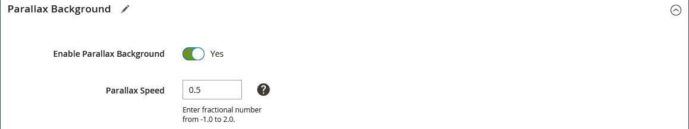

# Layout - Linha

Use o _Linha_ tipo de conteúdo para adicionar uma linha no [[!DNL Page Builder] estágio](workspace.md#stage).

{{$include /help/_includes/page-builder-save-timeout.md}}

## Caixa de ferramentas Linha

A caixa de ferramentas da linha é exibida quando você passa o mouse sobre o contêiner de linha. A caixa de ferramentas inclui opções para mover, ocultar, duplicar, editar ou remover a linha. A seleção de configurações determina a aparência, o plano de fundo e o layout da linha. Os elementos de conteúdo adicionais podem ser arrastados para a linha do [!DNL Page Builder] à esquerda.

{width="600" zoomable="yes"}

| Ferramenta | Ícone | Descrição |
| --------- | ---------- | ----------- |
| Mover | {width="25"} | Move a linha para outra posição em relação a outras linhas no palco. |
| (rótulo) | [!UICONTROL Row] | Identifica o contêiner de conteúdo atual como uma linha. Passe o mouse sobre o contêiner para ver a caixa de ferramentas. |
| Configurações | {width="25"} | Abre a página Editar linha, onde é possível alterar as propriedades do container. |
| Ocultar | {width="25"} | Oculta a linha atual. |
| Mostrar | {width="25"} | Mostra a linha oculta. |
| Duplicar | {width="25"} | Faz uma cópia da linha. |
| Remover | {width="25"} | Exclui o contêiner de linha e seu conteúdo do estágio. |

{style="table-layout:auto"}

{{$include /help/_includes/page-builder-hidden-element-note.md}}

## Adicionar uma linha

1. No [!DNL Page Builder] painel em _[!UICONTROL Layout]_, arraste um novo **[!UICONTROL Row]**para o estágio, logo abaixo da primeira linha.

1. Para formatar a linha, passe o mouse sobre o contêiner de linha para exibir a caixa de ferramentas e escolher o _Configurações_ ( {width="20"} ) ícone.

   Use as seções a seguir para obter informações detalhadas sobre como concluir as configurações disponíveis.

   {width="600" zoomable="yes"}

## Alterar configurações de linha

1. Passe o mouse sobre o contêiner de linha para exibir a caixa de ferramentas e escolher o _Configurações_ ( {width="20"} ) ícone.

   {width="600" zoomable="yes"}

1. Use as seções a seguir para obter informações detalhadas sobre como atualizar as configurações disponíveis.

1. Quando terminar, clique em **[!UICONTROL Save]** para aplicar as configurações e retornar ao [!DNL Page Builder] espaço de trabalho.

## Aparência

Use o _Aparência_ para determinar como o conteúdo é exibido na linha.

{width="600" zoomable="yes"}

- Para determinar como a cor e/ou a imagem do plano de fundo aparecem em relação ao contêiner e à largura da área de conteúdo, escolha o alinhamento:

  | Opção | Descrição |
  | ------ | ----------- |
  | [!UICONTROL Contained] | A cor ou imagem do plano de fundo é limitada à largura máxima da página definida pelo tema. |
  | [!UICONTROL Full Width] | Limita o conteúdo à largura máxima da página definida pelo tema. A cor e/ou imagem do plano de fundo não é limitada e estende a largura total da linha. |
  | [!UICONTROL Full Bleed] | O conteúdo e a imagem e/ou cor do plano de fundo não são limitados e estendem a largura total da linha. A &#39;Sangria total&#39; pode ser usada somente com [temas](../content-design/themes.md) que suportam o layout. |

  {style="table-layout:auto"}

- Insira o **[!UICONTROL Minimum Height]** para a linha. Esse valor pode ser um número com qualquer unidade CSS válida (como `100px`, `50%`, `50em`, `100vh`) ou um cálculo (como `100vh - 237px`).

  Por exemplo, você pode definir a altura mínima de uma linha para alongar a altura total da página, fornecendo opções atraentes para imagens e vídeos de fundo de página inteira.

- Escolha um **[!UICONTROL Vertical Alignment]** configuração para alinhar qualquer contêiner de conteúdo adicionado à linha (Superior, Centro ou Inferior).

## Histórico

Há muitas opções para definir a exibição do plano de fundo de uma linha. É possível aplicar uma cor simples ou uma imagem de plano de fundo e gerenciar efeitos mais sofisticados.

### Cor do plano de fundo

Especifique a cor do plano de fundo escolhendo uma amostra, clicando no seletor de cores ou inserindo um nome de cor válido ou um valor hexadecimal equivalente. Essa configuração determina a cor do plano de fundo da linha. Também é possível ajustar a opacidade da cor.

{width="200"}

Você pode definir o valor de uma das três formas a seguir:

- Um nome de cor predefinido, como `White`
- O valor de cor hexadecimal da cor, como `#ffffff`
- O valor rgba da cor, com porcentagem de opacidade, como `rgba(255, 255, 255, 0.75)`

Se quiser escolher uma cor, clique na amostra à esquerda do _Sem cor_ caixa.

{width="600" zoomable="yes"}

Se você clicar na caixa de cores para abrir o seletor de cores novamente, a caixa abaixo do controle deslizante mostrará os valores atuais de vermelho, verde, azul e alfa (rgba). O último número indica a porcentagem de opacidade atual como um decimal. Você pode usar o controle deslizante para ajustar a opacidade ou inserir o valor decimal desejado.

{width="600" zoomable="yes"}

>[!NOTE]
>
>[!DNL Page Builder] também suporta uma camada de transparência, ou _canal alfa_, em imagens de plano de fundo que podem ser usadas para criar planos de fundo com vários graus de opacidade.

### [!UICONTROL Background Type]

Um tipo de plano de fundo pode ser uma imagem ou um vídeo. [!DNL Page Builder] toma como padrão `Image` e mostra várias configurações de imagem. Se você selecionar `Video`, [!DNL Page Builder] troca as configurações da imagem pelas configurações do vídeo. Ambos os tipos de plano de fundo são descritos a seguir.

{width="200"}

### Configurações de tipo de imagem

Se você definir a variável _[!UICONTROL Background Type]_para `Image`, use as configurações a seguir para definir a exibição da imagem de fundo.

{width="600" zoomable="yes"}

- **[!UICONTROL Background Image]** - Se necessário, use as ferramentas fornecidas para escolher uma imagem de plano de fundo a ser aplicada à linha:

  | Opção | Descrição |
  | ------ | ----------- |
  | [!UICONTROL Upload] | Faz upload de um arquivo de imagem do seu computador local para a galeria e o aplica como a imagem de plano de fundo para a linha. |
  | [!UICONTROL Select from Gallery] | Solicita que você escolha uma imagem existente da galeria como a imagem do plano de fundo para a linha. |
  | {width="25"} | Permite que você arraste a imagem para o bloco da câmera ou navegue até a imagem no seu sistema de arquivos local. |

  {style="table-layout:auto"}

- **[!UICONTROL Background Mobile Image]** - Se necessário, use as mesmas ferramentas para escolher uma imagem de fundo diferente para ser usada para exibição em dispositivos móveis.

- **[!UICONTROL Background Size]** - Defina esta opção para determinar como a imagem do plano de fundo é dimensionada em relação à largura da linha:

  | Opção | Descrição |
  | ------ | ----------- |
  | `Cover` | A imagem de plano de fundo cobre a largura total da linha. |
  | `Contain` | A imagem de fundo é limitada à largura da área de conteúdo. |
  | `Auto` | Aplica o tamanho da folha de estilos atual. |

  {style="table-layout:auto"}

  {width="250"}

- **[!UICONTROL Background Position]** - Defina esta opção para determinar como a imagem do plano de fundo é ancorada em relação à linha:

  | Ponto de ancoragem | Position |
  | ------ | ----------- |
  | `Top` | Esquerda / Centro / Direita |
  | `Center` | Esquerda / Centro / Direita |
  | `Bottom` | Esquerda / Centro / Direita |

  {style="table-layout:auto"}

  O ponto de ancoragem se parece com um pino de pressão que anexa a imagem à linha na posição de fundo especificada.

- **[!UICONTROL Background Attachment]** - Defina o tipo de anexo para determinar como a imagem do plano de fundo se move em relação à página de rolagem:

  | Opção | Descrição |
  | ------ | ----------- |
  | `Scroll` | A imagem de fundo anexada é sincronizada para se mover para baixo conforme a página rola. Use Plano de fundo paralaxe para controlar a velocidade de rolagem. |
  | `Fixed` | (Não disponível para dispositivos móveis) A imagem de plano de fundo não se move conforme o contêiner rola pela imagem e é fixada na posição de plano de fundo especificada. |

  {style="table-layout:auto"}

- **[!UICONTROL Background Repeat]** - Defina como `Yes` para repetir a imagem de plano de fundo para preencher o espaço disponível na linha.

### Configurações de tipo de vídeo

Se você definir a variável _Tipo de plano de fundo_ para `Video`, use as configurações a seguir para definir a exibição da imagem de fundo.

- **[!UICONTROL Video URL]** - Digite um URL de vídeo válido. Os URLs válidos do vídeo podem ser links para:

   - Vídeos do YouTube: `https://youtu.be/CoDhMRUUjeI`
   - Vídeos do Vimeo: `https://vimeo.com/190156113`
   - Arquivos de vídeo válidos (`.mp4` é recomendado): `https://myvideos.com/spiral.mp4`

  {width="300"}

- **[!UICONTROL Overlay Color]** - Selecione uma cor para aplicar um tom transparente ao vídeo.

- **[!UICONTROL Infinite Loop]** - Defina como `No` para que o vídeo seja reproduzido uma vez e interrompido. Quando essa opção estiver definida como `Yes` (padrão), o vídeo se repete em um loop infinito.

- **[!UICONTROL Lazy Load]** - Defina como `No` para fazer com que o vídeo seja carregado com a página, mesmo quando não estiver visível. Quando essa opção estiver definida como `Yes` (padrão), o vídeo é carregado a partir da origem somente quando visível na tela.

- **[!UICONTROL Play Only When Visible]** - Defina como `No` para fazer com que o vídeo comece a ser reproduzido imediatamente depois de ser carregado, independentemente de estar visível. Quando essa opção estiver definida como `Yes` (padrão), o vídeo começa a ser reproduzido somente quando está visível.

- **[!UICONTROL Fallback Image]** - Se necessário, especifique uma imagem a ser exibida na tela antes do vídeo ser carregado e se o vídeo não for carregado por algum motivo.

## Plano de fundo do Parallax

Use essas opções para controlar a velocidade de uma imagem ou vídeo de plano de fundo de rolagem em relação à rolagem da página. O plano de fundo pode ser definido para rolar mais lentamente para criar uma sensação de imersão.

- Definir **Ativar plano de fundo do Parallax** para `Yes`.
- Insira o **Velocidade da paralaxe** como um valor decimal entre `-1.0` e `2.0`.

{width="600" zoomable="yes"}

## Avançado

- Para controlar o posicionamento horizontal dos contêineres de conteúdo adicionados à linha, escolha uma **[!UICONTROL Alignment]**:

  | Opção | Descrição |
  | ------ | ----------- |
  | `Default` | Aplica a configuração padrão de alinhamento especificada na folha de estilos do tema atual. |
  | `Left` | Alinha os contêineres de conteúdo na borda esquerda do contêiner de linha, com permissão para qualquer preenchimento especificado. |
  | `Center` | Alinha o contêiner de conteúdo no centro do contêiner de linha, com permissão para qualquer preenchimento especificado. |
  | `Right` | Alinha o contêiner de conteúdo na borda direita do contêiner de linha, com permissão para qualquer preenchimento especificado. |

  {style="table-layout:auto"}

- Defina o **[!UICONTROL Border]** estilo aplicado aos quatro lados do contêiner de linha:

  | Opção | Descrição |
  | ------ | ----------- |
  | `Default` | Aplica o estilo de borda padrão especificado pela folha de estilos associada. |
  | `None` | Não fornece nenhuma indicação visível das bordas do contêiner. |
  | `Dotted` | A borda do contêiner aparece como uma linha pontilhada. |
  | `Dashed` | A borda do contêiner aparece como uma linha tracejada. |
  | `Solid` | A borda do contêiner aparece como uma linha sólida. |
  | `Double` | A borda do contêiner aparece como uma linha dupla. |
  | `Groove` | A borda do contêiner é exibida como uma linha com ranhura. |
  | `Ridge` | A borda do contêiner aparece como uma linha estriada. |
  | `Inset` | A borda do contêiner aparece como uma linha interna. |
  | `Outset` | A borda do contêiner aparece como uma linha de saída. |

  {style="table-layout:auto"}

- Se você definir um estilo de borda diferente de `None`, conclua as opções de exibição da borda:

  {width="600" zoomable="yes"}

  | Opção | Descrição |
  | ------ |------------ |
  | [!UICONTROL Border Color] | Especifique a cor escolhendo uma amostra, clicando no seletor de cores ou inserindo um nome de cor válido ou um valor hexadecimal equivalente. |
  | [!UICONTROL Border Width] | Insira o número de pixels para a largura da linha de borda. |
  | [!UICONTROL Border Radius] | Insira o número de pixels para definir o tamanho do raio usado para arredondar cada canto da borda. |

  {style="table-layout:auto"}

  A linha no exemplo a seguir tem um raio de borda de 15.

  {width="500"}

- (Opcional) Especifique os nomes dos **[!UICONTROL CSS classes]** na folha de estilos atual para aplicar ao contêiner de linha.

  Separe vários nomes de classe com um espaço.

- Insira valores, em pixels, para o **[!UICONTROL Margins and Padding]** para especificar as margens externas e o preenchimento interno da linha.

  Insira cada valor correspondente no diagrama de contêiner de linha.

  | Área de contêiner | Descrição |
  | -------------- | ----------- |
  | [!UICONTROL Margins] | A quantidade de espaço em branco aplicada à borda externa de todos os lados do container. Opções: `Top` / `Right` / `Bottom` / `Left` |
  | [!UICONTROL Padding] | A quantidade de espaço em branco aplicada à borda interna de todos os lados do contêiner. Opções: `Top` / `Right` / `Bottom` / `Left` |

  {style="table-layout:auto"}

  {width="600" zoomable="yes"}
