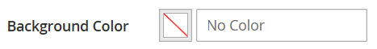
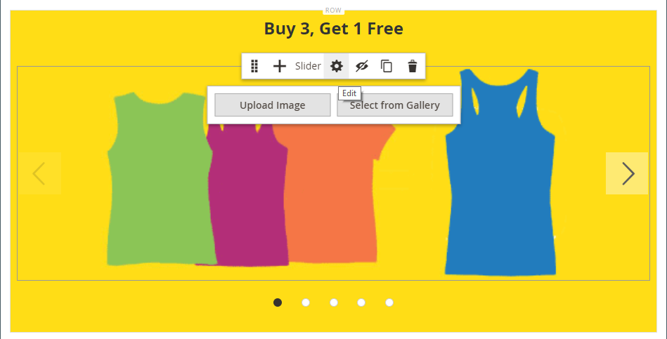

# Media - Slider

Use o tipo de conteúdo _Controle Deslizante_ para adicionar uma apresentação de slides de imagens ao [[!DNL Page Builder] estágio](workspace.md#stage). Você pode fazer upload de novas imagens ou escolher imagens existentes na galeria ou no catálogo de produtos. Um controle deslizante pode ser configurado para ser reproduzido automaticamente ou ser controlado manualmente com botões de navegação. Para associar o controle deslizante a uma promoção específica, consulte [Bloco Dinâmico](dynamic-block.md).

{width="700" zoomable="yes"}

{{$include /help/_includes/page-builder-save-timeout.md}}

## Toolboxes

Ao trabalhar com o tipo de conteúdo Controle deslizante, você adiciona e edita slides individuais e o contêiner do controle deslizante que contém um ou mais slides. Cada slide tem sua própria caixa de ferramentas que você usa para criar slides no estágio [!DNL Page Builder].

## Caixa de ferramentas de slide individual

{width="500" zoomable="yes"}

| Ferramenta | Ícone | Descrição |
|--- |--- |--- |
| Mover | {width="25"} | Move o slide para outra posição no controle deslizante. |
| (rótulo) | Slide # | Identifica o número do slide atual. |
| Configurações | {width="25"} | Abre a página _[!UICONTROL Edit Slide]_, na qual você pode alterar as propriedades do slide atual. |
| Duplicar | {width="25"} | Faz uma cópia do slide atual. |
| Remover | {width="25"} | Exclui o slide atual do controle deslizante. |

{style="table-layout:auto"}

## Caixa de ferramentas do controle deslizante

| Ferramenta | Ícone | Descrição |
|--- |--- |--- |
| Mover | {width="25"} | Move o controle deslizante para outra posição no palco. |
| (rótulo) | [!UICONTROL Slider] | Identifica o contêiner do controle deslizante. |
| Configurações | {width="25"} | Abre a página _[!UICONTROL Edit Slider]_, na qual você pode alterar as propriedades do vídeo e do container. |
| Ocultar | {width="25"} | Oculta o controle deslizante atual. |
| Mostrar | {width="25"} | Mostra a barra oculta. |
| Duplicar | {width="25"} | Faz uma cópia do controle deslizante. |
| Remover | {width="25"} | Exclui o controle deslizante do estágio. |

{style="table-layout:auto"}

{{$include /help/_includes/page-builder-hidden-element-note.md}}

## Adicionar um slide individual

1. Abra a página, o bloco ou o bloco dinâmico em que deseja colocar o controle deslizante e expanda a seção **[!UICONTROL Content]**.

1. No painel [!DNL Page Builder], expanda **[!UICONTROL Media]** e arraste um espaço reservado **[!UICONTROL Slider]** para uma linha, coluna ou guia no estágio.

   No exemplo a seguir, a cor de fundo da linha é amarela (`#fffd16`).

   {width="600" zoomable="yes"}

   O contêiner do controle deslizante é exibido no palco com um único slide vazio.

1. Clique no contêiner de controle deslizante para exibir o [editor de texto](../content-design/editor.md) e inserir conteúdo para o primeiro slide.

   Você também pode incluir conteúdo de banner mais complexo usando as configurações de [Conteúdo](#content).

1. Clique no ponto de navegação na parte inferior do controle deslizante para exibir a caixa de ferramentas para o slide individual e escolha o ícone _Configurações_ ( {width="20"} ).

   Os controles deslizantes têm duas caixas de ferramentas. Certifique-se de usar a caixa de ferramentas de slide na parte inferior.

1. Conclua as configurações, conforme necessário, de acordo com as seguintes seções:

   - [[!UICONTROL Appearance]](#appearance)
   - [[!UICONTROL Background]](#background)
   - [[!UICONTROL Content]](#content)
   - [[!UICONTROL Search Engine Optimization]](#seo)
   - [[!UICONTROL Advanced]](#advanced)

1. Quando terminar, clique em **[!UICONTROL Save]** para aplicar as configurações e retornar ao espaço de trabalho [!DNL Page Builder].

## Adicionar mais slides

As seções a seguir descrevem uma série de etapas para começar com um slide individual e criar um controle deslizante responsivo que apresenta e vincula a produtos específicos. Se você ainda não tiver um slide individual, siga as instruções anteriores para adicionar um slide individual ao palco.

Para adicionar slides, use um dos métodos a seguir ou uma combinação deles:

### Método 1: duplicar um slide existente

Você pode economizar tempo duplicando um slide que já foi configurado com as configurações necessárias.

1. Clique no ponto de navegação abaixo do slide para exibir a caixa de ferramentas e escolha o ícone _Duplicar_ ( {width="20"} ).

   {width="500" zoomable="yes"}

1. Clique no ponto de navegação do novo slide e, para exibir a caixa de ferramentas, escolha o ícone _Configurações_ ( {width="20"} ).

1. Modifique as configurações, conforme necessário, de acordo com as seguintes seções:

   - [[!UICONTROL Appearance]](#appearance)
   - [[!UICONTROL Background]](#background)
   - [[!UICONTROL Content]](#content)
   - [[!UICONTROL Advanced]](#advanced)

1. Quando terminar, clique em **[!UICONTROL Save]** para aplicar as configurações e retornar ao espaço de trabalho [!DNL Page Builder].

### Método 2: adicionar um novo slide em branco

1. Passe o mouse sobre o contêiner de controle deslizante na parte superior para exibir a caixa de ferramentas e escolha o ícone _Adicionar_ ( {width="20"} ).

   {width="500" zoomable="yes"}

   Um novo slide em branco com seu próprio ponto de navegação e caixa de ferramentas é adicionado ao controle deslizante e exibido no palco.

   {width="500" zoomable="yes"}

1. Clique no ponto de navegação do novo slide e, para exibir a caixa de ferramentas, escolha o ícone _Configurações_ ( {width="20"} ).

1. Modifique as configurações, conforme necessário, de acordo com as seguintes seções:

   - [[!UICONTROL Appearance]](#appearance)
   - [[!UICONTROL Background]](#background)
   - [[!UICONTROL Content]](#content)
   - [[!UICONTROL Advanced]](#advanced)

1. Quando terminar, clique em **[!UICONTROL Save]** no canto superior direito para fechar a página _[!UICONTROL Edit Slide]_.

### Adicionar widget em um slide

Você pode adicionar qualquer [tipo de widgets](../content-design/widgets.md#widget-types) ao seu slide em um estágio [!DNL Page Builder] usando estas etapas:

1. [Crie o widget](../content-design/widget-create.md) que você deseja ver em um slide.

1. Abra a página, o bloco ou o bloco dinâmico em que deseja colocar o controle deslizante e expanda a seção **[!UICONTROL Content]**.

1. No painel [!DNL Page Builder], expanda **[!UICONTROL Media]** e arraste um espaço reservado **[!UICONTROL Slider]** para uma linha, coluna ou guia no estágio.

1. Clique no contêiner de controle deslizante para exibir a barra de ferramentas do [editor de texto](../content-design/editor.md) e clique no ícone _Inserir widget_ ( {width="20"} ).

1. Selecione o **[!UICONTROL Widget Type]** necessário.

1. Especifique as configurações, que são diferentes dependendo do tipo de widget

   {width="600" zoomable="yes"}

1. Quando terminar, clique em **[!UICONTROL Insert Widget]** no canto superior direito.

1. Modifique as outras configurações conforme necessário.

1. Quando terminar, clique em **[!UICONTROL Save]** no canto superior direito.

   {width="600" zoomable="yes"}

### Exibir cada slide

Para exibir cada slide no palco, clique no próximo ponto abaixo do slide exibido no momento.

{width="500" zoomable="yes"}

O slide no exemplo anterior tem uma imagem de plano de fundo, uma imagem móvel transparente e uma imagem integrada que foi adicionada do editor de texto. Essa técnica funciona bem em dispositivos móveis, desativando a imagem de fundo e exibindo apenas a imagem integrada menor. O slide do produto neste exemplo tem as seguintes configurações adicionais:

| Opção | Exemplo de configuração |
|--- |--- |
| [!UICONTROL Appearance] | `Collage Right` |
| [!UICONTROL Background Color] | `#ffffff` (Branco) |
| [!UICONTROL Background Image] | A imagem deste slide foi salva na página do produto e carregada na galeria. |
| [!UICONTROL Mobile Background Image] | A imagem de plano de fundo móvel é uma imagem transparente com 10 pixels quadrados. Usar uma imagem em branco para dispositivos móveis substitui efetivamente a imagem de plano de fundo padrão por uma imagem invisível. |
| [!UICONTROL Background Size] | `Auto` |
| [!UICONTROL Message Text] | `Minerva LumaTech&trade; V-Tee` (Alinhar ao centro) com imagem inserida dimensionada em 40% (Alinhar ao centro) |
| [!UICONTROL Link] | `Product` |
| [!UICONTROL Show Button] | `Always` |
| [!UICONTROL Button Text] | `Buy Now` |
| [!UICONTROL Show Overlay] | `Never Show` |
| [!UICONTROL Alignment] | `Center` (para alinhar o botão) |
| [!UICONTROL Border] | `Solid` |
| [!UICONTROL Border Color] | `#000000` (Preto) |
| [!UICONTROL Border Width] | `1 px` |

{style="table-layout:auto"}

## Alterar configurações de slide individuais

1. Altere a exibição do controle deslizante no palco e visualize o slide que deseja alterar.

1. Na caixa de ferramentas de slide individual, escolha o ícone _Configurações_ ( {width="20"} ) e conclua as configurações, conforme necessário, de acordo com as seções a seguir.

1. No canto superior direito, clique em **[!UICONTROL Save]** para aplicar as configurações e retornar ao espaço de trabalho [!DNL Page Builder].

### [!UICONTROL Appearance]

1. Escolha um dos seguintes tipos de posicionamento de slide:

   | Tipo | Descrição |
   | ---- | ----------- |
   | `Poster` | Centraliza o conteúdo do slide no contêiner do controle deslizante. A sobreposição, se usada, estende a largura total do controle deslizante. |
   | `Collage Left` | Coloca o conteúdo do slide em uma área definida no lado esquerdo do contêiner do controle deslizante. A sobreposição, se usada, cobre somente a área definida. |
   | `Collage Center` | Coloca o conteúdo do slide em uma área definida centralizada no container do controle deslizante. A sobreposição, se usada, cobre somente a área definida. |
   | `Collage Right` | Coloca o conteúdo do slide em uma área definida no lado direito do contêiner do controle deslizante. A sobreposição, se usada, cobre somente a área definida. |

   {style="table-layout:auto"}

   {width="600" zoomable="yes"}

1. Insira o **[!UICONTROL Slide Name]**.

   Ao trabalhar no modo de edição, o nome do slide aparece como uma dica de ferramenta acima do ponto de navegação. O nome do slide não está visível da loja.

   {width="500" zoomable="yes"}

1. Insira o **[!UICONTROL Minimum Height]** para o slide.

   A altura mínima pode ser um número com qualquer unidade CSS válida (como `100px`, `50%`, `50em`, `100vh`) ou um cálculo (como `100vh - 237px`).

   Por exemplo, você pode definir a altura mínima do slide para cobrir a altura total da página, em seguida, usar imagens e vídeos de fundo para opções de design atraentes.

   >[!NOTE]
   >
   >Quando o slide está definido com a altura total da página (100vh), o controle deslizante que contém o slide também estende a altura total da página para acomodar a altura do slide.

## [!UICONTROL Background]

Há muitas opções para definir a exibição do plano de fundo de um slide. É possível aplicar uma cor simples ou uma imagem de plano de fundo e gerenciar efeitos mais sofisticados.

### [!UICONTROL Background Color]

Especifique a cor do plano de fundo escolhendo uma amostra, clicando no seletor de cores ou inserindo um nome de cor válido ou um valor hexadecimal equivalente. Essa configuração determina a cor do plano de fundo da linha. Também é possível ajustar a opacidade da cor.

{width="200"}

Você pode definir o valor de uma das três formas a seguir:

- Um nome de cor predefinido, como `White`
- O valor de cor hexadecimal da cor, como `#ffffff`
- O valor rgba da cor, com porcentagem de opacidade, como `rgba(255, 255, 255, 0.75)`

Se quiser escolher uma cor, clique na amostra à esquerda da caixa _Sem cor_.

{width="600" zoomable="yes"}

Se você clicar na caixa de cores para abrir o seletor de cores novamente, a caixa abaixo do controle deslizante mostrará os valores atuais de vermelho, verde, azul e alfa (rgba). O último número indica a porcentagem de opacidade atual como um decimal. Você pode usar o controle deslizante para ajustar a opacidade ou inserir o valor decimal desejado.

{width="600" zoomable="yes"}

>[!NOTE]
>
>[!DNL Page Builder] também oferece suporte a uma camada de transparência, ou a um _canal alfa_, em imagens de plano de fundo que podem ser usadas para criar planos de fundo com vários graus de opacidade.

### [!UICONTROL Background Type]

Um tipo de plano de fundo pode ser uma imagem ou um vídeo. O [!DNL Page Builder] assume o padrão `Image` e mostra várias configurações de imagem. Se você selecionar `Video`, o [!DNL Page Builder] trocará as configurações da imagem pelas configurações do vídeo. Ambas as configurações de tipo de plano de fundo são descritas nas seções a seguir.

{width="400"}

### Configurações de tipo de imagem

Se você definir o _[!UICONTROL Background Type]_como `Image`, use as seguintes configurações para definir a exibição da imagem de fundo.

{width="600" zoomable="yes"}

- **[!UICONTROL Background Image]** - Se necessário, use as ferramentas fornecidas para escolher uma imagem de plano de fundo a ser aplicada ao banner:

  | Ferramenta | Descrição |
  | ---- | ----------- |
  | [!UICONTROL Upload] | Faz upload de um arquivo de imagem de seu computador local para a galeria e o aplica como a imagem de fundo para o banner. |
  | [!UICONTROL Select from Gallery] | Solicita que você escolha uma imagem existente da galeria como imagem de fundo para o banner. |
  | {width="25"} | Permite que você arraste a imagem para o bloco da câmera ou navegue até a imagem no seu sistema de arquivos local. |

  {style="table-layout:auto"}

- **[!UICONTROL Background Mobile Image]** - Se necessário, use as mesmas ferramentas para escolher uma imagem de plano de fundo diferente para ser usada para exibição em dispositivos móveis.

- **[!UICONTROL Background Size]** - Escolha como a imagem de plano de fundo é dimensionada em relação à largura do banner:

  | Opção | Descrição |
  | ------ | ----------- |
  | `Cover` | A imagem de fundo cobre a largura total do banner. |
  | `Contain` | A imagem de fundo é limitada à largura da área de conteúdo. |
  | `Auto` | Aplica o tamanho da folha de estilos atual. |

  {style="table-layout:auto"}

  {width="400"}

- **[!UICONTROL Background Position]** - Escolha como a imagem do plano de fundo será ancorada em relação ao banner:

  | Ponto de ancoragem | Position |
  | ------------ | -------- |
  | `Top` | Esquerda / Centro / Direita |
  | `Center` | Esquerda / Centro / Direita |
  | `Bottom` | Esquerda / Centro / Direita |

  {style="table-layout:auto"}

  O ponto de ancoragem se parece com um pino de pressão que anexa a imagem ao banner na posição de fundo especificada.

- **[!UICONTROL Background Repeat]** - Se quiser repetir a imagem de fundo para preencher o espaço, altere esta configuração `Yes`.

### Configurações de tipo de vídeo

Se você definir o _Tipo de Plano de Fundo_ como `Video`, use as configurações a seguir para definir a exibição da imagem de plano de fundo.

- **[!UICONTROL Video URL]** - Digite uma URL de vídeo válida. Os URLs válidos do vídeo podem ser links para:

   - Vídeos do YouTube: `https://youtu.be/CoDhMRUUjeI`
   - Vídeos do Vimeo: `https://vimeo.com/190156113`
   - Arquivos de vídeo válidos (`.mp4` é recomendado): `https://myvideos.com/spiral.mp4`

  {width="500"}

- **[!UICONTROL Overlay Color]** - Selecione uma cor para aplicar um tom transparente ao vídeo.

- **[!UICONTROL Infinite Loop]** - Defina como `No` para reproduzir o vídeo uma vez e parar. Quando essa opção é definida como `Yes` (padrão), o vídeo se repete em um loop infinito.

- **[!UICONTROL Lazy Load]** - Defina como `No` para fazer com que o vídeo seja carregado com a página, mesmo quando não estiver visível. Quando essa opção está definida como `Yes` (padrão), o vídeo é carregado da origem somente quando visível na tela.

- **[!UICONTROL Play Only When Visible]** - Defina como `No` para fazer com que o vídeo comece a ser reproduzido imediatamente após ser carregado, independentemente de estar visível ou não. Quando essa opção está definida como `Yes` (padrão), o vídeo começa a ser reproduzido somente quando está visível.

- **[!UICONTROL Fallback Image]** - Se necessário, especifique uma imagem a ser exibida na tela antes do carregamento do vídeo e se ele não for carregado por algum motivo.

## [!UICONTROL Content]

Você pode modificar o conteúdo do slide diretamente no palco ou quando estiver alterando as configurações. As configurações fornecem recursos de conteúdo mais complexos, como links de slides e botões, e sobreposições. A posição do conteúdo reflete a configuração de posicionamento [Aparência](#appearance).

### Conteúdo simples no palco

1. Clique no espaço reservado ou no texto existente e insira o novo texto que deseja exibir no slide.

   A barra de ferramentas do editor é exibida acima da caixa de texto.

1. Use a barra de ferramentas do editor para inserir e formatar texto, bem como inserir elementos, como links, imagens e widgets.

   {width="500" zoomable="yes"}

### Conteúdo complexo nas configurações

1. Clique no ponto de navegação na parte inferior do controle deslizante para exibir a caixa de ferramentas para o slide individual e escolha o ícone _Configurações_ ( {width="20"} ).

1. Na seção _[!UICONTROL Content]_, digite o **[!UICONTROL Message Text]**que você deseja que apareça com o slide.

1. Role para baixo até a seção _[!UICONTROL Content]_e use o editor **[!UICONTROL Message Text]**para inserir e formatar o texto do banner.

   Você também pode inserir elementos, como links de texto, imagens e widgets.

1. Formate o texto conforme necessário usando a barra de ferramentas do editor.

   O primeiro slide deste exemplo tem uma imagem de plano de fundo, mas nenhum texto de mensagem. O texto `Buy 3 Get 1 Free` acima do controle deslizante está em um contêiner de Texto (adicionado posteriormente).

1. Se necessário, especifique um **[!UICONTROL Link]** para o slide.

   O link é a página de destino exibida quando o cliente clica na área do slide. Você pode usar um dos três tipos de link:

   - **[!UICONTROL URL]** - Links para uma URL relativa ou totalmente qualificada.

   - **[!UICONTROL Product]** - Identifica a página de destino com base no nome do produto ou SKU. Procure o produto por nome com base em um nome parcial ou completo. Escolha o produto na lista de resultados da pesquisa.

     {width="600" zoomable="yes"}

   - **[!UICONTROL Category]** - Identifica a página de destino como uma categoria ou subcategoria específica na árvore de categorias. Procure a categoria com base em um nome parcial ou completo. Escolha a categoria na seção expandida da árvore exibida.

     {width="600" zoomable="yes"}

   - **[!UICONTROL Page]** - Identifica a página de destino como uma página de conteúdo específica. Procure a página com base em um nome parcial ou completo. Escolha a página na lista de resultados da pesquisa.

     {width="600" zoomable="yes"}

   

   A partir da versão 2.4.1, o [!DNL Page Builder] não oferece mais suporte à vinculação do slide e dos links dentro do texto aninhado devido a problemas com a exibição na loja. Se você estiver usando um link em _[!UICONTROL Message Text]_, não poderá configurar a opção _[!UICONTROL Link]_. Se preferir usar um único link para todo o slide, é possível remover todos os links do texto.

   {width="300"}
   

   Se quiser impedir que o visitante saia do armazenamento, marque a caixa de seleção **[!UICONTROL Open in new tab]**. Quando a caixa de seleção é desmarcada, o destino vinculado é aberto na mesma guia do navegador, o que pode efetivamente afastar o visitante da loja.

1. Se necessário, adicione um botão para solicitar que os clientes sigam o link.

   A posição _Aparência_ do slide coloca um único link ou botão abaixo do texto. Complete as propriedades do link ou botão que deseja adicionar.

   {width="600" zoomable="yes"}

   >[!NOTE]
   >
   >Você também pode usar vários botões ou links adicionando um [bloco](block.md) ao banner. Para evitar conflitos, mantenha todos os links ou botões no bloco separado e não adicione um link ou botão diretamente ao banner.

   - Defina **[!UICONTROL Show Button]** como um dos seguintes:

     | Opção | Descrição |
     | ------ | ----------- |
     | `Always` | Um botão sempre aparece no slide. |
     | `On Hover` | Um botão é exibido no slide somente ao passar o mouse. |
     | `Never Show` | Um botão nunca aparece no slide. |

     {style="table-layout:auto"}

   - Digite o **[!UICONTROL Button Text]** a ser exibido no botão.

   - Defina **[!UICONTROL Button Type]** como um dos seguintes:

     | Opção | Descrição |
     | ------ | ----------- |
     | `Primary` | Aplica o estilo de botão primário da folha de estilos atual. |
     | `Secondary` | Aplica o estilo de botão secundário da folha de estilos atual, se aplicável. |
     | `Link` | Cria um hiperlink em vez de um botão. |

     {style="table-layout:auto"}

     O estilo do botão do tema atual determina o formato do botão. Normalmente, um botão principal tem uma cor de fundo mais proeminente do que um botão secundário.

1. Defina **[!UICONTROL Show Overlay]** como um dos seguintes:

   | Opção | Descrição |
   | ------ | ----------- |
   | `Always` | A sobreposição está sempre visível. |
   | `On Hover` | A sobreposição aparece somente ao passar o mouse. |
   | `Never Show` | A sobreposição não está visível. |

   {style="table-layout:auto"}

   Você pode usar uma sobreposição para aplicar uma cor de plano de fundo à área de conteúdo ativa definida pela configuração Aparência. A imagem de plano de fundo do slide permanece visível durante toda a largura do slide.

   {width="600" zoomable="yes"}

   Se você optar por mostrar uma sobreposição, defina o **[!UICONTROL Overlay Color]**:

   - Clique na amostra _Sem cor_ e escolha uma amostra.
   - No campo **[!UICONTROL Color]**, digite um nome de cor válido ou um valor hexadecimal.

   {width="600" zoomable="yes"}

## [!UICONTROL Search Engine Optimization] {#seo}

O texto dessas configurações está visível para mecanismos de pesquisa e melhora a forma como a página é indexada.

- Para **[!UICONTROL Alternative Text]**, insira uma descrição de texto _alt_ para que as ferramentas de acessibilidade digital sejam exibidas.

  O uso do texto alternativo é uma prática recomendada de acessibilidade e é exigido por lei em alguns locais. No HTML, o atributo `alt` é um subconjunto da marca `image`: `<image title="tooltip" alt="description" src="image.jpg">`.

- Para **[!UICONTROL Title Attribute]**, insira o texto a ser exibido como uma dica de ferramenta ao passar o mouse.

  Como prática recomendada, escolha um título descritivo e rico em palavras-chave para melhorar a forma como a imagem é indexada por mecanismos de pesquisa. No HTML, o atributo `title` é um subconjunto da marca `image`: `<image title="tooltip" alt="description" src="image.jpg">`.

## [!UICONTROL Advanced]

1. Para controlar o posicionamento horizontal do conteúdo adicionado ao slide, escolha a **[!UICONTROL Alignment]**:

   | Opção | Descrição |
   | ------ | ----------- |
   | `Default` | Aplica a configuração padrão de alinhamento especificada na folha de estilos do tema atual. |
   | `Left` | Alinha o conteúdo na borda esquerda do slide, permitindo qualquer preenchimento especificado. |
   | `Center` | Alinha o conteúdo no centro do slide, permitindo qualquer preenchimento especificado. |
   | `Right` | Alinha o conteúdo ao longo da borda direita do slide, com permissão para qualquer preenchimento especificado. |

   {style="table-layout:auto"}

1. Defina o estilo **[!UICONTROL Border]** que é aplicado aos quatro lados do slide:

   | Opção | Descrição |
   | ------ | ----------- |
   | `Default` | Aplica o estilo de borda padrão especificado pela folha de estilos associada. |
   | `None` | Não fornece nenhuma indicação visível das bordas do slide. |
   | `Dotted` | A borda do contêiner aparece como uma linha pontilhada. |
   | `Dashed` | A borda do contêiner aparece como uma linha tracejada. |
   | `Solid` | A borda do contêiner aparece como uma linha sólida. |
   | `Double` | A borda do contêiner aparece como uma linha dupla. |
   | `Groove` | A borda do contêiner é exibida como uma linha com ranhura. |
   | `Ridge` | A borda do contêiner aparece como uma linha estriada. |
   | `Inset` | A borda do contêiner aparece como uma linha interna. |
   | `Outset` | A borda do contêiner aparece como uma linha de saída. |

   {style="table-layout:auto"}

1. Se você definir um estilo de borda diferente de `None`, conclua as opções de exibição de borda:

   {width="600" zoomable="yes"}

   | Opção | Descrição |
   | ------ |------------ |
   | [!UICONTROL Border Color] | Especifique a cor escolhendo uma amostra, clicando no seletor de cores ou inserindo um nome de cor válido ou um valor hexadecimal equivalente. |
   | [!UICONTROL Border Width] | Insira o número de pixels para a largura da linha de borda. |
   | [!UICONTROL Border Radius] | Insira o número de pixels para definir o tamanho do raio usado para arredondar cada canto da borda. |

   {style="table-layout:auto"}

1. (Opcional) Especifique os nomes de **[!UICONTROL CSS classes]** da folha de estilos atual para aplicar ao slide.

   Separe vários nomes de classe com um espaço.

1. Insira valores, em pixels, para que **[!UICONTROL Margins and Padding]** especifique as margens externas e o preenchimento interno do slide.

   Insira cada valor correspondente no diagrama do slide.

   | Área de contêiner | Descrição |
   | -------------- | ----------- |
   | [!UICONTROL Margins] | A quantidade de espaço em branco aplicada à borda externa de todos os lados do slide. |
   | [!UICONTROL Padding] | A quantidade de espaço em branco aplicada à borda interna de todos os lados do slide. |

   {style="table-layout:auto"}

## Adicionar um título de controle deslizante

Se quiser um título acima do controle deslizante, basta adicionar um [Tipo de conteúdo de texto] acima dele. Em seguida, formate o texto conforme necessário.

1. No painel [!DNL Page Builder], expanda **[!UICONTROL Elements]** e arraste um espaço reservado para **Texto** para uma linha, coluna ou conjunto de guias no estágio.

   Conforme você arrasta, uma linha de guia vermelha marca o ponto de inserção acima do controle deslizante.

   {width="600" zoomable="yes"}

1. Use o editor para formatar o texto conforme necessário.

   {width="500" zoomable="yes"}

## Alterar configurações do controle deslizante

1. Passe o mouse sobre o contêiner do controle deslizante para mostrar a caixa de ferramentas principal e escolha o ícone _Configurações_ ( {width="20"} ).

   {width="500" zoomable="yes"}

1. Insira o **[!UICONTROL Minimum Height]** para o slide.

   A altura mínima pode ser um número com qualquer unidade CSS válida (como `100px`, `50%`, `50em`, `100vh`) ou um cálculo (como `100vh - 237px`).

   Por exemplo, é possível definir a altura mínima de um controle deslizante para alongar a altura total da página, fornecendo opções atraentes para imagens e vídeos de fundo de página inteira.

   {width="400"}

1. Se desejar que o controle deslizante comece quando a página for carregada, defina **[!UICONTROL Autoplay]** como `Yes` e defina **[!UICONTROL Autoplay Speed]** como o número de milissegundos no atraso entre os slides.

   Por padrão, a velocidade é definida como 4000 ms, que é de quatro segundos. Se você definir a reprodução automática como `No`, o primeiro slide aparecerá por padrão e o cliente deverá clicar na navegação do slide (pontos ou setas) para exibir o próximo slide em sequência.

   {width="600" zoomable="yes"}

1. Para facilitar a transição de um slide para o próximo, defina **[!UICONTROL Fade]** como `Yes`.

   Com o fade, os slides parecem permanecer no lugar, mas o conteúdo muda facilmente de um para outro. Sem esmaecer, você verá o movimento horizontal de um slide para o próximo.

   {width="600" zoomable="yes"}

1. Para fazer com que a apresentação de slides se repita indefinidamente enquanto a página estiver aberta, defina **[!UICONTROL Infinite Loop]** como `Yes`.

1. Para escolher o tipo de controles de navegação para o controle deslizante, faça o seguinte:

   - Para incluir as setas _Avançar_ e _Anterior_ nos lados esquerdo e direito de cada slide, defina **[!UICONTROL Show Arrows]** como `Yes`.

   - Para incluir um conjunto de pontos de navegação abaixo do controle deslizante, defina **[!UICONTROL Show Dots]** como `Yes`.

   {width="600" zoomable="yes"}

1. Conclua as configurações do controle deslizante [Avançado](#slider-advanced) conforme necessário.

1. Quando terminar, clique em **[!UICONTROL Save]** para aplicar as configurações e retornar ao espaço de trabalho [!DNL Page Builder].

### Avançado - controle deslizante {#slider-advanced}

1. Para controlar o posicionamento dos slides dentro do contêiner de controle deslizante pai, escolha a **[!UICONTROL Alignment]**:

   | Opção | Descrição |
   | ------ | ----------- |
   | `Default` | Aplica a configuração padrão de alinhamento especificada na folha de estilos do tema atual. |
   | `Left` | Alinha os slides ao longo da borda esquerda do contêiner do controle deslizante, permitindo qualquer preenchimento especificado. |
   | `Center` | Alinha os slides no centro do contêiner do controle deslizante, permitindo qualquer preenchimento especificado. |
   | `Right` | Alinha os slides ao longo da borda direita do contêiner do controle deslizante, com permissão para qualquer preenchimento especificado. |

   {style="table-layout:auto"}

1. Defina o estilo **[!UICONTROL Border]** que é aplicado aos quatro lados do contêiner de controle deslizante:

   | Opção | Descrição |
   | ------ | ----------- |
   | `Default` | Aplica o estilo de borda padrão especificado pela folha de estilos associada. |
   | `None` | Não fornece nenhuma indicação visível das bordas do contêiner. |
   | `Dotted` | A borda do contêiner aparece como uma linha pontilhada. |
   | `Dashed` | A borda do contêiner aparece como uma linha tracejada. |
   | `Solid` | A borda do contêiner aparece como uma linha sólida. |
   | `Double` | A borda do contêiner aparece como uma linha dupla. |
   | `Groove` | A borda do contêiner é exibida como uma linha com ranhura. |
   | `Ridge` | A borda do contêiner aparece como uma linha estriada. |
   | `Inset` | A borda do contêiner aparece como uma linha interna. |
   | `Outset` | A borda do contêiner aparece como uma linha de saída. |

   {style="table-layout:auto"}

1. Se você definir um estilo de borda diferente de `None`, conclua as opções de exibição de borda:

   | Opção | Descrição |
   | ------ |------------ |
   | [!UICONTROL Border Color] | Especifique a cor escolhendo uma amostra, clicando no seletor de cores ou inserindo um nome de cor válido ou um valor hexadecimal equivalente. |
   | [!UICONTROL Border Width] | Insira o número de pixels para a largura da linha de borda. |
   | [!UICONTROL Border Radius] | Insira o número de pixels para definir o tamanho do raio usado para arredondar cada canto da borda. |

   {style="table-layout:auto"}

1. (Opcional) Especifique os nomes de **[!UICONTROL CSS classes]** da folha de estilos atual para aplicar ao contêiner de controle deslizante.

   Separe vários nomes de classe com um espaço.

1. Insira valores, em pixels, para que **[!UICONTROL Margins and Padding]** determine as margens externas e o preenchimento interno do contêiner de controle deslizante.

   Insira os valores correspondentes no diagrama.

   | Área de contêiner | Descrição |
   | -------------- | ----------- |
   | [!UICONTROL Margins] | A quantidade de espaço em branco aplicada à borda externa de todos os lados do container. |
   | [!UICONTROL Padding] | A quantidade de espaço em branco aplicada à borda interna de todos os lados do contêiner. |

   {style="table-layout:auto"}

## Teste o controle deslizante

1. Abra a página onde você incluiu o controle deslizante, defina **[!UICONTROL Enable Page]** como `Yes`.

1. No canto superior direito, clique na seta **[!UICONTROL Save]** e escolha **[!UICONTROL Save & Close]**.

1. Localize a página na grade _Páginas_ e selecione **[!UICONTROL View]** na coluna _[!UICONTROL Action]_.

   {width="600" zoomable="yes"}

   Ao visualizar o controle deslizante, redimensione a janela para que você possa ver como ela aparece em um dispositivo móvel.

   {width="400" zoomable="yes"}

<!-- Last updated from includes: 2023-09-11 14:30:19 -->
