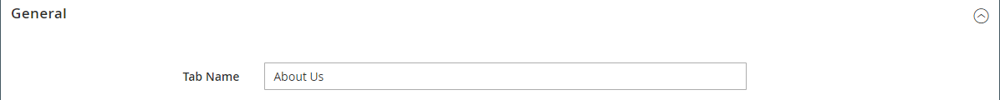

# Layout - Guias

Use o tipo de conteúdo _Guias_ para adicionar um conjunto de guias no [[!DNL Page Builder] estágio](workspace.md#stage). Ao arrastar o espaço reservado Tabulações do painel para o estágio, uma única guia padrão é exibida inicialmente. É possível adicionar mais guias para criar um conjunto completo. A largura do conjunto de guias é determinada pela largura de seu container principal e pelas configurações de preenchimento.

{width="500" zoomable="yes"}

{{$include /help/_includes/page-builder-save-timeout.md}}

## Toolboxes

Ao trabalhar com o tipo de conteúdo _Guias_, você adiciona e edita guias individuais e o contêiner de guias que contém uma ou mais guias. Cada guia tem sua própria caixa de ferramentas usada para criar guias no estágio [!DNL Page Builder].

### Caixa de ferramentas de guia Individual

{width="500" zoomable="yes"}

| Ferramenta | Ícone | Descrição |
|--- |--- |--- |
| Mover | {width="25"} | Esse controle ao lado do rótulo da guia é usado para mover a guia individual para outra posição no conjunto de guias. |
| Configurações | {width="25"} | Abre a página Editar guias, onde é possível alterar as propriedades da guia individual. |
| Duplicar | {width="25"} | Faz uma cópia da guia. |
| Remover | {width="25"} | Exclui a guia do conjunto de guias. |

{style="table-layout:auto"}

### Caixa de ferramentas do contêiner de Guias

{width="500" zoomable="yes"}

| Ferramenta | Ícone | Descrição |
|--- |--- |--- |
| Mover | {width="25"} | Move o conjunto de guias para outra posição na grade no contêiner pai. |
| Adicionar | {width="25"} | Adiciona uma guia ao conjunto de guias. |
| (rótulo) | [!UICONTROL Tabs] | Identifica o container atual como um conjunto de guias. Passe o mouse sobre a borda superior do contêiner para ver a caixa de ferramentas. |
| Configurações | {width="25"} | Abre a página de guia Editar, onde é possível alterar as propriedades do container. |
| Ocultar | {width="25"} | Oculta o contêiner da guia. |
| Mostrar | {width="25"} | Mostra o contêiner da guia oculta. |
| Duplicar | {width="25"} | Faz uma cópia da guia atual. |
| Remover | {width="25"} | Exclui o conjunto de guias atual do estágio. |

{style="table-layout:auto"}

{{$include /help/_includes/page-builder-hidden-element-note.md}}

## Adicionar uma guia individual

1. No painel [!DNL Page Builder], em _[!UICONTROL Layout]_, arraste o espaço reservado **[!UICONTROL Tabs]**&#x200B;diretamente para o estágio ou para uma linha ou coluna no estágio.

   {width="600" zoomable="yes"}

1. Clique no rótulo **[!UICONTROL Tab 1]** para exibir a caixa de ferramentas de guia individual e escolha o ícone _Configurações_ ( {width="20"} ).

1. Insira o **[!UICONTROL Tab Name]** que você deseja usar como rótulo.

   {width="600" zoomable="yes"}

1. Se necessário, insira o **[!UICONTROL Minimum Height]** para a guia.

   Este valor pode ser um número com qualquer unidade CSS válida (como `100px`, `50%`, `50em`, `100vh`) ou um cálculo (como `100vh - 237px`).

1. Escolha uma configuração **[!UICONTROL Vertical Alignment]** para alinhar qualquer contêiner de conteúdo adicionado à guia (Superior, Centro ou Inferior).

1. Se necessário, defina as outras opções usando as seguintes seções como orientação:

   - [[!UICONTROL Background]][background]
   - [[!UICONTROL Advanced]][advanced]

1. No canto superior direito, clique em **[!UICONTROL Save]** para aplicar as configurações e retornar ao espaço de trabalho [!DNL Page Builder].

## Adicionar um conjunto de guias

As etapas a seguir começam com uma guia individual e criam um conjunto de três guias em um contêiner de guias. Se você ainda não tiver uma guia individual, siga as instruções anteriores para adicionar uma única guia ao estágio.

1. Passe o mouse sobre o contêiner de guias para exibir a caixa de ferramentas e escolher o ícone _Adicionar_ ( {width="20"} ).

1. Clique no rótulo **[!UICONTROL Tab 2]** para exibir o cursor e insira seu próprio rótulo para a guia.

1. Clique na segunda guia novamente no palco e escolha o ícone _Duplicar_ ( {width="20"} ).

1. Clique no rótulo SeuNome **[!UICONTROL Copy]** para exibir o cursor e inserir seu próprio rótulo para a terceira guia.

{width="600" zoomable="yes"}

## Mover uma guia dentro do conjunto

1. Clique na guia que deseja mover.

1. Selecione e arraste o ícone _Mover_ ( {width="20"} ), que aparece logo antes do texto do rótulo da guia, para uma nova posição dentro do conjunto de guias.

## Adicionar conteúdo a uma guia

Você pode adicionar qualquer tipo de conteúdo a uma guia da mesma forma que pode adicionar a uma linha. Use as etapas a seguir para adicionar um tipo de conteúdo de texto como exemplo.

1. Clique na guia onde deseja adicionar o conteúdo.

1. No painel [!DNL Page Builder], expanda **[!UICONTROL Elements]** e arraste um espaço reservado para **Texto** para a guia.

1. Insira ou cole algum texto no editor e use a barra de ferramentas do editor para formatá-lo conforme necessário.

   Consulte [Elementos - Texto](text.md) para obter mais informações sobre como trabalhar com o tipo de conteúdo de texto.

   {width="500" zoomable="yes"}

1. No canto superior direito, clique em **[!UICONTROL Save]**.

## Alterar configurações de guia individuais

1. Passe o mouse sobre uma guia individual para exibir a caixa de ferramentas e escolha o ícone _Configurações_ ( {width="20"} ).

1. Se necessário, altere qualquer uma das configurações básicas da guia:

   - **[!UICONTROL Tab Name]** - Inserir texto revisado para o rótulo da guia. Também é possível modificar o rótulo diretamente no palco.

   - **[!UICONTROL Minimum Height]** - Digite como pixels se desejar substituir a altura automática. Por exemplo, você pode definir a altura mínima para corresponder à altura de uma imagem do plano de fundo para garantir que a imagem completa fique visível.

   - **[!UICONTROL Vertical Alignment]** - Escolha a posição vertical dos contêineres de conteúdo adicionados à guia.

1. Altere as outras configurações conforme necessário usando as seções a seguir para obter detalhes.

1. Quando terminar, clique em **[!UICONTROL Save]** para aplicar as configurações e retornar ao espaço de trabalho [!DNL Page Builder].

### Histórico

- **[!UICONTROL Background Color]** - Especifique a cor do plano de fundo escolhendo uma amostra, clicando no seletor de cores ou inserindo um nome de cor válido ou um valor hexadecimal equivalente. Essa configuração determina a cor do plano de fundo da linha. Também é possível ajustar a opacidade da cor.

  {width="200"}

  Você pode inserir um valor de três maneiras:

   - Um nome de cor predefinido, como `White`

   - O valor de cor hexadecimal da cor, como `#ffffff`

   - O valor rgba da cor, com porcentagem de opacidade, como `rgba(255, 255, 255, 0.75)`

  Se quiser escolher uma cor, clique na amostra à esquerda da caixa _Sem cor_.

  {width="600" zoomable="yes"}

  Se você clicar na caixa de cores para abrir o seletor de cores novamente, a caixa abaixo do controle deslizante mostrará os valores atuais de vermelho, verde, azul e alfa (rgba). O último número indica a porcentagem de opacidade atual como um decimal. Você pode usar o controle deslizante para ajustar a opacidade ou inserir o valor decimal desejado.

  {width="600" zoomable="yes"}

  >[!NOTE]
  >
  >[!DNL Page Builder] também oferece suporte a uma camada de transparência, ou a um _canal alfa_, em imagens de plano de fundo que podem ser usadas para criar planos de fundo com vários graus de opacidade.

- **[!UICONTROL Background Image]** - Se necessário, use as ferramentas fornecidas para escolher uma imagem de plano de fundo para aplicar à guia:

  | Ferramenta | Descrição |
  |--- |--- |
  | [!UICONTROL Upload] | Faz upload de um arquivo de imagem do seu computador local para a galeria e o aplica como a imagem do plano de fundo da guia. |
  | [!UICONTROL Select from Gallery] | Solicita que você escolha uma imagem existente da galeria como a imagem do plano de fundo para a guia. |
  | {width="25"} | Permite que você arraste a imagem para o bloco da câmera ou navegue até a imagem no seu sistema de arquivos local. |

  {style="table-layout:auto"}

- **[!UICONTROL Background Mobile Image]** - Se necessário, use as mesmas ferramentas para escolher uma imagem de plano de fundo diferente para ser usada para exibição em dispositivos móveis.

- **[!UICONTROL Background Size]** - Escolha como a imagem de plano de fundo é dimensionada em relação à largura da guia:

  | Opção | Descrição |
  |--- |--- |
  | `Cover` | A imagem de fundo cobre a largura total da guia. |
  | `Contain` | A imagem de fundo é limitada à largura da área da tabulação. |
  | `Auto` | Aplica o tamanho da folha de estilos atual. |

  {style="table-layout:auto"}

- **[!UICONTROL Background Position]** - Escolha como a imagem de plano de fundo é ancorada em relação à guia: `Top Left` / `Top Center` / `Top Right` / `Center Left` / `Center` / `Center Right` / `Bottom Left` / `Bottom Center` / `Bottom Right`

- **[!UICONTROL Background Attachment]** - Escolha o tipo de anexo para determinar como a imagem de plano de fundo se move em relação à página de rolagem:

  | Opção | Descrição |
  | --- | --- |
  | `Scroll` | A imagem de fundo anexada é sincronizada para se mover para baixo conforme a página rola. |
  | `Fixed` | (Não disponível para dispositivos móveis) A imagem de plano de fundo não se move conforme o contêiner rola pela imagem e é fixada na posição de plano de fundo especificada. |

  {style="table-layout:auto"}

- **[!UICONTROL Background Repeat]** - Defina como `Yes` para repetir a imagem de plano de fundo para preencher o espaço disponível na guia.

### Avançado

- Para controlar o alinhamento horizontal dos contêineres de conteúdo adicionados à guia, escolha um **[!UICONTROL Alignment]** .

  | Opção | Descrição |
  | --- | --- |
  | `Default` | Aplica a configuração padrão de alinhamento especificada na folha de estilos do tema atual. |
  | `Left` | Alinha os contêineres de conteúdo na borda esquerda da guia, com permissão para qualquer preenchimento especificado. |
  | `Center` | Alinha o contêiner de conteúdo no centro da guia, com permissão para qualquer preenchimento especificado. |
  | `Right` | Alinha o contêiner de conteúdo na borda direita da guia, com permissão para qualquer preenchimento especificado. |

  {style="table-layout:auto"}

- Defina o estilo **[!UICONTROL Border]** que é aplicado aos quatro lados do contêiner de guias:

  | Opção | Descrição |
  | --- | --- |
  | `Default` | Aplica o estilo de borda padrão especificado pela folha de estilos associada. |
  | `None` | Não fornece nenhuma indicação visível das bordas do contêiner. |
  | `Dotted` | A borda do contêiner aparece como uma linha pontilhada. |
  | `Dashed` | A borda do contêiner aparece como uma linha tracejada. |
  | `Solid` | A borda do contêiner aparece como uma linha sólida. |
  | `Double` | A borda do contêiner aparece como uma linha dupla. |
  | `Groove` | A borda do contêiner é exibida como uma linha com ranhura. |
  | `Ridge` | A borda do contêiner aparece como uma linha estriada. |
  | `Inset` | A borda do contêiner aparece como uma linha interna. |
  | `Outset` | A borda do contêiner aparece como uma linha de saída. |

  {style="table-layout:auto"}

- Se você definir um estilo de borda diferente de `None`, conclua as opções de exibição de borda:

  {width="600" zoomable="yes"}

  | Opção | Descrição |
  | ------ |------------ |
  | [!UICONTROL Border Color] | Especifique a cor escolhendo uma amostra, clicando no seletor de cores ou inserindo um nome de cor válido ou um valor hexadecimal equivalente. |
  | [!UICONTROL Border Width] | Insira o número de pixels para a largura da linha de borda. |
  | [!UICONTROL Border Radius] | Insira o número de pixels para definir o tamanho do raio usado para arredondar cada canto da borda. |

  {style="table-layout:auto"}

  A linha no exemplo a seguir tem um raio de borda de 15.

  {width="500"}

- (Opcional) Especifique os nomes de **[!UICONTROL CSS classes]** da folha de estilos atual para aplicar ao contêiner de coluna.

  Separe vários nomes de classe com um espaço.

- Insira valores, em pixels, para que **[!UICONTROL Margins and Padding]** especifique as margens externas e o preenchimento interno da coluna.

  Insira cada valor correspondente no diagrama do container de guias.

  | Área de contêiner | Descrição |
  | -------------- | ---------- |
  | [!UICONTROL Margins] | A quantidade de espaço em branco aplicada à borda externa de todos os lados do container. Opções: `Top` / `Right` / `Bottom` / `Left` |
  | [!UICONTROL Padding] | A quantidade de espaço em branco aplicada à borda interna de todos os lados do contêiner. Opções: `Top` / `Right` / `Bottom` / `Left` |

  {style="table-layout:auto"}

## Alterar configurações de conjunto de guias

1. Passe o mouse sobre a borda superior do contêiner do conjunto de guias para exibir a caixa de ferramentas e escolha o ícone _Configurações_ ( {width="20"} ).

1. Se necessário, altere o **[!UICONTROL Default Active Tab]**.

   Escolha a guia no conjunto que você deseja que fique ativa quando a página for carregada.

1. Insira o **[!UICONTROL Minimum Height]**, em pixels, se desejar substituir a altura automática do conjunto de guias.

1. Para posicionar as guias de navegação na parte superior do conjunto de guias, escolha o **[!UICONTROL Tab Navigation Alignment]** (`Left`, `Center` ou `Right`).

   {width="500" zoomable="yes"}

1. Defina as opções Avançadas para o conjunto de guias:

   - Para controlar o posicionamento do conjunto de guias no contêiner pai, escolha um **[!UICONTROL Alignment]**:

     | Opção | Descrição |
     | ------ | ---------- |
     | `Default` | Aplica a configuração padrão de alinhamento especificada na folha de estilos do tema atual. |
     | `Left` | Alinha o conjunto de guias na borda esquerda do contêiner pai, com permissão para qualquer preenchimento especificado. |
     | `Center` | Alinha o conjunto de guias no centro do contêiner pai, com permissão para qualquer preenchimento especificado. |
     | `Right` | Alinha o conjunto de guias na borda direita do container principal, com permissão para qualquer preenchimento especificado. |

     {style="table-layout:auto"}

   - Defina o estilo **[!UICONTROL Border]** aplicado a todos os quatro lados do contêiner de guias:

     | Opção | Descrição |
     | ------ | ---------- |
     | `Default` | Aplica o estilo de borda padrão especificado pela folha de estilos associada. |
     | `None` | Não fornece nenhuma indicação visível das bordas do contêiner. |
     | `Dotted` | A borda do contêiner aparece como uma linha pontilhada. |
     | `Dashed` | A borda do contêiner aparece como uma linha tracejada. |
     | `Solid` | A borda do contêiner aparece como uma linha sólida. |
     | `Double` | A borda do contêiner aparece como uma linha dupla. |
     | `Groove` | A borda do contêiner é exibida como uma linha com ranhura. |
     | `Ridge` | A borda do contêiner aparece como uma linha estriada. |
     | `Inset` | A borda do contêiner aparece como uma linha interna. |
     | `Outset` | A borda do contêiner aparece como uma linha de saída. |

     {style="table-layout:auto"}

   - Se você definir um estilo de borda diferente de `None`, conclua as opções de exibição de borda:

     | Opção | Descrição |
     | ------ |------------ |
     | [!UICONTROL Border Color] | Especifique a cor escolhendo uma amostra, clicando no seletor de cores ou inserindo um nome de cor válido ou um valor hexadecimal equivalente. |
     | [!UICONTROL Border Width] | Insira o número de pixels para a largura da linha de borda. |
     | [!UICONTROL Border Radius] | Insira o número de pixels para definir o tamanho do raio usado para arredondar cada canto da borda. |

     {style="table-layout:auto"}

   - (Opcional) Especifique os nomes de **[!UICONTROL CSS classes]** da folha de estilos atual para aplicar ao contêiner de guias.

     Separe vários nomes de classe com um espaço.

   - Insira valores, em pixels, para que **[!UICONTROL Margins and Padding]** determine as margens externas e o preenchimento interno do contêiner de guias.

     Insira os valores correspondentes no diagrama do container de guias.

     | Área de contêiner | Descrição |
     | -------------- | ---------- |
     | [!UICONTROL Margins] | A quantidade de espaço em branco aplicada à borda externa de todos os lados do container. Opções: `Top` / `Right` / `Bottom` / `Left` |
     | [!UICONTROL Padding] | A quantidade de espaço em branco aplicada à borda interna de todos os lados do contêiner. Opções: `Top` / `Right` / `Bottom` / `Left` |

     {style="table-layout:auto"}

1. Quando terminar, clique em **[!UICONTROL Save]** para aplicar as configurações e retornar ao espaço de trabalho [!DNL Page Builder].

[background]: #background
[advanced]: #advanced
