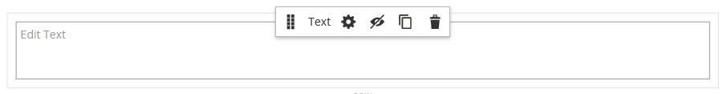

# Elementos - Texto

Use o _Texto_ tipo de conteúdo para adicionar um contêiner de texto com um editor WYSIWYG (&quot;O que você vê é o que você obtém&quot;) na [[!DNL Page Builder] estágio](workspace.md#stage). Além disso, é possível adicionar links, imagens, [variáveis](../systems/variables-predefined.md)e widgets para o texto na barra de ferramentas do editor.

{width="700"}

{{$include /help/_includes/page-builder-save-timeout.md}}

## Ferramentas do editor de texto

Você pode acessar o editor de texto diretamente do palco ou de uma página de configurações. As alterações feitas diretamente no estágio são salvas automaticamente. Para obter mais informações, consulte [Uso do Editor](../content-design/editor.md).

{width="600"}

## Caixa de ferramentas do contêiner de texto

{width="600"}

| Ferramenta | Ícone | Descrição |
| --------- | --------------------- | -------------- |
| Mover | {width="25"} | Move o contêiner de texto para outro local válido na página. |
| (rótulo) | TEXTO | Identifica o container atual como um elemento de texto. |
| Configurações | {width="25"} | Abre as propriedades do container de texto no modo de edição. |
| Ocultar | {width="25"} | Oculta o container de texto. |
| Mostrar | {width="25"} | Mostra o contêiner de texto oculto. |
| Duplicar | {width="25"} | Faz uma cópia do contêiner de texto. |
| Remover | {width="25"} | Exclui o contêiner de texto e seu conteúdo do estágio. |

{style="table-layout:auto"}

{{$include /help/_includes/page-builder-hidden-element-note.md}}

## Adicionar texto

1. No [!DNL Page Builder] painel, expandir **[!UICONTROL Elements]** e arraste uma **[!UICONTROL Text]** espaço reservado para uma linha, coluna ou conjunto de guias no estágio.

   {width="600" zoomable="yes"}

1. Use o editor para inserir e formatar texto, conforme necessário.

   Para obter mais informações, consulte [Uso do Editor](../content-design/editor.md).

   {width="600"}

## Criar um link

O botão Inserir link no editor facilita a adição de um hiperlink a uma imagem na galeria. No entanto, ele também pode ser usado para criar um link em linha no texto, se você tiver o URL antecipadamente. Diferentemente do botão Widget, o botão Inserir/Editar link não é integrado a páginas, produtos ou categorias na loja.

Para criar um link para um número de telefone ou email, consulte [Adição de variáveis personalizadas](../systems/variables-custom.md).

1. Na loja, navegue até a página que deve ser o destino do link e copie as informações do link.

   Você pode usar o URL totalmente qualificado ou um URL relativo que omita a referência ao domínio da loja.

   URL completo - `https://mystore.com/women/tops-women/tees-women.html`

   URL relativo - `../women/tops-women/tees-women.html`

1. Selecione o texto no espaço do editor e clique em _Inserir/editar link_ ( {width="20"} ) na barra de ferramentas do editor.

   {width="500" zoomable="yes"}

1. Para **[!UICONTROL URL]**, insira o link relativo preparado.

1. Definir **[!UICONTROL Target]** para `None`.

   Essa configuração abre a página na mesma janela do navegador, em vez de abrir uma nova guia.

1. Para **[!UICONTROL Title]**, insira `Shop Tees`.

   A variável `Title` o atributo de link é usado por alguns navegadores como uma dica de ferramenta.

1. Para salvar o link e retornar para a [!DNL Page Builder] espaço de trabalho, clique **[!UICONTROL OK]**.

   {width="500" zoomable="yes"}

## Inserir uma imagem

1. Coloque o cursor no texto onde deseja inserir a imagem.

1. Clique em _Inserir/editar imagem_ ( {width="20"} ) na barra de ferramentas do editor.

1. Para **[!UICONTROL Source]**, clique no ícone de pesquisa para usar o armazenamento de mídia para localizar e selecionar uma imagem.

1. Para **[!UICONTROL Image Description]**, digite o texto descritivo para a imagem.

   Esse texto preenche o `alt` atributo de link para a imagem e é usado por alguns navegadores para acessibilidade.

1. Insira a largura e a altura **[!UICONTROL Dimensions]**, em pixels, para renderizar a imagem na página.

   Mantenha a **[!UICONTROL Constrain proportions]** selecionada para manter automaticamente a proporção da imagem.

1. Para inserir a imagem e retornar à tag [!DNL Page Builder] espaço de trabalho, clique **[!UICONTROL OK]**.

## Alterar configurações de texto

1. Passe o mouse sobre o contêiner de texto para exibir a caixa de ferramentas e escolher _Configurações_ ( {width="20"} ) ícone.

   >[!NOTE]
   >
   >Como o contêiner de texto está bem aninhado dentro de outro contêiner, verifique se você tem a caixa de ferramentas correta.

1. Atualize o conteúdo conforme necessário.

1. Atualize o _[!UICONTROL Advanced]_conforme necessário.

   - Para controlar o posicionamento do texto no container principal, escolha uma **[!UICONTROL Alignment]**:

     | Opção | Descrição |
     | ------ |------------ |
     | `Default` | Aplica a configuração padrão de alinhamento especificada na folha de estilos do tema atual. |
     | `Left` | Alinha a lista ao longo da borda esquerda do contêiner principal, com permissão para qualquer preenchimento especificado. |
     | `Center` | Alinha a lista no centro do contêiner pai, com permissão para qualquer preenchimento especificado. |
     | `Right` | Alinha o bloco ao longo da borda direita do contêiner principal, com permissão para qualquer preenchimento especificado. |

     {style="table-layout:auto"}

   - Defina o **[!UICONTROL Border]** estilo aplicado aos quatro lados do contêiner de texto:

     | Opção | Descrição |
     | ------ |------------ |
     | `Default` | Aplica o estilo de borda padrão especificado pela folha de estilos associada. |
     | `None` | Não fornece nenhuma indicação visível das bordas do contêiner. |
     | `Dotted` | A borda do contêiner aparece como uma linha pontilhada. |
     | `Dashed` | A borda do contêiner aparece como uma linha tracejada. |
     | `Solid` | A borda do contêiner aparece como uma linha sólida. |
     | `Double` | A borda do contêiner aparece como uma linha dupla. |
     | `Groove` | A borda do contêiner é exibida como uma linha com ranhura. |
     | `Ridge` | A borda do contêiner aparece como uma linha estriada. |
     | `Inset` | A borda do contêiner aparece como uma linha interna. |
     | `Outset` | A borda do contêiner aparece como uma linha de saída. |

     {style="table-layout:auto"}

   - Se você definir um estilo de borda diferente de `None`, conclua as opções de exibição da borda:

     | Opção | Descrição |
     | ------ |------------ |
     | [!UICONTROL Border Color] | Especifique a cor escolhendo uma amostra, clicando no seletor de cores ou inserindo um nome de cor válido ou um valor hexadecimal equivalente. |
     | [!UICONTROL Border Width] | Insira o número de pixels para a largura da linha de borda. |
     | [!UICONTROL Border Radius] | Insira o número de pixels para definir o tamanho do raio usado para arredondar cada canto da borda. |

     {style="table-layout:auto"}

   - (Opcional) Especifique os nomes dos **[!UICONTROL CSS classes]** na folha de estilos atual para aplicar ao contêiner.

     Separe vários nomes de classe com um espaço.

   - Insira valores, em pixels, para o **[!UICONTROL Margins and Padding]** para determinar as margens externas e o preenchimento interno do container de texto.

     Insira os valores correspondentes no diagrama.

     | Área de contêiner | Descrição |
     | -------------- |------------ |
     | [!UICONTROL Margins] | A quantidade de espaço em branco aplicada à borda externa de todos os lados do container. Opções: `Top` / `Right` / `Bottom` / `Left` |
     | [!UICONTROL Padding] | A quantidade de espaço em branco aplicada à borda interna de todos os lados do contêiner. Opções: `Top` / `Right` / `Bottom` / `Left` |

     {style="table-layout:auto"}

1. Quando terminar, clique em **[!UICONTROL Save]** para aplicar as configurações e retornar ao [!DNL Page Builder] espaço de trabalho.
