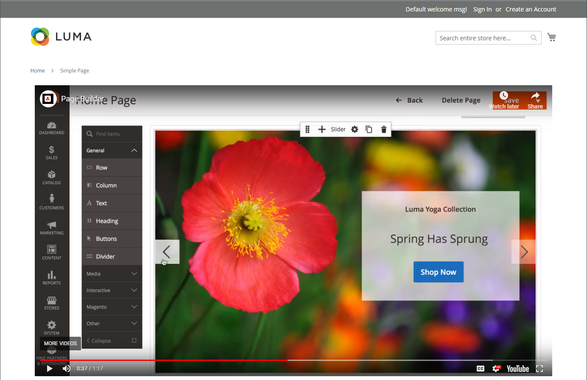
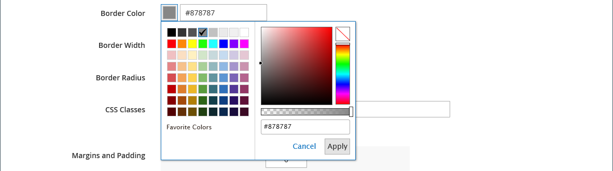

# Mídia - Vídeo

Use o tipo de conteúdo _Vídeo_ para adicionar um vídeo hospedado no [YouTube][1] ou no [Vimeo][2] ao [[!DNL Page Builder] estágio](workspace.md#stage). É fácil incorporar vídeos em uma página ou bloco ou em descrições de produtos e categorias.

{width="700" zoomable="yes"}

{{$include /help/_includes/page-builder-save-timeout.md}}

## Caixa de ferramentas Vídeo

{width="600" zoomable="yes"}

| Ferramenta | Ícone | Descrição |
|--- |--- |--- |
| Mover | {width="25"} | Move o vídeo para outra posição no palco. |
| (rótulo) | [!UICONTROL Video] | Identifica o contêiner de conteúdo atual como um vídeo. Passe o mouse sobre o contêiner de imagem para ver a caixa de ferramentas. |
| Configurações | {width="25"} | Abre a página _[!UICONTROL Edit Video]_, na qual você pode alterar as propriedades do vídeo e do container. |
| Ocultar | {width="25"} | Oculta o vídeo atual. |
| Mostrar | {width="25"} | Mostra o vídeo oculto. |
| Duplicar | {width="25"} | Faz uma cópia do vídeo. |
| Remover | {width="25"} | Exclui o vídeo do estágio. |

{style="table-layout:auto"}

{{$include /help/_includes/page-builder-hidden-element-note.md}}

## Adicionar um vídeo

1. Antes de começar, navegue até o vídeo [YouTube][1] ou [Vimeo][2] que deseja incorporar e copie o link.

   Como alternativa, você também pode copiar um link direto para um arquivo de vídeo válido. Consulte [Configurações básicas de vídeo](#basic-video-settings) para obter links válidos.

1. No Administrador [!DNL Commerce], retorne ao espaço de trabalho [!DNL Page Builder] ao qual deseja adicionar o vídeo.

1. No painel [!DNL Page Builder], expanda **[!UICONTROL Media]** e arraste um espaço reservado **[!UICONTROL Video]** para o estágio.

   {width="600" zoomable="yes"}

1. Passe o mouse sobre o contêiner de vídeo para exibir a caixa de ferramentas e escolher o ícone _Configurações_ ( {width="20"} ).

1. Para **[!UICONTROL Video URL]**, cole a URL do vídeo que você copiou.

   A URL do vídeo [!DNL Page Builder] usado neste exemplo é: `https://www.youtube.com/watch?v=Y0KNS7C5dZA`.

1. Para limitar o **[!UICONTROL Maximum Width]** do vídeo, insira a largura máxima em pixels.

   Se estiver em branco, o vídeo terá a largura permitida pelo contêiner, permitindo margens e preenchimento.

1. No canto superior direito, clique em **[!UICONTROL Save]** para aplicar as configurações e retornar ao espaço de trabalho [!DNL Page Builder].

## Alterar configurações de vídeo

1. Passe o mouse sobre o contêiner de vídeo para exibir a caixa de ferramentas e escolher o ícone _Configurações_ ( {width="20"} ).

1. Modifique as configurações de acordo com as seguintes seções:

   - [Básico](#basic-video-settings)
   - [Avançado](#advanced)

1. No canto superior direito, clique em **[!UICONTROL Save]** para aplicar as configurações e retornar ao espaço de trabalho [!DNL Page Builder].

### Configurações básicas de vídeo

1. Para alterar o vídeo atual, atualize o **[!UICONTROL Video URL]**.

   Insira um URL de vídeo válido. Os URLs válidos do vídeo podem ser links para:

   - Vídeos do YouTube: `https://youtu.be/CoDhMRUUjeI`
   - Vídeos do Vimeo: `https://vimeo.com/190156113`
   - Arquivos de vídeo válidos (`.mp4` é recomendado): `https://myvideos.com/spiral.mp4`

1. Para alterar a largura permitida para o vídeo na vitrine, insira a nova **[!UICONTROL Maximum Width]** em pixels.

   Se estiver em branco, o vídeo estende a largura total do contêiner, menos espaço para margens e preenchimento.

1. Para iniciar o vídeo automaticamente depois que a página for carregada, defina **[!UICONTROL Autoplay]** como `Yes`.

   Se a reprodução automática estiver definida como `Yes`, o vídeo será silenciado na reprodução de acordo com a política. No entanto, mesmo com essa configuração, os dispositivos móveis não podem reproduzir automaticamente seus vídeos. Para obter mais informações sobre essas políticas, consulte os seguintes recursos do desenvolvedor:

   - [Política de reprodução automática do Vimeo](https://vimeo.zendesk.com/hc/en-us/articles/115004485728-Autoplaying-and-looping-embedded-videos)
   - [Política de reprodução automática do Google (Chrome/YouTube)](https://developer.chrome.com/blog/autoplay/)
   - [Política de reprodução automática para vídeos locais](https://developer.mozilla.org/en-US/docs/Web/Media/Autoplay_guide)

   Se a reprodução automática estiver definida como `No`, o vídeo será reproduzido somente sob demanda do usuário.

### [!UICONTROL Advanced]

1. Para controlar o posicionamento horizontal do vídeo no contêiner, escolha um **[!UICONTROL Alignment]**:

   | Opção | Descrição |
   | ------ | ----------- |
   | `Default` | Aplica a configuração padrão de alinhamento especificada na folha de estilos do tema atual. |
   | `Left` | Alinha o conteúdo ao longo da borda esquerda do contêiner de vídeo, com permissão para qualquer preenchimento especificado. |
   | `Center` | Alinha o conteúdo no centro do contêiner de vídeo, permitindo qualquer preenchimento especificado. |
   | `Right` | Alinha o conteúdo ao longo da borda direita do contêiner de vídeo, com permissão para qualquer preenchimento especificado. |

   {style="table-layout:auto"}

- Defina o estilo **[!UICONTROL Border]** que é aplicado aos quatro lados do contêiner de vídeo:

  | Opção | Descrição |
  | ------ | ----------- |
  | `Default` | Aplica o estilo de borda padrão especificado pela folha de estilos associada. |
  | `None` | Não fornece nenhuma indicação visível das bordas do contêiner. |
  | `Dotted` | A borda do contêiner aparece como uma linha pontilhada. |
  | `Dashed` | A borda do contêiner aparece como uma linha tracejada. |
  | `Solid` | A borda do contêiner aparece como uma linha sólida. |
  | `Double` | A borda do contêiner aparece como uma linha dupla. |
  | `Groove` | A borda do contêiner é exibida como uma linha com ranhura. |
  | `Ridge` | A borda do contêiner aparece como uma linha estriada. |
  | `Inset` | A borda do contêiner aparece como uma linha interna. |
  | `Outset` | A borda do contêiner aparece como uma linha de saída. |

  {style="table-layout:auto"}

- Se você definir um estilo de borda diferente de `None`, conclua as opções de exibição de borda:

  {width="600" zoomable="yes"}

  | Opção | Descrição |
  | ------ |------------ |
  | [!UICONTROL Border Color] | Especifique a cor escolhendo uma amostra, clicando no seletor de cores ou inserindo um nome de cor válido ou um valor hexadecimal equivalente. |
  | [!UICONTROL Border Width] | Insira o número de pixels para a largura da linha de borda. |
  | [!UICONTROL Border Radius] | Insira o número de pixels para definir o tamanho do raio usado para arredondar cada canto da borda. |

  {style="table-layout:auto"}

- (Opcional) Especifique os nomes de **[!UICONTROL CSS classes]** da folha de estilos atual para aplicar ao contêiner de vídeo.

  Separe vários nomes de classe com um espaço.

- Insira valores, em pixels, para que **[!UICONTROL Margins and Padding]** especifique as margens externas e o preenchimento interno do contêiner de vídeo.

  Insira cada valor correspondente no diagrama do contêiner de vídeo.

  | Área de contêiner | Descrição |
  | -------------- | ----------- |
  | [!UICONTROL Margins] | A quantidade de espaço em branco aplicada à borda externa de todos os lados do container. |
  | [!UICONTROL Padding] | A quantidade de espaço em branco aplicada à borda interna de todos os lados do contêiner. |

  {style="table-layout:auto"}

## Mover um vídeo

1. Passe o mouse sobre o contêiner de vídeo para exibir a caixa de ferramentas e escolher o ícone _Mover_ ( {width="20"} ).

   {width="500" zoomable="yes"}

1. Selecione e arraste o vídeo para a nova posição, logo abaixo da diretriz vermelha.

   {width="500" zoomable="yes"}

## Remover um vídeo do palco

1. Passe o mouse sobre o contêiner de vídeo para exibir a caixa de ferramentas e escolha o ícone _Remover_ ().

1. Quando for solicitada a confirmação, clique em **[!UICONTROL OK]**.

[1]: https://www.youtube.com/
[2]: https://vimeo.com/
