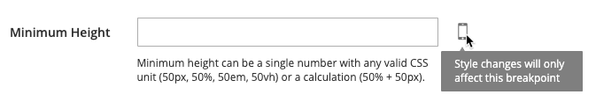

# [!DNL Page Builder] Workspace

Quando [[!DNL Page Builder] está ativado](setup.md), o _[!UICONTROL Content]_seção e o processo de criação de conteúdo são modificados para aproveitar o [!DNL Page Builder] ferramentas para CMS [páginas](../content-design/page-add.md), [produto](../catalog/product-content.md) e [categoria](../catalog/categories-content-settings.md) páginas, [blocos](../content-design/block-add.md), e [blocos dinâmicos](../content-design/dynamic-blocks.md). Esta seção inclui uma_ Cabeçalho do conteúdo _uma pré-visualização do conteúdo e fácil acesso à tela inteira [!DNL Page Builder] espaço de trabalho.

![Seção de conteúdo com [!DNL Page Builder] pré-visualização](./assets/pb-content-preview.png){width="700" zoomable="yes"}

## Cabeçalho do conteúdo

Como os mecanismos de pesquisa procuram cabeçalhos de nível um (H1), adicionar um cabeçalho de nível um é uma maneira fácil de garantir que a página seja indexada corretamente.

>[!NOTE]
>
>A variável _[!UICONTROL Content Heading]_O campo que aparece na parte superior da página é um campo herdado que oferece suporte ao conteúdo criado com [!DNL Commerce] versões. No entanto, não faz parte [!DNL Page Builder]. A variável [!UICONTROL Content Heading] é formatado como um cabeçalho H1 de acordo com a folha de estilos associada ao tema atual. Ele está posicionado logo acima da área de conteúdo ativa definida pelo [!DNL Page Builder] estágio.

Para obter o melhor controle sobre o posicionamento e o formato dos cabeçalhos de todos os níveis, é recomendável deixar a opção _[!UICONTROL Content Heading]_campo vazio e use o [!DNL Page Builder] [Cabeçalho](heading.md) tipo de conteúdo.

{width="700" zoomable="yes"}

## Visualização

Ao expandir a variável _[!UICONTROL Content]_e houver conteúdo existente criado com [!DNL Page Builder], ele exibe uma pré-visualização do conteúdo como ele seria exibido em uma página. Clique em **[!UICONTROL Edit with Page Builder]**ou dentro da área de pré-visualização de conteúdo para abrir o [!DNL Page Builder] espaço de trabalho, onde você pode fazer as atualizações necessárias.

{width="500" zoomable="yes"}

>[!NOTE]
>
>Para os formulários de produto e categoria, essa pré-visualização de conteúdo é habilitada por padrão, mas pode ser desabilitada. Se o desempenho for afetado pelo carregamento da visualização, você poderá desativar a visualização na [Configuração da Gestão de conteúdo](../configuration-reference/general/content-management.md#advanced-content-tools) configurações.

## Estágio

Ao abrir a variável [!DNL Page Builder] espaço de trabalho na pré-visualização, o estágio é a área de trabalho principal onde você pode criar e formatar conteúdo e até fazer edições rápidas no conteúdo ativo. O estágio está inicialmente vazio, fornecendo a superfície de design onde você pode arrastar linhas, colunas e guias do painel esquerdo.

>[!NOTE]
>
>A partir da versão 2.4.1, a edição de conteúdo agora é em tela cheia somente para todas as áreas controladas pelo [!DNL Page Builder]— Páginas CMS, páginas de produto e categoria, blocos e blocos dinâmicos. A edição em tela cheia coloca o foco no conteúdo e fornece uma visualização que melhor corresponde à experiência do usuário na loja.

{width="600" zoomable="yes"}

{{$include /help/_includes/page-builder-save-timeout.md}}

## Visores

A _viewport_ é a área visível de uma página da web que um usuário vê. No modo de design de tela cheia, os botões da janela de visualização são exibidos acima da [!DNL Page Builder] para mostrar o conteúdo à medida que o usuário do site o vê na loja.

{width="500" zoomable="yes"}

[!DNL Page Builder] O também define pontos de interrupção para janelas de visualização. Os pontos de interrupção definem as larguras mínimas e máximas nas quais determinados estilos são aplicados. A variável [!DNL Page Builder] Os visores fornecem os seguintes pontos de interrupção de conteúdo:

- **Ponto de interrupção da área de trabalho**—`min-width: 1024px`. Esse ponto de interrupção aplica estilos definidos para larguras de visor de 1024 pixels ou mais.
- **Pontos de interrupção móveis**—`max-width: 768px, min-width: 640px`. Esses pontos de interrupção aplicam estilos definidos para larguras de visor entre 768 e 640 pixels.

[!DNL Page Builder] Os visores fornecem dois recursos: **_visualizações de conteúdo_** e **_configurações de ponto de interrupção_**.

### Visualizações de conteúdo

Por padrão, [!DNL Page Builder] O fornece duas visualizações de visor:

- **Desktop** — Exibe a pré-visualização de conteúdo sem uma largura predefinida. Estilos definidos pela área de trabalho (usando a largura mínima do ponto de interrupção de 1024 pixels) ainda são aplicados à página. Mas a largura da janela de visualização da área de trabalho é definida pelas configurações para tipos de conteúdo de contêiner, como Linhas. A seleção da janela de visualização do desktop mostra como o conteúdo é estilizado na loja quando a largura da página do navegador é de 1024 pixels e mais.

  {width="500" zoomable="yes"}

- **Dispositivo móvel** — Exibe a visualização do conteúdo em uma largura predefinida de 768 pixels. Ao contrário do visor desktop, o visor móvel mostra o conteúdo da página com uma largura de 768 pixels, juntamente com os estilos definidos para as larguras de ponto de interrupção de 768 pixels (máximo) e 640 pixels (mínimo).

  {width="500" zoomable="yes"}

### Configurações de ponto de interrupção

Os botões visor também fornecem a opção para aplicar diferentes estilos de ponto de interrupção a tipos de conteúdo com base no visor selecionado. Por padrão, [!DNL Page Builder] fornece configurações de ponto de interrupção para o _[!UICONTROL Minimum Height]_campos de Linhas, Colunas, Tabulações, Itens de tabulação, Banners, Sliders e Slides. Ao selecionar a janela de visualização móvel e abrir o editor para um desses tipos de conteúdo, você pode inserir valores de campo específicos para os pontos de interrupção da janela de visualização móvel. Os campos de tipo de conteúdo que permitem configurações específicas de ponto de interrupção exibem um ícone à direita do campo, semelhante ao exemplo a seguir para uma Linha:

{width="400"}

## Painel

A variável [!DNL Page Builder] O painel está localizado à esquerda do estágio e contém tipos de conteúdo que podem ser arrastados para o estágio. Um contêiner específico ao tipo de conteúdo é exibido com uma caixa de ferramentas de opções. Os tipos de conteúdo são organizados no painel da seguinte maneira:

### Layout

A variável _[!UICONTROL Layout]_seção do [!DNL Page Builder] é usado para adicionar linhas, colunas ou guias ao estágio. Ao arrastar um tipo de conteúdo do painel para o estágio, um contêiner é exibido com uma caixa de ferramentas de opções específicas ao tipo de conteúdo.

Por padrão, a variável [!DNL Page Builder] estágio está vazio. Ao arrastar tipos de conteúdo de layout do painel para o palco, você pode colocá-los acima, abaixo ou dentro de outros contêineres de layout na página. As linhas só podem ser adicionadas diretamente ao estágio.

![[!DNL Page Builder] painel com tipos de conteúdo de layout e estágio](./assets/pb-stage-toolbox.png){width="600" zoomable="yes"}

| Tipo de conteúdo de layout | Descrição |
| ------------------- |------------ |
| [Linha](row.md) | Uma nova linha só pode ser arrastada do painel para o estágio e posicionada acima ou abaixo de outra linha, guia ou grupo de colunas. Também é possível usar a opção Duplicate para fazer uma cópia de uma linha existente. |
| [Coluna](column.md) | Uma coluna pode ser arrastada do painel para o palco ou para linhas e guias. O número máximo de colunas que podem ser adicionadas é determinado pelo número de divisões da grade especificado no [configuração](setup.md). |
| [Guias](tabs.md) | Uma única guia pode ser arrastada do painel para o palco ou para linhas e colunas. Guias adicionais podem ser adicionadas na caixa de ferramentas. |

{style="table-layout:auto"}

### Elementos

Use o _[!UICONTROL Elements]_seção do [!DNL Page Builder] painel para adicionar texto, cabeçalhos, botões, divisores e código HTML a qualquer contêiner de layout no [[!DNL Page Builder] estágio](workspace.md#stage). Ao arrastar um tipo de conteúdo do painel para uma linha ou coluna, ou para um conjunto de guias no palco, um container é exibido. Use a caixa de ferramentas de tipo de conteúdo para acessar as configurações específicas do tipo.

![[!DNL Page Builder] painel com tipos de conteúdo Elemento](./assets/pb-elements.png){width="600" zoomable="yes"}

| Tipo de conteúdo do elemento | Descrição |
| -------------------- | ----------- |
| [Texto](text.md) | Adiciona um contêiner de texto e um editor ao estágio. |
| [Cabeçalho](heading.md) | Adiciona um contêiner de cabeçalho ao estágio. |
| [Botões](buttons.md) | Adiciona um contêiner a um botão individual ou a um conjunto de botões ao estágio. |
| [Divisor](divider.md) | Adiciona um contêiner de um divisor ao estágio. |
| [Código HTML](html-code.md) | Adiciona um contêiner para código HTML ao estágio. |

{style="table-layout:auto"}

### Mídia

Use o _[!UICONTROL Media]_seção do [!DNL Page Builder] painel para adicionar imagens, vídeo, banners, controles deslizantes e [!DNL Google Maps] para qualquer contêiner de layout na [[!DNL Page Builder] estágio](workspace.md#stage). Quando um tipo de conteúdo de mídia é arrastado do painel para o palco, um container é exibido com uma caixa de ferramentas de opções específicas ao tipo de conteúdo.

![[!DNL Page Builder] painel com tipos de conteúdo de mídia](./assets/pb-media-content-types.png){width="600" zoomable="yes"}

| Tipo de conteúdo de mídia | Descrição |
| ------------------- | ------------------------------------------ |
| [Imagem](image.md) | Adiciona um contêiner de imagem ao estágio. |
| [Vídeo](video.md) | Adiciona um contêiner de vídeo ao estágio. |
| [Banner](banner.md) | Adiciona um contêiner de banner ao estágio. |
| [Controle deslizante](slider.md) | Adiciona um contêiner de controle deslizante ao estágio. |
| [Mapa](map.md) | Adiciona um [!DNL Google Maps] contêiner ao estágio. |

{style="table-layout:auto"}

### Adicionar conteúdo

Use o _[!UICONTROL Add Content]_seção do [!DNL Page Builder] painel para adicionar conteúdo existente à [[!DNL Page Builder] estágio](workspace.md#stage). Quando você arrasta um tipo de conteúdo de mídia do painel para o palco, um container é exibido. Use a caixa de ferramentas do tipo de conteúdo para acessar a_ Configurações _que são específicos ao tipo.

![[!DNL Page Builder] painel com Adicionar tipos de conteúdo](./assets/pb-add-content.png){width="600" zoomable="yes"}

| Tipo de conteúdo | Descrição |
| ---------------------------------------------------------------- | -------------------------------------------- |
| [Bloquear](block.md) | Adiciona um bloco existente ao estágio. |
| [Bloco dinâmico](dynamic-block.md) | Adiciona um bloco dinâmico existente ao estágio. |
| [Produtos](products.md) | Adiciona uma lista de produtos ao estágio. |
|  [Recommendations do produto](recommendations.md) | Adiciona uma unidade de recomendação ao estágio. |

{style="table-layout:auto"}

## Toolbox

Cada container de conteúdo no estágio tem uma caixa de ferramentas de opções. As opções variam de acordo com o tipo de conteúdo, mas normalmente incluem Mover, Configurações, Ocultar/Mostrar, Duplicar e Remover.

### Mostrar a caixa de ferramentas

Passe o mouse sobre o container para exibir a caixa de ferramentas e escolher uma opção.

{width="600" zoomable="yes"}

### Opções da caixa de ferramentas

| Opção | Ícone | Descrição |
| --------- | ---------------------------------------- | ------------ |
| Mover | {width="25"} | Move o contêiner de conteúdo atual para outra posição no estágio. |
| Adicionar | {width="25"} | Adiciona elementos secundários, como um botão, slide ou guia. |
| (rótulo) |           | Identifica o tipo de conteúdo do container. |
| Configurações | {width="25"} | Abre as propriedades do container de conteúdo no modo de edição. |
| Ocultar | {width="25"} | Oculta o contêiner de conteúdo atual. |
| Mostrar | {width="25"} | Mostra o contêiner de conteúdo atual. |
| Duplicar | {width="25"} | Faz uma cópia do container de conteúdo atual. |
| Remover | {width="25"} | Exclui o contêiner de conteúdo atual do estágio. |

{style="table-layout:auto"}

{{$include /help/_includes/page-builder-hidden-element-note.md}}
