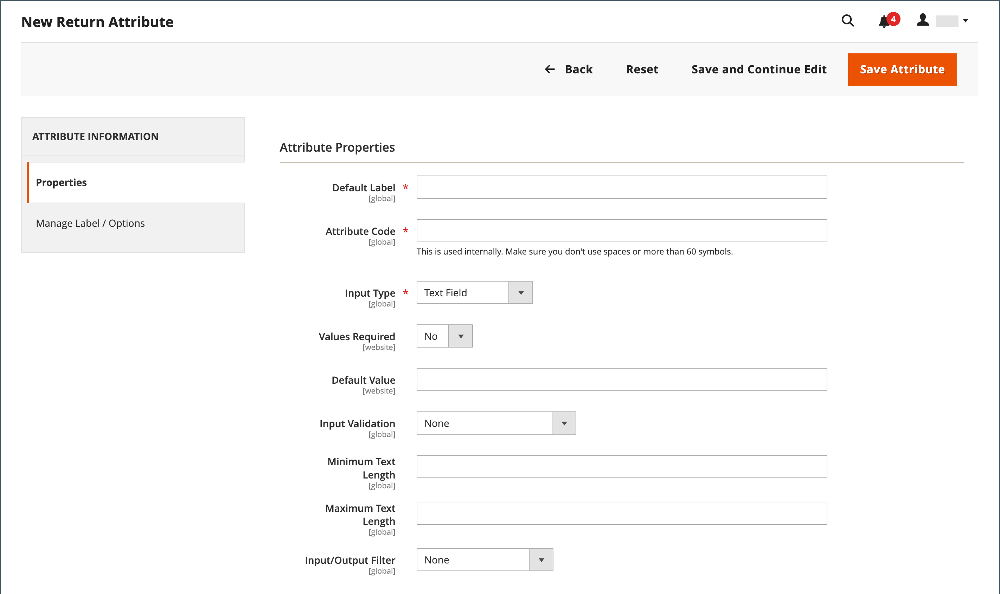

# Retorna atributo

{{ee-feature}}

Os atributos de devolução são usados para armazenar informações necessárias durante o processo de devolução do produto. Os atributos padrão incluem a condição do produto devolvido, o motivo da devolução e um campo que indica como a devolução foi resolvida. O processo para criar um atributo de retornos é semelhante à criação de um [atributo de cliente](../customers/attribute-properties.md).

{width="700" zoomable="yes"}

## Criar um atributo returns

1. Na barra lateral _Admin_, vá para **[!UICONTROL Stores]** > _[!UICONTROL Attributes]_>**[!UICONTROL Returns]**.

1. No canto superior direito, clique em **[!UICONTROL Add New Attribute]**.

   {width="600" zoomable="yes"}

### Definir as propriedades

1. Para identificar o atributo durante a entrada de dados, defina o **[!UICONTROL Default Label]**.

1. Para **[!UICONTROL Attribute Code]**, insira um código que identifique o atributo no sistema.

1. Para determinar o tipo de controle de entrada usado para entrada de dados, defina **[!UICONTROL Input Type]** como um dos seguintes:

   - `Text Field`
   - `Text Area`
   - `Dropdown`
   - `Yes/No`
   - `File`
   - `Image File`

1. Para tornar o campo um item obrigatório, defina **[!UICONTROL Values Required]** como `Yes`.

1. Para atribuir um valor inicial ao campo, insira um **[!UICONTROL Default Value]**.

1. Para validar a precisão dos dados inseridos no campo antes que o registro seja salvo, defina **[!UICONTROL Input Validation]** como um dos seguintes:

   - `None`
   - `Alphanumeric`
   - `Alphanumeric with Space`
   - `Numeric Only`
   - `Alpha Only`
   - `URL`
   - `Email`

1. Para os tipos de entrada `Text Field` e `Text Area`, insira o **[!UICONTROL Minimum Text Length]** e **[!UICONTROL Maximum Text Length]**.

1. Para aplicar um filtro de pré-processamento, defina **[!UICONTROL Input/Output Filter]** como um dos seguintes:

   - `None`
   - `Strip HTML Tags`
   - `Escape  HTML Entities`

1. Para tornar o atributo visível para clientes, defina **[!UICONTROL Show on Storefront]** como `Yes` na seção _[!UICONTROL Storefront Properties]_.

1. (Opcional) Para **[!UICONTROL Sort Order]**, insira um número para determinar onde esse atributo aparece em relação aos outros na mesma parte da página. (`0` = primeiro, `1` = segundo, `2` = terceiro e assim por diante.)

### Gerenciar rótulos/opções

1. No painel esquerdo, escolha **[!UICONTROL Manage Labels/Options]**.

1. Na seção **[!UICONTROL Manage Titles (Size, Color, etc.)]**, insira o rótulo para cada exibição de loja.

   {width="600" zoomable="yes"}

1. Se o **[!UICONTROL Input Type]** do atributo for `Dropdown`, gerencie as opções na seção **[!UICONTROL Manage Options (Values of Your Attribute)]**.

   - Para adicionar uma opção, clique em **[!UICONTROL Add Option]** e insira o rótulo para Admin e cada exibição de loja.
   - Para tornar uma opção padrão, escolha **[!UICONTROL Is Default]**.
   - Para remover uma opção, clique em **[!UICONTROL Delete]**.

1. Para salvar as alterações, clique em **[!UICONTROL Save Attribute]**.
