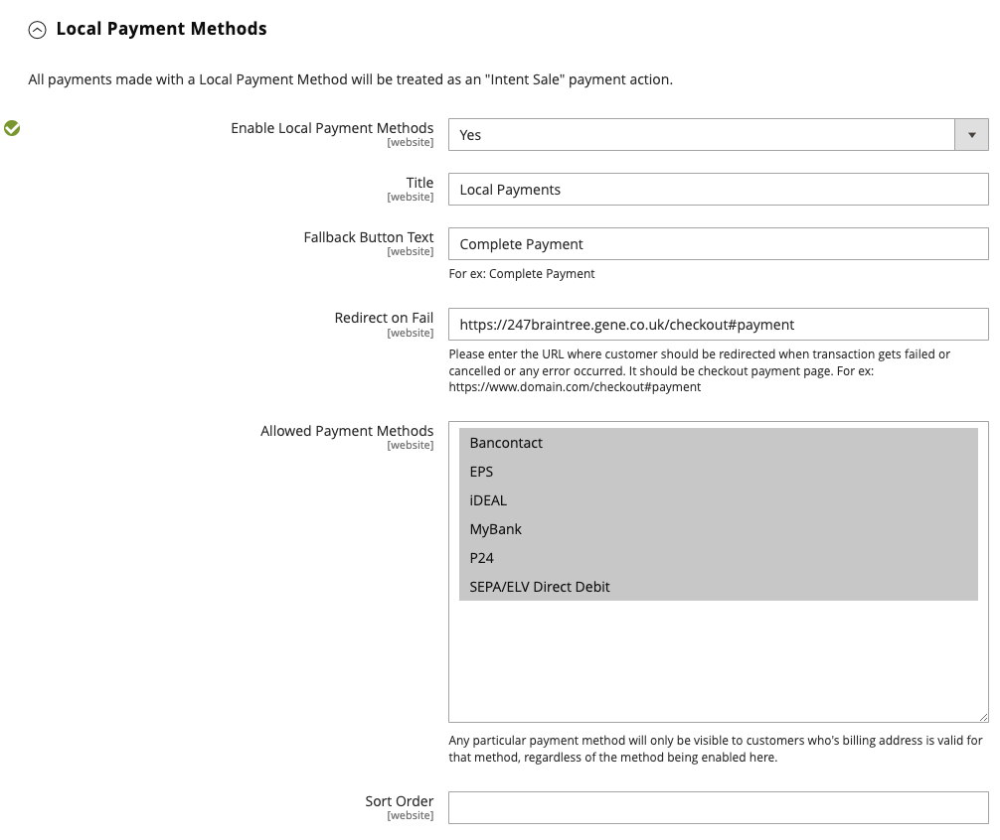

# Braintree

>[!IMPORTANT]
>
>Se precisar de ajuda com cobranças inesperadas em seu cartão, acesse a página [cancelar assinatura](https://helpx.adobe.com/br/manage-account/using/cancel-subscription.html) para obter assistência.

O Braintree oferece uma experiência de check-out totalmente personalizável com detecção de fraudes e integração com o PayPal. Ele oferece suporte a [!DNL Apple Pay], [!DNL Google Pay], ACH, Venmo e métodos de pagamento locais. A Braintree reduz a carga de conformidade com o PCI para os comerciantes, pois a transação ocorre no sistema Braintree. A integração do Braintree Payments é desenvolvida pela [GENE Commerce](https://www.gene.co.uk/gene-braintree-payments/).

>[!NOTE]
>
>Se você estiver atualizando para a versão 2.4.x de uma versão anterior do Adobe Commerce ou Magento Open Source com a extensão Braintree do Commerce Marketplace instalada, consulte as [notas de atualização do 2.4](#24-upgrade-notes) no final desta página.

## Etapa 1: Obtenha suas credenciais do Braintree

Vá para [Braintree Payments][1] e inscreva-se para obter uma conta.

## Etapa 2: concluir as configurações básicas

1. Na barra lateral _Admin_, vá para **[!UICONTROL Stores]** > _[!UICONTROL Settings]_>**[!UICONTROL Configuration]**.

1. No painel esquerdo, expanda **[!UICONTROL Sales]** e escolha **[!UICONTROL Payment Methods]**.

   - Se a sua instalação do Commerce tiver vários sites, lojas ou modos de exibição, no canto superior esquerdo, escolha a **[!UICONTROL Store View]** à qual a configuração se aplica.

   - Na seção _[!UICONTROL Merchant Location]_, verifique se **[!UICONTROL Merchant Country]**&#x200B;está definido como o local da sua empresa.

1. Em _[!UICONTROL Recommended Solutions]_, na seção_[!UICONTROL Braintree Payments] (por [GENE Commerce](https://www.gene.co.uk/gene-braintree-payments/) v4.7.0 - [Notas de Versão](https://support.gene.co.uk/support/solutions/articles/35000278668)_, clique em **[!UICONTROL Configure]**.

   {width="600" zoomable="yes"}

1. Para **[!UICONTROL Title]**, insira um título que identifique o Braintree como uma opção de pagamento durante o check-out.

1. Definir o **[!UICONTROL Environment]** operacional atual para transações do Braintree como `Sandbox` ou `Production`

   Ao testar a configuração em uma sandbox, use apenas [números de cartão de crédito][2] recomendados pela Braintree. Quando estiver pronto para entrar na produção com o Braintree, defina **[!UICONTROL Environment]** como `Production`.

   {width="600" zoomable="yes"}

1. Defina **[!UICONTROL Payment Action]** como um dos seguintes:

   - `Authorize Only` - Aprova a compra e suspende os fundos. O valor não é sacado da conta bancária do cliente até que a venda seja _capturada_ pelo comerciante.|
   - `Intent Sale` - O valor da compra é autorizado e imediatamente retirado da conta do cliente. **_Observação:_** este valor era _Autorizar e Capturar_ na versão 2.3.x e em versões anteriores.|

1. Digite o **[!UICONTROL Sandbox Merchant ID / Merchant ID]** da sua conta do Braintree.

1. Insira as seguintes credenciais da sua conta da Braintree:

   - **[!UICONTROL Sandbox Public Key / Public Key]**
   - **[!UICONTROL Sandbox Private Key / Private Key]**

   >[!NOTE]
   >
   >Há campos separados para ambos os ambientes **(Sandbox e Produção)** e os outros campos são renderizados com base no ambiente selecionado.

1. Antes de salvar a configuração, clique em **[!UICONTROL Validate Credentials]** para validar suas credenciais.

1. Defina **[!UICONTROL Enable Card Payments]** como `Yes`.

1. Se você quiser ter a capacidade de armazenar informações do cliente com segurança, para que os clientes não precisem digitá-las novamente toda vez que fizerem uma compra, defina **[!UICONTROL Enable Vault for Card Payments]** como `Yes`.

1. Se quiser que um cliente verifique o número CVV de seu cartão com cofre em cada compra, defina **[!UICONTROL Enable Vault CVV Re-verification]** como `Yes`.

## Etapa 3: concluir as configurações avançadas

1. Expandir  a seção **[!UICONTROL Advanced Braintree Settings]**.

   {width="550" zoomable="yes"}

1. Para **[!UICONTROL Vault Title]**, insira um título descritivo para sua referência que identifique o cofre no qual as informações de seu cartão de cliente estão armazenadas.

1. Digite o **[!UICONTROL Merchant Account ID]** da sua conta do Braintree.

   Se você não especificar a conta de comerciante a ser usada, o Braintree processará a transação usando sua conta de comerciante padrão.

1. Para proporcionar uma experiência de finalização mais rápida com as opções de Pagamento Expresso no início do processo de finalização, incluindo PayPal, PayLater, Apple Pay e Google Pay, defina **[!UICONTROL Enable Checkout Express Payments]** como `Yes`.

1. Se você quiser impedir que a transação seja enviada para avaliação como parte das verificações das Ferramentas Avançadas de Fraude, nos pedidos feitos pelo Administrador, defina **[!UICONTROL Skip Fraud Checks on Admin Orders]** como `Yes`.

1. Defina o **[!UICONTROL Bypass Fraud Protection Threshold]** para que as verificações de `Advanced Fraud Protection` sejam ignoradas quando o limite for atingido ou excedido.

   Deixar esse campo em branco desativa essa opção.

1. Se quiser que o sistema salve um arquivo de log de interações entre o armazenamento e a Braintree, defina **[!UICONTROL Debug]** como `Yes`.

1. Para exigir que os clientes forneçam o código de segurança de três dígitos da parte de trás de um cartão de crédito, defina **[!UICONTROL CVV Verification]** como `Yes`.

   Se estiver usando a verificação CVV, habilite AVS e/ou CVV na seção _Configurações/Processamento_ da sua conta do Braintree.

1. Para enviar os itens de linha carrinho para todos os métodos de pagamento, defina **[!UICONTROL Send Card Line Items]** como `Yes`.

1. Em **[!UICONTROL Credit Card Types]**, selecione cada cartão de crédito aceita pela sua armazenamento como pagamento por meio de Braintree.

   Para selecionar vários cartão tipos, segure a tecla Ctrl (PC) ou a tecla Comando (Mac) e clique em cada opção.

1. Para **[!UICONTROL Sort Order]**, insira um número para determinar a sequência em que o Braintree aparece quando listado com outros métodos de pagamento durante o check-out.

## Etapa 4: concluir as configurações de webhook do Braintree

{width="600" zoomable="yes"}

1. Defina **[!UICONTROL Enable Webhook]** como `Yes` para habilitar a funcionalidade de webhook para proteção contra fraude, pagamentos ACH e métodos de pagamento locais.

1. Copie a URL no campo **[!UICONTROL Fraud Protection URL]** e adicione-a à sua conta da Braintree como _[!UICONTROL Webhook Destination URL]_.

   >[!IMPORTANT]
   >
   >Este URL deve ser seguro e estar acessível publicamente.

1. Defina o campo **[!UICONTROL Fraud Protection Approve Order Status]** para determinar quando a proteção contra fraude é aprovada pela Braintree.

   O status do pedido selecionado é atribuído ao pedido Commerce.

1. Defina o campo **[!UICONTROL Fraud Protection Reject Order Status]** para determinar quando a proteção contra fraude é rejeitada pela Braintree.

   O status do pedido selecionado é atribuído ao pedido Commerce.

## Etapa 5: concluir as configurações específicas do país

1. Defina **[!UICONTROL Payment from Applicable Countries]** como um dos seguintes:

   - `All Allowed Countries` - Clientes de todos os [países](../getting-started/store-details.md#country-options) especificados na sua configuração de loja podem usar esta forma de pagamento.
   - `Specific Countries` - Depois de escolher esta opção, a lista _[!UICONTROL Payment from Specific Countries]_&#x200B;é exibida. Mantenha pressionada a tecla Ctrl (PC) ou a tecla Command (Mac) e selecione cada país na lista onde os clientes podem fazer compras na sua loja.

   {width="600" zoomable="yes"}

1. Para configurar **[!UICONTROL Country Specific Credit Card Types]**:

   - Clique em **[!UICONTROL Add]**.

   - Defina o **[!UICONTROL Country]** e escolha cada **[!UICONTROL Allowed Credit Card Type]**.

   - Repita para identificar os cartões de crédito aceitos de cada país.

## Etapa 6: concluir o ACH pelas configurações do Braintree

{width="600" zoomable="yes"}

1. Para incluir ACH como uma opção de pagamento com Braintree, defina **[!UICONTROL Enable ACH Direct Debit]** como `Yes`.

1. Os clientes podem compartimentar seu método de pagamento de Débito Direto ACH de uso único e armazená-lo para uso futuro. Depois de arquivados, os clientes podem reutilizar o Débito Direto ACH sem precisar inserir novamente ou autenticar suas informações de pagamento, se definidas como **[!UICONTROL Enable Vault for ACH Direct Debit]** a `Yes`.

1. Para **[!UICONTROL Sort Order]**, insira um número para determinar a sequência na qual a opção de pagamento da ACH do Braintree aparece quando listada com outras opções de pagamento durante o check-out.

## Etapa 7: concluir o [!UICONTROL Apple Pay] pelas configurações do Braintree

{width="600" zoomable="yes"}

1. Para incluir [!DNL Apple Pay] como uma opção de pagamento com o Braintree, defina **[!UICONTROL Enable ApplePay through Braintree]** como `Yes`.

   Certifique-se de [verificar primeiro o nome de domínio](https://developer.paypal.com/braintree/docs/guides/apple-pay/configuration/javascript/v3) na sua conta da Braintree.

1. Se você quiser ter a capacidade de armazenar informações do cliente com segurança, para que os clientes não precisem inseri-las novamente sempre que fizerem uma compra com o Apple Pay, defina **[!UICONTROL Enable Vault for ApplePay]** como `Yes`.

1. Defina **[!UICONTROL Payment Action]** como um dos seguintes:

   - `Authorize Only` - Aprova a compra e suspende os fundos. O valor não é sacado da conta bancária do cliente até que a venda seja _capturada_ pelo comerciante.
   - `Intent Sale` - O valor da compra é autorizado e imediatamente retirado da conta do cliente.

1. Para **[!UICONTROL Merchant Name]**, insira o texto que especifica o rótulo exibido para os clientes na caixa de diálogo Pagamento do Apple.

1. Para **[!UICONTROL Sort Order]**, insira um número para determinar a sequência em que a opção de pagamento [!DNL Apple Pay] aparece quando listada com outras opções de pagamento durante o check-out.

## Etapa 8: concluir as configurações para métodos de pagamento locais

1. Para incluir métodos de pagamento local como uma opção de pagamento com o Braintree, defina **[!UICONTROL Enable Local Payment Methods]** como `Yes`.

1. Para **[!UICONTROL Title]**, insira o texto a ser usado para o rótulo que aparece na seção de método de pagamento de check-out (valor padrão: `Local Payments`).

1. Para **[!UICONTROL Fallback Button Text]**, insira o texto a ser usado para o botão que aparece na página de fallback do Braintree para levar o cliente de volta ao site (por exemplo, `Complete Checkout`).

1. Para **[!UICONTROL Redirect on Fail]**, insira a URL para a qual os clientes devem ser redirecionados quando as transações do método de pagamento local forem canceladas, com falha ou encontrarem erros. Deve ser a página de pagamento do check-out (por exemplo, `https://www.domain.com/checkout#payment`).

1. Para **[!UICONTROL Allowed Payment Methods]**, selecione o método de pagamento local a ser habilitado.

   Opções: `Bancontact` / `EPS` / `giropay` / `iDeal` `Klarna Pay Now` / `SOFORT` / / `MyBank` / `P24` `SEPA/ELV Direct Debit` (ainda não suportado)

   {width="600" zoomable="yes"}

   >[!NOTE]
   >
   >A extensão de Braintree empacotada não suporta todos os métodos de pagamento locais listados na [documentação](https://developer.paypal.com/braintree/docs/guides/local-payment-methods/overview) Braintree desenvolvedor. Outros métodos de pagamento locais estão em desenvolvimento para serem suportados em versões futuras.

1. Para **[!UICONTROL Sort Order]**, insira um número para determinar a sequência em que o método de pagamento local aparece quando listado com outras opções de pagamento durante o check-out.

## Etapa 9: Todos os Apps as configurações de [!DNL Google Pay] Braintree

{width="600" zoomable="yes"}

1. Para incluir [!DNL Google Pay] como uma opção de pagamento com o Braintree, defina **[!UICONTROL Enable GooglePay Through Braintree]** como `Yes`.

1. Se você quiser ter a capacidade de armazenar informações do cliente com segurança, para que os clientes não precisem inseri-las novamente sempre que fizerem uma compra com o Google Pay, defina **[!UICONTROL Enable Vault for GooglePay]** como `Yes`.

1. Defina **[!UICONTROL Payment Action]** como um dos seguintes:

   - `Authorize Only` - Aprova a compra e suspende os fundos. O valor não é sacado da conta bancária do cliente até que a venda seja _capturada_ pelo comerciante.
   - `Intent Sale` - O valor da compra é autorizado e imediatamente retirado da conta do cliente.

1. Defina **[!UICONTROL Button Color]** para determinar a cor do botão [!DNL Google Pay]: `White` ou `Black`

1. Para **[!UICONTROL Merchant ID]**, insira sua MerchantID (fornecida pela Google).

1. Para **[!UICONTROL Accepted Cards]**, selecione o tipo de cartões que um cliente pode usar para fazer um pedido usando [!DNL Google Pay].

   Opções: `Visa` / `MasterCard` / `AMEX` / `Discover` / `JCB`

1. Para **[!UICONTROL Sort Order]**, insira um número para determinar a sequência em que [!DNL Google Pay] aparece quando listada com outras opções de pagamento durante o check-out.

## Etapa 10: Todos os Apps o Venmo pelas configurações Braintree

1. Para incluir o Venmo como opção de pagamento com Braintree, defina **[!UICONTROL Enable Venmo through Braintree]** `Yes`como .

1. Definido **[!UICONTROL Enable Vault for Venmo]** para `Yes` permitir o uso de um cofre seguro para armazenamento os conta dos clientes para que o cliente não precise fazer logon no Venmo conta novamente para transações futuras.

   {width="600" zoomable="yes"}

1. Defina **[!UICONTROL Payment Action]** como um dos seguintes:

   - `Authorize Only` - Aprova a compra e suspende os fundos. O valor não é sacado da conta bancária do cliente até que a venda seja _capturada_ pelo comerciante.
   - `Intent Sale` - O valor da compra é autorizado e imediatamente retirado da conta do cliente.

1. Para **[!UICONTROL Sort Order]**, insira um número para determinar a sequência em que Venmo aparece quando listado com outras opções de pagamento durante o check-out.

## Etapa 11: Concluir o PayPal por meio das configurações do Braintree

{width="550" zoomable="yes"}

1. Para incluir o PayPal como uma opção de pagamento com Braintree, defina **[!UICONTROL Enable PayPal through Braintree]** como `Yes`.

1. Especifique seu PayPal por meio do método de pagamento Braintree:

   >[!NOTE]
   >
   >**[!DNL PayPal Credit]** ou **[!DNL PayPal PayLater]** pode ser habilitado. Ambos os métodos não podem ser ativados ao mesmo tempo.

   - Para incluir [!DNL PayPal Credit] como uma opção de pagamento com o Braintree, defina **[!UICONTROL Enable PayPal Credit through Braintree]** como `Yes`.

     Quando **Habilitar PayPal por meio do Braintree** estiver definido como `Yes`, somente este campo será exibido.

     >[!NOTE]
     >
     >O PayPal Credit só está disponível nos Estados Unidos e no Reino Unido. O Crédito do PayPal estará desabilitado se o valor selecionado para o campo _[!UICONTROL Merchant Country]_&#x200B;não for `US` ou `UK`.

   - Para incluir [!DNL PayPal PayLater] como uma opção de pagamento com o Braintree, defina **[!UICONTROL Enable PayPal PayLater through Braintree]** como `Yes`.

     Quando **[!UICONTROL Enable PayPal PayLater through Braintree]** estiver definido como `Yes`, somente este campo aparecerá.

     Você pode exibir mensagens do PayLater no seu site para ofertas, como o _Pay in 3_, que permite que os clientes paguem com três pagamentos mensais sem juros. A integração do Braintree pode exibir mensagens no site para promover esse recurso. Não é possível promover ofertas do PayLater com qualquer outro conteúdo, marketing ou material.

1. Para **[!UICONTROL Title]**, insira um título que identifique a opção Pagamento Braintree por PayPal durante o check-out.

1. Defina **[!UICONTROL Vault Enabled]** como `Yes` para habilitar o uso de um cofre seguro para armazenar a conta do PayPal dos clientes. A conta do PayPal com cofre pode ser usada para transações futuras, o que reduz o número de etapas para os clientes.

1. Defina **[!UICONTROL Send Cart Line Items for PayPal]** como `Yes` para enviar os itens de linha (itens de pedido) ao PayPal junto com Cartões-presente, Empacotamento de presente para itens, Empacotamento de presente para pedido, Crédito da loja, Remessa e Imposto como itens de linha.

1. Para **[!UICONTROL Sort Order]**, insira um número para determinar a sequência em que a opção de pagamento do Braintree PayPal aparece quando listada com outras opções de pagamento durante o check-out.

1. Para exibir seu nome de comerciante de forma diferente do definido em sua [configuração de armazenamento](../getting-started/store-details.md#store-information), digite o nome no campo **[!UICONTROL Override Merchant Name]** da maneira que deseja que ele seja exibido.

1. Defina **[!UICONTROL Payment Action]** como um dos seguintes:

   - `Authorize Only` - Aprova a compra e suspende os fundos. O valor não é sacado da conta bancária do cliente até que a venda seja _capturada_ pelo comerciante.
   - `Authorize and Capture` - O valor da compra é autorizado e imediatamente retirado da conta do cliente.

1. Defina **[!UICONTROL Payment from Applicable Countries]** como um dos seguintes valores para transações do Braintree processadas pelo PayPal:

   - `All Allowed Countries` - Clientes de todos os [países](../getting-started/store-details.md#country-options) especificados na sua configuração de loja podem usar esta forma de pagamento.
   - `Specific Countries` - Depois de escolher esta opção, a lista _[!UICONTROL Payment from Specific Countries]_&#x200B;é exibida. Mantenha pressionada a tecla Ctrl (PC) ou a tecla Command (Mac) e selecione cada país na lista onde os clientes podem fazer compras na sua loja.

   {width="550" zoomable="yes"}

1. Para exigir que os clientes forneçam um endereço de cobrança, defina **[!UICONTROL Require Customer's Billing Address]** como `Yes`.

   >[!NOTE]
   >
   >Este recurso deve ser habilitado para sua conta pelo Suporte Técnico do PayPal.

1. Para ignorar a página de revisão do pedido do PayPal Express, defina **[!UICONTROL Skip Order Review Step]** como `Yes`.

   Para clientes que pagam com o PayPal Express: se você quiser que os clientes sejam redirecionados para uma página de revisão antes de concluir o pagamento, defina como `No`. Se preferir que os clientes pulem a página de revisão, defina-a como `Yes`.

1. Para salvar um arquivo de log das interações entre seu armazenamento e o PayPal por meio do Braintree, defina **[!UICONTROL Debug]** como `Yes`.

1. Para exibir o botão PayPal no carrinho e na página do carrinho de compras, defina **[!UICONTROL Display on Shopping Cart]** como `Yes`.

1. Para enviar informações de rastreamento de pacote para o PayPal, defina **[!UICONTROL Send Package Tracking]** como `Yes`.

   As informações de rastreamento de pacotes serão enviadas ao PayPal somente para transações/pedidos do PayPal. Você deve habilitar o campo de configuração [!UICONTROL Send Cart Line Items for PayPal] para que o recurso [!UICONTROL Package Tracking] funcione corretamente.

1. Para notificar um Comprador ou Pagador até PayPal do pacote rastreamento atualizações, defina **[!UICONTROL Use PayPal's "Notify Payer" functionality]** como `Yes`.

## Etapa 12: Definir as configurações de estilo

1. Para **[!UICONTROL Location]**, escolha onde PayPal botões e mensagens são renderizados: `Mini-Cart and Cart Page`, , `Checkout Page`ou `Product Page`

   {width="600" zoomable="yes"}

### [!UICONTROL Mini-Cart and Cart Page]

As opções e configurações desta seção variam de acordo com a configuração no campo _[!UICONTROL Location]_.

1. Defina **[!UICONTROL PayPal Button Type]** como um dos três tipos de botões: `PayPal Button` / `PayPal Pay Later Button` / `PayPal Credit Button`

**[!UICONTROL PayPal Button]**

As opções e configurações desta seção variam de acordo com o tipo de botão selecionado no campo _[!UICONTROL PayPal Button Type]_.

1. Para mostrar o botão PayPal na vitrine do local selecionado, defina **[!UICONTROL Show PayPal Button]** como `Yes`.

1. Para **[!UICONTROL Button Label]**, selecione o rótulo do botão PayPal: `Paypal`, `Checkout`, `Buynow` ou `Pay`

1. Para **[!UICONTROL Color]**, selecione a cor do botão PayPal: `Blue`, `Black`, `Gold` ou `Silver`

1. Para **[!UICONTROL Shape]**, selecione a forma de botão PayPal: `Pill` ou `Rectangle`

1. Para **[!UICONTROL Size (Deprecated)]**, selecione o tamanho do botão PayPal: `Medium`, `Large` ou `Responsive`

>[!NOTE]
>
>O campo de configuração **[!DNL Size(Deprecated)]** está obsoleto e não está sendo usado para estilizar os botões PayPal.

Quando essas opções são definidas, você pode visualizar os botões PayPal. Há controles que você pode usar para aplicar as configurações ou redefinir os valores:

- Para armazenar as configurações de estilo selecionadas para mensagens de botões e PayLater e aplicá-las ao local atual e ao tipo de botão atual, clique em **[!UICONTROL Apply]**.

- Para armazenamento as configurações de estilo selecionadas para botões e PayLater mensagens valores e aplicá-los a todos os botão tipos e locais, clique **[!UICONTROL Apply to All Buttons]**.

- Para retornar as configurações de estilo aos valores padrão recomendados para botões e mensagens PayLater e aplicá-las a todos os botão tipos e locais, clique **[!UICONTROL Reset to Recommended Defaults]** em.

## Etapa 13: pagar mensagens posteriores

**[!UICONTROL Product Page]**

{width="600" zoomable="yes"}

1. Para mostrar mensagens de [!DNL Pay Later] na loja na página do produto, defina **[!UICONTROL Show PayLater Messaging]** como `Yes`.

   Exibe mensagens de Pagamento Posterior para ofertas disponíveis. Restrições são aplicadas. Consulte a [documentação do PayPal](https://developer.paypal.com/studio/checkout/pay-later/us).

1. Para **[!UICONTROL Message Layout]**, selecione o layout de mensagem [!DNL Pay Later]: `Text` ou `Flex`

1. Para **[!UICONTROL Logo]**, selecione o tipo de logotipo do PayPal: `Inline`, `Primary`, `Alternative` ou `None`

1. Para **[!UICONTROL Logo Position]**, selecione a posição do logotipo do PayPal: `Left`, `Right` ou `Top`

1. Para **[!UICONTROL Text Color]**, selecione a cor do texto da mensagem [!DNL PayLater]: `Black`, `White`, `Monochrome` ou `Grayscale`

**[!UICONTROL Cart]**

{width="600" zoomable="yes"}

1. Para mostrar mensagens de [!DNL Pay Later] na vitrine do carrinho ou da Página do carrinho, defina **[!UICONTROL Show PayLater Messaging]** como `Yes`.

   Exibe mensagens de Pagamento Posterior para ofertas disponíveis. Restrições são aplicadas. Consulte a [documentação do PayPal](https://developer.paypal.com/studio/checkout/pay-later/us).

1. Para **[!UICONTROL Message Layout]**, selecione o layout de mensagem [!DNL Pay Later]: `Text` ou `Flex`

1. Para **[!UICONTROL Logo]**, selecione o tipo de logotipo do PayPal: `Inline`, `Primary`, `Alternative` ou `None`

1. Para **[!UICONTROL Logo Position]**, selecione a posição do logotipo do PayPal: `Left`, `Right` ou `Top`

1. Para **[!UICONTROL Text Color]**, selecione a cor do texto da mensagem [!DNL PayLater]: `Black`, `White`, `Monochrome` ou `Grayscale`

**[!UICONTROL Checkout]**

{width="600" zoomable="yes"}

1. Para mostrar mensagens de [!DNL Pay Later] na vitrine, defina **[!UICONTROL Show PayLater Messaging]** como `Yes`.

   Exibe mensagens de Pagamento Posterior para ofertas disponíveis. Restrições são aplicadas. Consulte a [documentação do PayPal](https://developer.paypal.com/studio/checkout/pay-later/us).

1. Para **[!UICONTROL Text Align]**, selecione o alinhamento do texto para [!DNL Pay Later] mensagem: `Text` ou `Center` ou `Right`

1. Para **[!UICONTROL Text Color]**, selecione a cor do texto da mensagem [!DNL Pay Later]: `Black`, `White`

## Etapa 14: concluir as configurações de verificação 3D

1. Se você quiser adicionar uma etapa de verificação para clientes que usam cartões de crédito inscritos em um programa de verificação (como _Verificado pela VISA_), defina **[!UICONTROL 3D Secure Verification]** como `Yes`.

   Durante o processo, o valor da transação enviado para verificação é verificado em relação ao valor enviado para autorização.

2. Para sempre desafiar a solicitação do 3D Secure para todas as transações, defina **[!UICONTROL Always request 3DS]** como `Yes`.

3. Para **[!UICONTROL Threshold Amount]**, insira o valor de pedido mínimo necessário para acionar a verificação 3D.

4. Defina **[!UICONTROL Verify for Applicable Countries]** como um dos seguintes:

   - `All Allowed Countries` - Clientes de todos os [países](../getting-started/store-details.md#country-options) especificados na sua configuração de loja podem usar esta forma de pagamento.
   - `Specific Countries` - Depois de escolher esta opção, a lista _[!UICONTROL Verify for Specific Countries]_&#x200B;é exibida. Mantenha pressionada a tecla Ctrl (PC) ou a tecla Command (Mac) e selecione cada país na lista onde os clientes podem fazer compras na sua loja.

   {width="600" zoomable="yes"}

## Etapa 15: configurar os descritores dinâmicos do Braintree

Os descritores a seguir são usados para identificar compras em demonstrativos de cartão de crédito do cliente. Você pode reduzir o número de cobranças retroativas identificando claramente a empresa associada a cada compra. Se os descritores dinâmicos não estiverem ativados para sua conta, entre em contato com o suporte da Braintree.

{width="600" zoomable="yes"}

1. Insira o descritor dinâmico para **[!UICONTROL Name]**, **[!UICONTROL Phone]** e **[!UICONTROL URL]** de acordo com estas diretrizes:

   - **[!UICONTROL Name]** - Há duas partes no descritor de nome, separadas por um asterisco (*). Por exemplo:

     `company*myproduct`

     A primeira parte do descritor identifica a empresa ou o DBA e a segunda identifica o produto. O comprimento das partes `company` e `product` do descritor pode ser alocado das seguintes maneiras, para um comprimento combinado de até 22 caracteres.

     **_Caracteres no descritor de nome_**

     _Opção 1:_ `Company` deve ter três caracteres, `Product` pode ter até 18 caracteres

     _Opção 2:_ `Company` deve ter sete caracteres, `Product` pode ter até 14 caracteres

     _Opção 3_: `Company` deve ter 12 caracteres, `Product` pode ter até nove caracteres

   - **[!UICONTROL Phone]** - O descritor de telefone deve ter de 10 a 14 caracteres e pode incluir somente números, traços, parênteses e pontos. Por exemplo:

     `9999999999`

     `(999) 999-9999`

     `999.999.9999`

   - **[!UICONTROL URL]** - O URL descritor representa seu nome de domínio e pode ter até 13 caracteres. Por exemplo:

     `company.com`

1. Quando a configuração do Braintree estiver concluída, clique em **[!UICONTROL Save Config]**.

## Notas de atualização do 2.4

A partir do Adobe Commerce e do Magento Open Source 2.4.0, a extensão do Braintree estará incluída na versão. Se você estiver migrando para o Commerce 2.4.x a partir de uma versão anterior à 2.4.0 que tenha a extensão do Marketplace Braintree instalada, desinstale essa extensão (`paypal/module-braintree` ou `gene/module-braintree`) e atualize todas as personalizações de código para usar o namespace `PayPal_Braintree` em vez de `Magento_Braintree`. As configurações da extensão principal agrupada do Commerce Braintree Payments e da extensão distribuída no Commerce Marketplace persistem e os pagamentos colocados com essas versões anteriores ainda podem ser capturados, anulados ou reembolsados normalmente.

[1]: https://www.braintreepayments.com/
[2]: https://developers.braintreepayments.com/reference/general/testing/php
