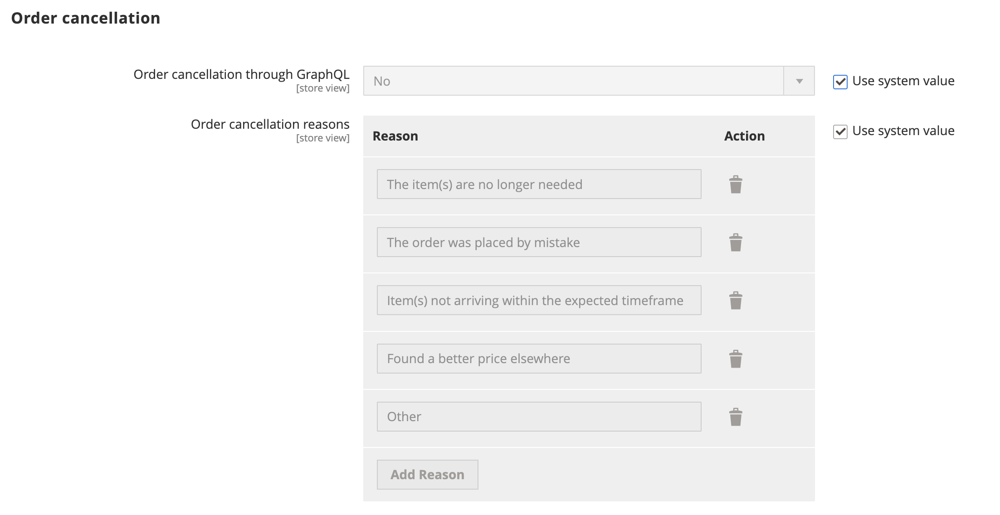
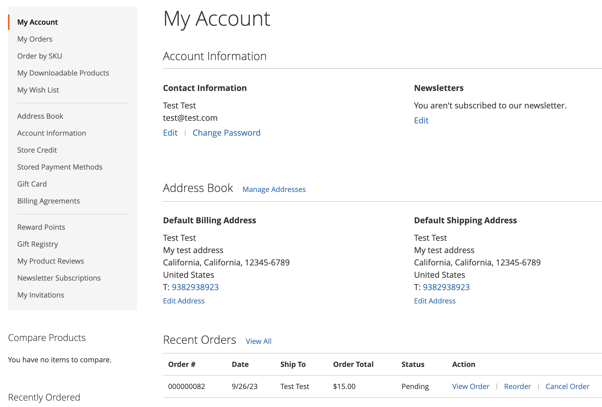

# Permitir cancelamento da ordem

Quando ativado, você pode cancelar um pedido diretamente da conta do cliente. Cancelar está desativado por padrão.

## Critérios para habilitar o cancelamento de um pedido

- A opção de configuração _Permitir Cancelar Ordem_ deve estar habilitada.

- Se a ordem estiver com o status `Hold`, `Canceled`, `Complete` ou `Closed`, a opção de cancelamento será desabilitada na loja.

- Se algum dos itens na ordem tiver sido enviado, a opção de cancelamento estará desativada na loja.

- Se houver algum item pago, a opção de cancelamento será ativada e o reembolso será criado para esse item.

- Se a ordem estiver com o status `Pending` ou `Processing`, a opção de cancelamento será habilitada na vitrine eletrônica.

## Configurar o para permitir o cancelamento do cliente e personalizar os motivos do cancelamento

1. Na barra lateral _Admin_, vá para **[!UICONTROL Stores]** > _[!UICONTROL Settings]_>**[!UICONTROL Configuration]**.

1. No painel esquerdo, expanda **[!UICONTROL Sales]** e selecione **[!UICONTROL Sales]**.

1. Expandir  a seção **[!UICONTROL Order cancellation]**.

   {width="600" zoomable="yes"}

1. Defina **[!UICONTROL Order cancellation through GraphQL]** como `Yes`.

   Essa configuração habilita a funcionalidade de cancelamento da conta do cliente na loja.

1. No **[!UICONTROL Order Order cancellation reasons]**, você pode adicionar, excluir ou modificar qualquer motivo de cancelamento.

   Com essa configuração, os motivos do cancelamento são exibidos na loja para o cliente quando ele cancela um pedido.
Verifique se você especificou pelo menos um motivo.

1. Clique em **[!UICONTROL Save Config]**.

## Cancelar da loja

Um cliente pode iniciar a funcionalidade de cancelamento para um pedido específico a partir de três páginas:

- Página _Meus Pedidos_

- Página _Exibição do pedido_

- Página _Minha conta_

### Meus Pedidos

O botão _Cancelar Pedido_ será exibido na página Meus Pedidos se o pedido puder ser cancelado.

{width="700" zoomable="yes"}

### Página de exibição de pedidos

O botão _Cancelar Pedido_ será exibido na página Exibir Pedido se o pedido puder ser cancelado.

{width="700" zoomable="yes"}

### Minha conta

O botão _Cancelar pedido_ será exibido na seção Pedidos recentes da página Minha conta, se o pedido puder ser cancelado.

{width="700" zoomable="yes"}
