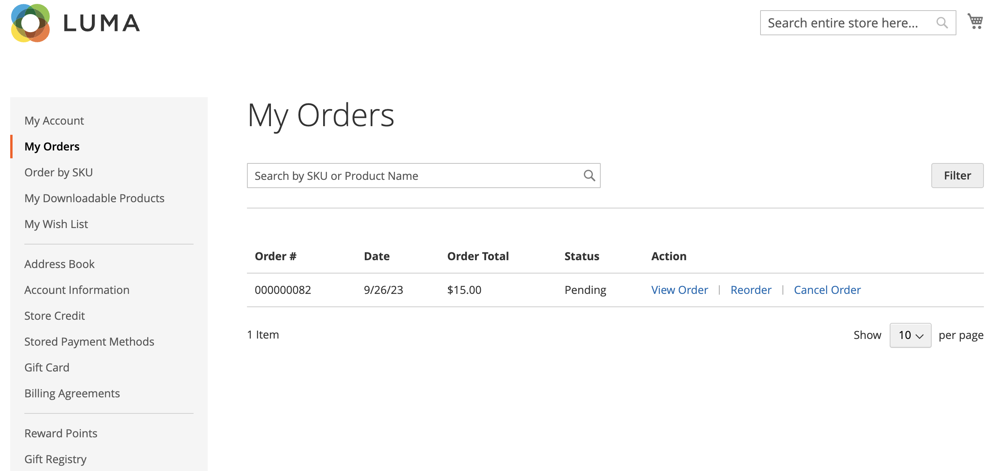

# Permitir cancelamento da ordem

Quando ativado, você pode cancelar um pedido diretamente da conta do cliente. Cancelar está desativado por padrão.

## Critérios para habilitar o cancelamento de um pedido

- A variável _Permitir cancelamento do pedido_ a opção de configuração deve estar habilitada.

- Se a ordem estiver em `Hold`, `Canceled`, `Complete`ou `Closed` status, a opção de cancelamento está desativada na loja.

- Se algum dos itens na ordem tiver sido enviado, a opção de cancelamento estará desativada na loja.

- Se houver algum item pago, a opção de cancelamento será ativada e o reembolso será criado para esse item.

- Se a ordem estiver em `Pending` ou `Processing` status, a opção de cancelamento é ativada na loja.

## Configurar o para permitir o cancelamento do cliente e personalizar os motivos do cancelamento

1. No _Admin_ barra lateral, vá para **[!UICONTROL Stores]** > _[!UICONTROL Settings]_>**[!UICONTROL Configuration]**.

1. No painel esquerdo, expanda **[!UICONTROL Sales]** e selecione **[!UICONTROL Sales]**.

1. Expandir  o **[!UICONTROL Order cancellation]** seção.

   {width="600" zoomable="yes"}

1. Definir **[!UICONTROL Order cancellation through GraphQL]** para `Yes`.

   Essa configuração habilita a funcionalidade de cancelamento da conta do cliente na loja.

1. No **[!UICONTROL Order Order cancellation reasons]** você pode adicionar, excluir ou modificar qualquer motivo de cancelamento.

   Com essa configuração, os motivos do cancelamento são exibidos na loja para o cliente quando ele cancela um pedido.
Verifique se você especificou pelo menos um motivo.

1. Clique em **[!UICONTROL Save Config]**.

## Cancelar da loja

Um cliente pode iniciar a funcionalidade de cancelamento para um pedido específico a partir de três páginas:

- _Meus Pedidos_ página

- _Visualização do pedido_ página

- _Minha conta_ página

### Meus Pedidos

A variável _Cancelar pedido_ será exibido na página Meus pedidos se o pedido puder ser cancelado.

{width="700" zoomable="yes"}

### Página de exibição de pedidos

A variável _Cancelar pedido_ será exibido na página Exibir Ordem se a ordem puder ser cancelada.

{width="700" zoomable="yes"}

### Minha conta

A variável _Cancelar pedido_ será exibido na seção Pedidos recentes da página Minha conta, se o pedido puder ser cancelado.

{width="700" zoomable="yes"}

