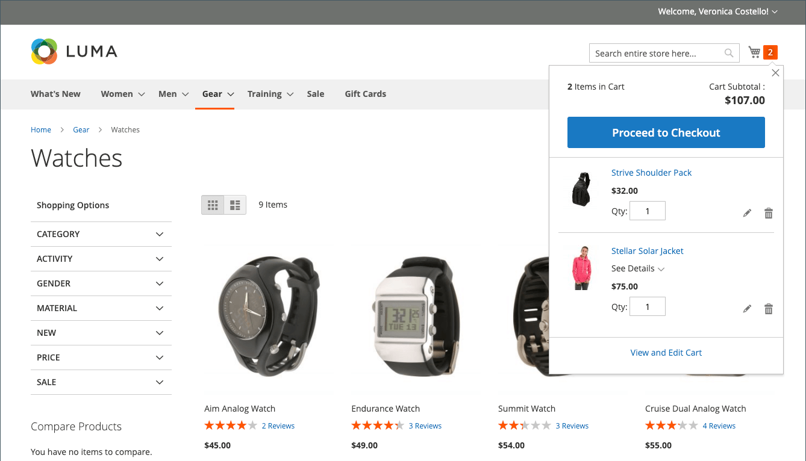

# Configuração do carrinho

A configuração do carrinho determina como o carrinho de compras funciona para os clientes da loja, incluindo quando o cliente é redirecionado para a página do carrinho e quais imagens são usadas para miniaturas de produtos. Você também pode exigir que um pedido atinja uma quantia mínima antes do início do processo de finalização, especificar o número de dias em que os preços cotados permanecem válidos e especificar a ordem dos itens no _Totais do pedido_ seção.

[**Mini carrinho**](#mini-cart) - Configure essa opção para determinar se o link/ícone do carrinho exibe o número de produtos diferentes (ou SKUs) no carrinho ou a quantidade total de todos os itens.

[**Link do minicarrinho**](#configure-the-cart-link) - Configure essa opção para determinar se o minicarrinho aparece quando um cliente clica no número de itens no ícone do carrinho na parte superior de uma página de loja.

[**Redirecionar para carrinho**](#redirect-to-cart)- Configure essa opção para determinar se a página do carrinho de compras é exibida sempre que um item é adicionado ao carrinho ou somente quando um cliente opta por ir para a página.

[**Tempo de vida da cotação**](#quote-lifetime) - Configure essa opção para especificar por quanto tempo um preço é válido.

[**Valor mínimo da ordem**](#minimum-order-amount) - Configure essas opções para especificar um valor mínimo, após a aplicação de descontos, que os subtotais da ordem devem atender e as mensagens exibidas no carrinho de compras.

[**Quantidade mínima da ordem**](#minimum-order-quantity) - Configure essas opções para especificar um número mínimo de itens necessários para fazer um pedido.

[**Miniaturas do carrinho**](#cart-thumbnails)  - Configure as opções de miniatura do carrinho para determinar as miniaturas exibidas no carrinho para produtos agrupados ou configuráveis.

[**Opções de presente**](#gift-options) - Configure as opções de presente para determinar se os clientes podem adicionar uma mensagem de presente ou um cartão-presente e se as opções de invólucro de presente estão disponíveis.

>[!NOTE]
>
>Para obter informações sobre como configurar o processo de finalização, consulte [Opções de check-out](checkout-process.md).

## Mini carrinho

A variável _mini carrinho_ exibe um resumo dos itens no carrinho. Ela é ativada por padrão e é exibida ao clicar no link Carrinho na parte superior da página.
O link pode ser configurado para exibir o número de produtos diferentes (ou SKUs) no carrinho ou a quantidade total de todos os itens.

{width="700" zoomable="yes"}

>[!NOTE]
>
>Para um _registrado_ cliente, há casos em que o Mini carrinho pode não ser sincronizado entre os vários dispositivos e navegadores automaticamente. Para sincronizar o Minicarrinho nesses casos, o cliente pode simplesmente abrir o [Carrinho de compras](cart.md) nesse dispositivo ou navegador.

### Configurar o minicarrinho

1. No _Admin_ barra lateral, vá para **[!UICONTROL Stores]** > _[!UICONTROL Settings]_>**[!UICONTROL Configuration]**.

1. No painel esquerdo, expanda **[!UICONTROL Sales]** e escolha **[!UICONTROL Checkout]**.

1. Expandir  o _[!UICONTROL Mini Cart]_seção.

   {width="600" zoomable="yes"}

1. Se a configuração for para uma exibição de loja específica, [escolher a exibição de loja](../configuration-reference/scope-change.md#set-the-scope) onde a configuração se aplica.

   Quando solicitado, clique em **[!UICONTROL OK]** para continuar.

1. Definir **[!UICONTROL Display Mini Cart]** a um dos seguintes:

   - `Yes` - Exibe o mini carrinho nas páginas da loja. A aparência da barra lateral depende do tema.
   - `No` - Desativa a exibição do mini carrinho nas páginas da loja.

1. Se a exibição estiver ativada, atualize as outras opções para configurar a exibição:

   - Para **[!UICONTROL Number of Items to Display Scrollbar]**, insira o número de itens que podem aparecer na barra lateral antes que a barra de rolagem seja acionada.
   - Para **[!UICONTROL Maximum Display Recently Added Item(s)]**, insira o número máximo de itens adicionados recentemente que você deseja que apareçam no minicarrinho.

1. Clique em **[!UICONTROL Save Config]**.

### Configurar o link do carrinho

1. No _Admin_ barra lateral, chegou a **[!UICONTROL Stores]** > _[!UICONTROL Settings]_>**[!UICONTROL Configuration]**.

1. No painel esquerdo, expanda **[!UICONTROL Sales]** e escolha **[!UICONTROL Checkout]**.

1. Expandir  o **[!UICONTROL My Cart Link]** seção.

1. Definir **[!UICONTROL Display Cart Summary]** para uma das seguintes configurações:

   - `Display item quantities` - Esta configuração exibe o número total de produtos no carrinho, adicionando as quantidades de cada produto.
   - `Display number of items in cart` - Esta configuração exibe o número de itens de produto no carrinho, independentemente da quantidade.

   {width="600" zoomable="yes"}

1. Clique em **[!UICONTROL Save Config]**.

## Redirecionar para carrinho

A página do carrinho de compras pode ser configurada para aparecer sempre que um item for adicionado ao carrinho ou somente quando os clientes optam por ir até a página. As informações básicas sobre os itens que estão no carrinho estão sempre disponíveis no [mini carrinho](#mini-cart). A decisão é uma questão de equilibrar os benefícios de permitir que os clientes continuem comprando, com os benefícios de incentivar os clientes a prosseguir para a finalização da compra. Pode ser uma simples questão de preferência pessoal. No entanto, se você quiser fazer backup com números, execute um teste A/B para ver qual abordagem produz uma taxa de conversão mais alta.

**_Para configurar quando o carrinho é exibido:_**

1. No _Admin_ barra lateral, vá para **[!UICONTROL Stores]** > _[!UICONTROL Settings]_>**[!UICONTROL Configuration]**.

1. No painel esquerdo, expanda **[!UICONTROL Sales]** e escolha **[!UICONTROL Checkout]**.

1. Expandir  o **[!UICONTROL Shopping Cart]** seção.

   {width="600" zoomable="yes"}

1. Se a configuração for para uma exibição de loja específica, [escolher a exibição de loja](../configuration-reference/scope-change.md#set-the-scope) onde a configuração se aplica.

   Quando solicitado, clique em **[!UICONTROL OK]** para continuar.

1. Definir **[!UICONTROL After Adding a Product Redirect to Shopping Cart]** a um dos seguintes:

   - `Yes` - Exibe a página do carrinho de compras imediatamente após um produto ser adicionado ao carrinho.
   - `No` - Desativa o redirecionamento para o carrinho de compras após uma adição de produto ao carrinho.

1. Clique em **[!UICONTROL Save Config]**.

## Tempo de vida da cotação

Com a instalação e a ativação do B2B para o Adobe Commerce, você pode adicionar suporte para o _Aspas_ recurso. Esse recurso permite que compradores autorizados iniciem o processo de negociação de preços submetendo uma solicitação do carrinho de compras. A variável _Aspas_ A grade lista cada cotação recebida e mantém um histórico da comunicação entre comprador e vendedor. Para obter mais informações sobre os recursos B2B, consulte [Cotações negociadas](../b2b/quotes.md) no _Guia do usuário B2B para Adobe Commerce_.

Você pode determinar por quanto tempo um preço é válido definindo o tempo de vida da cotação do carrinho na configuração. Por exemplo, se um comprador deixar um carrinho sem supervisão após vários dias, o preço das cotações de alguns itens poderá não ser mais o mesmo. Por padrão, o tempo de vida da cotação é definido como 30 dias.

**_Para configurar o tempo de vida da cotação:_**

1. No _Admin_ barra lateral, vá para **[!UICONTROL Stores]** > _[!UICONTROL Settings]_>**[!UICONTROL Configuration]**.

1. No painel esquerdo, expanda **[!UICONTROL Sales]** e escolha **[!UICONTROL Checkout]**.

1. Expandir  o **[!UICONTROL Shopping Cart]** seção.

   {width="600" zoomable="yes"}

1. Se a configuração for para uma exibição de loja específica, [escolher a exibição de loja](../configuration-reference/scope-change.md#set-the-scope) onde a configuração se aplica.

   Quando solicitado, clique em **[!UICONTROL OK]** para continuar.

1. Para **[!UICONTROL Quote Lifetime (days)]**, informe o número de dias em que um preço cotado permanece válido.

1. Clique em **[!UICONTROL Save Config]**.

## Valor mínimo da ordem

A configuração permite especificar um valor mínimo, após a aplicação de descontos, que os subtotais da ordem devem atender. Os pedidos enviados para vários endereços podem ser solicitados para atender ao valor mínimo de pedido por endereço. O botão Check-out fica disponível somente depois que o valor mínimo do pedido é atingido.

{width="700" zoomable="yes"}

**_Para configurar um valor de pedido mínimo:_**

1. No _Admin_ barra lateral, vá para **[!UICONTROL Stores]** > _[!UICONTROL Settings]_>**[!UICONTROL Configuration]**.

1. No painel esquerdo, expanda **[!UICONTROL Sales]** e escolha **[!UICONTROL Sales]** por baixo.

1. Expandir  o **[!UICONTROL Minimum Order Amount]** seção.

   {width="600" zoomable="yes"}

1. Para exigir um valor mínimo do pedido, defina **[!UICONTROL Enable]** para `Yes`.

1. Se a ordem mínima estiver habilitada, defina as seguintes opções para configurar o requisito:

   - Insira o **[!UICONTROL Minimum Amount]** que é necessário para o subtotal, após a aplicação de descontos.

   - Definir **[!UICONTROL Include Discount Amount]** a um dos seguintes:

      - `Yes` - Exige que o subtotal atenda ao valor mínimo com todos os descontos incluídos. Usando um exemplo de um mínimo de US$ 50, se o carrinho contiver um superior de US$ 60 com um desconto de 25% aplicado, o subtotal resultante será de US$ 45 e o carrinho não atenderá ao mínimo.
      - `No` - Exige que o subtotal atenda ao valor mínimo sem descontos.

   - Definir **[!UICONTROL Include Tax to Amount]** a um dos seguintes:

      - `Yes` - Exige que o subtotal atenda ao valor mínimo com o imposto incluído.
      - `No` - Exige que o subtotal atenda ao valor mínimo sem impostos.

1. Opcionalmente, personalize as configurações de mensagem da quantia mínima da ordem:

   - Para **[!UICONTROL Description Message]**, digite o texto que deseja usar para personalizar a mensagem que aparece na parte superior do carrinho quando o subtotal não atende à quantidade mínima.

   - Para **[!UICONTROL Error to Show in Shopping Cart]**, digite o texto que deseja usar para personalizar a mensagem de erro do carrinho de compras.

   Deixe os campos de descrição da mensagem vazios para usar as mensagens padrão.

1. Se necessário, defina a configuração de valor mínimo do pedido para pedidos com vários endereços:

   - Para exigir que cada endereço em um pedido de vários endereços atenda ao valor mínimo do pedido, defina **[!UICONTROL Validate Each Address Separately in Multi-address Checkout]** para `Yes`.

   - Opcionalmente, personalize as configurações de mensagem da quantia mínima da ordem:

      - **[!UICONTROL Multi-address Description Message]** - Digite o texto que deseja usar para personalizar a mensagem que aparece na parte superior do carrinho para pedidos de vários endereços que não atendem ao mínimo.

      - **[!UICONTROL Multi-address Error to Show in Shopping Cart]** - Digite o texto que deseja usar para personalizar a mensagem de erro do carrinho de compras para pedidos de vários endereços que não atendam ao mínimo. Digite o texto na caixa.

     Deixe os campos de descrição da mensagem vazios para usar as mensagens padrão.

1. Clique em **[!UICONTROL Save Config]**.

## Quantidade mínima da ordem

Você pode definir a quantidade mínima permitida para um pedido. A quantidade mínima também pode ser configurada de acordo com cada grupo de clientes.

1. Ir para **[!UICONTROL Stores]** > _[!UICONTROL Settings]_>**[!UICONTROL Configuration]**.

1. No painel esquerdo, expanda **[!UICONTROL Catalog]** e escolha **[!UICONTROL Inventory]**.

1. Expandir  o **[!UICONTROL Product Stock Options]** seção.

   {width="600" zoomable="yes"}

1. Para **[!UICONTROL Minimum Qty Allowed in Shopping Cart]**, defina a quantidade mínima do produto para um pedido.

   Se necessário, limpe a caixa de seleção **[!UICONTROL Use system value]** para modificar essas configurações.

   - Altere o **[!UICONTROL Customer Group]** para um grupo específico e insira a variável **[!UICONTROL Minimum Qty]** para esse grupo. Para adicionar outro grupo e limite de quantidade, clique em **[!UICONTROL Add Minimum Qty]**.

   - Para definir o mesmo limite de quantidade mínima para todos os clientes, mantenha a `ALL GROUPS` selecione e insira o **[!UICONTROL Minimum Qty]**.

1. Clique em **[!UICONTROL Save Config]**.

   {width="700" zoomable="yes"}

## Miniaturas do carrinho

 (somente Adobe Commerce)

As imagens em miniatura exibidas no carrinho fornecem aos clientes uma visão geral rápida dos itens que eles estão prestes a comprar. No entanto, para produtos com várias opções, a imagem pode não corresponder à variação do produto que está no carrinho. Se o cliente comprar um item em uma cor específica, o ideal é que a miniatura no carrinho corresponda a.

A imagem em miniatura de produtos agrupados e configuráveis pode ser definida para exibir a imagem do produto &quot;principal&quot; ou da variação do produto.

{width="700" zoomable="yes"}

**_Para configurar as miniaturas do carrinho:_**

1. No _Admin_ barra lateral, vá para **[!UICONTROL Stores]** > _[!UICONTROL Settings]_>**[!UICONTROL Configuration]**.

1. No painel esquerdo, expanda **[!UICONTROL Sales]** e escolha **[!UICONTROL Checkout]**.

1. Expandir  o **[!UICONTROL Shopping Cart]** seção.

   {width="600" zoomable="yes"}

1. Definir **[!UICONTROL Grouped Product Image]** para determinar a miniatura usada no carrinho para [produtos agrupados](../catalog/product-create-grouped.md):

   - `Product Thumbnail Itself` - Usa a miniatura atribuída à variação de produto adicionada ao carrinho.
   - `Parent Product Thumbnail` - Usa a miniatura atribuída ao produto principal.

1. Definir **[!UICONTROL Configurable Product Image]** para determinar a miniatura usada no carrinho para [produtos configuráveis](../catalog/product-create-configurable.md):

   - `Product Thumbnail Itself` - Usa a miniatura atribuída à variação de produto adicionada ao carrinho.
   - `Parent Product Thumbnail` - Usa a miniatura atribuída ao produto principal.

1. Clique em **[!UICONTROL Save Config]**.

## Opções de presente

A seleção de opções de presentes disponíveis é exibida no carrinho antes do início do processo de finalização. A configuração de opções de presente determina se os clientes podem adicionar uma mensagem de presente ou cartão-presente e se as opções de invólucro de presente estão disponíveis. Cada item na ordem pode ter uma mensagem separada e um invólucro do presente. Quando aplicado a todo o pedido, os clientes também podem adicionar um recibo de presente e um cartão de mensagem.

{width="700" zoomable="yes"}

A configuração de Opções de presente se aplica a todo o site, mas pode ser substituída no nível do produto.

### Ativar opções de presente

1. No _Admin_ barra lateral, vá para **[!UICONTROL Stores]** > _[!UICONTROL Settings]_>**[!UICONTROL Configuration]**.

1. No painel esquerdo, expanda **[!UICONTROL Sales]** e escolha **[!UICONTROL Sales]** por baixo.

1. Expandir  **[!UICONTROL Gift Options]** na página.

   {width="600" zoomable="yes"}

1. Defina as opções de mensagem de presente de acordo com sua preferência:

   - Para **[!UICONTROL Allow Gift Messages on Order Level]**, selecione `Yes` para habilitar uma única mensagem de presente para todo o pedido.
   - Para **[!UICONTROL Allow Gift Messages for Order Items]**, selecione `Yes` para permitir a adição de mensagens de presente separadas para itens individuais no carrinho de compras do cliente.

1.  (Somente no Adobe Commerce) Defina as opções de invólucro do presente de acordo com sua preferência:

   - Para **[!UICONTROL Allow Gift Wrapping on Order Level]**, selecione `Yes` para habilitar um invólucro de presente único para todo o pedido.
   - Para **[!UICONTROL Allow Gift Wrapping for Order Items]**, selecione `Yes` para habilitar a adição de invólucro de presente individualmente para cada item no carrinho de compras do cliente.

   Você também pode definir diferentes [designs de embrulhar para presente](#gift-wrap) para que os clientes possam escolher o invólucro.

1.  (Somente Adobe Commerce) Para fornecer aos clientes uma opção para incluir um recibo de presente, defina **[!UICONTROL Allow Gift Receipt]** para `Yes`.

1.  (Somente Adobe Commerce) Para fornecer aos clientes a opção de incluir um cartão impresso, defina **[!UICONTROL Allow Printed Card]** para `Yes`.

1.  (Somente Adobe Commerce) Insira o **[!UICONTROL Default Price for Printed Card]**.

1. Clique em **[!UICONTROL Save Config]**.

### Invólucro de presente

 (somente Adobe Commerce)

O invólucro do presente está disponível para qualquer produto que possa ser enviado e pode ser oferecido para itens individuais ou para o pedido inteiro. Você pode cobrar um preço separado para cada design de invólucro de presente e fazer upload de uma imagem em miniatura para cada design que aparece como uma opção para um produto no carrinho. Quando um cliente clica na miniatura do invólucro do presente, uma imagem em tamanho normal é exibida. Durante a revisão do checkout, o encargo do invólucro do presente é exibido com o outro [totais de check-out](checkout-totals-sort-order.md) no _Resumo do pedido_ seção.

A imagem do invólucro do presente deve ser uma amostra que mostre o padrão de repetição e também pode incluir uma amostra da faixa de opções a ser usada. Você pode escanear o papel ou tirar uma fotografia de um pacote embrulhado. A imagem carregada pode ser uma imagem GIF, JPG ou PNG e deve ser quadrada. No exemplo a seguir, a imagem de invólucro do presente carregada é de 230 x 230 pixels.

{width="700" zoomable="yes"}

#### Adicionar um design de invólucro de presente

1. No _Admin_ barra lateral, vá para **[!UICONTROL Stores]** > _[!UICONTROL Other Settings]_>**[!UICONTROL Gift Wrapping]**.

   {width="700" zoomable="yes"}

1. No canto superior direito, clique em **[!UICONTROL Add Gift Wrapping]**.

1. Insira o nome da variável **[!UICONTROL Gift Wrapping Design]** para aparecer durante o check-out.

   Se necessário, você pode alterar a variável **[!UICONTROL Scope]** e configure um nome diferente para cada exibição de loja.

1. Selecione o **[!UICONTROL Websites]** onde o design do invólucro do presente está disponível.

1. Definir **[!UICONTROL Status]** para `Enabled`.

   Se você tiver a opção de quebra de linha sazonal, poderá configurá-la como `Disabled` quando não quiser que a opção esteja disponível.

1. Insira o **[!UICONTROL Price]** do design do invólucro de presente.

   Essa configuração pode ser substituída pelo preço do invólucro do presente definido no nível do produto.

   {width="600" zoomable="yes"}

1. Para carregar uma miniatura **[!UICONTROL Image]** da embalagem do presente, clique em **[!UICONTROL Choose File]** e selecione o arquivo a ser carregado do seu diretório.

   Uma miniatura da imagem aparece no _[!UICONTROL Gift Wrapping Information]_após salvar o registro.

1. Clique em **[!UICONTROL Save]**.

#### Editar um design de invólucro de presente

1. No _Admin_ barra lateral, vá para **[!UICONTROL Stores]** > _[!UICONTROL Other Settings]_>**[!UICONTROL Gift Wrapping]**.

1. Localize o registro de invólucro do presente na lista.

1. No _Ação_ clique em **[!UICONTROL Edit]**.

   {width="600" zoomable="yes"}

1. Faça as alterações necessárias.

1. Clique em **[!UICONTROL Save]**.

#### Excluir designs de invólucro de presente

Com o _Invólucro do presente_ abrir grade, use um destes métodos para excluir designs de quebra automática.

**_Método 1: excluir um único design de invólucro de presente_**

1. Abra o design de invólucro do presente no modo de edição.

1. Na parte superior do espaço de trabalho, clique em **[!UICONTROL Delete]**.

1. Quando solicitado, clique em **[!UICONTROL OK]** para confirmar.

**_Método 2: excluir vários designs de invólucro de presente_**

1. No _Invólucro do presente_ marque a caixa de seleção de cada design de invólucro de presente que deseja excluir.

1. Defina o **[!UICONTROL Actions]** controle para `Delete`.

1. Clique em **[!UICONTROL Submit]**.

### Imposto sobre opções de presente

 (somente Adobe Commerce)

Os preços de embalagem de presentes e cartão-presente impresso podem ser configurados para incluir ou excluir imposto, ou para exibir ambas as opções. Você também pode especificar uma classe de imposto para esses itens, no nível global ou no nível do site.

**_Para configurar impostos de opções de presente:_**

1. No _Admin_ barra lateral, vá para **[!UICONTROL Stores]** > _[!UICONTROL Settings]_>**[!UICONTROL Configuration]**.

1. No painel esquerdo, expanda **[!UICONTROL Sales]** e escolha **[!UICONTROL Tax]**.

1. Expandir  o **[!UICONTROL Tax Classes]** seção.

   {width="600" zoomable="yes"}

1. Definir **[!UICONTROL Tax Class for Gift Options]** à classe de imposto aplicável.

1. Expandir  o **[!UICONTROL Orders, Invoices, Credit Memos Display Settings]** seção.

   {width="600" zoomable="yes"}

1. Definir **[!UICONTROL Display Gift Wrapping Prices]** a um dos seguintes:

   - `Excluding Tax`
   - `Including Tax`
   - `Including and Excluding Tax`

1. Definir **[!UICONTROL Display Printed Card Prices]** a um dos seguintes:

   - `Excluding Tax`
   - `Including Tax`
   - `Including and Excluding Tax`

1. Clique em **[!UICONTROL Save Config]**.
