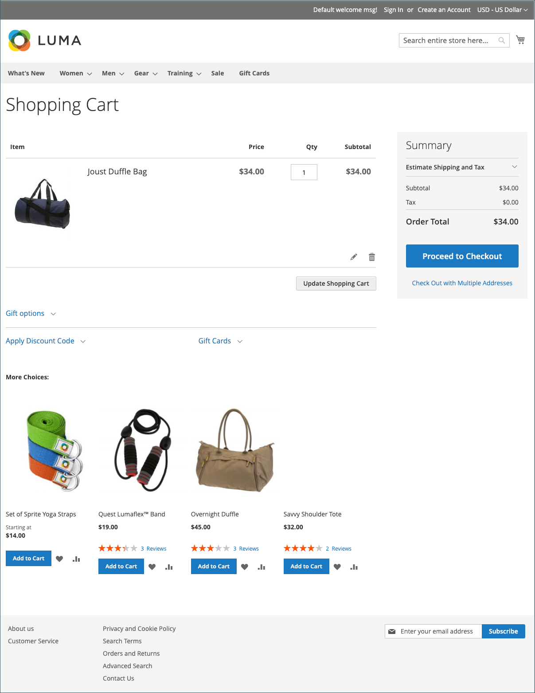

# Carrinho de compras

O carrinho está posicionado no final do caminho de compra, na interseção de _Comprar_ e _Abandonar_, e é uma das páginas mais importantes da sua loja. O carrinho é onde o total do pedido é calculado, juntamente com cupons de desconto e remessa e imposto estimados. É um ótimo lugar para mostrar seus crachás de confiança e selos, e uma oportunidade ideal para oferecer um último item. Você pode escolher os itens a serem oferecidos como uma compra por impulso de venda cruzada sempre que um item específico aparecer no carrinho.

{width="700" zoomable="yes"}

- Configure as [opções do carrinho de compras](cart-configuration.md) para determinar quais ferramentas estão disponíveis aos compradores e modificar a exibição.
- Configure o comportamento [persistência do carrinho](cart-persistent.md) para ajudar os compradores a reter o conteúdo do carrinho.
- Adicione o widget [Pedir por SKU](order-by-sku.md) como conveniência para todos os compradores, ou apenas para compradores em grupos de clientes específicos, para inserir as informações de SKU e quantidade diretamente em uma página.
