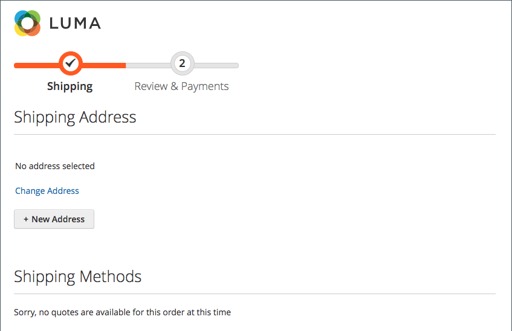

# Pesquisa de endereço no check-out

{{ee-feature}}

Seus clientes podem ter muitos endereços e informações salvos em seu catálogo de endereços, especialmente clientes recorrentes ou empresas que informam vários pedidos e locais de entrega. A exibição de muitos endereços pode retardar consideravelmente o carregamento de check-out e os processos, além de resultar em uma experiência de compra negativa. Para ajudar a aumentar a capacidade de resposta do checkout, é recomendável ativar e configurar a pesquisa de endereço para o seu site.

>[!NOTE]
>
>A pesquisa de endereço não está habilitada por padrão. Você pode configurar esse recurso para incluir a funcionalidade em seu site.

Quando esse recurso estiver ativado e o número de endereços salvos do cliente atender ou exceder o limite configurado, a variável _Envio_ e _Revisão e Pagamentos_ as etapas exibem apenas um endereço (o padrão). O cliente pode alterar o endereço selecionado clicando em **Alterar endereço** e, em seguida, procure o endereço correto por cidade, estado, rua ou CEP. Este recurso também oferece suporte à seleção de endereços para check-out de registro de presente.

{width="700" zoomable="yes"}

Se o cliente não tiver um endereço de entrega padrão, a variável _Envio_ exibições de página _Nenhum endereço selecionado_. Nesse caso, o cliente deve clicar em **Alterar endereço** para selecionar um endereço salvo ou clique em **Novo endereço** para adicionar e selecionar um endereço antes de prosseguir com a finalização da compra. Se o cliente não tiver um endereço de faturamento padrão, a variável _Revisão e Pagamentos_ exibe o endereço selecionado para envio junto com o _Alterar endereço_ opção.

{width="600" zoomable="yes"}

## Pesquisa de endereço bloqueado por cotações

 (Disponível com B2B somente para Adobe Commerce)

A ativação da pesquisa de endereço também afeta o check-out de pedidos criados a partir de cotações em que o número de endereços salvos do cliente atende ou excede o limite configurado. Quando a cotação estiver concluída e o cliente prosseguir para o checkout, somente o endereço de entrega selecionado será exibido. A página também exibe uma mensagem de que o endereço de entrega está bloqueado e só pode ser alterado na cotação.

{width="600" zoomable="yes"}

## Habilitar pesquisa de endereço

1. No _Admin_ barra lateral, vá para **[!UICONTROL Stores]** > _[!UICONTROL Settings]_>**[!UICONTROL Configuration]**.

1. No painel esquerdo, expanda **[!UICONTROL Sales]** e escolha **[!UICONTROL Checkout]**.

1. Expandir  o **[!UICONTROL Checkout Options]** seção.

   {width="700" zoomable="yes"}

   Para obter uma descrição detalhada de cada uma dessas configurações, consulte [Opções de check-out](../configuration-reference/sales/checkout.md#checkout-options) no _Guia de referência de configuração_.

1. Definir **[!UICONTROL Enable Address Search]** para `Yes`.

1. Para especificar o limite para incluir o recurso de pesquisa de endereço, defina o **[!UICONTROL Number of Customer Addresses Limit]** opção.

   Se necessário, limpe a **[!UICONTROL Use system value]** para fazer essa alteração.

   Quando o número de endereços salvos do cliente atender ou exceder esse limite, a página exibirá o endereço padrão (se o cliente tiver um) ou _Nenhum endereço selecionado_ com o _Alterar endereço_ opção. O limite padrão é `10`.

1. Clique em **[!UICONTROL Save Config]**.
