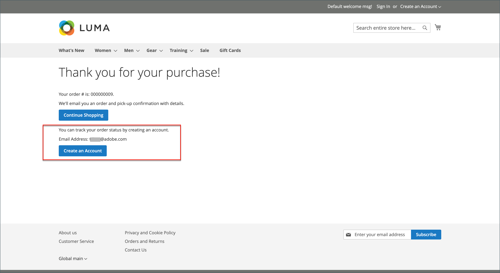

# Check-out de convidado

Sua loja pode ser configurada para exigir que os compradores abram uma conta antes de fazer uma compra. A configuração padrão permite que os convidados façam compras, com uma opção para se registrarem em uma conta depois de concluírem o processo de finalização.

{width="600" zoomable="yes"}

**_Para desabilitar o check-out do convidado:_**

1. Na barra lateral _Admin_, vá para **[!UICONTROL Stores]** > _[!UICONTROL Settings]_>**[!UICONTROL Configuration]**.

1. No painel esquerdo, expanda **[!UICONTROL Sales]** e escolha **[!UICONTROL Checkout]**.

1. Expandir  a seção **[!UICONTROL Checkout Options]**.

   {width="700" zoomable="yes"}

Para obter uma descrição detalhada de cada uma dessas configurações, consulte [Opções de Check-out](../configuration-reference/sales/checkout.md#checkout-options) no _Guia de Referência de Configuração_.

1. Se a configuração for para um modo de exibição de repositório específico, [escolha o modo de exibição de repositório](../configuration-reference/scope-change.md#set-the-scope) ao qual a configuração se aplica.

   Quando solicitado, clique em **[!UICONTROL OK]** para continuar.

1. Defina **[!UICONTROL Allow Guest Checkout]** como `No`.

   Se necessário, desmarque a caixa de seleção **[!UICONTROL Use system value]** para habilitar alterações nessa configuração.

1. Clique em **[!UICONTROL Save Config]**.
