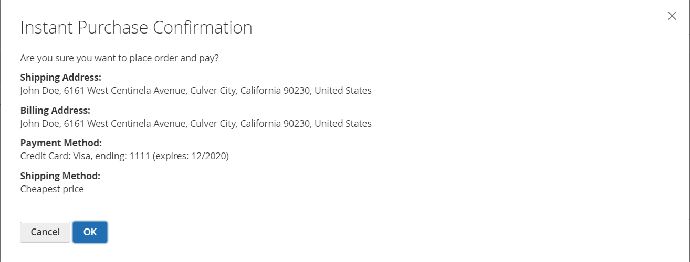
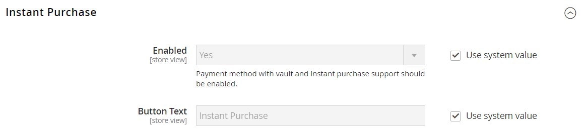

# Compra instantânea

A _Compra instantânea_ permite que os clientes acelerem o processo de finalização usando informações salvas em suas contas. Quando habilitado, o botão _Compra Instantânea_ aparece abaixo do botão _Adicionar ao Carrinho_ na página do produto para clientes que atendem aos requisitos.

{width="700" zoomable="yes"}

## Requisitos do cliente

- O cliente [entrou](../customers/customer-sign-in.md) em sua conta.

- A conta do cliente tem um [endereço de entrega e cobrança padrão](../customers/account-dashboard-address-book.md).

- Pelo menos um [método de envio](delivery.md) está disponível para o país especificado no endereço de envio padrão.

- A conta do cliente tem um método de [pagamento armazenado](../stores-purchase/stored-payment-methods.md) com o cofre habilitado.

  Os métodos de pagamento a seguir podem ser usados para fornecer acesso seguro às informações salvas do cartão de crédito:

   - [Cartões de Crédito da Braintree](braintree.md) (a Compra Instantânea não poderá ser usada com Cartões de Crédito da Braintree se o 3D Secure estiver habilitado.)
   - [Braintree com PayPal habilitado](braintree.md)
   - [PayPal Payflow Pro](paypal-payflow-pro.md)

## Compra instantânea na loja

1. Na loja, o cliente vai para a página do produto do item a ser comprado.

1. Selecione as opções necessárias e clique em **[!UICONTROL Instant Purchase]**.

   {width="500" zoomable="yes"}

1. Examina as informações de **[!UICONTROL Instant Purchase Confirmation]** e clica em **[!UICONTROL OK]** para concluir a transação.

   Uma mensagem de confirmação e o número do pedido são exibidos na parte superior da página do produto.

## Configurar Compra Instantânea

### Etapa 1: abrir a página de configuração

1. Na barra lateral _Admin_, vá para **[!UICONTROL Stores]** > _[!UICONTROL Settings]_>**[!UICONTROL Configuration]**.

### Etapa 2: configurar o cofre do método de pagamento

Você pode usar a Compra instantânea com o Braintree ou os Serviços de pagamento para Adobe Commerce e Magento Open Source. A compartimentalização deve ser ativada antes que um comprador possa usar a função de Compra instantânea.

Saiba como configurar o método de pagamento e habilitar a compartimentação para Braintree ou Serviços de pagamento:

- [Braintree](braintree.md)
- [Documentação dos serviços de pagamento](https://experienceleague.adobe.com/docs/commerce/payment-services/guide-overview.html)

### Etapa 3: Habilitar Compra Instantânea

1. No painel esquerdo, abaixo da seção _[!UICONTROL Sales]_, escolha **[!UICONTROL Sales]**.

1. Expandir  a seção **[!UICONTROL Instant Purchase]**.

1. Se esta alteração for para um modo de exibição de repositório específico, [escolha o modo de exibição de repositório](../configuration-reference/scope-change.md#set-the-scope) ao qual a configuração se aplica.

   Quando solicitado, clique em **[!UICONTROL OK]** para continuar.

1. Defina **[!UICONTROL Enabled]** como `Yes`.

1. Digite o **[!UICONTROL Button Text]** que você deseja que apareça no botão.

   O texto do botão pode ser alterado para cada exibição de armazenamento ou idioma. Por padrão, o texto do botão é `Instant Purchase`.

   {width="600" zoomable="yes"}

   Para obter uma descrição detalhada de cada uma dessas configurações, consulte [Compra Instantânea](../configuration-reference/sales/sales.md#instant-purchase) no _Guia de Referência de Configuração_.

1. Clique em **[!UICONTROL Save Config]**.

1. Quando solicitado a atualizar o cache, clique em **[!UICONTROL Cache Management]** na mensagem do sistema e siga as instruções para liberar o cache.
