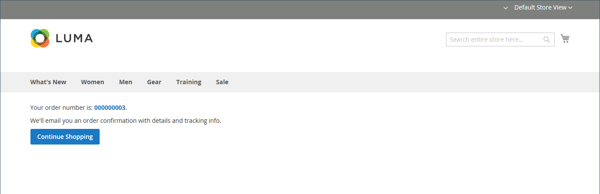

# Processo e opções de check-out

Quando o processo de finalização começa, a transação é transferida para um canal seguro e criptografado. Um símbolo de cadeado é exibido na barra de endereços do navegador, e a URL muda de `http` para `https`.

## Processo

O objetivo do processo de finalização é coletar as informações necessárias para concluir a transação. A página _Check-out_ guia o cliente em cada etapa do processo. Os clientes que estão conectados às suas contas podem concluir o check-out rapidamente, pois grande parte das informações já está em suas contas. Os clientes associados a uma conta de empresa que usa ordens de compra têm um fluxo de trabalho ligeiramente diferente.

### Envio

A primeira etapa do processo de finalização da compra é para o cliente completar as informações de endereço de entrega e escolher o método de entrega. Se o cliente tiver uma conta, o endereço de entrega será inserido automaticamente, mas poderá ser alterado se necessário.

 (somente Adobe Commerce) O formato do endereço do destinatário e do remetente é determinado pelas propriedades do [atributo de endereço do cliente](../customers/address-attributes.md). A configuração de validação de entrada determina os caracteres válidos que podem ser usados em um endereço de entrega.

A barra de progresso na parte superior da página segue cada etapa do processo de finalização e o Resumo do pedido mostra as informações inseridas até o momento.

{width="600" zoomable="yes"}

#### Enviar para outro endereço

1. Se houver entradas adicionais no catálogo de endereços, o cliente localizará o endereço para onde a ordem deve ser entregue.

1. Para selecionar o endereço, clique em **[!UICONTROL Ship Here]**.

#### Adicionar um endereço

1. Na parte inferior da seção _[!UICONTROL Shipping Address]_, o cliente clica em **[!UICONTROL + New Address]**.

1. Conclui o formulário _[!UICONTROL Shipping Address]_.

   Por padrão, o nome e o sobrenome do cliente aparecem inicialmente no formulário.

   {width="600" zoomable="yes"}

1. Para salvar o novo endereço no catálogo de endereços, o cliente marca a caixa de seleção na parte inferior do formulário.

1. Cliques **[!UICONTROL Save Address]**.

   O novo endereço agora está selecionado como o endereço de entrega.

   {width="600" zoomable="yes"}

#### Escolha o método de envio

1. Na lista de métodos de [remessa](delivery.md), o cliente escolhe a opção que deseja usar.

   {width="600" zoomable="yes"}

1. Clica em **[!UICONTROL Next]** para continuar.

### Revisão e Pagamentos - Ordem Regular

Durante a segunda etapa do processo de finalização, o cliente escolhe o [método de pagamento](payments.md) e aplica quaisquer cupons com códigos promocionais à compra. Todas as informações podem ser revisadas e editadas, se necessário. Se ativado, o cliente deve concordar com os termos e condições da venda antes de fazer o pedido.

>[!NOTE]
>
>Embora a Commerce permita configurar vários códigos de cupom, um cliente pode aplicar apenas um código de cupom ao carrinho. (Consulte os [Códigos do cupom](../merchandising-promotions/price-rules-cart-coupon.md) para obter mais informações.)

{width="700" zoomable="yes"}

### Revisar e Pagamentos - Ordem de Compra

 (Disponível somente com Adobe Commerce B2B)

Quando um cliente está associado a uma empresa que habilitou [ordens de compra](../b2b/purchase-order-flow.md), todas as ordens são processadas como ordens de compra. Os métodos de pagamento disponíveis são determinados pelas configurações da conta da empresa.

1. O cliente seleciona um método de pagamento.

   Ao usar o método _Pagamento na Conta_, o campo [!UICONTROL Custom Reference Number] pode ser usado para fazer referência a um número de fatura.

1. O cliente clica em **[!UICONTROL Place Purchase Order]**.

   A ordem de compra é feita.

Se a empresa tiver configurado [regras de aprovação](../b2b/account-dashboard-approval-rules.md), a ordem de compra passará pelo processo de aprovação. Caso contrário, será processado imediatamente.

{width="700" zoomable="yes"}

### Número de itens exibidos no resumo do pedido

Os usuários administradores podem alterar o número máximo de itens exibidos no resumo do pedido no check-out para simplificar a exibição com menos produtos. Por padrão, esse valor é definido como 10.

{width="700" zoomable="yes"}

1. Na barra lateral _Admin_, vá para **[!UICONTROL Stores]** > _[!UICONTROL Settings]_>**[!UICONTROL Configuration]**.

1. No painel esquerdo, expanda **[!UICONTROL Sales]** e escolha **[!UICONTROL Checkout]**.

1. Expandir  a seção **[!UICONTROL Checkout Options]**.

1. Para **[!UICONTROL Maximum Number of Items to Display in Order Summary]**, insira o número máximo de itens a serem exibidos.

1. Clique em **[!UICONTROL Save Config]**.

   Com essa atualização, o resumo do pedido exibido durante a finalização da compra fica limitado à quantidade especificada de itens.

### Confirmação de pedido

A confirmação do pedido é exibida depois que o pedido é feito. Para clientes registrados, a página inclui o número do pedido com um link para a conta do cliente e um link para gerar um recebimento. Os clientes registrados devem esperar a confirmação do pedido e as informações de rastreamento por email. Os convidados são incentivados a criar uma conta para rastrear o pedido. Os clientes registrados podem gerar um recebimento clicando em um link.

A página de confirmação de pedido também é chamada de página _Sucesso_, e é usada por programas de análise para rastrear conversões.

{width="700" zoomable="yes"}

## Opções de check-out

As opções de check-out controlam vários atributos da página de check-out, incluindo o layout. Há opções que você pode configurar para colocar restrições no check-out, incluindo a permissão do check-out do convidado e a aplicação de um contrato de termos e condições. Também há opções para controlar a exibição de informações durante o processo de finalização.

{width="700" zoomable="yes"}

Para obter uma descrição detalhada de cada uma dessas configurações, consulte [Opções de Check-out](../configuration-reference/sales/checkout.md#checkout-options) no _Guia de Referência de Configuração_.

### Alterar as opções de check-out

1. Na barra lateral _Admin_, vá para **[!UICONTROL Stores]** > _[!UICONTROL Settings]_>**[!UICONTROL Configuration]**.
1. No painel esquerdo, expanda **[!UICONTROL Sales]** e escolha **[!UICONTROL Checkout]**.
1. Defina qualquer uma das opções necessárias.
1. Clique em **[!UICONTROL Save Config]**.

1. Expandir  a seção **[!UICONTROL Checkout Options]**.

1. Se as configurações forem para um modo de exibição de repositório específico, [escolha o modo de exibição de repositório](../configuration-reference/scope-change.md#set-the-scope) ao qual a configuração se aplica.

   Quando solicitado, clique em **[!UICONTROL OK]** para continuar.

1. Defina as opções de check-out.

1. Clique em **[!UICONTROL Save Config]**.

### Opções de check-out disponíveis

| Campo | [Escopo](../getting-started/websites-stores-views.md#scope-settings) | Descrição |
|--- |--- |--- |
| [!UICONTROL Enable Onepage Checkout] | Exibição da loja | Determina se [check-out de uma página](checkout-one-page.md) é o formato de check-out padrão. Opções: Sim / Não |
| [!UICONTROL Allow Guest Checkout] | Exibição da loja | Determina se os convidados podem passar pelo check-out de [ sem se registrarem](checkout-guest.md) em uma conta com sua loja. Opções: `Yes` / `No` |
| [!UICONTROL Enable Terms and Conditions] | Exibição da loja | Determina se os clientes devem concordar com os [Termos e Condições](terms-and-conditions.md) da venda antes de fazer uma compra. Opções: `Yes` / `No` |
| [!UICONTROL Display Billing Address On] | Exibição da loja | Determina o local do endereço de cobrança durante a finalização da compra. Opções: `Payment Method` / `Payment Page` |
| [!UICONTROL Maximum Number of Items to Display in Order Summary] | Exibição da loja | Determina o número máximo de itens que podem aparecer no Resumo do pedido durante a finalização da compra. O padrão é `10`. |
| [!UICONTROL Enable Address Search] | Site | O  (somente Adobe Commerce) Determina se os clientes podem usar a funcionalidade [pesquisa de endereço](checkout-address-search.md) para o _Envio_ e as etapas _Revisão e Pagamentos_. Quando esta função estiver habilitada, use o _[!UICONTROL Number of Customer Addresses Limit]_para definir o número de endereços salvos necessários para ativar esta funcionalidade durante o check-out. Opções: `Yes` / `No` |
| [!UICONTROL Number of Customer Addresses Limit] | Site |  (somente Adobe Commerce) Quando a pesquisa de endereço é **[!UICONTROL Enabled]**, determina o número de endereços salvos necessários para ativar esta funcionalidade durante o check-out. Quando o número de endereços salvos do cliente atingir ou exceder esse número, somente o endereço padrão será renderizado nas etapas _Remessa_ e _Revisão e Pagamentos_. O cliente pode usar uma função de pesquisa para alterar o endereço selecionado. O padrão é 10. |

{style="table-layout:auto"}
