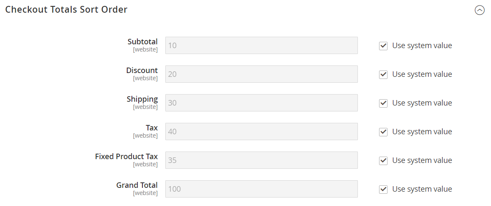

# Ordem de classificação para totais de check-out

Durante a revisão da ordem, o total aparece na parte inferior da ordem, com quaisquer ajustes para descontos, encargos de entrega, crédito de loja e impostos. A ordem de cada item determina a sequência dos cálculos e é definida na configuração por um número atribuído a cada item. Por exemplo, o Subtotal é o primeiro item na seção e recebe um valor de 10. O Total geral é exibido por último e recebe um valor de 100. Todos os outros itens na seção de totais recebem um valor entre esses valores.

{width="700" zoomable="yes"}

**_Para configurar a ordem de classificação dos totais de check-out:_**

1. Na barra lateral _Admin_, vá para **[!UICONTROL Stores]** > _[!UICONTROL Settings]_>**[!UICONTROL Configuration]**.

1. No painel esquerdo, expanda a seção **[!UICONTROL Sales]** e escolha **[!UICONTROL Sales]** abaixo.

1. Expandir  a seção **[!UICONTROL Checkout Totals Sort Order]**.

   {width="600" zoomable="yes"}

   Para obter uma descrição detalhada de cada uma dessas configurações, consulte [Ordem de Classificação dos Totais de Check-out](../configuration-reference/sales/sales.md#checkout-totals-sort-order) no _Guia de Referência de Configuração_.

1. Se a configuração for para um modo de exibição de repositório específico, [escolha o modo de exibição de repositório](../configuration-reference/scope-change.md#set-the-scope) ao qual a configuração se aplica.

   Quando solicitado, clique em **[!UICONTROL OK]** para continuar.

1. Para determinar a ordem na seção _Totais_, altere o número atribuído a cada item.

   Quanto menor o valor, mais cedo será o seu posicionamento na lista. Na configuração padrão, o Subtotal (`10`) é o primeiro e o Total geral (`100`) é o último.

   Se necessário, desmarque a caixa de seleção **[!UICONTROL Use system value]** para concluir essas alterações.

1. Clique em **[!UICONTROL Save Config]**.
