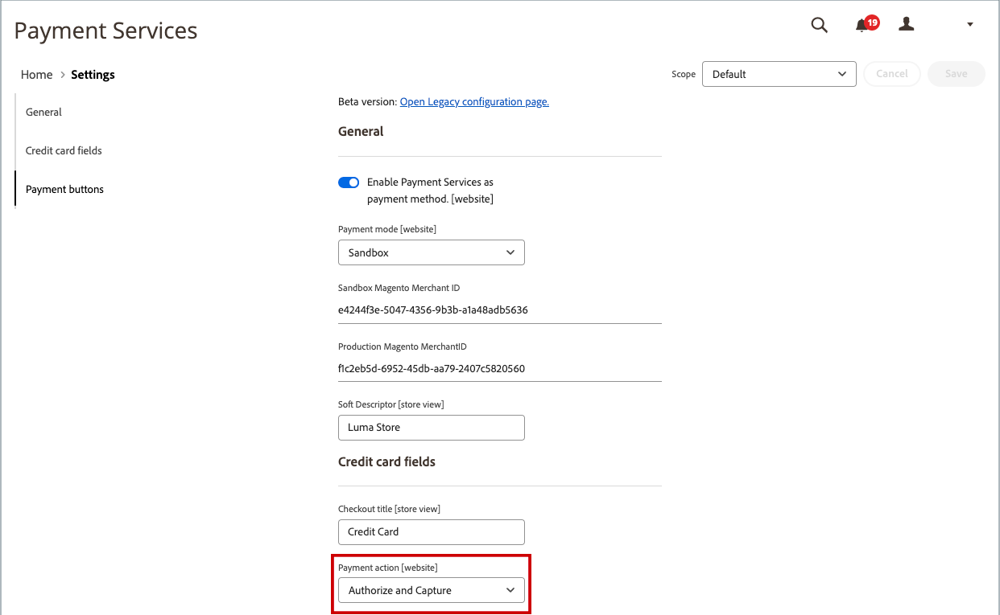

# Emitir um memorando de crédito

Antes de imprimir um memorando de crédito, ele deve ser gerado para uma [ordem faturada](invoices.md#create-an-invoice). É possível emitir reembolsos online e offline (parcial ou total) a partir de um aviso de crédito aberto, dependendo do método de pagamento.

-  (somente Adobe Commerce) Os reembolsos podem ser aplicados ao crédito da loja.
-  (Disponível com Adobe Commerce B2B) Os reembolsos podem ser aplicados ao crédito da empresa.
- As compras feitas com cartão de crédito podem ser reembolsadas online ou offline.
- Compras feitas com cheque ou ordem de pagamento devem ser reembolsadas off-line.

Qualquer memorando de crédito com um [status aberto](order-status.md) tem uma restituição pendente devida.

Com os avisos de crédito, você pode:

- Reembolsar o valor total de uma NFF.
- Reembolsar uma quantia parcial de uma NFF.
- Reembolsar várias quantias parciais de uma NFF.
- Reembolsar várias faturas por pedido, sem exceder o valor total do pedido.
- Reembolsar uma parte da quantidade para um item de linha, como três das cinco camisetas em um pedido.

Consulte [Criar uma fatura](invoices.md#create-an-invoice) para obter mais informações.

## Configuração da ação de pagamento

O fluxo de trabalho de reembolso para pedidos pagos com cartão de crédito é determinado pela [configuração da Ação de Pagamento](../configuration-reference/sales/payment-methods.md#payment-actions) na configuração de cada método de pagamento disponível. Os reembolsos não podem ser emitidos até que a transação seja liquidada.

{width="600" zoomable="yes"}

- Se a Ação de Pagamento para o seu método de pagamento configurado estiver definido como `Authorize`, você deve primeiro gerar a fatura do Administrador antes que um aviso de crédito possa ser criado.
- Se a Ação de Pagamento para o seu método de pagamento configurado estiver definido como `Authorize and Capture`, a fatura já foi gerada pelo processador de pagamento, mas os fundos não estarão disponíveis até que a transação seja liquidada. Esse breve período de espera é recomendado por muitos processadores de pagamento como uma medida de segurança e pode ser manipulado automaticamente. As transações também podem ser liquidadas manualmente a partir da sua conta de comerciante com o processador de pagamento.
-  (somente Adobe Commerce) Se você criar um memorando de crédito para um pedido que inclui opções de presente, o reembolso do invólucro do presente e/ou do cartão impresso aparecerá na seção Totais de Reembolso do memorando de crédito. Para excluir esses custos do valor a ser reembolsado, informe o valor como uma Taxa de Ajuste. Se vários avisos de crédito forem emitidos para a mesma ordem, a restituição das opções de presente será exibida somente no primeiro aviso de crédito.

## Criar um memorando de crédito

Determine o tipo de reembolso que deseja emitir, para uma [compra de crédito](#issue-a-refund-for-a-credit-purchase) ou para [cheque ou ordem de pagamento](#issue-an-offline-refund-for-check-or-money-order), gere o aviso de crédito e emita um reembolso.

### Emitir reembolso para uma compra de crédito

1. Na barra lateral _Admin_, vá para **[!UICONTROL Sales]** > **[!UICONTROL Orders]**.

   {width="700" zoomable="yes"}

1. Localize a ordem na grade e clique em **[!UICONTROL View]**.

1. Se o botão _[!UICONTROL Credit Memo]_estiver visível na barra de botões, siga um destes procedimentos:

   - Para emitir um reembolso de `offline`, vá para a etapa #6.
   - Para emitir um reembolso de `online`, continue com a etapa #4.

   Consulte [Avisos de Crédito](credit-memos.md) para obter mais informações sobre reembolsos offline e online.

1. Clique em **[!UICONTROL Invoices]** no painel esquerdo.

1. Localize a fatura na grade e clique em **[!UICONTROL View]**.

   {width="700" zoomable="yes"}

1. Role para baixo até a seção **[!UICONTROL Invoice Totals]** da fatura, verifique se a fatura está definida como `Capture Online` e clique em **[!UICONTROL Submit Invoice]**.

   {width="600" zoomable="yes"}

   Se essa opção não estiver disponível, a fatura já foi criada. Vá para a próxima etapa.

1. Na barra de botões na parte superior da fatura, clique em **[!UICONTROL Credit Memo]**.

1. Verifique as informações na seção **[!UICONTROL Items to Refund]** e faça o seguinte, se aplicável:

   - Para devolver o produto ao estoque, marque a caixa de seleção **[!UICONTROL Return to Stock]**.

     O produto retornará ao estoque automaticamente se as _Opções de Estoque do Produto_ estiverem definidas como `Automatically Return Credit Memo Item to Stock`. Com o [Inventory management habilitado](../inventory-management/enable.md), o item retorna à origem que enviou a remessa.

   - Atualize o **[!UICONTROL Qty to Refund]** e clique em **[!UICONTROL Update Qty's]**.

     {width="600" zoomable="yes"}

1. Atualize a seção **[!UICONTROL Refunds Totals]** da seguinte maneira:

   - Para **[!UICONTROL Refund Shipping]**, insira qualquer valor a ser reembolsado da taxa de remessa.

     Este campo mostra inicialmente o valor total do frete do pedido que está disponível para reembolso. É igual ao valor total da remessa do pedido, menos qualquer valor de remessa que já tenha sido reembolsado. Assim como a quantidade, a quantidade pode ser reduzida, mas não aumentada.

   - Para **[!UICONTROL Adjustment Refund]**, insira um valor a ser adicionado ao valor total reembolsado como reembolso extra que não se aplica a nenhuma parte específica do pedido (remessa, itens ou imposto). Ele também pode ser usado para reembolso parcial com dinheiro virtual, como um cartão-presente, quando um administrador quiser reembolsar um método de pagamento não virtual primeiro.

     O valor inserido não pode aumentar o reembolso total para um valor maior que o valor pago.

   - Para **[!UICONTROL Adjustment Fee]**, insira um valor a ser subtraído do valor total reembolsado.

     Esse valor não é subtraído de uma seção específica do pedido, como remessa, itens ou imposto.

1. Para adicionar um comentário, insira o texto na caixa **[!UICONTROL Credit Memo Comments]**.

   - Para enviar uma notificação por email ao cliente, marque a caixa de seleção **[!UICONTROL Email Copy of Credit Memo]**.

1. Clique em **[!UICONTROL Update Totals]**.

1. Faça o seguinte, conforme aplicável:

   -  (somente Adobe Commerce) Para reembolsar o valor para o crédito de loja do cliente, marque a caixa de seleção **[!UICONTROL Refund to Store Credit]**.

   -  (Disponível com Adobe Commerce B2B) Para reembolsar o valor para o crédito da empresa do cliente, marque a caixa de seleção **[!UICONTROL Refund to Company Credit]**.

   - Para emitir reembolso offline, clique em **[!UICONTROL Refund Offline]**.

   - Para emitir um reembolso online, clique em **[!UICONTROL Refund]**.

   -  (Disponível com Adobe Commerce B2B) Se a compra foi paga com crédito da empresa, clique em **[!UICONTROL Refund to Company Credit]**.

   Consulte [Avisos de Crédito](credit-memos.md) para obter mais informações sobre reembolsos offline e online.

   {width="600" zoomable="yes"}

### Emitir reembolso offline para cheque ou ordem de pagamento

1. Na barra lateral _Admin_, vá para **[!UICONTROL Sales]** > **[!UICONTROL Orders]**.

1. Localize a ordem concluída na grade e abra-a clicando no link **[!UICONTROL View]**.

1. Na barra de botões na parte superior da página, clique em **[!UICONTROL Invoice]**.

1. Role para baixo até a parte inferior da página e clique em **[!UICONTROL Submit Invoice]**.

1. Na barra de botões na parte superior da fatura, clique em **[!UICONTROL Credit Memo]**.

   {width="600" zoomable="yes"}

1. Verifique as informações na seção **[!UICONTROL Items to Refund]** e faça o seguinte, se aplicável:

   {width="600" zoomable="yes"}

   - Marque a caixa de seleção **[!UICONTROL Return to Stock]** se desejar devolver o produto devolvido ao estoque.

     Com o Inventory management ativado, a quantidade do inventário é devolvida à origem que enviou a entrega. O produto retornará ao estoque automaticamente se as [Opções de Estoque do Produto](../inventory-management/enable.md) estiverem definidas como `Automatically Return Credit Memo Item to Stock`.

   - Atualize o **[!UICONTROL Qty to Refund]** e clique em **[!UICONTROL Update Qty's]**.

     O valor a ser creditado não pode exceder o valor máximo disponível para reembolso.

1. Atualize a seção **[!UICONTROL Refunds Totals]** conforme aplicável:

   - Para **[!UICONTROL Refund Shipping]**, insira qualquer valor a ser reembolsado da taxa de remessa.

     Este campo exibe inicialmente o valor total do frete do pedido que está disponível para reembolso. É igual ao valor total da remessa do pedido, menos qualquer valor de remessa que já tenha sido reembolsado. Assim como a quantidade, a quantidade pode ser reduzida, mas não aumentada.

   - Para **[!UICONTROL Adjustment Refund]**, insira um valor a ser adicionado ao valor total reembolsado como reembolso extra que não se aplica a nenhuma parte específica do pedido (remessa, itens ou imposto). Ele também pode ser usado para reembolso parcial com dinheiro virtual, como um cartão-presente, quando um administrador quiser reembolsar um método de pagamento não virtual primeiro.

     O valor inserido não pode aumentar o reembolso total para um valor maior que o valor pago.

   - Para **[!UICONTROL Adjustment Fee]**, insira um valor a ser subtraído do valor total reembolsado.

     Esse valor não é subtraído de uma seção específica do pedido, como remessa, itens ou imposto.

   - Se a compra foi paga com crédito de loja, marque a caixa de seleção **[!UICONTROL Refund to Store Credit]** para creditar o valor ao saldo da conta do cliente.

1. Para adicionar um comentário, insira o texto na caixa **[!UICONTROL Credit Memo Comments]** e faça o seguinte:

   - Para enviar uma notificação por email ao cliente, marque a caixa de seleção **[!UICONTROL Email Copy of Credit Memo]**.

   - Para incluir os comentários inseridos no email, marque a caixa de seleção **[!UICONTROL Append Comments]**.

     O status de uma notificação de aviso de crédito é exibido no aviso de crédito concluído ao lado do número do aviso de crédito.

     {width="600" zoomable="yes"}

1. Para concluir o processo e emitir o reembolso, clique em **[!UICONTROL Refund Offline]**.

## Descrições dos campos

### [!UICONTROL Order & Account Information]

| Campo | Descrição |
|--- |--- |
| [!UICONTROL Order Number] | O número do pedido aparece nas _Informações sobre pedidos e conta_, seguido de uma observação que indica se o email de confirmação foi enviado. |
| [!UICONTROL Order Date] | A data e a hora em que o pedido foi feito. |
| [!UICONTROL Order Status] | Indica o status do pedido como `Complete`. |
| [!UICONTROL Purchased From] | Indica o site, a loja e a exibição da loja em que o pedido foi feito. |
| [!UICONTROL Placed from IP] | Indica o endereço IP do computador do qual o pedido foi feito. |

{style="table-layout:auto"}

### [!UICONTROL Account Information]

| Campo | Descrição |
|--- |--- |
| [!UICONTROL Customer Name] | O nome do cliente ou comprador que colocou a ordem. O nome do cliente está vinculado ao perfil do cliente. |
| [!UICONTROL Email] | O endereço de email do cliente ou comprador. O endereço de email está vinculado para abrir uma nova mensagem de email. |
| [!UICONTROL Customer Group] | O nome do grupo de clientes ou catálogo compartilhado ao qual o cliente está atribuído. |
| [!UICONTROL Company Name] |  (Disponível com Adobe Commerce B2B) O nome da empresa associada ao comprador e em cujo nome o pedido é feito. O nome da empresa está vinculado ao perfil da empresa. |

{style="table-layout:auto"}

### [!UICONTROL Address Information]

| Campo | Descrição |
|--- |--- |
| [!UICONTROL Billing Address] | O nome do cliente ou comprador que fez o pedido, seguido do endereço para cobrança, número de telefone e [VAT](vat.md), se aplicável. O número de telefone está vinculado à discagem automática em um dispositivo móvel. |
| [!UICONTROL Shipping Address] | O nome da pessoa para cuja atenção o pedido deve ser enviado, seguido do endereço de entrega e do número de telefone. O número de telefone está vinculado à discagem automática em um dispositivo móvel. |

{style="table-layout:auto"}

### [!UICONTROL Payment & Shipping Method]

| Campo | Descrição |
|--- |--- |
| [!UICONTROL Payment Information] | O método de pagamento a ser usado para o pedido e o número do pedido de compra, se aplicável, seguido da moeda usada para fazer o pedido. Se a ordem for debitada do crédito da empresa usando [Pagamento na Conta](../b2b/enable-basic-features.md#configure-payment-on-account), o valor debitado na conta será indicado. |
| [!UICONTROL Shipping & Handling Information] | O método de envio a ser usado e qualquer taxa de manuseio aplicável. |

{style="table-layout:auto"}

### [!UICONTROL Items to Refund]

| Campo | Descrição |
|--- |--- |
| [!UICONTROL Product] | O nome do produto, SKU e opções (se aplicável). |
| [!UICONTROL Price] | O preço de compra do item. Para o Adobe Commerce B2B, esse valor reflete qualquer desconto aplicado ao item do catálogo compartilhado, se aplicável. |
| [!UICONTROL Qty] | A quantidade solicitada. |
| [!UICONTROL Return to Stock] | Caixa de seleção que indica se o item devolvido deve ser devolvido ao estoque. |
| [!UICONTROL Qty to Refund] | Indica o número de unidades retornadas do produto. |
| [!UICONTROL Subtotal] | O subtotal é o preço de compra multiplicado pela quantidade de unidades de produto devolvidas. |
| [!UICONTROL Tax Amount] | O valor do imposto que se aplica ao item devolvido como um valor decimal. |
| [!UICONTROL Tax Percent] | A porcentagem de imposto aplicada ao item devolvido como uma porcentagem. |
| [!UICONTROL Discount Amount] | Qualquer desconto que se aplique ao item devolvido. |
| [!UICONTROL Row Total] | O total do item de linha, incluindo os impostos aplicáveis devidos para o nível do produto devolvido, menos os descontos. |
| _total de pedidos_ |  |

{style="table-layout:auto"}

### [!UICONTROL Credit Memo Comments]

| Campo | Descrição |
|--- |--- |
| [!UICONTROL Comment Text] | Uma caixa de texto que é usada para inserir um comentário ao cliente sobre o aviso de crédito. |

{style="table-layout:auto"}

### [!UICONTROL Refund Totals]

| Campo | Descrição |
|--- |--- |
| [!UICONTROL Refund Shipping] | O valor da remessa a ser reembolsado. |
| [!UICONTROL Adjustment Refund] | Uma quantia que é adicionada à quantia total reembolsada como uma restituição extra que não se aplica a nenhuma parte específica do pedido, como remessa, itens ou imposto. O valor inserido não pode aumentar o reembolso total para um valor maior que o pago. |
| [!UICONTROL Adjustment Fee] | Um valor que é subtraído do valor total reembolsado, como uma taxa de reposição de estoque ou um valor relacionado ao invólucro do presente ou às opções de presente. |
| [!UICONTROL Grand Total] | O valor total a ser reembolsado |
| [!UICONTROL Append Comments] | Caixa de seleção que determina se os comentários são incluídos no aviso de crédito. |
| [!UICONTROL Email Copy of Credit Memo] | Caixa de seleção que determina se uma cópia do aviso de crédito será enviada por e-mail. |
| [!UICONTROL Refund to Store Credit] |  (somente Adobe Commerce) Caixa de seleção que determina se o total deve ser reembolsado para [crédito da loja](../customers/store-credit-using.md). |
| [!UICONTROL Subtotal] |  (Disponível com Adobe Commerce B2B) O total de todos os itens de linha a serem reembolsados. |

{style="table-layout:auto"}

### Botões de reembolso

O método de pagamento usado para a ordem determina os botões de restituição disponíveis para um aviso de crédito.

| Botão | Descrição |
|--- |--- |
| **[!UICONTROL Refund]** | Se a compra original foi paga por cartão de crédito através de um gateway de pagamento, o valor do reembolso é gerenciado pelo processador de pagamento. Para gerenciar reembolsos, consulte a documentação fornecida pelo seu provedor de pagamento. |
| **[!UICONTROL Refund Offline]** | Se a compra original foi paga em cheque ou ordem de pagamento, o reembolso é pago diretamente ao cliente, emitindo um cheque, cartão-presente ou dinheiro, se você tiver uma loja física. O aviso de crédito serve como um registro da transação offline. |
| **[!UICONTROL Refund to Company Credit]** |  (Disponível com Adobe Commerce B2B) Se a compra foi cobrada do crédito da empresa, o reembolso é devolvido à [Conta da Empresa](../b2b/credit-company.md). |

{style="table-layout:auto"}

## Imprimir um aviso de crédito

Para imprimir ou exibir o aviso de crédito concluído, é necessário ter um leitor PDF instalado. Você pode baixar o [Adobe Reader](https://www.adobe.com/acrobat/pdf-reader.html "Obter o Adobe Reader") gratuitamente.

1. Na barra lateral _Admin_, vá para **[!UICONTROL Sales]** > _[!UICONTROL Operations]_>**[!UICONTROL Credit Memos]**.

1. Use um dos seguintes métodos para imprimir o aviso de crédito:

### Método 1: Imprimir aviso de crédito atual

1. Na grade, abra o memorando de crédito.

1. Clique em **[!UICONTROL Print]**.

   {width="600" zoomable="yes"}

### Método 2: Imprimir vários avisos de crédito

1. Na lista, marque a caixa de seleção de cada aviso de crédito que deseja imprimir.

1. Defina o controle **[!UICONTROL Actions]** como `PDF Credit Memos` e clique em **[!UICONTROL Submit]**.

   {width="600" zoomable="yes"}

1. Quando solicitado, execute um dos procedimentos a seguir:

   - Para salvar o documento, clique em **[!UICONTROL Save]** e siga as instruções para salvar o arquivo no computador. Quando o download estiver concluído, abra o PDF no Adobe Reader e imprima o documento.

   - Para exibir o documento, clique em **[!UICONTROL Open]**. O memorando de crédito do PDF pronto para impressão é aberto no Adobe Reader. Aqui, você pode imprimir o aviso de crédito ou salvá-lo em seu computador.
